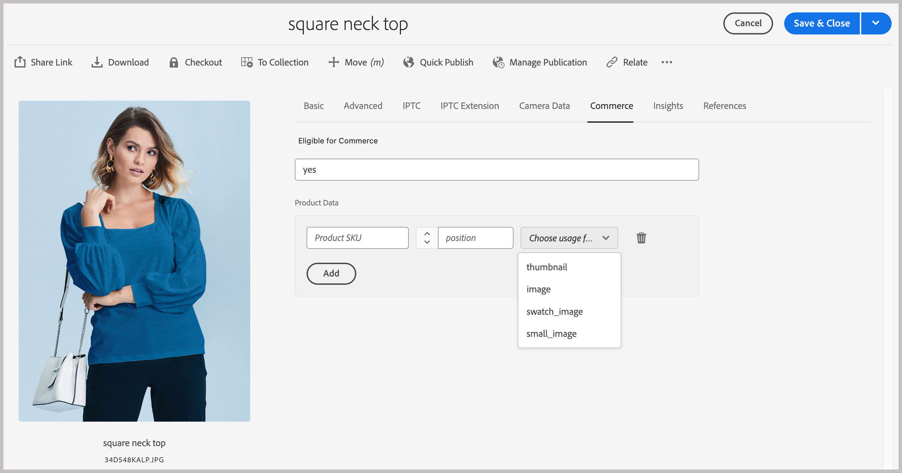

# Configuration du projet AEM Assets pour la prise en charge des métadonnées Commerce

Lorsque vous utilisez AEM Assets en tant que système de gestion des ressources numériques (DAM) pour Commerce, l’installation du package `assets-commerce` vous permet de gérer les images et les vidéos pour les produits Commerce à partir de l’environnement de création AEM.

Suivez les étapes ci-dessous pour configurer le projet AEM Assets avec le code et les métadonnées de package requis pour gérer les ressources Commerce à partir de l’environnement de création AEM :

1. [Découvrez le ](#aem-commerce-assets-commerce-package-contents)

1. [Suivez les étapes d’installation pour configurer le projet AEM Assets afin de prendre en charge les métadonnées Commerce](#step-1-install-the-assets-commerce-package)

## AEM Commerce **assets-commerce** contenu du package

Adobe fournit un `assets-commerce` de code de package AEM Commerce pour ajouter des ressources d’espace de noms Commerce et de schéma de métadonnées à la configuration de l’environnement Experience Manager Assets as a Cloud Service.

Ce code de package ajoute les ressources suivantes à l’environnement de création AEM Assets :

* Un [espace de noms personnalisé](https://github.com/ankumalh/assets-commerce/blob/main/ui.config/jcr_root/apps/commerce/config/org.apache.sling.jcr.repoinit.RepositoryInitializer~commerce-namespaces.cfg.json), `Commerce` pour identifier les propriétés liées à Commerce.

   * Un type de métadonnées personnalisé `commerce:isCommerce` avec le libellé `Eligible for Commerce` pour baliser les ressources Commerce associées à un projet Adobe Commerce.

   * Un `commerce:skus` de type de métadonnées personnalisé et un composant d’interface utilisateur correspondant pour ajouter une propriété **[!UICONTROL Product Data]**. Les données de produit incluent les propriétés de métadonnées pour associer une ressource Commerce aux SKU de produit.

     {width="600" zoomable="yes"}

   * Un type de métadonnées personnalisé `commerce:roles` et `commerce:positions` des attributs pour montrer comment la ressource est visualisée dans Commerce.

* Formulaire de schéma de métadonnées avec un onglet Commerce contenant les champs `Eligible for Commerce` et `Product Data` pour le balisage des ressources Commerce. Le formulaire fournit également des options pour afficher ou masquer les champs `roles` et `position` de l’interface utilisateur d’AEM Assets.

  Onglet {width="600" zoomable="yes"}

* Un [exemple de ressource Commerce balisée et approuvée](https://github.com/ankumalh/assets-commerce/blob/main/ui.content/src/main/content/jcr_root/content/dam/wknd/en/activities/hiking/equipment_6.jpg/.content.xml) `equipment_6.jpg` pour prendre en charge la synchronisation initiale des ressources. Seules les ressources Commerce approuvées peuvent être synchronisées d’AEM Assets vers Adobe Commerce.

>[!NOTE]
>
> Voir la page [readme](https://github.com/ankumalh/assets-commerce) pour plus d&#39;informations sur le **code du package AEM Commerce**.

## Conditions préalables

Vous avez besoin des ressources et autorisations suivantes pour déployer le code du package `assets-commerce` dans l’environnement AEM Assets as a Cloud Service AEM :

* [Accès au programme et aux environnements AEM Assets Cloud Manager](https://experienceleague.adobe.com/en/docs/experience-manager-cloud-service/content/onboarding/journey/cloud-manager#access-sysadmin-bo) avec les rôles Responsable de programme et de déploiement .

* Un [environnement de développement AEM local](https://experienceleague.adobe.com/en/docs/experience-manager-learn/cloud-service/local-development-environment-set-up/overview) et une connaissance du processus de développement local d’AEM.

* Découvrez la structure de projet [AEM et comment déployer ](https://experienceleague.adobe.com/fr/docs/experience-manager-cloud-service/content/implementing/developing/aem-project-content-package-structure) packages de contenu personnalisés à l’aide de Cloud Manager.

* L’**ID d’organisation IMS** configuré pour votre instance Commerce.

## Étape 1 : installer le package **assets-commerce**

1. Accédez à AEM Cloud Manager, sélectionnez un programme, puis [créez des environnements de production et d’évaluation](https://experienceleague.adobe.com/en/docs/experience-manager-cloud-service/content/onboarding/journey/create-environments#creating-environments) à intégrer à Adobe Commerce.

1. Configurez un [pipeline de déploiement](https://experienceleague.adobe.com/en/docs/experience-manager-cloud-service/content/sites/administering/site-creation/quick-site/pipeline-setup#create-front-end-pipeline) ou vérifiez que votre pipeline peut déployer les modifications dans l’environnement sélectionné.

1. [Clonez le référentiel Git géré par Adobe](https://experienceleague.adobe.com/en/docs/experience-manager-cloud-service/content/sites/administering/site-creation/quick-site/retrieve-access#repo-access) pour le programme sélectionné.

1. À partir de GitHub, téléchargez le code du package à partir du [référentiel AEM Assets Commerce](https://github.com/ankumalh/assets-commerce).

1. À partir de votre [environnement de développement AEM local](https://experienceleague.adobe.com/en/docs/experience-manager-learn/cloud-service/local-development-environment-set-up/overview), copiez manuellement le code téléchargé dans le référentiel géré par Adobe existant.

1. Dans tous les `filter.xml` et `pom.xml files` de votre projet, remplacez toutes les occurrences de `<my-app>` par le nom de votre application.

>[!NOTE]
>
> Vous pouvez également installer le code personnalisé dans la configuration de votre projet AEM Assets sous la forme d’un package **Maven**.

1. Validez les modifications et envoyez votre branche de développement local au référentiel Git de Cloud Manager.

1. Depuis AEM Cloud Manager, [mettez à jour l’environnement AEM à l’aide du pipeline pour déployer votre code](https://experienceleague.dobe.com/en/docs/experience-manager-cloud-service/content/implementing/using-cloud-manager/deploy-code#deploying-code-with-cloud-manager).

1. Accédez à n’importe quelle ressource et modifiez ses propriétés pour valider les modifications :

   * Le schéma de métadonnées par défaut inclut l’onglet **Commerce**.

   * Les SKU de produit et les champs `Eligible for Commerce` sont visibles.

### L’onglet **Commerce** n’est pas visible dans les propriétés

Si l’onglet **Commerce** n’apparaît pas dans les propriétés, vous devez en créer un manuellement dans l’éditeur de schéma de métadonnées.

1. Accédez à l’éditeur de schéma de métadonnées.

1. Cliquez sur **Modifier** pour modifier le formulaire de schéma de métadonnées par défaut.

1. Créez un onglet **Commerce** et sélectionnez-le.

1. Faites glisser et déposez le composant **Product** dans l’onglet **Commerce** et mappez-le à la `commerce:skus` de propriété.

1. Cochez la case **Afficher les rôles** et **Afficher l’ordre**.

1. Faites glisser et déposez un composant **case à cocher** dans l’onglet **Commerce** et mappez-le à l’`commerce:isCommerce` de propriété. Définissez **Oui** et **Non** comme options.

Si vous rencontrez d’autres problèmes, créez un [ticket d’assistance](https://experienceleague.adobe.com/docs/commerce-knowledge-base/kb/help-center-guide/magento-help-center-user-guide.html#submit-ticket) ou contactez votre représentant commercial pour l’intégration AEM Assets pour obtenir de l’aide.

## Étape 2 : Facultatif. Configuration d’un profil de métadonnées

Dans l’environnement de création AEM Assets, définissez les valeurs par défaut des métadonnées de ressources Commerce en créant un profil de métadonnées. Appliquez ensuite le nouveau profil aux dossiers AEM Assets pour utiliser automatiquement ces paramètres par défaut. Cette configuration simplifie le traitement des ressources en réduisant les étapes manuelles.

Lorsque vous configurez le profil de métadonnées, il vous suffit de configurer les composants suivants :

* Ajoutez un onglet Commerce . Cet onglet active les paramètres de configuration spécifiques à Commerce ajoutés par le modèle.

* Ajoutez le champ `Eligible for Commerce` à l’onglet Commerce .

Le composant d’interface utilisateur des données de produit est ajouté automatiquement en fonction du modèle.

### Définition du profil de métadonnées

1. Connectez-vous à l’environnement de création de Adobe Experience Manager.

1. Dans l’espace de travail Adobe Experience Manager , accédez à l’espace de travail Créer une administration de contenu pour AEM Assets en cliquant sur l’icône Adobe Experience Manager .

   {width="600" zoomable="yes"}

1. Ouvrez les outils d’administration en sélectionnant l’icône en forme de marteau.

   {width="600" zoomable="yes"}

1. Ouvrez la page de configuration du profil en cliquant sur **[!UICONTROL Metadata Profiles]**.

1. **[!UICONTROL Create]** un profil de métadonnées pour l’intégration de Commerce.

   {width="600" zoomable="yes"}

1. Ajoutez un onglet pour les métadonnées Commerce.

   1. Sur la gauche, cliquez sur **[!UICONTROL Settings]**.

   1. Cliquez sur **[!UICONTROL +]** dans la section d’onglet, puis spécifiez le **[!UICONTROL Tab Name]**, `Commerce`.

1. Ajoutez le champ `Eligible for Commerce` au formulaire.

   {width="600" zoomable="yes"}

   * Cliquez sur **[!UICONTROL Build form]**.

   * Faites glisser le champ `Single Line text` vers le formulaire.

   * Ajoutez le texte `Eligible for Commerce` pour le libellé en cliquant sur **[!UICONTROL Field Label]**.

   * Dans l’onglet Paramètres , ajoutez le texte du libellé à **Libellé du champ**.

   * Définissez le texte d’espace réservé sur `yes`.

   * Dans le champ **[!UICONTROL Map to Property]** , copiez et collez la valeur suivante :

     ```terminal
     ./jcr:content/metadata/commerce:isCommerce
     ```

1. Facultatif. Pour synchroniser automatiquement les ressources Commerce approuvées lors de leur chargement dans l’environnement AEM Assets, définissez la valeur par défaut du champ _[!UICONTROL Review Status]_de l’onglet `Basic` sur `approved`.

1. Enregistrez la mise à jour.

### Application du profil de métadonnées au dossier source des ressources Commerce

1. Sur la page [!UICONTROL  Metadata Profiles], sélectionnez le profil d’intégration de Commerce.

1. Dans le menu d’actions, sélectionnez **[!UICONTROL Apply Metadata Profiles to Folders]**.

1. Sélectionnez le dossier contenant les ressources Commerce.

   Créez un dossier Commerce s’il n’existe pas.

1. Cliquez sur **[!UICONTROL Apply]**.

## Étapes suivantes

* [!BADGE PaaS uniquement]{type=Informative tooltip="S’applique uniquement à Adobe Commerce sur les projets cloud (infrastructure PaaS gérée par Adobe)."} [installer les packages Adobe Commerce](configure-commerce.md).

* [!BADGE SaaS uniquement]{type=Positive url="https://experienceleague.adobe.com/en/docs/commerce/user-guides/product-solutions" tooltip="S’applique uniquement aux projets Adobe Commerce as a Cloud Service et Adobe Commerce Optimizer (infrastructure SaaS gérée par Adobe)."} [Configurez l’intégration à partir de l’administration Commerce](setup-synchronization.md).
