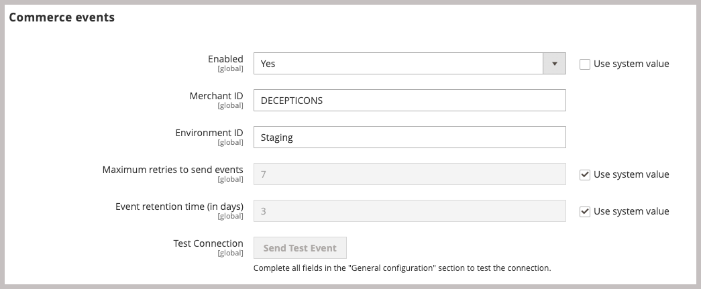

# Installation des packages Adobe Commerce

Cette intégration pour Commerce permet la synchronisation des ressources entre Adobe Commerce et Adobe Experience Manager Assets (AEM Assets). L’extension fournit un ensemble d’outils et de services permettant de gérer les images du produit, les vidéos et d’autres ressources multimédias sur les deux plateformes.

Ajoutez cette extension à l&#39;environnement Commerce en installant l&#39;extension PHP `aem-assets-integration`. Vous devez également activer Adobe I/O Events pour Commerce et générer les informations d’identification requises pour les communications et les workflows entre Adobe Commerce et Adobe Experience Manager Assets.

**Conditions d’accès**

Vous avez besoin des rôles et autorisations suivants pour activer l’intégration de Commerce à AEM Assets.

- [Administrateur de projet cloud Commerce ](https://experienceleague.adobe.com/en/docs/commerce-cloud-service/user-guide/project/user-access) : installez les extensions requises et configurez le serveur d’applications Commerce à partir de l’Administration ou de la ligne de commande.

   - Accédez à [repo.magento.com](https://repo.magento.com/admin/dashboard) pour installer l’extension.

     Pour la génération des clés et l’obtention des droits nécessaires, voir [ Obtenir vos clés d’authentification ](https://experienceleague.adobe.com/en/docs/commerce-operations/installation-guide/prerequisites/authentication-keys). Pour les installations cloud, consultez le guide [Commerce sur les infrastructures cloud](https://experienceleague.adobe.com/en/docs/commerce-cloud-service/user-guide/develop/authentication-keys)

- [Commerce Admin](https://experienceleague.adobe.com/en/docs/commerce-admin/start/guide-overview)—Mettez à jour la configuration du magasin et gérez les comptes utilisateur Commerce.

>[!TIP]
>
> Adobe Commerce peut être configuré pour utiliser [l’authentification Adobe IMS](https://experienceleague.adobe.com/en/docs/commerce-admin/start/admin/ims/adobe-ims-config).

## Workflow d’installation et de configuration

Installez le package Adobe Commerce et préparez l’environnement Commerce en effectuant les tâches suivantes :

1. [Installez l’extension AEM Assets Integration for Commerce (`aem-assets-integration`)](#install-the-aem-assets-integration-extension).

1. [Configurez le connecteur de services Commerce](#configure-the-commerce-services-connector) pour connecter votre instance Adobe Commerce et aux services qui permettent la transmission de données entre Adobe Commerce et AEM Assets.

1. [Configuration de Adobe I/O Events pour Commerce](#configure-adobe-io-events-for-commerce)

1. [Obtention des informations d’authentification pour l’accès à l’API](#get-authentication-credentials-for-api-access)

## Installation de l’extension `aem-assets-integration`

Installez la dernière version de l’extension d’intégration AEM Assets (`aem-assets-integration`) sur une instance Adobe Commerce avec la version Adobe Commerce 2.4.5+. L’extension est fournie en tant que métapaquet de compositeur à partir du référentiel [repo.magento.com](https://repo.magento.com/admin/dashboard).

>[!BEGINTABS]

>[!TAB Infrastructure cloud]

Utilisez cette méthode pour installer l’extension [!DNL AEM Assets Integration] sur une instance Commerce Cloud.

1. Sur votre station de travail locale, accédez au répertoire du projet d’infrastructure cloud d’Adobe Commerce.

   >[!NOTE]
   >
   >Pour plus d’informations sur la gestion locale des environnements de projet Commerce, voir [Gestion des branches avec l’interface de ligne de commande](https://experienceleague.adobe.com/en/docs/commerce-cloud-service/user-guide/develop/cli-branches) dans le _Guide d’utilisation d’Adobe Commerce sur les infrastructures cloud_.

1. Consultez la branche d’environnement pour effectuer la mise à jour à l’aide de l’interface de ligne de commande Adobe Commerce Cloud.

   ```shell
   magento-cloud environment:checkout <environment-id>
   ```

1. Ajoutez l’extension AEM Assets Integration for Commerce .

   ```shell
   composer require "magento/aem-assets-integration" "<version-tbd>" --no-update
   ```

1. Mettez à jour les dépendances de package.

   ```shell
   composer update "magento/aem-assets-integration"
   ```

1. Validez et envoyez les modifications de code pour les fichiers `composer.json` et `composer.lock`.

1. Ajoutez, validez et envoyez les modifications de code des fichiers `composer.json` et `composer.lock` à l’environnement cloud.

   ```shell
   git add -A
   git commit -m "Install AEM Assets Integration extension for Adobe Commerce"
   git push origin <branch-name>
   ```

   L’envoi des mises à jour lance le processus de déploiement cloud de [Commerce](https://experienceleague.adobe.com/en/docs/commerce-cloud-service/user-guide/develop/deploy/process) pour appliquer les modifications. Vérifiez le statut du déploiement dans le [journal de déploiement](https://experienceleague.adobe.com/en/docs/commerce-cloud-service/user-guide/develop/test/log-locations#deploy-log).

>[!TAB Sur site]

Utilisez cette méthode pour installer l’extension [!DNL AEM Assets Integration] pour une instance locale.

1. Utilisez le compositeur pour ajouter l’extension AEM Assets Integration for Commerce à votre projet :

   ```shell
   composer require "magento/aem-assets-integration" --no-update
   ```

1. Mettez à jour les dépendances et installez l’extension :

   ```shell
   composer update  "magento/aem-assets-integration"
   ```

1. Mettre à niveau Adobe Commerce :

   ```shell
   bin/magento setup:upgrade
   ```

1. Effacez le cache :

   ```shell
   bin/magento cache:clean
   ```

>[!TIP]
>
>Lors d’un déploiement en production, pensez à ne pas effacer le code compilé pour gagner du temps. Sauvegardez toujours votre système avant d’apporter des modifications.

>[!ENDTABS]

## Configuration du connecteur de services Commerce

>[!NOTE]
>
>La configuration du connecteur de services Commerce est un processus unique requis pour utiliser les [services SaaS Adobe Commerce](https://experienceleague.adobe.com/en/docs/commerce/user-guides/integration-services/saas#availableservices). Si vous avez déjà configuré le connecteur pour un autre service, vous pouvez afficher la configuration existante à partir de l’Administration Commerce en sélectionnant **[!UICONTROL Systems]** > [!UICONTROL Services] > **[!UICONTROL Commerce Services Connector]**.

Pour transmettre des données entre votre instance Adobe Commerce et les services qui activent l&#39;intégration AEM Assets, configurez le connecteur Commerce Services depuis l&#39;Admin (**[!UICONTROL System]** > [!UICONTROL Services] > **[!UICONTROL Commerce Services Connector]**).

{width="600" zoomable="yes"}

Fournissez les valeurs suivantes dans la configuration :

- Clés API de production et sandbox pour l’authentification
- Nom de l’espace de données (identifiant SaaS) pour un stockage dans le cloud sécurisé
- Identifiant de l’organisation IMS dans lequel vos environnements Commerce et AEM Assets sont configurés

Pour obtenir des instructions détaillées, regardez la vidéo de configuration du connecteur de services Commerce [](https://experienceleague.adobe.com/en/docs/commerce-learn/tutorials/admin/adobe-commerce-services/configure-adobe-commerce-services-connector#configuration-faqs) ou consultez la documentation du connecteur de services Commerce [](../../landing/saas.md#organizationid).

Lorsque vous enregistrez la configuration, le système génère les identifiants de projet SaaS et de base de données pour votre environnement. Ces valeurs sont requises pour activer la synchronisation des ressources entre Adobe Commerce et AEM Assets.

## Configuration de Adobe I/O Events pour Commerce

L’intégration AEM Assets utilise le service Adobe I/O Events pour envoyer des données d’événement personnalisées entre l’instance Commerce et Experience Cloud. Les données d’événement sont utilisées pour coordonner les workflows pour l’intégration d’AEM Assets.

Avant de configurer Adobe I/O Events, vérifiez la configuration des tâches RabbitMQ et cron pour votre projet Commerce :

- Assurez-vous que RabbitMQ est activé et écoute les événements.
   - [Configuration de RabbitMQ pour Adobe Commerce on-premise](https://experienceleague.adobe.com/en/docs/commerce-cloud-service/user-guide/configure/service/rabbitmq)
   - [Configuration de RabbitMQ pour Adobe Commerce sur l’infrastructure cloud](https://experienceleague.adobe.com/en/docs/commerce-cloud-service/user-guide/configure/service/rabbitmq)
   - Vérifiez que les tâches [cron) sont activées](https://developer.adobe.com/commerce/extensibility/events/configure-commerce/#check-cron-and-message-queue-configuration). Des tâches cron sont nécessaires pour la communication et les workflows de l’intégration d’AEM Assets.

>[!NOTE]
>
> Pour les projets sous Commerce version 2.4.5, vous devez [installer les modules Adobe I/O](https://developer.adobe.com/commerce/extensibility/events/installation/#install-adobe-io-modules-on-commerce). Dans la version 2.4.6 ou ultérieure de Commerce, ces modules sont chargés automatiquement. Pour l’intégration d’AEM Assets pour Commerce, il vous suffit d’installer les modules . La configuration d’App Builder n’est pas requise.


### Activation de la structure d’événements Commerce

Activez la structure d’événements à partir de l’administration Commerce.

>[!NOTE]
>
>La configuration d’App Builder n’est requise que si vous prévoyez d’utiliser une stratégie de correspondance personnalisée pour synchroniser les ressources entre Commerce et AEM Assets.

1. Depuis l’administration, accédez à **[!UICONTROL Stores]** > [!UICONTROL Settings] > **[!UICONTROL Configuration]** > **[!UICONTROL Adobe Services]** > **Adobe I/O Events**.

1. Développez **[!UICONTROL Commerce events]**.

1. Définissez **[!UICONTROL Enabled]** sur `Yes`.

   {width="600" zoomable="yes"}

1. Saisissez le nom de la société marchande dans les champs **[!UICONTROL Merchant ID]** et le nom de l’environnement dans les champs **[!UICONTROL Environment ID]** . Utilisez uniquement des caractères alphanumériques et des traits de soulignement lors de la définition de ces valeurs.

>[!BEGINSHADEBOX]

**Configurer le VCL personnalisé pour bloquer les requêtes**

Si vous utilisez un fragment de code VCL personnalisé pour bloquer les requêtes entrantes inconnues, vous devrez peut-être inclure le `X-Ims-Org-Idheader` d’en-tête HTTP pour autoriser les connexions entrantes à partir du service AEM Assets Integration for Commerce .

>[!TIP]
>
> Vous pouvez utiliser le module Fast CDN pour créer une liste de contrôle d’accès Edge avec une liste d’adresses IP que vous souhaitez bloquer.

Le code de fragment de code VCL personnalisé suivant (format JSON) illustre un exemple avec un en-tête de requête `X-Ims-Org-Id`.

```json
{
  "name": "blockbyuseragent",
  "dynamic": "0",
  "type": "recv",
  "priority": "5",
  "content": "if ( req.http.X-ims-org ~ \"<YOUR-IMS-ORG>\" ) {error 405 \"Not allowed\";}"
}
```

Avant de créer un fragment de code basé sur cet exemple, passez en revue les valeurs pour déterminer si vous devez apporter des modifications :

- `name` : nom du fragment de code VCL. Cet exemple utilise le nom `blockbyuseragent`.

- `dynamic` : permet de définir la version du fragment de code. Cet exemple utilise `0`. Voir [Fragments de code VCL Fastly](https://www.fastly.com/documentation/reference/api/vcl-services/snippet/) pour obtenir des informations détaillées sur le modèle de données.

- `type` : indique le type de fragment de code VCL qui détermine son emplacement dans le code VCL généré. Cet exemple utilise `recv`. Pour obtenir la liste des types de fragment de code, reportez-vous à la [Référence de fragment de code VCL Fastly](https://www.fastly.com/documentation/reference/api/#api-section-snippet).

- `priority` : détermine à quel moment le fragment de code VCL s&#39;exécute. Cet exemple utilise la priorité `5` pour exécuter immédiatement et vérifier si une requête Admin provient d’une adresse IP autorisée.

- `content` : fragment de code VCL à exécuter, qui vérifie l’adresse IP du client. Si l’adresse IP se trouve dans la liste de contrôle d’accès d’Edge, elle est bloquée avec une erreur de `405 Not allowed` pour l’ensemble du site web. Toutes les autres adresses IP client sont autorisées à y accéder.

Pour plus d’informations sur l’utilisation de fragments de code VCL pour bloquer les requêtes entrantes, consultez [Custom VCL for blocking requests](https://experienceleague.adobe.com/en/docs/commerce-cloud-service/user-guide/cdn/custom-vcl-snippets/fastly-vcl-blocking) dans le guide _Commerce sur les infrastructures cloud_.

>[!ENDSHADEBOX]

## Obtention des informations d’authentification pour l’accès à l’API

L’intégration d’AEM Assets pour Commerce nécessite des informations d’authentification OAuth pour autoriser l’accès de l’API à l’instance Commerce. Ces informations d’identification sont requises pour authentifier les requêtes d’API lors de la gestion des ressources à l’aide de l’intégration AEM Assets.

Vous générez les informations d’identification en ajoutant l’intégration à l’instance Commerce et en l’activant.

### Ajouter l’intégration à l’environnement Commerce

1. Dans l’administration, accédez à **Système** > Extensions > **Intégrations**, puis cliquez sur **Ajouter une nouvelle intégration**.

1. Saisissez des informations sur l’intégration.

   Dans la section **Général**, spécifiez uniquement l’intégration **Nom** et **E-mail**. Utilisez l’adresse e-mail pour un compte Adobe IMS ayant accès à l’organisation dans laquelle Commerce et Experience Manager Assets sont déployés.

   {width="600" zoomable="yes"}

1. Vérifiez votre identité en cliquant sur **Confirmer l’identité**.

   Le système vérifie votre identité en s’authentifiant auprès d’Experience Cloud avec votre Adobe Id.

1. Configurez les ressources d’API.

   1. Dans le panneau de gauche, cliquez sur **[!UICONTROL API]**.

   1. Sélectionnez le **[!UICONTROL Catalog > Inventory > Products > External Media]** de ressource de média externe.

      {width="600" zoomable="yes"}

1. Cliquez sur **[!UICONTROL Save]**.

### Générer des informations d’identification OAuth

Sur la page Intégrations , générez les informations d’identification d’authentification OAuth en cliquant sur **Activer** pour l’intégration Assets. Vous avez besoin de ces informations d’identification pour enregistrer le projet Commerce auprès du service Moteur de règles d’Assets et pour envoyer des demandes d’API afin de gérer les ressources entre Adobe Commerce et AEM Assets.

1. Sur la page Intégrations , générez les informations d’identification en cliquant sur **[!UICONTROL Activate]**.

   {width="600" zoomable="yes"}

1. Si vous prévoyez d’utiliser l’API, enregistrez les informations d’identification de la clé du client et du jeton d’accès pour configurer l’authentification dans votre client API.

   {width="600" zoomable="yes"}

1. Cliquez sur **[!UICONTROL Done]**.

>[!NOTE]
>
>Vous pouvez également générer des informations d’authentification à l’aide des API Adobe Commerce. Pour plus d’informations sur ce processus et l’authentification basée sur OAuth pour Adobe Commerce, consultez la section [Authentification basée sur OAuth](https://developer.adobe.com/commerce/webapi/get-started/authentication/gs-authentication-oauth/) dans la documentation d’Adobe Developer.

## Étape suivante

- [Configuration de l’intégration à partir de l’administration Commerce](setup-synchronization.md)
