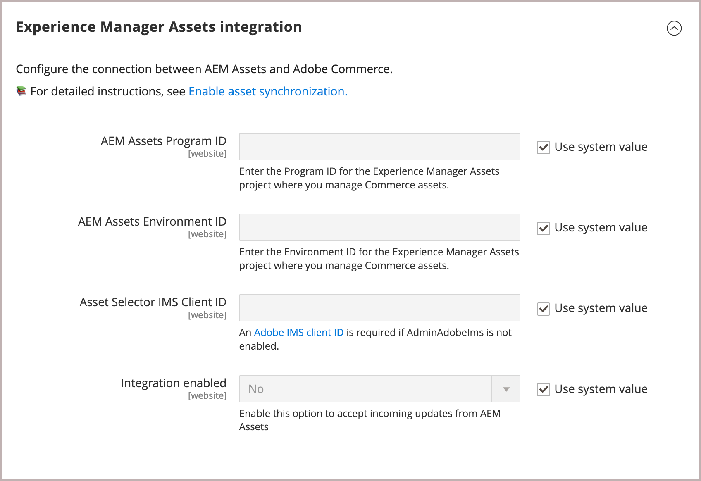

# Configuration de l’intégration

Configurez l’intégration en connectant Commerce à l’instance AEM Assets et en sélectionnant la stratégie correspondante pour la synchronisation des ressources.

Après avoir identifié le projet AEM Assets, sélectionnez la règle correspondante pour synchroniser les ressources entre Adobe Commerce et AEM Assets.

* **[!UICONTROL Match by product SKU]** : règle par défaut qui associe le SKU dans les métadonnées de ressource au [SKU de produit Commerce](https://experienceleague.adobe.com/en/docs/commerce-operations/implementation-playbook/glossary#sku) pour s’assurer que les ressources sont associées aux produits appropriés.

* **[!UICONTROL Custom match]** : règle de correspondance pour les scénarios plus complexes ou pour les besoins spécifiques de l&#39;entreprise qui nécessitent une logique de correspondance personnalisée. L’implémentation d’une correspondance personnalisée nécessite le développement d’un code personnalisé dans Adobe Developer App Builder pour définir la manière dont les ressources sont associées aux produits. Plus de détails bientôt disponibles...

Pour la configuration initiale, utilisez la règle par défaut *Correspondance par sku de produit*.

## Conditions préalables

* [Installation du package AEM Assets](configure-aem.md)

* [!BADGE PaaS uniquement]{type=Informative tooltip="S’applique uniquement à Adobe Commerce sur les projets cloud (infrastructure PaaS gérée par Adobe)."} [Installez les packages Adobe Commerce](configure-commerce.md) pour ajouter l’extension et générer les informations d’identification et les connexions requises pour utiliser l’extension.

* Suivez les étapes décrites dans la rubrique [activation de l’API Open Dynamic Media](https://experienceleague.adobe.com/en/docs/experience-manager-cloud-service/content/assets/dynamicmedia/dynamic-media-open-apis/dynamic-media-open-apis-overview#enable-dynamic-media-open-apis). Insérez les informations suivantes pour l’équipe d’assistance :

   * **[!UICONTROL AEM Program ID]**
   * **[!UICONTROL Adobe Commerce URL]**
   * **[!UICONTROL AEM Environment ID]**,
   * **[!UICONTROL IMS Org ID]** pour l’environnement de création AEM Assets auquel vous souhaitez vous connecter à Commerce.

## Configurer la connexion

1. Obtenez l’identifiant de projet et d’environnement [AEM Assets Authoring Environment](https://experienceleague.adobe.com/en/docs/experience-manager-cloud-service/content/sites/authoring/quick-start).

   1. Ouvrez l’AEM Cloud Manager et sélectionnez **[!UICONTROL Assets]**.

   1. Copiez et enregistrez les identifiants de projet et d’environnement à partir de l’URL  `https://author-p[Program ID]-e[EnvironmentID].adobeaemcloud.com/`

1. Ouvrez la configuration de l’intégration AEM Assets à partir de l’Administration Commerce.

   1. Accédez à **[!UICONTROL Store]** > Configuration > **[!UICONTROL ADOBE SERVICES]** > **[!UICONTROL AEM Assets Integration]**.

      {width="600" zoomable="yes"}

1. Saisissez les **[!UICONTROL Program ID]** et **[!UICONTROL Environment ID]** de l’environnement AEM Assets.

   Modifiez les valeurs de configuration en supprimant la sélection de *[!UICONTROL Use system value]*.

1. Saisissez le **[!UICONTROL Asset Selector IMS Client ID]**.

   Pour plus d’informations sur le sélecteur de ressources, voir [ Sélection manuelle des ressources ](../synchronize/asset-selector-integration.md)

1. [!BADGE PaaS uniquement]{type=Informative tooltip="S’applique uniquement à Adobe Commerce sur les projets cloud (infrastructure PaaS gérée par Adobe)."} sélectionnez les [[!UICONTROL Commerce integration]](configure-commerce.md#add-the-integration-to-the-commerce-environment) d’authentification des requêtes entre Commerce et le service de correspondance des ressources.

1. Définissez **[!UICONTROL Integration enabled]** sur `Yes` pour permettre à Commerce d’accepter les mises à jour entrantes en provenance d’AEM Assets.

   Après avoir activé l’intégration, des options de configuration supplémentaires sont disponibles pour spécifier les critères de correspondance des ressources.

1. Sélectionnez l’une des règles de correspondance de ressources pour la synchronisation des ressources dans la liste déroulante **[!UICONTROL Asset matching rule]** .

   * Sélectionnez **[!UICONTROL Match by SKU]** pour [correspondance automatique par défaut](../synchronize/default-match.md),
   * Sélectionnez **[!UICONTROL Custom match]** pour [correspondance automatique personnalisée](../synchronize/custom-match.md) (nécessite [Adobe Developer App Builder](https://experienceleague.adobe.com/en/docs/commerce-learn/tutorials/adobe-developer-app-builder/introduction-to-app-builder).)

1. Ajoutez le [nom du champ de métadonnées AEM Assets](configure-aem.md#configure-metadata) défini pour les SKU de produit Commerce dans le champ **[!UICONTROL Match by product SKU attribute name]**, `commerce:skus` par défaut.

1. Sélectionnez **[!UICONTROL Save Config]** pour appliquer des mises à jour et lancer la synchronisation des ressources.

   La mise à jour de la configuration déclenche le processus de synchronisation initial, ce qui permet à Commerce d’accepter les mises à jour entrantes provenant d’AEM Assets. Le temps nécessaire à la synchronisation dépend du volume de ressources et de configurations spécifiques. L’intégration tire parti de processus automatisés afin de réduire le temps nécessaire à la synchronisation.

### SLA de synchronisation

L’intégration garantit les niveaux de performances de synchronisation suivants :

* `< 5 minutes for 99% of updates`

* `< 30 minutes for 99.9% of updates`

Cela permet de s’assurer que les pages produit affichent toujours les images les plus récentes, en préservant la précision et l’attrait visuel du contenu du storefront.

### Facultatif. Configuration de l’URL du domaine personnalisé

Si le projet AEM Assets as a Cloud Service a été configuré avec un [nom de domaine personnalisé](https://experienceleague.adobe.com/fr/docs/experience-manager-cloud-service/content/implementing/using-cloud-manager/custom-domain-names/add-custom-domain-name){target=_blank}, vous devez ajouter le nom de domaine à la configuration du magasin Commerce afin que l’intégration AEM Assets pour Commerce puisse l’utiliser.

1. Accédez à **[!UICONTROL Store]** > Configuration > **[!UICONTROL ADOBE SERVICES]** > **[!UICONTROL AEM Assets Integration]**.

   {width="600" zoomable="yes"}

1. Ajoutez l’**URL de domaine personnalisé** au champ **[!UICONTROL Asset Custom Domain]** .

1. Cliquez sur **[!UICONTROL Save Config]** pour appliquer les mises à jour et lancer la synchronisation des ressources.

## Étape suivante

[Gestion des ressources Commerce](../manage-assets.md)
