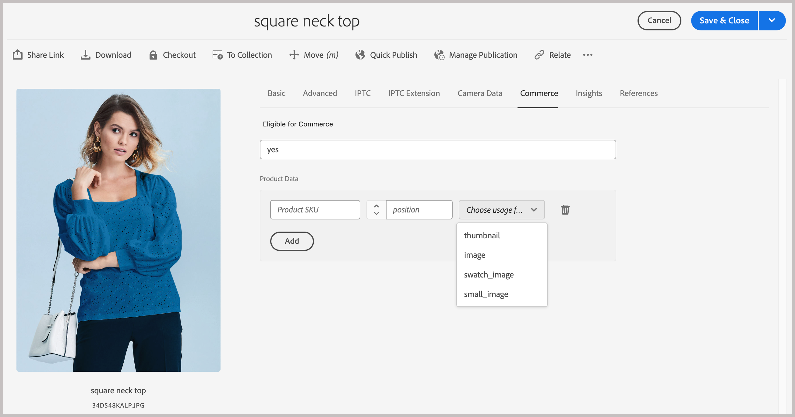
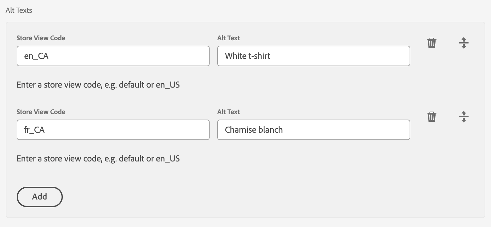

# Métadonnées Commerce dans AEM Assets

Les métadonnées Commerce sont le contrat entre AEM Assets et Commerce. Il indique à Commerce quelles ressources sont destinées à Commerce, à quels produits elles appartiennent et comment elles doivent être utilisées ou affichées. Ces métadonnées permettent à l’intégration d’AEM Assets de mapper et de synchroniser correctement les fichiers de ressource.

Les métadonnées Commerce offrent les fonctionnalités suivantes :

* **Marquer une ressource comme éligible pour Commerce** via le champ `commerce:isCommerce`.
* **Associer une ressource à un ou plusieurs SKU de produit** via le champ `commerce:skus` .
* **Définissez la manière dont la ressource s’affiche dans Commerce** à l’aide des champs `commerce:roles` et `commerce:positions`.
* **Ajoutez du texte secondaire spécifique à Commerce indexé par vue de magasin** via les champs `commerce:altTextStoreViews` et `commerce:altTextValues`.
* **Exposez ces champs dans l’interface utilisateur des propriétés d’AEM Assets** par le biais d’un onglet **[!UICONTROL Commerce]** et d’un formulaire de schéma.

Pour configurer ces ressources dans votre projet AEM, voir [Configurer le projet AEM Assets](get-started/configure-aem.md). Le reste de cette rubrique décrit comment les métadonnées sont fournies.

## Contenu du package AEM Commerce assets-commerce

Adobe fournit le package de code AEM Commerce `assets-commerce` pour ajouter des espaces de noms Commerce et des ressources de schéma de métadonnées à la configuration Experience Manager Assets as a Cloud Service.

Ce code de package ajoute les ressources suivantes à l’environnement de création AEM Assets :

* Un [espace de noms personnalisé](https://github.com/ankumalh/assets-commerce/blob/main/ui.config/jcr_root/apps/commerce/config/org.apache.sling.jcr.repoinit.RepositoryInitializer~commerce-namespaces.cfg.json), `Commerce` pour identifier les propriétés liées à Commerce.

  * Un type de métadonnées personnalisé `commerce:isCommerce` avec le libellé `Eligible for Commerce` pour baliser les ressources Commerce associées à un projet Adobe Commerce.

  * Un `commerce:skus` de type de métadonnées personnalisé et un composant d’interface utilisateur correspondant pour ajouter une propriété **[!UICONTROL Product Data]**. Les données de produit incluent les propriétés de métadonnées pour associer une ressource Commerce aux SKU de produit.

    {width="600" zoomable="yes"}

  * Un `commerce:roles` de type de métadonnées personnalisé et des attributs de `commerce:positions` qui montrent comment la ressource est visualisée dans Commerce. Les quatre rôles standard (`image`, `small_image`, `thumbnail` et `swatch_image`) restent pris en charge. Depuis l’extension d’intégration AEM Assets version 1.4.6, vous pouvez également définir un rôle d’image personnalisé dans `commerce:roles`, tel que `hero` ou `custom_role_1`, pour synchroniser un rôle que Commerce ne définit pas par défaut. Voir [Correspondance automatique personnalisée](synchronize/custom-match.md) pour savoir comment les rôles d’image personnalisés sont ingérés.

    >[!NOTE]
    >
    >Commerce crée automatiquement un attribut de style `media_image` manquant pour un rôle personnalisé.

  * Métadonnées à plusieurs champs de texte secondaire (_[!UICONTROL Alt texts]_) afin que les éditeurs puissent saisir un texte secondaire pour chaque code d’affichage de la boutique Commerce. Le multichamp persiste dans deux propriétés `String[]` alignées sur l’index :

    * `commerce:altTextStoreViews` — stocker le code d&#39;affichage pour chaque ligne.
    * `commerce:altTextValues` : texte de remplacement correspondant au même index que chaque entrée dans `commerce:altTextStoreViews`.

    Les implémentations d’App Builder utilisant un [mappeur externe](synchronize/custom-match.md){target=_blank} peuvent intercepter ces propriétés lors de la transformation des payloads des ressources. Cela ne modifie pas la manière dont les images de produit sont affectées ou la portée dans le catalogue. Voir [&#x200B; Texte secondaire localisé dans les métadonnées AEM Assets](#localized-alt-text-in-aem-assets-metadata).

* Formulaire de schéma de métadonnées avec un onglet Commerce contenant les champs `Eligible for Commerce` et `Product Data` pour le balisage des ressources Commerce. Le formulaire fournit également des options pour afficher ou masquer les champs `roles` et `position` de l’interface utilisateur d’AEM Assets.

  Onglet {width="600" zoomable="yes"}

* Un [exemple de ressource Commerce balisée et approuvée](https://github.com/ankumalh/assets-commerce/blob/main/ui.content/src/main/content/jcr_root/content/dam/wknd/en/activities/hiking/equipment_6.jpg/.content.xml) `equipment_6.jpg` pour prendre en charge la synchronisation initiale des ressources. Seules les ressources Commerce approuvées peuvent être synchronisées d’AEM Assets vers Adobe Commerce.

>[!NOTE]
>
> Voir la page [readme](https://github.com/ankumalh/assets-commerce) sur GitHub pour plus d’informations sur le **code du package AEM Commerce**.

## Texte secondaire localisé dans les métadonnées AEM Assets

Le multichamp _[!UICONTROL Alt texts]_&#x200B;est disponible dans l’éditeur de métadonnées de ressource d’AEM Assets dans l’onglet **[!UICONTROL Commerce]**&#x200B;lorsque vous modifiez une image éligible.

>[!IMPORTANT]
>
> Le comportement d’affichage par magasin s’applique uniquement au texte secondaire. L’intégration d’AEM Assets ne synchronise pas les différentes images des produits par vue de magasin Adobe Commerce. Les images de produit d’AEM continuent à se synchroniser dans Commerce avec le même comportement d’affectation de galerie qu’avant cette version.

Le multichamp contient une ligne par vue de magasin Commerce. Chaque ligne comporte deux entrées :

* **[!UICONTROL Store View Code]** — Identifiant de vue de magasin (par exemple `default` ou `en_US`).

* **[!UICONTROL Alt Text]** : texte secondaire pour cette vue de magasin, limité à 255 caractères.

Sélectionnez **[!UICONTROL Add]** pour ajouter d’autres lignes pour les vues de magasin supplémentaires. Pour supprimer une ligne, sélectionnez l’icône **[!UICONTROL Delete]** de cette ligne pour la supprimer.

{width="600" zoomable="yes"}

Lors de l’enregistrement, la validation côté client bloque l’envoi si une ligne a un _[!UICONTROL Store View Code]_&#x200B;vide ou si deux lignes utilisent le même code d’affichage du magasin (non-respect de la casse).

Les entrées de texte secondaire sont conservées dans les métadonnées de ressource JCR sous la forme de deux propriétés `String[]` alignées sur l’index :

* `commerce:altTextStoreViews` : Stocker le code d’affichage pour chaque ligne.
* `commerce:altTextValues` : Correspondance du texte secondaire au même index que chaque entrée dans `commerce:altTextStoreViews`.

Lorsque ces ressources se synchronisent avec Adobe Commerce, le texte secondaire d’affichage par magasin est écrit dans la galerie de médias du produit pour les codes d’affichage de magasin correspondants. Le mapping d’images sous-jacent reste inchangé.

Exemples de valeurs de métadonnées :

```text
commerce:altTextStoreViews = ["en_US", "fr_FR"]
commerce:altTextValues = ["Running shoe", "Chaussure de course"]
```

Lorsque ces ressources se synchronisent avec Adobe Commerce, chaque valeur de texte secondaire est écrite dans le champ de **[!UICONTROL Label]** d’image standard de Commerce pour le code d’affichage de magasin correspondant. L’intégration ne renseigne pas de colonne de base de données `alt_text` créée par le client.

Le texte secondaire est localisé par vue de magasin, mais l’affectation produit-image sous-jacente et le mappage de galerie restent inchangés. Une affectation d’image unique continue de s’appliquer en fonction du comportement de la galerie Commerce existante.
