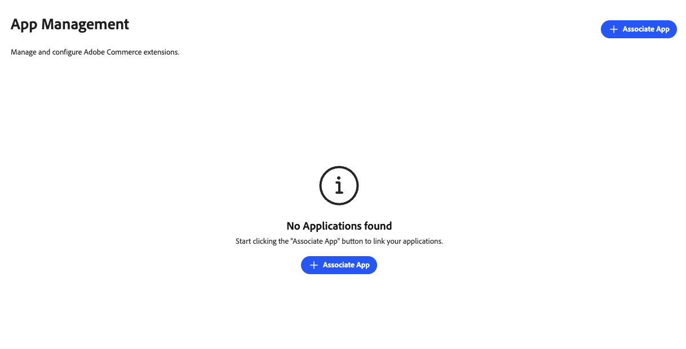
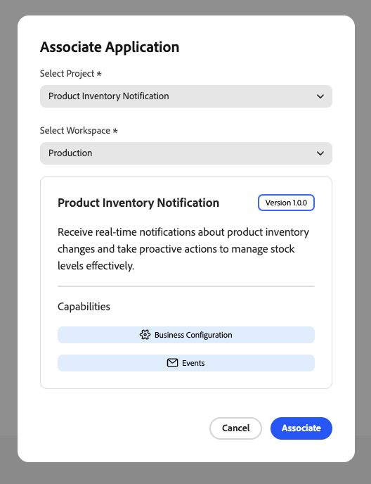

# Gestion de l’application

Un App Manager associe une application App Builder à son instance Commerce. Les formulaires de configuration sont rendus dynamiquement en fonction du schéma de l’application. Aucun développement personnalisé de l’interface d’administration n’est donc nécessaire. App Manager configure les paramètres par le biais de formulaires que Commerce génère automatiquement.

{width="500" zoomable="yes"}

## Trouver une application dans l’Admin

Sous **[!UICONTROL Apps]** > **[!UICONTROL App Management]**, chaque application s’affiche sous la forme d’une carte. La liste peut inclure chaque application associée à l’instance Adobe Commerce pour l’organisation Adobe IMS sélectionnée. Utilisez les commandes situées au-dessus des cartes pour limiter les résultats :

| Contrôle | Description |
| --- | --- |
| **Filtrer par application...** | Effectuez une recherche par nom d’application. |
| **Statut** | Limiter les cartes par état du cycle de vie. **Tous les statuts** affiche chaque application ; les autres valeurs sont **Associé**, **Installé**, **Partiellement installé** et **Non associé**. Le statut de chaque carte correspond à l’indicateur coloré de la liste. |
| **Modèles d’extensibilité** | Limitez les cartes en fonction des fonctionnalités utilisées par l’application. **Tous les modèles d’extensibilité** affiche chaque application ; les autres valeurs sont alignées sur les badges de chaque carte, telles que **Configuration commerciale**, **SDK de l’interface utilisateur d’administration**, **Webhooks** et **Events**. |

Le texte de recherche et les deux listes déroulantes s’appliquent ensemble (ET logique). Pour afficher à nouveau la liste complète, définissez **Statut** et **Modèles d’extensibilité** sur leurs options **Tous...**, puis effacez le champ de recherche.

## Acquérir l’application

**[!UICONTROL Acquire App]** ouvre un nouvel onglet du navigateur (ou une vue de navigateur distincte) dans [Adobe Exchange](https://exchange.adobe.com/experiencecloud){target="_blank"}, où vous pouvez découvrir les listes de la marketplace liées à Commerce et ajouter des applications à votre organisation Adobe IMS. Une fois l’application acquise, approuvée et déployée, elle apparaît en [!DNL App Management] pour [association et installation](#associate-an-app).

## Conditions préalables

Avant d’associer une application, vérifiez que vous disposez des éléments suivants :

| Exigence | Description |
|-------------|-------------|
| **Accès administrateur** | Administrateur Commerce avec autorisations [!DNL App Management] |
| **Application déployée** | Application App Builder déployée dans votre organisation et prête à se connecter |
| **Accès à l’organisation** | Accès à l’organisation Adobe sur laquelle l’application est déployée |

## Tutoriel

Regardez cette vidéo pour savoir comment associer une application à une instance Commerce et configurer des paramètres.

>[!VIDEO](https://video.tv.adobe.com/v/3478944)

## Associer une application

Le processus d’association importe des sites web, des boutiques et des vues de boutique depuis Commerce et crée le lien entre l’application et votre instance Commerce.

Pour lier votre application App Builder à une instance Commerce :

1. Accédez à **[!UICONTROL Apps]** > **[!UICONTROL App Management]**.

1. Cliquez sur **[!UICONTROL Associate App]**.

   {width="500" zoomable="yes"}

1. Sélectionnez un **[!UICONTROL Project]** dans la liste.

1. Sélectionnez le **[!UICONTROL Workspace]**.

1. Cliquez sur **[!UICONTROL Associate]**.

   {width="500" zoomable="yes"}

>[!WARNING]
>
>Si la synchronisation de la portée échoue, l’association se termine toujours. Vous pouvez synchroniser les portées manuellement ultérieurement à partir de la vue **[!UICONTROL Manage Scopes]** dans la configuration de l’application associée.

## Configurer les paramètres

Après avoir associé une application dans la vue [!DNL App Management], configurez ses paramètres via le formulaire :

1. Cliquez sur **[!UICONTROL Configure]** dans l’application associée.

1. Le formulaire affiche les paramètres configurables de l’application.

1. Modifiez les valeurs selon vos besoins.

1. Cliquez sur **[!UICONTROL Save]**.

### Configuration spécifique à la portée

Utilisez une configuration spécifique à la portée lorsque différents sites web, magasins ou vues de magasin ont besoin de paramètres uniques. Par exemple, activez une fonctionnalité uniquement pour une zone géographique ou une vue de boutique spécifique, ou utilisez différents paramètres par marque. Les paramètres d’une portée inférieure remplacent ceux des portées supérieures.

Pour remplacer des valeurs globales à un niveau de portée spécifique :

1. Cliquez sur **[!UICONTROL Change Scope]**.

1. Sélectionnez une étendue dans la liste.

1. Modifiez les valeurs pour cette étendue.

1. Cliquez sur **[!UICONTROL Save]**.

## Gérer les portées

Accédez aux **[!UICONTROL Manage Scopes]** à partir de l’écran des détails de l’application pour gérer la hiérarchie de l’étendue de votre application.

{width="500" zoomable="yes"}

| Action | Description |
|--------|-------------|
| **[!UICONTROL Add root scope]** | Ajoutez une portée qui s’applique uniquement à l’application. |
| **[!UICONTROL Sync Commerce scopes]** | Actualisez la liste des sites web, des boutiques et des affichages de boutique à partir de Commerce après les avoir ajoutés ou modifiés. |
| **[!UICONTROL Import scopes]** | Importer les portées en bloc depuis un fichier. |

## Dissocier une application

Annulez l’association d’une application lorsque vous n’en avez plus besoin connectée à votre instance Commerce. Par exemple, vous devrez peut-être supprimer une intégration, passer à un autre espace de travail ou nettoyer les configurations de test.

>[!WARNING]
>
> La dissociation supprime toutes les valeurs de configuration pour cette instance. Cette opération ne peut pas être annulée.

Pour supprimer une application d’une instance Commerce :

1. Accédez à **[!UICONTROL Apps]** > **[!UICONTROL App Management]**.

1. Cliquez sur **[!UICONTROL Unassociate]** dans l’application.

1. Confirmez l’action.

## Documentation connexe

* [Dépannage [!DNL App Management]](troubleshooting.md)—Résolvez les problèmes courants liés à l&#39;association et à la configuration des applications.
