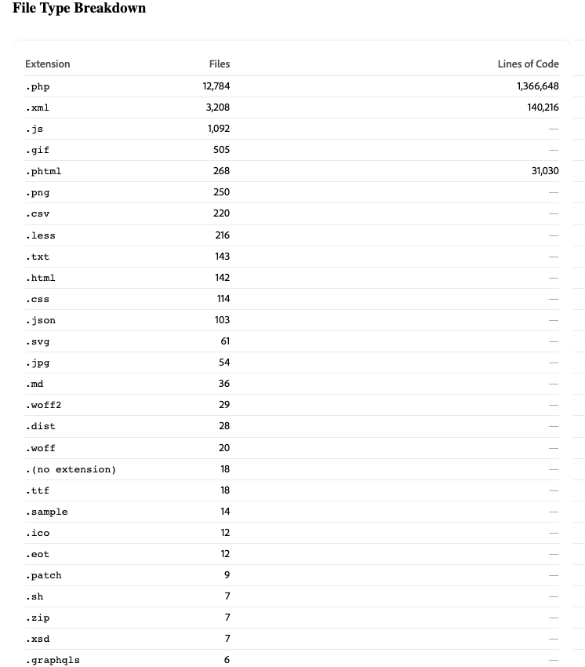

# Évaluation de la migration

>[!IMPORTANT]
>
> L’évaluation de la migration n’est disponible que lors de la migration de projets [!DNL Adobe Commerce on Cloud Infrastructure] ou [!DNL Adobe Commerce on-premises] vers [!DNL Adobe Commerce as a Cloud Service].

Une évaluation de la migration Commerce est une analyse automatisée de votre mise en œuvre Adobe Commerce existante. Les outils d’Adobe analysent votre base de code Commerce et génèrent un rapport structuré qui répertorie tout ce qui a été créé, personnalisé ou modifié. Le rapport indique ensuite comment les personnalisations apportées à votre codebase affectent votre migration vers [!DNL Adobe Commerce as a Cloud Service].

Le rapport est diffusé sous la forme d’un fichier HTML que vous pouvez ouvrir dans n’importe quel navigateur. Aucun accès à votre environnement de production n’est requis, à l’exception du partage initial de la base de code du projet.

**L’évaluation fournit les éléments suivants**

- Un inventaire complet de chaque module personnalisé de votre magasin, organisé par type et niveau d’impact
- Indice de complexité de migration (Élevé, Medium ou Faible) calculé à partir des mesures prédictives des risques
- Une vue hiérarchisée des zones principales et storefront les plus impactantes nécessitant une planification de la migration
- Une description de chaque module personnalisé, que vous pouvez utiliser comme entrée directe pour les outils de développement de l’IA Adobe

## Présentation du rapport d’évaluation de la migration

Le rapport est organisé en trois onglets : **[!UICONTROL Summary]**, **[!UICONTROL Module Reports]** et **[!UICONTROL Report Reliability]**.

>[!NOTE]
>
>Toutes les sections du rapport ne s’appliquent pas à chaque magasin. L’évaluation est conçue pour être exhaustive et couvrir tous les types de personnalisation et facteurs de complexité possibles, mais votre boutique ne comporte qu’un sous-ensemble des sections répertoriées ici.

## Onglet Résumé

L’onglet **[!UICONTROL Summary]** donne un aperçu des signaux clés organisés en ces domaines :

- Complexité de la migration
- Répartition du type de fichier
- Modules à fort impact
- Pilotes de migration
- Répartition de la personnalisation

### Complexité de la migration

La section Complexité de la migration contient l’évaluation de votre boutique dans son ensemble. Il explique comment le score a été calculé et met en évidence vos principaux facteurs de risque.

**Score de complexité et de complexité de la migration**

{width="600" zoomable="yes"}

Le score de complexité pondère chaque entrée en fonction de la difficulté de la migration. Le score correspond à une évaluation de la complexité de migration à l’aide de seuils fixes :

| Évaluation | Plage de scores | Approche standard de la migration |
| --- | --- | --- |
| Faible | 150 ou moins | Migration standard : migration directe avec coordination des fournisseurs de services de paiement et migration des données en tant que flux de travail parallèles. |
| Medium | 151-375 | Migration modulaire : migrée par segments, triant des modules personnalisés à fort impact. |
| Élevée | Plus De 375 | Une migration progressive, qui durera probablement de 12 à 24 mois. |

**Custom Module Ratio**

{width="600" zoomable="yes"}

Pourcentage de vos modules qui ont été créés spécifiquement pour votre implémentation. Une proportion plus élevée signifie qu’un plus grand nombre de codes personnalisés doit être audité et migré. Le ratio moyen de modules personnalisés du client est d’environ 62 %.

>[!TIP]
>
>Custom Module Ratio est un signal de portée, pas un signal de complexité. Un magasin avec 80 % de modules personnalisés isolés et à faible risque peut être plus facile à migrer qu’un magasin avec 40 % de modules personnalisés présentant un risque plus élevé. Utilisez le score de complexité et le nombre de conflits de chaîne pour évaluer la difficulté. Utilisez le rapport de module personnalisé pour estimer le volume.

**Répartition du type de fichier**

{width="600" zoomable="yes"}

Liste du nombre de fichiers dans votre base de code, organisés par type.

**Modules à impact maximal**

{width="600" zoomable="yes"}

Liste sélectionnée des modules spécifiques de votre magasin qui nécessitent le plus d’attention pour la migration. Ces modules sont souvent des modules qui interagissent avec le passage en caisse, les paiements ou la gestion des commandes. Chaque module à fort impact nécessite son propre plan de migration. Cette liste est le meilleur point de départ pour des conversations avec votre équipe technique.

### Complexité du storefront

{width="600" zoomable="yes"}

La section Complexité du storefront couvre les efforts requis pour migrer la couche de présentation front-end de votre magasin. Ce flux de travail est distinct du flux de travail de migration du code back-end, traité par les développeurs front-end et nécessitant généralement des conversations de planification distinctes.

>[!NOTE]
>
>Un magasin peut avoir une complexité d’arrière-plan faible et une complexité de storefront élevée. Consultez toujours les deux sections avant de définir la portée de l’effort de migration.

- Thème personnalisé - Espace de noms du thème personnalisé de votre boutique (par exemple, BrandName_Theme). La présence d’un thème personnalisé signifie qu’une reconstruction complète du thème est requise pour [!DNL Adobe Commerce as a Cloud Service]. Chaque magasin évalué avec un espace de noms de thème personnalisé doit planifier un flux de travail de migration front-end dédié.

- Nombre total de blocs : nombre de fichiers de bloc et de modèle (.phtml) dans votre magasin. Les blocs sont les principaux artefacts de rendu côté serveur. Chacun d’eux représente une tâche de migration discrète.

| Nombre de blocs | Effort |
| --- | --- |
| Moins De 100 Ans | Ligne de base - effort standard |
| 100-300 | Medium - planifier une vague front-end structurée |
| Plus De 300 | Élevé : hiérarchisez les priorités en tant que flux de travail dédié |

### Pilotes de migration

{width="600" zoomable="yes"}

La section Facteurs de migration affiche les principaux facteurs qui déterminent votre évaluation de la complexité.

| Conducteur | Définition |
| --- | --- |
| Empreinte de personnalisation | Le volume global de code personnalisé par rapport à l’implémentation totale |
| Plug-ins et observateurs | Code qui intercepte le comportement de base de la plateforme au moment de l’exécution. |
| Préférences de classe | Un modèle de personnalisation fragile, qui remplace entièrement les classes principales et rompt silencieusement lors des mises à niveau |
| Modèle de données | Structures de base de données personnalisées et modifiées |
| Intégrations | Systèmes externes connectés à votre boutique |

Chaque pilote apparaît avec un effort Élevé, Medium ou Faible. Traitez d’abord les pilotes les mieux notés lors de la définition de la portée et de la planification.

### Modèle de données

{width="600" zoomable="yes"}

La section Modèle de données affiche le nombre de tables personnalisées, les modifications apportées aux tables de base de données principales [!DNL Adobe Commerce] et les attributs Entity-Attribute-Value (EAV) critiques.

Les modifications des tables principales constituent la catégorie la plus difficile à migrer, car elles créent des dépendances sur une version de schéma de plateforme spécifique et ont un impact important dans la formule de score de complexité .

>[!TIP]
>
>Si votre rapport répertorie plus de 15 modifications de table de base, planifiez un flux de travail de migration des données dédié avant de définir la portée de la migration du module principal.

## Répartition de la personnalisation

{width="600" zoomable="yes"}

La section Répartition de la personnalisation fournit des mesures détaillées pour chaque catégorie de personnalisation de votre boutique.

>[!NOTE]
>
>Toutes les sous-sections ne s’affichent pas dans chaque rapport, seules les catégories détectées dans votre base de code s’affichent.
>
>Les sous-sections qui affectent le calque de présentation front-end constituent un flux de travail distinct de la migration du code back-end et nécessitent généralement des conversations de planification distinctes.
>
>Un magasin peut avoir une complexité back-end faible et une complexité front-end élevée. Examinez toujours les sous-sections liées au serveur principal et au storefront avant de définir la portée de l’effort de migration.

### Mise en page XML

Nombre de fichiers XML de disposition et nombre total d’opérations. La disposition XML définit la structure de chaque page, y compris les blocs qui apparaissent, les conteneurs dans lesquels ils apparaissent et les types de page sous lesquels ils se trouvent.

Un nombre de fichiers élevé avec de nombreuses opérations indique une personnalisation importante de la structure de la page qui doit être repensée.

### Remplacements des poignées principales

Nombre d’emplacements où votre code XML de mise en page remplace un descripteur de page [!DNL Adobe Commerce] principal (par exemple, `checkout_cart_index` ou `catalog_product_view`). Les remplacements de descripteurs principaux sont le signal de mise en page présentant le risque le plus élevé, car ils modifient la structure de la page au niveau de la plateforme et nécessitent une reconstruction explicite.

| Remplacer le nombre | Effort |
| --- | --- |
| 0 | Aucun remplacement de disposition de base |
| 1-3 | Risque d’exécution : chaque remplacement nécessite une reconstruction de disposition explicite |
| 4 ou plus | Critique : planifiez un sprint de migration de disposition dédié |

### Blocs

Le nombre de fichiers de bloc et de modèle (`.phtml`) dans votre magasin. Les blocs sont les principaux artefacts de rendu côté serveur. Chaque bloc représente une tâche de migration discrète.

| Nombre de blocs | Effort |
| --- | --- |
| Moins De 100 Ans | Ligne de base - effort standard |
| 100-300 | Medium - planifier une vague front-end structurée |
| Plus De 300 | Élevé : hiérarchisez les priorités en tant que flux de travail dédié |

### Blocs à haut risque

Blocs qui touchent les chemins de rendu principaux, tels que le rendu de passage en caisse, l’affichage du panier et des surfaces front-end similaires. Tout bloc à haut risque nécessite une évaluation individuelle de la migration avant la planification.

### Thèmes et modèles d’e-mail

Espace de noms du thème personnalisé de votre magasin (par exemple, `BrandName_Theme`). La présence d’un thème personnalisé signifie qu’une reconstruction complète du thème est requise. Chaque magasin évalué avec un espace de noms de thème personnalisé doit planifier un flux de travail de migration front-end dédié.

### Remplacements de modèles (modification principale)

Nombre de modèles de `.phtml` de [!DNL Adobe Commerce] principaux qui ont été remplacés. Chaque remplacement de modèle de base crée une dépendance sur une version spécifique de ce modèle. Les mises à jour de Platform qui modifient le modèle interrompent silencieusement le remplacement.

### Migration déroulante requise

[!DNL Adobe Commerce as a Cloud Service] utilise une architecture modulaire de composant de dépôt pour les surfaces de storefront, y compris le passage en caisse, le panier et les détails du produit. Les personnalisations de ces surfaces doivent être reconstruites en tant que composants déroulants. Ces personnalisations peuvent couvrir un large éventail de fonctionnalités, telles que l’ajout d’étapes de passage en caisse personnalisées, la modification de la logique d’affichage du panier ou l’extension de la page des détails du produit.

Le champ [!UICONTROL Drop-in migration required] indique les zones de storefront qui nécessitent des reconstructions par dépôt.

>[!IMPORTANT]
>
>Si le **passage en caisse** est répertorié comme une exigence de migration déroulante, planifiez un flux de travail de passage en caisse dédié. Il s’agit de la tâche de migration de storefront la plus complexe et la plus critique pour l’entreprise.

## Onglet Rapports de module

{width="600" zoomable="yes"}

L’onglet **[!UICONTROL Module Reports]** contient une entrée dédiée pour chaque module personnalisé de votre boutique. Partagez ces informations avec votre équipe technique.

Pour chaque module, le rapport affiche :

| Nom du champ | Définition |
| --- | --- |
| Ce qu&#39;il fait | Description de l’objectif et de la fonction commerciale du module personnalisé |
| Niveau d&#39;impact | Impact **élevé**, **Medium** ou **faible** en fonction du comportement commercial touché par le module |
| Nombre de crochets | Nombre de webhooks, qui indique le nombre d’emplacements où ce module intercepte le comportement de base de la plateforme |
| Recommandation de migration | **Reconstruire**, **Refactoriser**, **Remplacer** avec une fonctionnalité native ou **Supprimer** |
| Dépendances | Avec quels autres modules ce module interagit, ce qui peut informer le séquencement de la migration |

**Workflow**

1. Filtrez d’abord les modules **à fort impact**. Ils génèrent le plus d’efforts et de coûts de migration.
1. Pour chaque module personnalisé, déterminez les réponses aux questions suivantes :
   - Ce module est-il toujours utilisé activement ?
   - Le module pourrait-il être remplacé par une fonctionnalité de [!DNL Adobe Commerce as a Cloud Service] native ?
   - Si le module doit être reconstruit, quelle fonctionnalité son remplacement doit-il fournir ?
1. Identifiez les modules personnalisés qui peuvent être retirés ou remplacés. Chacune d’elles réduit la portée de la migration avant l’écriture du code.
1. Copiez la description de chaque module personnalisé avec la recommandation de migration **Reconstruction**. Ces descriptions peuvent être données directement aux outils de développement de l’IA d’Adobe. Pour plus d’informations, reportez-vous à [Outils de développement de l’IA pour l’extensibilité de Commerce](#ai-developer-tools-for-commerce-extensibility).

## Référence : termes clés

| Terme | Définition |
| --- | --- |
| **Module** | Un package personnalisé et autonome de fonctionnalités. Votre boutique peut avoir entre vingt modules et des centaines de modules. |
| **Plug-in (intercepteur)** | Code qui intercepte une fonction Commerce et modifie son comportement avant, pendant ou après son exécution. |
| **Observateur** | Code qui écoute un événement de plateforme spécifique, tel que « commande passée », et exécute une logique personnalisée lorsque cet événement se déclenche. |
| **Préférence (remplacement de classe)** | Type de personnalisation fragile qui remplace complètement une classe Commerce de base, qui se rompt silencieusement lorsque la plateforme met à niveau cette classe. |
| **Conflit de chaîne** | Lorsque plusieurs plug-ins interceptent la même fonction et que l’un d’eux ne parvient pas à transmettre le contrôle à l’autre. Cela peut entraîner l’arrêt silencieux du fonctionnement des fonctionnalités, sans message d’erreur. |
| **Modification de la table principale** | Modification structurelle apportée aux tables de base de données intégrées de Commerce, créant une dépendance irréversible sur une version de schéma de plateforme spécifique. Ceux-ci ont le poids le plus élevé dans la formule Score de complexité . |
| **Entity-Attribute-Value (EAV)** | Champ personnalisé flexible ajouté aux produits ou aux clients, par exemple un champ personnalisé « période de garantie ». Un nombre élevé de VAE augmente la complexité de la migration des données. |
| **Densité de crochet** | Nombre moyen de plug-ins et d’observateurs par module. Une densité plus élevée signifie que la personnalisation est plus étroitement tissée dans la plate-forme principale. |
| **Drop-in** | [!DNL Adobe Commerce's] approche modulaire des composants storefront (y compris les pages de passage en caisse, de panier et de détails du produit). Le comportement de passage en caisse personnalisé sur [!DNL Adobe Commerce on Cloud Infrastructure] ou [!DNL Adobe Commerce on Premises] nécessite généralement une reconstruction par dépôt sur [!DNL Adobe Commerce as a Cloud Service]. |
| **** | La plateforme d’extensibilité hors processus d’Adobe et la méthode recommandée pour créer une fonctionnalité personnalisée, en remplaçant les extensions PHP en cours de processus. |
| **XML de disposition** | Fichiers de configuration qui définissent les blocs qui apparaissent sur les pages. La mise en page XML personnalisée doit être repensée pour [!DNL Adobe Commerce as a Cloud Service's] structure de page. |
| **Remplacement de poignée principale** | Personnalisation XML de la disposition qui modifie globalement la structure d’une page Commerce principale. Ils présentent le modèle de disposition le plus risqué pour la migration. |

## Outils de développement de l’IA pour l’extensibilité de Commerce

Vous pouvez utiliser les descriptions des modules dans l’onglet **[!UICONTROL Module Reports]** comme invites pour l’outil de développement de l’IA Adobe. Ces outils vous aident à créer et à déployer une extension de remplacement compatible avec [!DNL Adobe Commerce as a Cloud Service].

### Ce que fournissent les outils

Adobe [les outils de développement de l’IA pour l’extensibilité de Commerce](https://developer.adobe.com/commerce/extensibility/developer-agent/) incluent deux fonctionnalités principales.

- [!DNL Adobe Commerce] [!DNL App Builder] serveur MCP : une intégration MCP (Model Context Protocol) qui connecte directement les assistants de codage AI à la documentation [!DNL Adobe Commerce], aux API et aux modèles de développement App Builder. Les développeurs peuvent décrire ce qu’ils souhaitent créer et le serveur MCP fournit une génération de code compatible avec Commerce, une orientation de l’architecture et une automatisation du déploiement dans l’IDE.
- Compétences agent : compétences d’IA préconfigurées couvrant les schémas d’extensibilité courants de Commerce, tels que les API REST, les extensions de passage en caisse, les composants de storefront et les intégrations basées sur des événements. Les compétences guident l’IA à travers les étapes d’architecture, d’implémentation, de test et de déploiement spécifiques aux [!DNL Adobe Commerce as a Cloud Service] et aux [!DNL App Builder].

#### Installation des outils d’IA

Consultez la section [Installation des outils de développement de l’IA](https://developer.adobe.com/commerce/extensibility/developer-agent/coding-tools) pour obtenir des instructions complètes et des configurations d’IDE spécifiques.

**Conditions préalables requises :** Node.js 22.x, npm 9.0.0 ou version ultérieure, interface de ligne de commande Adobe I/O.

Commande d&#39;installation :

```bash
aio commerce extensibility tools-setup
```

### Créer des invites à partir du rapport d&#39;évaluation

Bien que l’évaluation vous fournisse un plan de développement, les outils d’IA permettent à votre équipe de commencer à créer immédiatement, avant la finalisation d’un plan de migration complet.

1. Ouvrez l’onglet **[!UICONTROL Module Reports]** et recherchez un module à fort impact avec une recommandation **Reconstruire**.
1. Lisez la description du module, par exemple :

```shell-session
Manages custom shipping rate calculations based on customer account tier and order    weight thresholds.
```

1. Ouvrez votre IDE, par exemple GitHub Copilot, Cursor ou Claude avec le serveur MCP d’extensibilité de Commerce activé.
1. Utilisez la description du module pour demander à l’agent d’IA.
1. Passez en revue l’application [!DNL App Builder] squelettique et effectuez une itération avec l’agent pour affiner l’implémentation.

## Étapes suivantes

1. Ouvrez l’onglet **[!UICONTROL Summary]** . Passez en revue la complexité de la migration et les modules ayant le plus d’impact, puis consultez les sous-sections Répartition de la personnalisation . Si votre boutique a un thème personnalisé, des blocs à haut risque ou une liste déroulante de passage en caisse, planifiez un flux de travail front-end parallèle à la migration du serveur principal.
1. Partagez l’onglet **[!UICONTROL Module Reports]** avec votre équipe technique ou votre partenaire de développement. Demandez-leur de signaler tout module personnalisé qui n’est plus utilisé activement ou qui pourrait être remplacé par une fonctionnalité [!DNL Adobe Commerce as a Cloud Service].
1. Commencez à créer vos personnalisations. Utilisez les descriptions des modules comme entrée d’outil d’IA pour commencer à créer des extensions compatibles.
1. Planifiez un appel de présentation avec l’équipe de votre compte Adobe. Adobe peut examiner les résultats avec vous, répondre à toutes les questions sur des modules spécifiques et les signaux storefront et vous aider à mapper l’approche de migration pour votre profil de complexité.

## Ressources

- [!DNL Adobe Commerce as a Cloud Service]
   - [Vue d’ensemble](../overview.md)
   - [Présentation de la migration](./overview.md)
   - [Tutoriel sur l’extension d’évaluations](../tutorials/ratings-extension.md)
   - [Tutoriel sur la méthode d’expédition](../tutorials/shipping-method-extension.md)
- Extensibilité
   - [Vue d’ensemble](https://developer.adobe.com/commerce/extensibility/)
   - [Outils de développement de l’IA](https://developer.adobe.com/commerce/extensibility/developer-agent/)
      - [Bonnes pratiques](https://developer.adobe.com/commerce/extensibility/developer-agent/best-practices)
      - [Configuration](https://developer.adobe.com/commerce/extensibility/developer-agent/coding-tools)
      - [Compétences et invites](https://developer.adobe.com/commerce/extensibility/developer-agent/skills-and-prompts)
      - [Cas d’utilisation](https://developer.adobe.com/commerce/extensibility/developer-agent/use-cases)
   - [Présentation d’App Builder](https://developer.adobe.com/app-builder/docs/intro_and_overview/)
   - [App Builder pour Adobe Commerce](https://experienceleague.adobe.com/en/docs/commerce-learn/tutorials/extensibility/adobe-developer-app-builder/introduction-to-app-builder)
   - Kits de démarrage
      - [Kit de démarrage de l’intégration du serveur principal](https://developer.adobe.com/commerce/extensibility/starter-kit/integration/)
      - [Kit de démarrage pour passage en caisse](https://developer.adobe.com/commerce/extensibility/starter-kit/checkout/)
- Développement de storefront
   - [Vue d’ensemble](https://experienceleague.adobe.com/developer/commerce/storefront/)
   - [Compétences en IA pour Storefront](https://experienceleague.adobe.com/developer/commerce/storefront/boilerplate/ai-agent-skills/)

>[!TIP]
>
>Contactez le gestionnaire de compte de votre solution pour demander une évaluation de la migration de votre instance existante.
