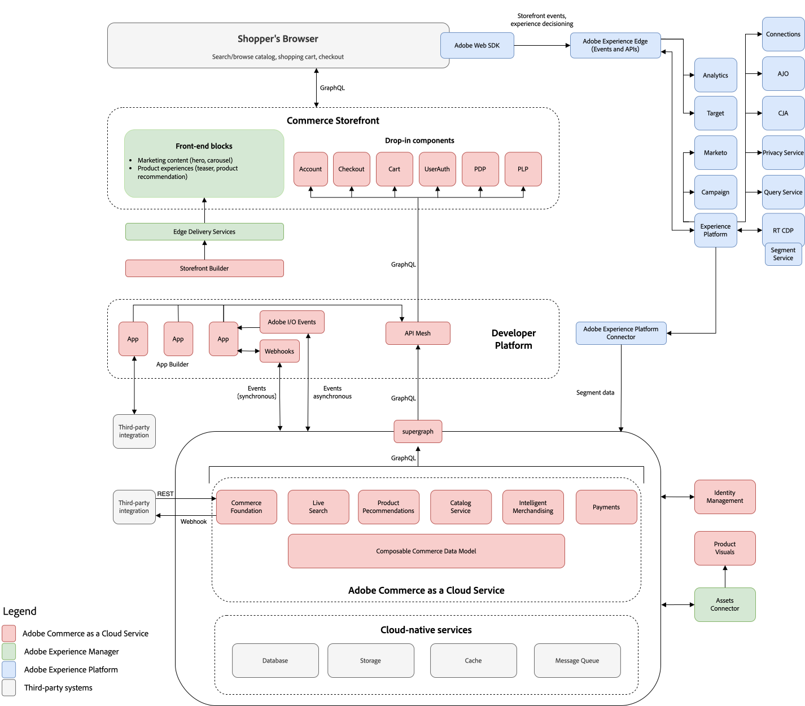

# Présentation d’Adobe Commerce as a Cloud Service

Adobe Commerce as a Cloud Service offre flexibilité, évolutivité et efficacité en permettant aux entreprises de fournir et d’adapter rapidement leurs opérations numériques et d’accélérer l’innovation. L’infrastructure native au cloud d’Adobe ajuste automatiquement les ressources pour répondre aux pics de demande de trafic, de commandes et de gestion de catalogues.

Le graphique suivant met en évidence les produits qui alimentent Adobe Commerce as a Cloud Service :

{align="center" zoomable="yes"}

>[!BEGINSHADEBOX]

 Si vous souhaitez participer au programme d’accès anticipé d’Adobe Commerce as a Cloud Service, remplissez [ce formulaire](https://forms.office.com/pages/responsepage.aspx?id=Wht7-jR7h0OUrtLBeN7O4WOxhjY2doZPikS2hIbfmL5URFZXTE5TUk9PMUw0OFdOWTBNNlI3UTlNMS4u&amp;route=shorturl).

>[!ENDSHADEBOX]

## Architecture

Regardez la vidéo suivante pour une brève présentation de l’architecture d’Adobe Commerce as a Cloud Service. Des diagrammes illustrant l’architecture sont fournis sous la vidéo.

>[!VIDEO](https://video.tv.adobe.com/v/3443232?learn=on)

Ce diagramme illustre le flux de données entre Adobe Commerce as a Cloud Service et toutes les solutions Adobe Experience Cloud.

{zoomable="yes"}

## Commerce Storefront

Utilisez Adobe [Commerce Storefront](https://experienceleague.adobe.com/developer/commerce/storefront) optimisé par Edge Delivery Services pour créer des expériences riches en quelques minutes avec une création simple basée sur des documents ou une modification visuelle avec Storefront Builder.

Le storefront Commerce est entièrement découplé avec une architecture découplée qui fournit tous les services et données de marchandisage via une couche d’API GraphQL. Cette architecture permet aux équipes de développer leurs interfaces indépendamment de Commerce Foundation, offrant ainsi l’agilité nécessaire pour créer et tester de nouveaux points de contact avec les technologies émergentes.

>[!NOTE]
>
>Adobe Commerce as a Cloud Service ne prend pas en charge les storefronts de Luma. Si vous migrez depuis Adobe Commerce on Cloud ou on-premise, consultez [storefronts existants](https://experienceleague.adobe.com/developer/commerce/storefront/discovery/#existing-storefronts) pour obtenir des conseils sur la transition.

## Services de marchandisage et services de paiement

Adobe fournit un ensemble riche de services de marchandisage intelligents et composables pour vous aider à atteindre vos principaux objectifs commerciaux. Ces services fournissent également des API qui sont essentielles pour optimiser les performances à grande échelle.

- [Recherche en direct](../live-search/overview.md) : obtenez des résultats plus intelligents, plus rapides et pertinents pour les acheteurs grâce à cet outil de recherche optimisé par l’IA.
- [Recommandations de produits](../product-recommendations/overview.md) : ajoutez des recommandations optimisées par l’IA en fonction du comportement des acheteurs, des tendances populaires, de la similarité des produits, etc.
- [Services de marchandisage optimisés par les canaux et les politiques](../merchandising-services/overview.md)—Gérez des catalogues de produits volumineux et complexes avec une modélisation de données flexible afin de fournir des catalogues commerciaux hautement performants et flexibles alignés sur la structure de l’entreprise et les stratégies de commercialisation. Utilisez avec [Commerce Optimizer](../optimizer/overview.md) pour optimiser les performances du catalogue et améliorer les taux de conversion.
- [Services de paiement](../payment-services/overview.md)—Augmentez la satisfaction des clients en offrant diverses méthodes de paiement, y compris des acomptes provisionnels sans intérêt, et une vue unique du traitement des paiements, des commandes et des factures.

## Visuels du produit

Simplifiez la gestion des ressources à l’aide d’un système de gestion des ressources numériques (DAM) robuste qui s’intègre à Adobe Experience Manager pour gérer le contenu multimédia. Sinon, la mini-gestion des ressources numériques native fournit des outils de gestion des ressources de base pour le stockage et la gestion des ressources numériques.

Voir [Gestion des ressources](https://experienceleague.adobe.com/en/docs/commerce-admin/content-design/aem-asset-management/aem-assets-integration) pour en savoir plus.

## Plateforme du développeur

Adobe fournit aux développeurs des points d’extension et des outils complets pour créer des applications qui étendent les fonctionnalités de Commerce Foundation et s’intègrent à des systèmes tiers (tels que CRM, ERPS et PIMS). Ces outils permettent de réduire le coût total de possession de la plateforme comme suit :

- **Évolutivité** : les applications peuvent être mises à l&#39;échelle séparément du logiciel principal, ce qui permet d&#39;accroître l&#39;efficacité et de simplifier les mises à niveau.
- **Isolation**-Un environnement isolé signifie que les développeurs peuvent mettre à niveau ou modifier leurs extensions à leur guise sans avoir recours à une version principale.
- **Indépendance technologique**-Les développeurs peuvent choisir la pile technologique et le langage de codage qui correspondent à leurs besoins.

>[!TIP]
>
>Des applications créées par le fournisseur peuvent également être installées sur [Adobe Exchange](https://exchange.adobe.com/).

Adobe fournit les outils de développement suivants pour créer des intégrations et des personnalisations :

- [**Maillage API pour Adobe Developer App Builder**](https://developer.adobe.com/graphql-mesh-gateway/) : coordonnez et combinez plusieurs API, GraphQL, REST et d’autres sources en un seul point d’entrée GraphQL interrogeable.
- [**App Builder**](https://developer.adobe.com/app-builder/docs/overview/) : créez et déployez des applications web sécurisées et évolutives qui étendent les fonctionnalités de Commerce et s’intègrent à des solutions tierces.
- [**Événements**](https://developer.adobe.com/commerce/extensibility/events/) : utilisez des déclencheurs d&#39;événement personnalisés pour interagir avec d&#39;autres outils de développement extensibles.
- [**Webhooks**](https://developer.adobe.com/commerce/extensibility/webhooks/) : utilisez les webhooks pour déclencher automatiquement les interactions entre Commerce et les systèmes tiers.
- [**Admin UI SDK**](https://developer.adobe.com/commerce/extensibility/admin-ui-sdk/) : personnalisez et améliorez l’administration Commerce avec de nouvelles pages et fonctionnalités pour vos commerçants.
- [**kit de démarrage de l’intégration**](https://developer.adobe.com/commerce/extensibility/starter-kit/integration/) : accélérez vos intégrations back-office grâce à des intégrations de référence, des scripts d’intégration et une architecture normalisée.

## Commerce Foundation

Commerce Foundation fournit une plateforme d’hébergement automatisée sécurisée et des fonctionnalités en libre-service pour gérer votre application Commerce dans un environnement natif dans le cloud.

Les principales fonctionnalités sont les suivantes :

- Intégration simplifiée
- Mises à niveau transparentes
- Intégrations tierces

### Intégration simplifiée

Lancez le sandbox et les instances de production en quelques minutes avec le portail d’approvisionnement en libre-service de Commerce Cloud Manager. Tout ce dont vous avez besoin, y compris les services de marchandisage, le storefront Commerce et App Builder, est automatiquement configuré et intégré à vos instances.

Voir [Prise en main](getting-started.md) pour savoir comment créer et gérer des instances Commerce.

### Mises à niveau transparentes

Accédez aux dernières fonctionnalités et améliorations sans avoir à effectuer de mises à niveau manuelles. La diffusion continue de nouvelles fonctionnalités et de mises à jour élimine le besoin d&#39;appliquer manuellement des correctifs, ce qui garantit que vous avez toujours accès aux dernières fonctionnalités avec un coût total de possession faible.

Le processus de mise à niveau classique pour Adobe Commerce sur Cloud consistait à créer des sauvegardes, cloner des instances, exécuter des outils de compatibilité et résoudre des conflits de code. Ce n’est plus nécessaire avec Adobe Commerce as a Cloud Service. Adobe vous envoie des notifications in-app lorsque de nouvelles fonctionnalités et mises à jour de sécurité sont publiées. Vous disposez d’une période de 30 jours pour évaluer les nouvelles fonctionnalités de vos instances sandbox avant que les mises à jour ne soient automatiquement appliquées à vos environnements de production.

>[!NOTE]
>
>Adobe garantit la rétrocompatibilité pour toutes les mises à jour. Cela signifie que lorsque des mises à jour sont appliquées, elles n’interrompent pas les fonctionnalités ou personnalisations existantes qui adhèrent au modèle [extensibilité API-first](https://developer.adobe.com/commerce/extensibility/).

### Intégrations tierces

Les développeurs peuvent utiliser des API [GraphQL et REST complètes](https://developer.adobe.com/commerce/services/cloud/guides/) pour intégrer Commerce Foundation à des systèmes tiers et étendre les fonctionnalités de Commerce.

## Intégration d’Experience Cloud

Adobe Commerce as a Cloud Service s’intègre à toutes les solutions Experience Cloud pour offrir des [expériences commerciales personnalisées à grande échelle](https://experienceleague.adobe.com/en/docs/commerce-admin/customers/customers-menu/personalize-scale#customers-menu).

[Connexion de données](../data-connection/overview.md) débloque des informations sur le comportement d’achat de vos clients afin que vous puissiez créer des expériences d’achat personnalisées sur tous les canaux avec d’autres produits d’expérience digitale Adobe.

## Avantages

Les sections suivantes fournissent des informations sur les avantages offerts par Adobe Commerce as a Cloud Service aux chefs d’entreprise et aux responsables informatiques.

### Chefs d’entreprise

- **Augmenter le chiffre d’affaires** : stimulez le trafic organique avec une vitrine haute performance qui stimule l’optimisation pour les moteurs de recherche. Créez des expériences personnalisées qui génèrent des conversions à l’aide de données enrichies.
- **Mise à l’échelle des opérations** : les services de mise à l’échelle automatique répondent aux demandes de pointe de votre entreprise avec une disponibilité de 99,9 %. Déployez plusieurs marques et régions et prenez en charge le B2B et le B2C à partir d’une seule instance. Prise en charge de catalogues de produits volumineux et complexes avec une modélisation de données flexible.
- **Augmenter la productivité du marchandiseur** : utilisez les services de marchandisage optimisés par l’IA pour améliorer la conversion. Faites des expériences en mode natif, directement dans le storefront. Gérez l’expérience du storefront pour créer des expériences riches en quelques minutes avec une création simple basée sur des documents ou un éditeur visuel.
- **Réduction du coût total de possession (TCO) et accélération de l’innovation** : des services toujours à jour vous donnent immédiatement accès à de nouvelles fonctionnalités. Activez de nouvelles fonctionnalités en installant facilement des applications à partir de la marketplace. Libérez des ressources de la maintenance fastidieuse pour vous concentrer sur la création de nouvelles fonctionnalités.

### Leaders en technologies de l&#39;information (TI)

- **Approvisionnement rapide** : commencez rapidement votre approvisionnement en libre-service en quelques minutes. Tous les services sont préconfigurés pour fonctionner de manière transparente afin de démarrer plus rapidement. Fournissez des sandbox pour l’expérimentation des développeurs, si nécessaire.
- **Faible coût de possession** : plus de mises à niveau avec des services toujours à jour. Restez sécurisé et conforme avec les derniers correctifs de sécurité automatiquement appliqués pour vous. Évoluez automatiquement pour répondre aux charges de travail les plus exigeantes.
- **Vitrine haute performance** : créez des expériences riches en quelques minutes avec une création simple basée sur des documents ou un éditeur visuel. Utilisez des services de marchandisage optimisés par l’IA pour améliorer la conversion. Expérimentation native intégrée au storefront.
- **Innovation plus rapide** : libérez des ressources nécessaires à une maintenance fastidieuse pour vous concentrer sur la création de nouvelles fonctionnalités offrant une valeur ajoutée à votre entreprise. Utilisez une extensibilité complète et des technologies standard (JavaScript, HTML, CSS et outils à code faible) pour créer des expériences différenciées. Installez des applications tierces en un clic pour ajouter de nouvelles fonctionnalités à votre plateforme commerciale.

## Nouvelles solutions de fonctionnalités

L’interface utilisateur [Admin](https://experienceleague.adobe.com/en/docs/commerce-admin/systems/guide-overview) est l’interface principale permettant d’accéder aux fonctionnalités de gestion des opérations de la boutique principale, des stocks, des prix, des promotions et des interactions des clients. Cependant, Adobe Commerce as a Cloud Service propose des solutions uniques qui remplacent certaines des fonctionnalités connues disponibles dans les projets Adobe Commerce on Cloud et on-premise. Le tableau suivant décrit les fonctionnalités et solutions de remplacement disponibles dans Adobe Commerce as a Cloud Service :

| Fonctionnalité | Solution | Disponibilité | Détails |
|---------|----------|--------------|--------|
| [Gestion des ressources numériques](https://experienceleague.adobe.com/en/docs/commerce-admin/content-design/wysiwyg/gallery/media-gallery-asset-management) | [Visuels du produit](https://experienceleague.adobe.com/en/docs/commerce-admin/content-design/aem-asset-management/aem-assets-integration) ou mini-gestion des ressources numériques (DAM) | Available | Système robuste de gestion des ressources numériques (DAM) qui s’intègre à Adobe Experience Manager pour gérer le contenu multimédia. Alternativement, la gestion des ressources numériques mini fournit des outils de gestion des ressources de base pour le stockage et la gestion des ressources numériques. |
| [Système de gestion de contenu (CMS)](https://experienceleague.adobe.com/en/docs/commerce-admin/content-design/guide-overview) | [Commerce Storefront](https://www.aem.live/) | Available | CMS de base permettant aux utilisateurs de créer et de gérer facilement des documents et du contenu de site web à l’aide de la création basée sur des documents. Vous pouvez également utiliser un éditeur universel qui permet une gestion et une personnalisation de contenu plus avancées sur plusieurs plateformes. |
| [Évaluation du contenu](https://experienceleague.adobe.com/en/docs/commerce-admin/content-design/staging/content-staging) | [Service de catalogue](../catalog-service/overview.md) | Feuille de route | Outil de gestion de catalogues lié à Adobe Experience Platform, permettant la gestion de catalogues volumineux. |
| [Page Builder](https://experienceleague.adobe.com/en/docs/commerce-admin/page-builder/guide-overview) | [Commerce Storefront](https://www.aem.live/) | Available | CMS de base permettant aux utilisateurs de créer et de gérer facilement des documents et du contenu de site web à l’aide de la création basée sur des documents. Vous pouvez également utiliser un éditeur universel qui permet une gestion et une personnalisation de contenu plus avancées sur plusieurs plateformes. |
| [ Paiements ](https://experienceleague.adobe.com/en/docs/commerce-admin/stores-sales/payments/payments) | [ Services de paiement pour Adobe Commerce ](../payment-services/overview.md) | Available | Un service de paiement intégré qui facilite les transactions sécurisées et efficaces. |
| [ Catalogue partagé ](https://experienceleague.adobe.com/en/docs/commerce-admin/b2b/shared-catalogs/catalog-shared) | [Service d’indexation des prix](../price-index/price-indexing.md) | Feuille de route | Analyse les données de tarification et suggère des stratégies de tarification optimales pour les produits en fonction de divers facteurs. |
| [Réécritures d’URL](https://experienceleague.adobe.com/en/docs/commerce-admin/marketing/seo/url-rewrites/url-rewrite) | [Commerce Storefront](https://www.aem.live/) | Available | CMS de base permettant aux utilisateurs de créer et de gérer facilement des documents et du contenu de site web à l’aide de la création basée sur des documents. Vous pouvez également utiliser un éditeur universel qui permet une gestion et une personnalisation de contenu plus avancées sur plusieurs plateformes. |
| [Marchandiseur visuel](https://experienceleague.adobe.com/en/docs/commerce-admin/marketing/merchandising/visual-merch/visual-merchandiser) | [Service de catalogue](../catalog-service/overview.md) | Feuille de route | Outil de gestion de catalogues lié à Adobe Experience Platform, permettant la gestion de catalogues volumineux. |
