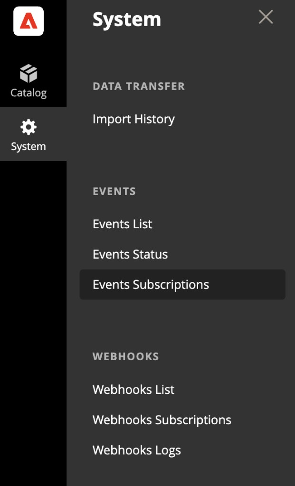

# Tutoriel sur l’extension des notifications en stock

Ce tutoriel vous guide tout au long de la création d’une extension de notification en stock pour les [!DNL Adobe Commerce as a Cloud Service] qui utilisent des outils de développement [!DNL Adobe App Builder] et assistés par l’IA. L’extension permet aux acheteurs de s’abonner à des produits en rupture de stock et de recevoir une notification lorsque le produit est de nouveau en stock.

Vous créez deux parties :

- **Extension App Builder** — Une API REST pour gérer les abonnements en rupture de stock (création, lecture, suppression) avec une détection de retour en stock planifiée et pilotée par un événement.
- **Intégration de Storefront** — Formulaire d&#39;abonnement sur la page des détails du produit (PDP) qui s&#39;affiche uniquement lorsque le produit ou la variante sélectionné est en rupture de stock.

>[!NOTE]
>
>Les agents de l’IA sont non déterministes. Les invites, questions et sorties de ce tutoriel sont des exemples. Votre agent peut formuler différentes questions, exigences ou propositions d’architecture. Utilisez les exemples de ce tutoriel pour diriger l’agent vers un résultat similaire.

Avant de commencer, renseignez les [conditions préalables](./tutorial-prerequisites.md). Ce tutoriel utilise le **kit de démarrage d’intégration**. Vérifiez que vous l’avez déjà cloné et effectuez les étapes de configuration décrites sur la page des conditions préalables.

## Vérifier les conditions préalables

Vérifiez que les prérequis suivants sont installés :

```bash
# Check Node.js version (should be 22.x.x)
node --version

# Check npm version (should be 9.0.0 or higher)
npm --version

# Check Git installation
git --version

# Check Bash shell installation
bash --version
```

Si l’une des commandes précédentes ne renvoie pas les résultats attendus, reportez-vous à la [conditions préalables](./tutorial-prerequisites.md) pour obtenir des conseils.

Vérifiez également les éléments suivants :

- Vous disposez d’une instance [!DNL Adobe Commerce as a Cloud Service] avec des données de produit. Voir [Instances du service Commerce Cloud](https://experienceleague.adobe.com/fr/docs/commerce/cloud-service/overview){target="_blank"}.
- Un projet de storefront est connecté à votre instance [!DNL Commerce]. Si vous n’en avez pas, suivez les étapes de la section [Créer un storefront](https://experienceleague.adobe.com/developer/commerce/storefront/get-started/create-storefront/?lang=fr){target="_blank"}.
- L’interface de ligne de commande `aem` est installée :

  ```bash
  npm install -g @adobe/aem-cli
  ```

## Développement d’extension

Cette section vous guide tout au long du développement d’une extension de notification en stock pour les [!DNL Adobe Commerce as a Cloud Service] qui utilisent des outils de développement assistés par l’IA. L’extension fournit une API REST pour la gestion des abonnements et détecte le moment où les produits sont de nouveau en stock par le biais d’événements Commerce et d’une vérification planifiée.

1. Accédez aux paramètres MCP dans votre agent de codage.

   Par exemple, dans Cursor, accédez à **[!UICONTROL Cursor]** > **[!UICONTROL Settings]** > **[!UICONTROL Cursor Settings]** > **[!UICONTROL Tools & MCP]**. Vérifiez que l&#39;ensemble d&#39;outils `commerce-extensibility` est activé sans erreur. Si des erreurs s’affichent, désactivez la palette d’outils et activez-la.

   >[!NOTE]
   >
   >Lorsque vous utilisez des outils de développement assistés par l’IA, attendez-vous à des variations naturelles du code et des réponses générées par l’agent.
   >Si vous rencontrez des problèmes avec votre code, demandez à l’agent de vous aider à le déboguer.

1. Si de la documentation est ajoutée au contexte du curseur, désactivez-la.

   Accédez à **[!UICONTROL Cursor]** > **[!UICONTROL Settings]** > **[!UICONTROL Cursor Settings]** > **[!UICONTROL Indexing & Docs]** et supprimez toute documentation répertoriée.

### Étape 1 : fournir l’invite initiale

Demandez à l’agent AI de commencer l’implémentation. Indiquer à l’agent d’arrêter et de poser des questions vous aide à piloter l’implémentation au plus tôt.

Saisissez l’invite suivante dans la fenêtre de conversation de l’agent :

```shell-session
Implement an Adobe Commerce as a Cloud Service extension to handle out-of-stock notifications for products.

The service should provide REST API endpoints for basic create, read, update, and delete (CRUD) operations on out-of-stock notifications, allowing storefronts to manage notifications for specific product SKUs.

Back-in-stock is detected by an inventory or product event or a scheduled action that checks Commerce API and then calls the REST API to send the notification.

STOP and ask me any clarifying questions you have about the requirements before you do any work.
```

>[!TIP]
>
>Indiquer à l’agent d’ARRÊTER et de poser des questions avant de continuer vous aide à piloter l’implémentation au début du processus. Ce processus permet de s’assurer que les hypothèses clés et les exigences manquantes sont identifiées rapidement. Il est nécessaire de lancer le workflow guidé dans ce tutoriel.

### Étape 2 : Répondre aux questions de l&#39;agent

L&#39;agent revient avec une série de questions dont il a besoin avant de pouvoir commencer à former une solution. L’exemple suivant illustre des questions et réponses standard. Votre agent peut poser des questions différentes, mais les sujets sont généralement les mêmes.

**Exemples de questions sur l’agent :**

1. **API REST — hôte et consommateurs** — L’API REST CRUD doit-elle faire partie de cette application App Builder (par exemple, actions web sur Adobe I/O Runtime) que les appels storefronts appellent ? Qui l’appellera (storefront EDS, storefront personnalisé/découplé, ou les deux) ? Avez-vous besoin d’un accès CORS, public (non authentifié), ou les appelants utiliseront-ils des clés API, des jetons OAuth ou Commerce ?
1. **Modèle de données** — Que doit représenter une « notification » ? Identifiant client (e-mail uniquement ou également identifiant client) ? Identifiant du produit (SKU uniquement ou SKU + vue magasin) ? Un même client peut-il s’abonner au même SKU plusieurs fois, ou les abonnements doivent-ils être dédupliqués ?
1. **Détection de retour en stock (événement ou planification)** - Souhaitez-vous une détection pilotée par les événements (réagissez à un événement d’inventaire/de produit à partir de Commerce), une détection planifiée (une action planifiée qui vérifie régulièrement le stock), ou les deux ? Que doit signifier « envoyer la notification » (appeler un webhook externe, envoyer un e-mail ou le consigner) ?
1. **Retour en stock — Source Commerce** — Avez-vous un nom d’événement préféré ou la conception doit-elle utiliser tout ce que Commerce fournit pour les événements mis à jour en stock/inventaire ? Pour les vérifications planifiées, quelle API doit être utilisée pour obtenir l’état du stock par SKU ?
1. **Persistance et multiclient** — `aio-lib-state`’est-il pas l’endroit approprié pour conserver les abonnements, ou disposez-vous d’une boutique externe ? La conception doit-elle prendre en compte plusieurs clients ou un seul client ?
1. **Sémantique CRUD et cycle de vie** — La suppression doit-elle signifier l&#39;annulation de l&#39;abonnement ? Avez-vous besoin de « mettre à jour » ? Une fois la notification de retour en stock envoyée, l’abonnement doit-il être automatiquement supprimé ou marqué comme notifié ?
1. **Non fonctionnel** — Des limites de débit ou des abonnements maximaux à appliquer ? Des besoins de conformité (double opt-in, indicateur de consentement) ?

**Exemples de réponses :**

```shell-session
1. The CRUD REST API should be part of thie App Builder app. It will be called by the EDS Storefront. For this implementation there is no need for API keys or security tokens.
2. For this initial implementation the customer identifier will be the email, product is identified by SKU, customer emails should not be able to subscribe to the same SKU multiple times.
3. Implement both. For now instead of sending the notification, log it so I can audit in the Adobe Developer Console.
4. Research and use what the best event to use that commerce already provides. Research the simplest way to get the stock status by SKU.
5. Use the aio-lib-state. Single tenant for now
6. Delete means cancel subscription. Skip Update, it does not apply for this service. After subscription is sent, it should be marked as notified or removed so it won't send again until the user subscribes again.
7. No limits. Implement minimal compliance requirements.
```

>[!NOTE]
>
>Votre agent peut poser différentes questions. Utilisez ces réponses comme conseils pour orienter l’agent vers le même résultat fonctionnel : une API REST avec des abonnements aux e-mails et aux SKU, une détection de retour en stock planifiée et pilotée par les événements, une persistance du `aio-lib-state` et des notifications basées sur des journaux.

### Étape 3 : examen des exigences et de l’architecture

L’agent génère des documents relatifs aux exigences et à l’architecture que vous pouvez consulter. Vérifiez que les exigences correspondent aux réponses que vous avez fournies et que l’architecture couvre :

- Une action de l’API REST pour un CRUD d’abonnement (création, lecture, mise à jour et suppression)
- Un gestionnaire de retour en stock piloté par les événements déclenché par les événements d’inventaire Commerce
- Action de stock de contrôle planifiée comme solution de secours
- Persistance à l’aide de `aio-lib-state`

>[!NOTE]
>
>Les agents d’IA sont non déterministes et leurs comportements diffèrent selon le modèle et l’IDE. Vous pouvez obtenir un ensemble différent de questions qui génère un ensemble différent d’exigences et d’architecture. Si tel est le cas, essayez d’orienter l’agent dans une direction telle que l’implémentation corresponde étroitement à ce qui est présenté dans ce tutoriel avant de continuer.

### Étape 4 : sélection d’un plan de mise en œuvre

L’agent vous donne la possibilité de créer un plan d’implémentation détaillé ou d’effectuer une implémentation directe.

- Si vous souhaitez un plan révisable que vous pouvez exécuter par phases avec plus de contrôle, sélectionnez la première option.
- Si vous souhaitez que l’agent effectue l’implémentation complète avec une intervention minimale, sélectionnez la deuxième option.

### Étape 5 : déployer, intégrer et s’abonner aux événements

Une fois l’implémentation terminée, l’agent fournit les étapes suivantes pour déployer l’application, intégrer l’instance Commerce et s’abonner aux événements à l’aide des commandes suivantes :

1. Déployez l’extension :

   ```bash
   aio app deploy
   ```

1. Exécutez le script d’intégration pour enregistrer le fournisseur d’événement auprès de Commerce :

   ```bash
   npm run onboard
   ```

1. Abonnement aux événements Commerce :

   ```bash
   npm run commerce-event-subscribe
   ```

1. Validez l’abonnement à l’événement.

   Accédez à votre instance Commerce et ouvrez **[!UICONTROL System]** > **[!UICONTROL Event Subscriptions]**.

   Vous devriez voir une table des enregistrements d’événement.

   {width="600" zoomable="yes"}

   {width="600" zoomable="yes"}

### Étape 6 : tester l’extension

Demandez à l’agent de fournir les étapes de test. Comme il s’agit d’un service d’API, vous pouvez demander des instructions de ligne de commande :

```shell-session
Give me step by step instructions to test the API service from the command line.
```

Suivez les étapes fournies par l’agent. Les exemples suivants présentent des commandes de test standard.

**S’abonner à un SKU :**

```bash
API_URL="https://<your-runtime-url>/api/v1/web/notify-out-of-stock/api"; curl -X POST "$API_URL" \
  -H "Content-Type: application/json" \
  -d '{"email":"test@example.com","sku":"ADB153"}'
```

La réponse ressemble à ce qui suit :

```json
{
  "createdAt": "2026-03-06T22:11:00.308Z",
  "email": "test@example.com",
  "id": "b3353bf5-1007-4b10-989d-430892dd4a66",
  "sku": "ADB153"
}
```

**Lister tous les abonnements :**

```bash
curl -X GET "$API_URL"
```

La réponse renvoie une liste de tous les abonnements actifs :

```json
{
  "subscriptions": [
    {
      "createdAt": "2026-03-06T22:11:00.308Z",
      "email": "test@example.com",
      "id": "b3353bf5-1007-4b10-989d-430892dd4a66",
      "sku": "ADB153"
    }
  ]
}
```

**Tester le flux de retour en stock :**

1. À partir de votre instance Commerce, modifiez un produit pour lequel vous avez créé un abonnement.
1. Définissez le statut du stock de produits sur **[!UICONTROL Out of Stock]**.
1. Patientez environ une minute et revenez à l’état du stock **[!UICONTROL In Stock]**.

   {width="600" zoomable="yes"}

1. Patientez environ cinq minutes pour que l’événement se déclenche et soit envoyé à votre service.

1. Dans la [!DNL Adobe Developer Console], accédez à la section Journaux App Builder .

   {width="600" zoomable="yes"}

1. Dans les journaux, vérifiez qu’il existe des entrées confirmant que l’événement a été traité et que la paire e-mail-SKU correcte a été identifiée.

   {width="600" zoomable="yes"}

>[!TIP]
>
>Vous pouvez demander à l’agent ce que vous devez rechercher dans les journaux pour vérifier que l’action de notification a bien été consignée. Vous pouvez également copier et coller les entrées du journal pour que l’agent effectue la vérification.

Une fois les processus d’événement de retour en stock terminés, la demande de liste d’abonnements doit renvoyer une entrée de moins, car l’abonnement notifié est supprimé.

### Créer le contrat de service

Maintenant que l’implémentation du service est terminée, demandez à l’agent de créer un contrat de service pour le travail de storefront :

```shell-session
Create an API service contract for the Out of Stock notification service and its endpoints. Ensure that the service contract is clear and detailed enough for a frontend developer to implement the storefront UI integration without needing to ask additional questions about the API. Name this file OUT_OF_STOCK_NOTIFICATION_CONTRACT.md
```

Copiez ce fichier dans votre projet storefront afin que l’agent storefront puisse le référencer.

## Connexion au storefront

Cette section vous guide tout au long de l’implémentation de la partie storefront de l’extension de notification en stock à l’aide d’outils de développement [!DNL Edge Delivery Services] et assistés par l’IA. Vous ajoutez un formulaire d’abonnement à la page de détails du produit (PDP) qui s’affiche uniquement lorsque le produit ou la variante sélectionné est en rupture de stock.

>[!NOTE]
>
>Les invites fournies sont des points de départ. Bien que vous puissiez les utiliser sans modification, pensez à avoir une conversation naturelle avec l&#39;agent.
>
>Lorsque vous utilisez des outils de développement assistés par l’IA, il existe toujours des variations naturelles dans le code et les réponses générés par l’agent.
>
>Si vous rencontrez des problèmes avec votre code, demandez à l’agent de vous aider à le déboguer.

### Conditions préalables requises pour Storefront

Avant de démarrer l’intégration du storefront, vérifiez que vous disposez des éléments suivants :

- Un projet de storefront connecté à votre instance [!DNL Commerce]
- Outils d’IA pour storefront Commerce [installés à l’aide de l’interface de ligne de commande](./tutorial-prerequisites.md#install-the-storefront-ai-tools)
- Le fichier `OUT_OF_STOCK_NOTIFICATION_CONTRACT.md` copié dans votre projet de storefront

### Étape 1 : valider l’environnement

Ouvrez votre fichier `config.json` et vérifiez que les valeurs de `commerce-core-endpoint` et `commerce-endpoint` pointent vers votre point d’entrée GraphQL [!DNL Adobe Commerce as a Cloud Service].

```json
"commerce-core-endpoint": "https://na1-sandbox.api.commerce.adobe.com/<your-instance-id>/graphql",
"commerce-endpoint": "https://na1-sandbox.api.commerce.adobe.com/<your-instance-id>/graphql",
```

### Étape 2 : fournir l’invite initiale

Le contrat de service étant déjà dans votre projet, demandez à l’agent de créer l’interface utilisateur dans la page des détails du produit. Utilisez le mode **Plan** s’il est disponible dans votre agent, pour empêcher l’agent de continuer sans plan.

```shell-session
Analyze @OUT_OF_STOCK_NOTIFICATION_CONTRACT.md. Add a form for subscribing to a notification for when a product is back in stock. Place this form on the product details page, underneath the add to cart and wishlist button. The form only displays when a product is out of stock. 

Use the project manager skill to plan this implementation.
```

>[!TIP]
>
>Le fait de demander spécifiquement à utiliser les compétences de chef de projet déclenche le workflow par phases qui vous aide à diriger la mise en œuvre dès le début du processus. Ce processus permet de s’assurer que les hypothèses clés et les exigences manquantes sont identifiées rapidement et donne à l’agent l’opportunité de vous présenter des détails et des exigences que vous n’auriez pas pensé fournir dans l’invite initiale.

### Étape 3 : Répondre aux questions de planification

L’agent revient avec une série de questions auxquelles il doit répondre avant de pouvoir commencer à former une solution. L’exemple suivant illustre des questions et réponses standard. Votre agent peut poser des questions différentes, mais les sujets sont généralement les mêmes.

**Exemples de questions sur l’agent :**

1. **URL de base de l’API** — Comment le storefront doit-il obtenir l’URL de base de l’API en cas de rupture de stock ? Les options peuvent inclure un bloc de configuration (par exemple, un tableau avec des `out-of-stock-api-base-url`), des espaces réservés globaux ou des variables d’environnement, ou une autre approche.
1. **Copie** — L’implémentation doit-elle utiliser des espaces réservés pour les messages de succès et d’erreur (par exemple, pour la localisation), ou utiliser un anglais statique pour cette implémentation ?
1. **Une fois l’abonnement réussi** — Le formulaire doit-il masquer et afficher uniquement « Vous êtes abonné » (A), laisser le formulaire visible mais désactivé avec un message de réussite au-dessus (B), ou un autre comportement (C) ?
1. **Produits configurables** — La visibilité du formulaire doit-elle être basée sur la valeur de `inStock` de la variante sélectionnée, de sorte que le formulaire s’affiche lorsque la variante choisie est en rupture de stock ?

**Exemples de réponses :**

```shell-session
1. Global placeholder with baseurl value of `https://<your-runtime-url>/api/v1/web/notify-out-of-stock/api`
2. Use placeholders with static English fallback
3. B
4. Use selected variant's inStock value
```

>[!NOTE]
>
>Remplacez `<your-runtime-url>` par l’URL de [!DNL Adobe I/O Runtime] réelle de votre déploiement App Builder.
>
>Votre agent peut poser différentes questions. Utilisez ces réponses comme conseils :
>
>- Utilisez un espace réservé global pour l’URL de base de l’API afin qu’elle puisse être modifiée sans modification de code.
>- Utilisez des espaces réservés pour la copie visible par l’utilisateur avec l’anglais statique comme solution de secours.
>- Après un abonnement réussi, gardez le formulaire visible mais désactivé avec un message de réussite au-dessus.
>- Pour les produits configurables, utilisez la valeur `inStock` de la variante sélectionnée pour contrôler la visibilité du formulaire.

### Étape 4 : examen des exigences et de l’architecture

L’agent met à jour le document des exigences que vous pouvez examiner. Vérifiez que :

- Le formulaire s’affiche uniquement lorsque le produit ou la variante sélectionnée est en rupture de stock.
- Le formulaire est placé sous les boutons Ajouter au panier et Liste de souhaits sur le PDP.
- L’intégration d’API utilise l’URL de base d’un espace réservé global.
- Les états de réussite et d’erreur sont gérés conformément au contrat (201, 409, 400, 503/500).

>[!NOTE]
>
>Les agents d’IA sont non déterministes et leurs comportements diffèrent selon le modèle et l’IDE. Vous pouvez obtenir un ensemble différent de questions qui génère un ensemble différent d’exigences et d’architecture. Si tel est le cas, essayez d’orienter l’agent dans une direction telle que l’implémentation corresponde étroitement à ce qui est présenté dans ce tutoriel avant de continuer.

Au cours de **Phase 2 (planification architecturale)** l’agent effectue des recherches dans la documentation et votre base de code avant de proposer une architecture. Attendez-vous à ce que l’agent :

- Recherchez dans [!DNL Commerce] documentation les conteneurs de dépôt PDP, les emplacements et les payloads d’événement.
- Recherchez du code lié au PDP dans le répertoire `blocks` et le dossier `scripts/initializers/`.
- Explorez les définitions TypeScript pour les conteneurs et les formes contextuelles d&#39;emplacement disponibles.

L’agent présente ensuite les options d’architecture. Examinez le plan et demandez à l’agent de continuer.

### Étape 5 : sélection d’un plan de mise en œuvre

L’agent vous donne la possibilité de créer un plan d’implémentation détaillé ou d’effectuer une implémentation directe.

- Si vous souhaitez un plan révisable que vous pouvez exécuter par phases avec plus de contrôle, sélectionnez la première option.
- Si vous souhaitez que l’agent effectue l’implémentation complète avec une intervention minimale, sélectionnez la deuxième option.

Au cours de **Phase 4 (implémentation)** l’agent génère le code en fonction de l’architecture choisie. Selon l&#39;approche, l&#39;agent utilise plusieurs compétences spécialisées :

- **Modélisation de contenu :** si un nouveau bloc est nécessaire, l’agent conçoit une structure de contenu conviviale pour la création.
- **Développement de blocs :** l’agent crée des fichiers de bloc en respectant les conventions [!DNL Edge Delivery Services], notamment les fonctions de décoration JavaScript, les styles CSS étendus, les libellés ARIA pour l’accessibilité, ainsi que le chargement et la gestion des états d’erreur.
- **Personnalisation du Drop-in :** si l’architecture utilise la personnalisation des emplacements, l’agent importe le conteneur approprié, utilise un emplacement vérifié à proximité du titre du produit et s’abonne aux événements de données de produit pour le SKU actuel.

Regardez le code en cours de génération et posez des questions ou redirigez l’agent si nécessaire.

### Étape 6 : démarrer le serveur et effectuer un test

Une fois que l’agent a terminé la mise en œuvre, démarrez le serveur de développement et testez le formulaire.

1. Démarrez le serveur de développement local :

   ```bash
   npm run start
   ```

1. Dans un navigateur, accédez à une page de produit en rupture de stock. Par exemple :

   ```shell-session
   http://localhost:3000/products/<out-of-stock-product-slug>/<sku>
   ```

1. Vérifiez que le formulaire d’abonnement s’affiche sous les boutons d’ajout au panier et de liste de souhaits.

Vous pouvez effectuer des tests manuels ou demander à l’agent d’utiliser ses fonctionnalités de navigateur pour effectuer des tests à votre place :

```shell-session
Run complete browser testing. Use the following out of stock product 'http://localhost:3000/products/<out-of-stock-product-slug>/<sku>'
```

{width="600" zoomable="yes"}

### Étape 7 : Nettoyage

Après avoir ignoré ou terminé le test, l’agent vous invite à passer à la phase finale **Nettoyage**. Après confirmation, l’agent archive tous les artefacts de documentation créés lors de l’implémentation.

## Dépannage

Suivez les conseils suivants si vous rencontrez des problèmes au cours du tutoriel :

- **Erreurs d’API :** utilisez l’interface de ligne de commande pour envoyer directement des requêtes à l’API pour vérifier les comportements. Par exemple, utilisez `curl` pour tester chaque point d’entrée indépendamment.
- **Erreurs de l’agent :** copiez et collez les messages d’erreur dans une session de conversation de l’agent pour vous aider à déboguer les problèmes. L’agent peut diagnostiquer des problèmes courants tels que des variables d’environnement manquantes ou des actions mal configurées.
- **Pipeline d’événements :** si les événements de retour en stock ne se déclenchent pas, vérifiez que vous avez terminé les étapes d’intégration et d’abonnement aux événements. Vérifiez que `workspace.json` se trouve à l’emplacement correct et que le module Événements Commerce est activé.
- **Payload de statut Stock :** Commerce peut envoyer des `is_in_stock` sous la forme d’une chaîne (`"1"`) au lieu d’une valeur booléenne (`true`). Si le gestionnaire de retour en stock ne se déclenche pas, demandez à l’agent de vérifier le code client pour des comparaisons de type strictes et mettez-le à jour pour gérer les deux formats.

## Résumé du tutoriel

Voici un résumé des sujets abordés dans ce tutoriel :

- **Développement d’extensions :** description de nouvelles fonctionnalités à un agent d’IA et génération d’une API REST fonctionnelle avec des opérations CRUD à l’aide de [!DNL App Builder].
- **Architecture pilotée par les événements :** configuration d’événements Commerce et d’une action planifiée pour détecter le moment où les produits sont de nouveau en stock.
- **Test et déploiement en local :** test de l’API avec `curl` et déploiement à l’aide de l’[!DNL Adobe I/O CLI] .
- **Contrats de service :** création de contrats d’API qui relient les extensions principales et les implémentations de storefront.
- **Intégration progressive du storefront :** en fonction des exigences, de l’architecture et de la mise en œuvre à l’aide de compétences assistées par l’IA.
- **Intégration drop-in :** ajout d’un formulaire d’abonnement au PDP à l’aide de conteneurs et d’emplacements de dépôt [!DNL Adobe Commerce].

## Étapes suivantes

Suivez les suggestions suivantes pour étendre votre service de notification en stock :

- **Envoyer de vraies notifications :** remplacez la notification basée sur les journaux par un service de messagerie, tel que [!DNL Adobe Campaign] ou un fournisseur tiers.
- **Ajouter une page de gestion des abonnements :** créez une page de storefront où les acheteurs peuvent afficher et annuler leurs abonnements actifs.
- **Prise en charge des déploiements à plusieurs clients :** permet d’étendre la gestion des états afin de prendre en charge plusieurs clients Commerce dans une seule application App Builder.
- **Ajouter une limite de débit :** implémentez des limites de débit sur l’API d’abonnement pour éviter les abus.
