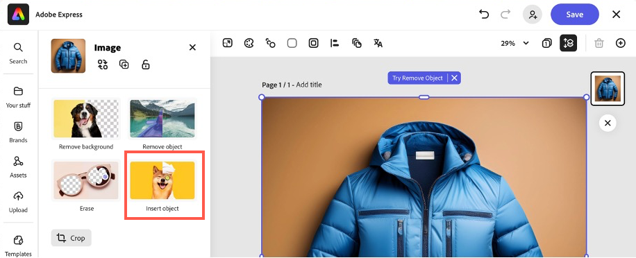
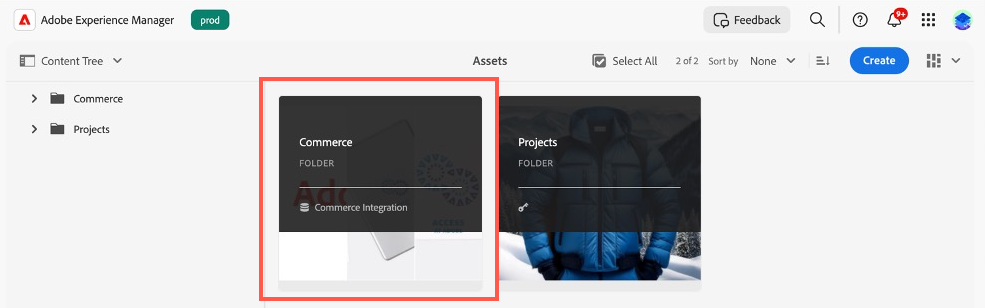

# Cas d’utilisation

{{accs-early-access}}

Les cas d’utilisation suivants présentent les principales fonctionnalités et les scénarios commerciaux pris en charge par [!DNL Adobe Commerce as a Cloud Service], ce qui vous permet d’accélérer le développement et de lancer des expériences à fort impact.

Si vous rencontrez des problèmes, consultez la section [Dépannage](#troubleshooting) pour obtenir des conseils.

## Conditions préalables

Avant de lancer l’un de ces cas d’utilisation, vous devez remplir les conditions préalables suivantes :

1. [Créez votre instance Cloud Service](./getting-started.md#create-an-instance) à l’aide des options suivantes :
   1. Sélectionnez [!UICONTROL **Sandbox**] dans le menu déroulant [!UICONTROL **Environnement**].
   1. Sélectionnez [!UICONTROL **Adobe Store**] dans le menu déroulant [!UICONTROL **Tester les données**].
1. [Connexion à votre compte Adobe Experience Cloud](https://experience.adobe.com)
1. [Configurez votre storefront Cloud Service](./storefront.md) à l’aide des options suivantes :
   1. Sélectionnez [!UICONTROL `adobe-commerce/adobe-demo-store`] pour le modèle.
   1. Sélectionnez [!UICONTROL **Choisir une instance disponible (maillage -> SaaS)**] pour la méthode de connexion.

## Workflow de passage en caisse

Ce workflow présente le processus de passage en caisse d’un client qui achète un produit sur votre storefront et la manière dont vous, en tant qu’administrateur, pouvez confirmer la commande.

### Activer les services de paiement

1. Dans Commerce Admin, accédez à [!UICONTROL **Paramètres**] > [!UICONTROL **Modes de paiement**].

1. Dans la section [!UICONTROL **Configuration générale**], saisissez vos `Payment Services Sandbox ID` et `Payment Services Sandbox Key`. Vous pouvez obtenir ces identifiants en suivant les étapes décrites dans [Intégration des sandbox](../payment-services/sandbox.md#sandbox-onboarding)

1. Définissez la liste déroulante [!UICONTROL **Activer**] sur [!UICONTROL **Oui**].

1. Cliquez sur [!UICONTROL **Enregistrer la configuration**].

### Achat d’un produit

1. Accédez au [storefront](./storefront.md) créé dans les conditions préalables.

1. Recherchez et sélectionnez un produit. Effectuez les sélections de personnalisation nécessaires. Cliquez ensuite sur [!UICONTROL **Ajouter au panier**].

   {width="600" zoomable="yes"}

1. Sélectionnez l’icône de panier pour afficher votre panier.

   {width="600" zoomable="yes"}

1. Cliquez sur [!UICONTROL **Extraire**].

   {width="600" zoomable="yes"}

1. Saisissez les coordonnées et les informations d’expédition requises. Vous pouvez utiliser des informations fictives pour cette commande.

1. Pour passer en caisse, sélectionnez [!UICONTROL **Chèque / Mandat**]. Si vous souhaitez utiliser une carte de crédit, utilisez l&#39;une des cartes [test fournies par Paypal](https://developer.paypal.com/tools/sandbox/card-testing/#link-teststaticcardnumbers). Vous pouvez les utiliser avec n’importe quelle date d’expiration future et n’importe quel CVC.

   {width="600" zoomable="yes"}

   {width="600" zoomable="yes"}

1. Cliquez sur [!UICONTROL **Passer une commande**].

### Confirmer la commande

1. Ouvrez l’Administration Commerce : `<your store URL>/admin`.

1. Connectez-vous à l’aide de votre Adobe ID.

1. Accédez à [!UICONTROL **Ventes**] > [!UICONTROL **Commandes**].

   {width="600" zoomable="yes"}

1. Recherchez la commande que vous avez passée et confirmez les détails.

   {width="600" zoomable="yes"}

## Mettre à jour le contenu du storefront

Créer, modifier et publier du contenu directement sur le storefront.

1. Ouvrez le [storefront](./storefront.md) créé dans les conditions préalables.

1. Ouvrez Storefront Builder. En accédant à `https://da.live/#/<GitHub User Name>/<Repository Name>/main/da/index.md`.

1. Ouvrez la page [!UICONTROL **Index**].

1. Sous le bloc Carrousel, saisissez un nouveau titre en modifiant la ligne « Bienvenue dans la démonstration de la boutique Adobe ».

1. Cliquez sur l’icône d’envoi, puis sur [!UICONTROL **Aperçu**].

1. Vérifiez la page d’aperçu et cliquez sur [!UICONTROL **Publier**].

1. Actualisez la page du storefront et confirmez que vos modifications sont maintenant actives.

## Expérimentation contextuelle

La fonctionnalité d’expérimentation contextuelle d’Adobe Commerce vous permet de créer et de gérer des expériences sur votre storefront pour tester différents contenus et configurations.

### Conditions préalables

* Installer l’extension [AEM Sidekick](https://www.aem.live/docs/sidekick)

1. Dans Storefront Builder, sélectionnez votre page d’index et cliquez sur [!UICONTROL **Copier**].

1. Créez un dossier [!UICONTROL **expériences**] sous le dossier principal, en cliquant sur le bouton [!UICONTROL **Nouveau**] et en sélectionnant [!UICONTROL **Dossier**].

1. Créez un dossier nommé **1234** dans le dossier [!UICONTROL **expériences**].

1. Collez les deux copies de la page d’index dans le dossier **1234**.

1. Ouvrez chaque page et renommez-les « homev1 » et « homev2 ». Ce sont vos [challengers](https://www.aem.live/docs/experimentation#create-your-challenger-page).

1. Modifiez chaque page pour inclure un contenu différent. Par exemple, modifiez l’image principale ou le texte. Vous devez être en mesure d&#39;identifier les différences entre chaque page.

1. Publiez chacune de vos pages de challenger.

1. Ouvrez la page de contrôle, la page d&#39;index d&#39;origine.

1. Ajoutez un nouveau bloc avec le titre [!UICONTROL **métadonnées**].

1. Ajoutez les informations suivantes aux lignes du bloc de métadonnées

   * Titre - Adobe Commerce
   * Description - Boutique web
   * Expérience - 1234
   * Variantes d’expérience
      * `https://<your-site>.aem.live/experiments/1234/indexv1`
      * `https://<your-site>.aem.live/experiments/1234/indexv2`

   {width="600" zoomable="yes"}

1. Ouvrez une fenêtre de navigation privée ou privée et accédez à la page principale.

1. Fermez la fenêtre de navigation privée et répétez l&#39;étape précédente. Chaque fois que vous ouvrez la page, une variante aléatoire que vous avez créée s’affiche.

## Améliorer le contenu du storefront

Avec AEM Assets, Adobe Express et Firefly, vous pouvez désormais rapidement apporter des modifications aux images qui apparaissent dans votre storefront à l’aide d’un workflow simple et autonome.

### Conditions préalables

* Nécessite un accès à AEM Assets, Adobe Express et Adobe Firefly.

### Personnaliser l’arrière-plan d’une image

Supposons que vous souhaitiez modifier rapidement l’arrière-plan d’une image de produit. La combinaison d’Adobe Commerce, d’AEM Assets et d’Adobe Express vous permet d’apporter cette modification en quelques étapes simples.

1. Ouvrez le [storefront](./storefront.md) créé dans les conditions préalables et accédez à un élément à modifier. Notez le SKU ou le code de produit des éléments.

1. Ouvrez [!UICONTROL AEM Assets] en le sélectionnant dans [Adobe Experience Cloud](https://experience.adobe.com/#/home).

   {width="600" zoomable="yes"}

1. Cliquez sur [!UICONTROL Assets].

   {width="600" zoomable="yes"}

1. Recherchez l’article par **SKU** ou **Code de produit**.

1. Sélectionnez l’élément à modifier, puis cliquez sur [!UICONTROL **Ouvrir dans Adobe Express**].

   {width="600" zoomable="yes"}

1. Dans le panneau [!UICONTROL **Image**], sélectionnez [!UICONTROL **Insérer un objet**].

   {width="600" zoomable="yes"}

1. Dans la zone de texte, décrivez l’image que vous souhaitez ajouter. Par exemple, « les pins enneigés ».

   {width="600" zoomable="yes"}

1. Ajustez la [!UICONTROL Brush size] et dessinez à l’endroit où vous souhaitez ajouter l’image générée. Pour cet exemple, dessinez autour de l’objet existant pour sélectionner l’arrière-plan.

1. Cliquez sur [!UICONTROL **Générer**] pour afficher les résultats.

1. Choisissez parmi les différents résultats, en sélectionnant l&#39;option souhaitée et en cliquant sur [!UICONTROL **Conserver**].

1. Cliquez sur [!UICONTROL **Vos affaires**] pour revenir à l’éditeur d’image.

1. Cliquez sur [!UICONTROL **Enregistrer**] pour spécifier le type d’image.

1. Cliquez de nouveau sur [!UICONTROL **Enregistrer**] pour enregistrer les modifications.

1. Dans la boîte de dialogue [!UICONTROL **Enregistrer la ressource**], sélectionnez le Commerce [!UICONTROL **Dossier de destination**].

   {width="600" zoomable="yes"}

1. Cliquez sur [!UICONTROL **Enregistrer en tant que nouvelle ressource**] pour enregistrer l’image.

#### Ajouter l’image à Commerce AEM Assets

1. Dans le [Panneau de navigation](https://experienceleague.adobe.com/fr/docs/experience-manager-cloud-service/content/sites/authoring/basic-handling#navigation-panel) d’AEM as a Cloud Service, sélectionnez **Assets** > **Fichiers** > **Commerce** et cliquez sur la ressource que vous avez créée dans la section précédente.

   {width="600" zoomable="yes"}

1. Cliquez sur [!UICONTROL **Propriétés**].

   {width="600" zoomable="yes"}

1. Sélectionnez l’onglet [!UICONTROL **Commerce**].

   {width="600" zoomable="yes"}

1. Vérifiez que le [!UICONTROL **existe-t-il dans Adobe Commerce ?**] champ est défini sur [!UICONTROL **Oui**].

1. Cliquez sur [!UICONTROL **Ajouter**] et saisissez le SKU du produit auquel vous souhaitez ajouter la ressource.

   {width="600" zoomable="yes"}

1. Sélectionnez la position et le type de la ressource.

1. Sélectionnez l’onglet [!UICONTROL **De base**] et modifiez l’onglet [!UICONTROL **Statut de la révision**] en [!UICONTROL **Approuvé**].

   {width="600" zoomable="yes"}

1. Cliquez sur [!UICONTROL **Enregistrer et fermer**].

#### Confirmer l’image dans Commerce

1. Dans Adobe Commerce [!UICONTROL **Admin**], accédez à [!UICONTROL **Catalogue**] > [!UICONTROL **Produits**].

1. Sélectionnez le produit auquel vous avez ajouté l’image dans la section précédente.

1. Développez la section [!UICONTROL **Images et vidéos**].

   {width="600" zoomable="yes"}

1. Vérifiez que votre image est maintenant disponible dans la liste des images.

1. Revenez à votre storefront et accédez à la page du produit modifié.

1. Vérifiez que la nouvelle image s’affiche.

   {width="600" zoomable="yes"}

## Générer des variations

Adobe Commerce Generate Variations exploite Generative AI pour automatiser la génération de contenu de haute qualité, affiner la messagerie et publier facilement des ressources sur votre storefront.

### Générer du texte

1. Ouvrez votre site storefront à l’aide de l’[éditeur universel](https://experienceleague.adobe.com/fr/docs/experience-manager-cloud-service/content/implementing/developing/universal-editor/introduction).

1. Sélectionnez le bloc de texte à modifier.

1. Dans le panneau [!UICONTROL **Propriétés**], cliquez sur [!UICONTROL **Générer des variations**].

1. Cliquez sur le bouton [!UICONTROL **Générer**].

1. Sélectionnez ou personnalisez le texte généré.

1. Cliquez sur [!UICONTROL **Publier**] pour mettre à jour votre storefront.

### Générer du contenu et des images

1. Ouvrez [ Générer des variations ](https://experienceleague.adobe.com/fr/docs/experience-manager-cloud-service/content/generative-ai/generate-variations)

1. Sélectionnez le modèle [!UICONTROL **Bannière héroïque**].

1. Dans la zone de texte [!UICONTROL **Expliquer l’interaction utilisateur**], saisissez : « Expérience permettant aux employés et aux partenaires d’Adobe d’acheter des équipements de marque Adobe ! ».

1. Dans l’[!UICONTROL **URL pour la connaissance de domaine**], saisissez **www.adobestore.com**.

1. Cliquez sur [!UICONTROL **Générer**].

1. Sélectionnez une variation de contenu et cliquez sur [!UICONTROL **Générer une image**].

1. Dans la liste déroulante [!UICONTROL **Taille de l’image**], sélectionnez [!UICONTROL **Écran large (16:9)**].

1. Dans la liste déroulante [!UICONTROL **Type de contenu**], sélectionnez [!UICONTROL **Photo**].

1. Pour l’image de référence [!UICONTROL **Style**], sélectionnez la bannière de magasin Adobe existante.

1. Sélectionnez l’image générée à utiliser, puis cliquez sur [!UICONTROL **Enregistrer**].

1. Répétez ce processus avec d’autres images de référence pour générer d’autres variations.

## Dépannage

Suivez les suggestions suivantes pour résoudre les problèmes rencontrés lors de ces tutoriels.

* Si vous avez besoin de conseils sur les commandes ou les indicateurs :
   1. Exécutez `aio --help` pour afficher toutes les commandes et indicateurs disponibles.
   1. Pour des commandes spécifiques, utilisez l’indicateur `--help` . Par exemple :
      * `aio console --help`
      * `aio commerce –help`

* Si vous rencontrez des problèmes de connexion non valides :
   1. Exécutez `aio config clear `.
   1. Exécutez `aio auth login –-force `.
   1. Connectez-vous à votre navigateur.
   1. Sélectionnez votre profil.
   1. Revenez au terminal pour continuer.

* Si la commande `init` échoue :
   1. Exécutez `aio api-mesh delete`.
   1. Réexécutez `aio commerce init`.

* Si vous n’avez pas sélectionné l’organisation, le projet ou l’espace de travail approprié avant d’exécuter la commande `init` :
   1. Exécutez `aio console org select`.
   1. Exécutez `aio console project select`.
   1. Exécutez `aio console workspace select`.

* Si vous avez une sélection de client non valide :
   1. Annulez l’exécution actuelle de l’interface de ligne de commande en appuyant sur **Ctrl+C**.
   1. Exécutez `aio commerce init`.

* Si vous rencontrez une installation du maillage API non valide :
   * Exécutez `aio api-mesh update mesh-config.json`.
