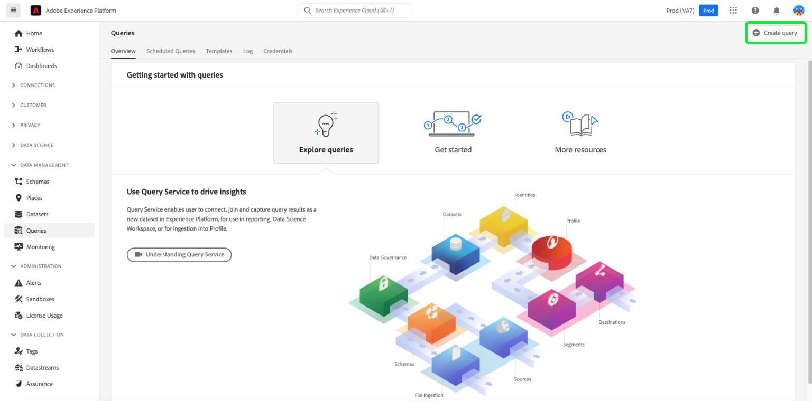

# Connexion des données Commerce à Adobe Experience Platform

Lorsque vous installez l’extension [!DNL Data Connection], deux nouvelles pages de configuration apparaissent dans le menu **Système** sous **Services** dans Commerce _Admin_.

- Commerce Services Connector
- [!DNL Data Connection]

Pour connecter votre instance Adobe Commerce au Adobe Experience Platform, vous devez configurer les deux connecteurs, en commençant par le connecteur Commerce Services, puis en terminant par l’extension [!DNL Data Connection].

## Configuration du connecteur Commerce Services

Si vous avez précédemment installé un service Adobe Commerce, vous avez probablement déjà configuré le connecteur Commerce Services. Dans le cas contraire, vous devez effectuer les tâches suivantes sur la page [Connecteur Commerce Services](../landing/saas.md) :

1. Connectez-vous à votre compte Commerce pour [récupérer vos clés API de production et sandbox](../landing/saas.md#credentials).
1. Sélectionnez un [espace de données SaaS](../landing/saas.md#saas-configuration).
1. Connectez-vous à votre compte Adobe pour [récupérer votre ID d’organisation](../landing/saas.md#ims-organization-optional).

Une fois que vous avez configuré le connecteur Commerce Services, vous devez configurer l’extension [!DNL Data Connection].

## Configuration de l’extension [!DNL Data Connection]

Dans cette section, vous apprendrez à configurer l’extension [!DNL Data Connection].

### Ajout des détails du compte de service et des informations d’identification

Si vous prévoyez de collecter et d’envoyer des [données de commande historiques](#send-historical-order-data) ou des [données de profil client](#send-customer-profile-data), vous devez ajouter des détails de compte de service et d’informations d’identification. En outre, si vous configurez l’extension [Audience Activation](https://experienceleague.adobe.com/docs/commerce-admin/customers/audience-activation.html?lang=fr), vous devez effectuer les étapes suivantes.

Si vous collectez et envoyez uniquement des données de storefront ou de back-office, vous pouvez passer à la section [général](#general).

#### Étape 1 : créer un projet dans Adobe Developer Console

Créez un projet dans le Adobe Developer Console qui authentifie Commerce afin qu’il puisse effectuer des appels API Experience Platform.

Pour créer le projet, suivez les étapes décrites dans le tutoriel [Authentification et accès aux API Experience Platform](https://experienceleague.adobe.com/docs/experience-platform/landing/platform-apis/api-authentication.html?lang=fr).

Au fur et à mesure que vous parcourez le tutoriel, assurez-vous que votre projet dispose des éléments suivants :

- Accédez aux [profils de produit](https://experienceleague.adobe.com/docs/experience-platform/landing/platform-apis/api-authentication.html?lang=fr#select-product-profiles) suivants : **Tous les accès de production par défaut** et **Tous les accès par défaut d’AEP**.
- Les [rôles et autorisations appropriés sont configurés](https://experienceleague.adobe.com/docs/experience-platform/landing/platform-apis/api-authentication.html?lang=fr#assign-api-to-a-role).
- Si vous avez décidé d’utiliser les jetons web JSON (JWT) comme méthode d’authentification serveur à serveur, vous devez également charger une clé privée.

Le résultat de cette étape crée un fichier de configuration que vous utiliserez à l’étape suivante.

#### Étape 2 : télécharger le fichier de configuration

Téléchargez le [fichier de configuration de l’espace de travail](https://developer.adobe.com/commerce/extensibility/events/project-setup/#download-the-workspace-configuration-file). Le fichier `<workspace-name>.json` contient toutes les valeurs que vous devez saisir sur la page **Compte de service/Informations d’identification** de l’administrateur Commerce.

Configuration d’![[!DNL Data Connection] Admin](./assets/epc-admin-config.png){width="700" zoomable="yes"}

1. Dans Commerce Admin, accédez à **Magasins** > Paramètres > **Configuration** > **Services** > **[!DNL Data Connection]**.

1. Sélectionnez la méthode d’autorisation serveur à serveur que vous avez implémentée dans le menu **Type d’autorisation Adobe Developer**. Adobe recommande d’utiliser OAuth. Le jeton JWT a été abandonné. [En savoir plus](https://developer.adobe.com/developer-console/docs/guides/authentication/ServerToServerAuthentication/migration/).

1. (JWT uniquement) Copiez et collez le contenu de votre fichier `private.key` dans le champ **Secret client**. Utilisez la commande suivante pour copier le contenu.

   ```bash
   cat config/private.key | pbcopy
   ```

   Voir [Authentification du compte de service (JWT)](https://developer.adobe.com/developer-console/docs/guides/authentication/JWT/) pour plus d’informations sur le fichier `private.key`.

1. Copiez le contenu du fichier `<workspace-name>.json` dans les champs **Détails du compte de service/d’informations d’identification** tels que `"client_id"`, `"client_secrets"`, `"technical_account_email"`, `"technical_account_id"`, etc.

1. Cliquez sur **Enregistrer la configuration**.

1. Cliquez sur le bouton **[!UICONTROL Test connection]** pour vous assurer que le compte de service et les informations d’identification que vous avez saisis sont corrects.

### Général

1. Dans Admin, accédez à **Système** > Services > **[!DNL Data Connection]**.

   ![[!DNL Data Connection] Settings](./assets/epc-settings.png){width="700" zoomable="yes"}

1. Dans l’onglet **Paramètres** sous **Général**, vérifiez l’identifiant associé à votre compte Adobe Experience Platform, tel que configuré dans le [Connecteur de services Commerce](../landing/saas.md#organizationid). L’ID d’organisation est global. Un seul identifiant d’organisation peut être associé par instance Adobe Commerce.

1. Dans le menu déroulant **Portée**, définissez le contexte sur **Site Web**.

1. (Facultatif) Si vous avez déjà déployé un [AEP Web SDK (alliage)](https://experienceleague.adobe.com/docs/experience-platform/edge/home.html?lang=fr) sur votre site, cochez la case et ajoutez le nom de votre AEP Web SDK. Sinon, laissez ces champs vides et l’extension [!DNL Data Connection] en déploie un pour vous.

   >[!NOTE]
   >
   >Si vous spécifiez votre propre SDK Web AEP, l’extension [!DNL Data Connection] utilise l’identifiant du flux de données associé à ce SDK et non l’identifiant du flux de données spécifié sur cette page (le cas échéant).

### Collecte de données

Dans cette section, vous indiquez le type de données à collecter et à envoyer à Experience Platform Edge. Il existe trois types de données :

- Les données **comportementales** (données côté client) sont des données capturées sur le storefront. Cela inclut les interactions d’acheteurs, telles que `View Page`, `View Product`, `Add to Cart` et [liste de demandes d’approvisionnement](events.md#b2b-events) (pour les commerçants B2B).

- Le **Back Office** (données côté serveur) correspond aux données capturées sur les serveurs Commerce. Cela inclut des informations sur le statut d’une commande, comme si une commande a été passée, annulée, remboursée, expédiée ou terminée. Il comprend également des [données d’ordre historiques](#send-historical-order-data).

- **Profil** correspond aux données liées aux informations de profil de votre acheteur. En savoir [plus](#send-customer-profile-data).

Pour vous assurer que votre instance Adobe Commerce peut commencer la collecte de données, consultez les [conditions préalables](overview.md#prerequisites).

Consultez la rubrique sur les événements pour en savoir plus sur les événements [storefront](events.md#storefront-events), [back office](events-backoffice.md) et [profile](events-backoffice.md#customer-profile-events-server-side).

>[!NOTE]
>
>Tous les champs de la section **Collecte de données** s’appliquent à la portée **Site web** ou une portée supérieure.

1. Sélectionnez **Événements Storefront** si vous souhaitez envoyer des données comportementales de storefront.

1. Sélectionnez **Événements back-office** si vous souhaitez envoyer des informations sur le statut de la commande, par exemple si une commande a été passée, annulée, remboursée ou expédiée.

   >[!NOTE]
   >
   >Si vous sélectionnez **Événements de back-office**, toutes les données de back-office sont envoyées à Experience Platform Edge. Si un acheteur choisit de se désabonner de la collecte de données, vous devez définir explicitement sa préférence de confidentialité dans Experience Platform. Cela diffère des événements de storefront où le collecteur gère déjà le consentement en fonction des préférences de l’acheteur. En savoir [plus](https://experienceleague.adobe.com/docs/experience-platform/landing/governance-privacy-security/consent/adobe/dataset.html?lang=fr) sur la définition des préférences de confidentialité d’un acheteur dans Experience Platform.

1. (Ignorez cette étape si vous utilisez votre propre SDK Web AEP.) [Créez](https://experienceleague.adobe.com/docs/experience-platform/datastreams/configure.html?lang=fr#create) un flux de données dans Adobe Experience Platform ou sélectionnez un flux de données existant à utiliser pour la collecte. Saisissez cet identifiant de flux de données dans le champ **Identifiant du flux de données**.

1. Saisissez l’**identifiant du jeu de données** qui doit contenir vos données Commerce. Pour trouver l’identifiant du jeu de données :

   1. Ouvrez l’interface utilisateur d’Experience Platform et sélectionnez **Jeux de données** dans le volet de navigation de gauche pour ouvrir le tableau de bord **Jeux de données**. Le tableau de bord répertorie tous les jeux de données disponibles pour votre organisation. Des détails s’affichent pour chaque jeu de données répertorié, notamment son nom, le schéma auquel le jeu de données adhère et le statut de l’exécution d’ingestion la plus récente.
   1. Ouvrez le jeu de données associé à votre flux de données.
   1. Dans le volet de droite, affichez les détails du jeu de données. Copiez l’identifiant du jeu de données.

1. Pour garantir des mises à jour des données d’événement de back-office basées sur un planning en fonction d’une tâche [cron](https://experienceleague.adobe.com/docs/commerce-admin/systems/tools/cron.html?lang=fr), vous devez remplacer l’index `Sales Orders Feed` par `Update by Schedule`.

   1. Dans la barre latérale _Admin_, accédez à **[!UICONTROL System]** > _[!UICONTROL Tools]_>**[!UICONTROL Index Management]**.

   1. Cochez la case de l’indexeur de `Sales Orders Feed`.

   1. Définissez **[!UICONTROL Actions]** sur `Update by Schedule`.

   1. Si vous activez les données de back-office pour la première fois, exécutez les commandes suivantes pour réindexer et déclencher une resynchronisation. Les resynchronisations suivantes se produisent automatiquement si la tâche [cron](https://experienceleague.adobe.com/docs/commerce-admin/systems/tools/cron.html?lang=fr) est configurée correctement.

      ```bash
      bin/magento index:reindex sales_order_data_exporter_v2
      ```

      ```bash
      bin/magento saas:resync --feed orders
      ```

#### Descriptions des champs

| Champ | Description |
|--- |--- |
| Portée | Site web spécifique sur lequel vous souhaitez appliquer les paramètres de configuration. |
| Identifiant de l’organisation (global) | Identifiant appartenant à l’organisation qui a acheté le produit Adobe DX. Cet identifiant associe votre instance Adobe Commerce à Adobe Experience Platform. |
| AEP Web SDK est-il déjà déployé sur votre site ? | Cochez cette case si vous avez déployé votre propre SDK Web AEP sur votre site |
| Nom du SDK Web AEP (global) | Si un SDK Web Experience Platform est déjà déployé sur votre site, indiquez le nom de ce SDK dans ce champ. Cela permet au collecteur d’événements Storefront et au SDK d’événements Storefront d’utiliser votre SDK web Experience Platform plutôt que la version déployée par l’extension [!DNL Data Connection]. Si aucun SDK Web Experience Platform n’est déployé sur votre site, laissez ce champ vide et l’extension [!DNL Data Connection] en déploie un pour vous. |
| Événements Storefront | Est coché par défaut tant que l’ID d’organisation et l’ID de flux de données sont valides. Les événements Storefront collectent des données comportementales anonymes auprès de vos clients lorsqu’ils parcourent votre site. |
| Événements back office | Si cette case est cochée, la payload de l&#39;événement contient des informations de statut de commande rendues anonymes, telles que si une commande a été passée, annulée, remboursée ou expédiée. |
| Identifiant du flux de données (site web) | Identifiant qui permet aux données de passer de Adobe Experience Platform à d’autres produits Adobe DX. Cet identifiant doit être associé à un site web spécifique dans votre instance Adobe Commerce spécifique. Si vous spécifiez votre propre SDK web Experience Platform, ne spécifiez pas d’identifiant de flux de données dans ce champ. L’extension [!DNL Data Connection] utilise l’ID de train de données associé à ce SDK et ignore tout ID de train de données spécifié dans ce champ (le cas échéant). |
| Identifiant du jeu de données (site web) | Identifiant du jeu de données contenant vos données Commerce. Ce champ est obligatoire sauf si vous avez désélectionné les cases **Événements Storefront** ou **Événements Back Office**. En outre, si vous utilisez votre propre SDK web Experience Platform et n’avez donc pas spécifié d’identifiant de flux de données, vous devez toujours ajouter l’identifiant du jeu de données associé à votre flux de données. Dans le cas contraire, vous ne pouvez pas enregistrer ce formulaire. |

Après l’intégration, les données du storefront commencent à circuler vers Experience Platform Edge. Les données de back-office mettent environ cinq minutes à apparaître à la périphérie. Les mises à jour suivantes sont visibles au niveau du serveur Edge selon le planning cron.

### Envoyer des données de profil client

Vous pouvez envoyer deux types de données de profil à Experience Platform : les enregistrements de profil et les événements de profil de série temporelle.

Un enregistrement de profil contient des données qui sont enregistrées lorsqu’un acheteur crée un profil dans votre instance Commerce, tel que le nom de l’acheteur. Lorsque votre schéma et votre jeu de données sont [ correctement configurés ](profile-data.md), un enregistrement de profil est envoyé à Experience Platform et transféré au service de gestion des profils et de segmentation d’Adobe : [Real-Time CDP](https://experienceleague.adobe.com/docs/experience-platform/rtcdp/intro/rtcdp-intro/overview.html?lang=fr).

Les événements de profil de série temporelle contiennent des données sur les informations de profil de votre acheteur, par exemple s’ils créent, modifient ou suppriment un compte sur votre site. Lorsque les données d’événement de profil sont envoyées à Experience Platform, elles résident dans un jeu de données où elles peuvent être utilisées par d’autres produits DX.

1. Vérifiez que vous avez [fourni](#add-service-account-and-credential-details) le compte de service et les informations d’identification.

1. Assurez-vous de disposer d’un schéma et d’un jeu de données spécifiés pour [ingestion des données d’enregistrement de profil](profile-data.md) et [ingestion des données d’événement de profil de série temporelle](update-xdm.md#time-series-profile-event-data).

1. Cochez la case **Profils client** si vous souhaitez envoyer des données de profil à Experience Platform.

1. Saisissez l’**Identifiant du jeu de données de profil**.

   Les données d’enregistrement de profil doivent utiliser un jeu de données différent de celui que vous utilisez actuellement pour les données comportementales et d’événement back-office.

1. Si vous ne souhaitez pas diffuser des événements de profil par le biais du même identifiant de flux de données que celui que vous utilisez pour les données comportementales et de back-office, supprimez la coche de la case **Diffuser des profils client par le biais du même identifiant de flux de données** et saisissez l’identifiant du flux de données que vous souhaitez utiliser à la place.

La disponibilité d’un enregistrement de profil dans Real-Time CDP peut prendre environ 10 minutes. Les événements de profil commencent immédiatement à diffuser.

>[!TIP]
>
>Si vous ne voyez pas les données de profil dans Experience Platform, consultez la [Base de connaissances Commerce](https://experienceleague.adobe.com/fr/docs/commerce-knowledge-base/kb/troubleshooting/miscellaneous/data-connection-customer-profiles-not-exported) pour obtenir des suggestions de dépannage.

#### Descriptions des champs

| Champ | Description |
|--- |--- |
| Profils client | Cochez cette case si vous souhaitez collecter et envoyer des enregistrements de profil client. |
| Identifiant du jeu de données de profil | Un enregistrement de profil doit utiliser un jeu de données différent du jeu de données utilisé pour les événements comportementaux et de back-office. |
| Diffusion des profils clients par le biais du même identifiant de flux de données | Choisissez si vous souhaitez utiliser le même flux de données que celui actuellement utilisé pour vos événements comportementaux et de back-office. |
| Flux de données pour les profils client | Spécifiez le flux de données spécifique à l’enregistrement du profil client. |

### Envoyer les données de commande historiques

Adobe Commerce collecte jusqu’à cinq ans de [données et statut d’ordre historique](events-backoffice.md#back-office-events). Vous pouvez utiliser l’extension [!DNL Data Connection] pour envoyer ces données historiques à Experience Platform afin d’enrichir vos profils client et de personnaliser les expériences client en fonction de ces commandes passées. Les données sont stockées dans un jeu de données au sein d’Experience Platform.

Bien que Commerce collecte déjà les données de commande historiques, vous devez suivre plusieurs étapes pour envoyer ces données à Experience Platform.

Regardez cette vidéo pour en savoir plus sur les ordres historiques, puis effectuez les étapes suivantes pour implémenter la collecte des ordres historiques.

>[!VIDEO](https://video.tv.adobe.com/v/3424672)

#### Configurer le service de synchronisation des commandes

Le service de synchronisation des commandes utilise [Message Queue Framework](https://developer.adobe.com/commerce/php/development/components/message-queues/) et RabbitMQ. Une fois ces étapes terminées, les données de statut de la commande peuvent être synchronisées avec SaaS, ce qui est obligatoire avant leur envoi à Experience Platform.

1. Vérifiez que vous avez [fourni](#add-service-account-and-credential-details) le compte de service et les informations d’identification.

1. [Activer](https://experienceleague.adobe.com/docs/commerce-cloud-service/user-guide/configure/service/rabbitmq.html?lang=fr) RabbitMQ.

   >[!NOTE]
   >
   >RabbitMQ est déjà configuré pour les versions 2.4.7 et ultérieures de Commerce, mais vous devez activer les consommateurs.

1. Activez les consommateurs de file d’attente de messages par tâche cron dans `.magento.env.yaml` à l’aide de `CRON_CONSUMERS_RUNNER` variable d’environnement .

   ```yaml
      stage:
        deploy:
          CRON_CONSUMERS_RUNNER:
            cron_run: true
   ```

   >[!NOTE]
   >
   >Consultez la [documentation sur le déploiement des variables](https://experienceleague.adobe.com/docs/commerce-cloud-service/user-guide/configure/env/stage/variables-deploy.html?lang=fr#cron_consumers_runner) pour en savoir plus sur toutes les options de configuration disponibles.

Lorsque le service de synchronisation des commandes est activé, vous pouvez spécifier la période de commande historique dans la page **[!UICONTROL [!DNL Data Connection]]**.

#### Spécifier la période de l’historique des commandes

Indiquez la période des commandes historiques que vous souhaitez envoyer à Experience Platform.

1. Dans Admin, accédez à **Système** > Services > **[!DNL Data Connection]**.

1. Sélectionnez l’onglet **Historique des commandes**.

   ![[!DNL Data Connection] l’historique des commandes](./assets/epc-order-history.png){width="700" zoomable="yes"}

1. Sous **Synchronisation de l’historique des commandes**, la case à cocher **Copier l’ID du jeu de données à partir des paramètres** est déjà activée. Vous utilisez ainsi le même jeu de données que celui spécifié dans l’onglet **Paramètres**.

1. Dans les champs **De** et **À**, indiquez la période pour les données de commande historiques que vous souhaitez envoyer. Vous ne pouvez pas sélectionner une période de plus de cinq ans.

1. Sélectionnez **[!UICONTROL Start Sync]** pour déclencher la synchronisation pour commencer. Les données de commande historiques sont des données par lots, par opposition aux données de storefront et de back-office qui sont des données en flux continu. Les données par lots arrivent dans Experience Platform en 45 minutes environ.

##### Descriptions des champs

| Champ | Description |
|--- |--- |
| Copier l’ID du jeu de données à partir des paramètres | Copie l’identifiant du jeu de données que vous avez saisi dans l’onglet **Paramètres**. |
| Identifiant du jeu de données (site web) | Identifiant du jeu de données contenant vos données Commerce. Ce champ est obligatoire sauf si vous avez désélectionné les cases **Événements Storefront** ou **Événements Back Office**. En outre, si vous utilisez votre propre SDK web Experience Platform et n’avez donc pas spécifié d’identifiant de flux de données, vous devez toujours ajouter l’identifiant du jeu de données associé à votre flux de données. Dans le cas contraire, vous ne pouvez pas enregistrer ce formulaire. |
| De | Date à partir de laquelle vous souhaitez commencer à collecter les données de l&#39;historique des commandes. |
| Vers | Date à partir de laquelle vous souhaitez terminer la collecte des données d&#39;historique des commandes. |
| Démarrer la synchronisation | Démarre le processus de synchronisation des données de l’historique des commandes avec Experience Platform Edge. Ce bouton est désactivé si le champ de **[!UICONTROL Dataset ID]** est vide ou si l’ID du jeu de données n’est pas valide. |

### Personnalisation des données

Dans l’onglet **Personnalisation des données**, vous pouvez afficher tous les attributs personnalisés configurés dans [!DNL Commerce] et envoyés à Experience Platform.

Personnalisation ![[!DNL Data Connection] données ](./assets/epc-data-customization.png){width="700" zoomable="yes"}

>[!IMPORTANT]
>
>Assurez-vous que l’identifiant du flux de données que vous [spécifié](#data-collection) dans l’onglet **Collecte de données** correspond à l’identifiant lié au schéma pour l’ingestion d’attributs personnalisés.

Lors de la création d’attributs personnalisés pour les commandes et de leur envoi à Experience Platform, les noms des attributs dans Commerce doivent correspondre à ceux du schéma [!DNL Commerce] dans Experience Platform. S’ils ne correspondent pas, il peut être difficile d’identifier les différences. Si des noms ne correspondent pas, le tableau **Attributs de commande personnalisés** peut vous aider à résoudre le problème.

Le tableau **Attributs de commande personnalisés** offre une visibilité sur la configuration et le mappage des attributs de commande personnalisés entre le back-office [!DNL Commerce] et le schéma [!DNL Commerce] dans Experience Platform. Ce tableau vous permet de consulter les attributs personnalisés au niveau des commandes et des articles de commande dans différentes sources, ce qui facilite l&#39;identification des attributs manquants ou non alignés. Elle affiche également les identifiants des jeux de données pour aider à différencier les jeux de données actifs et historiques, car chacun peut avoir ses propres attributs personnalisés.

Si vous ne voyez pas de coche verte en regard d’un nom d’attribut personnalisé dans le tableau, cela indique une incohérence entre les noms d’attribut dans les sources. Corrigez le nom de l’attribut dans une source et une coche verte s’affichera, indiquant que les noms correspondent désormais.

- Si le nom de l’attribut est mis à jour dans le schéma d’Experience Platform, vous devez enregistrer la configuration dans l’onglet **Personnalisation des données** pour déclencher la modification du schéma d’Experience Platform. Cette modification sera répercutée dans le tableau **Attributs de commande personnalisés** lorsque vous cliquerez sur le bouton **[!UICONTROL Refresh]**.
- Si le nom de l’attribut est mis à jour dans [!DNL Commerce], un événement de commande doit être généré pour mettre à jour le nom dans le tableau **Attributs de commande personnalisés**. Le changement se reflétera dans environ 60 minutes.

En savoir plus sur la [configuration d’attributs personnalisés](custom-attributes.md).

#### Descriptions des champs

| Champ | Description |
|--- |--- |
| Jeu de données | Affiche les jeux de données contenant les attributs personnalisés. Les jeux de données dynamiques et historiques peuvent avoir leurs propres attributs personnalisés. |
| Adobe Commerce | Affiche tout attribut personnalisé créé dans le back-office [!DNL Commerce]. |
| Experience Platform | Affiche tout attribut personnalisé spécifié dans votre schéma [!DNL Commerce] dans Experience Platform. |
| Actualiser | Récupère tous les noms d’attributs personnalisés du schéma [!DNL Commerce] dans Experience Platform. |

## Confirmer que les données d’événement sont collectées

Pour confirmer que les données sont collectées à partir de votre magasin Commerce, utilisez le débogueur [Adobe Experience Platform](https://experienceleague.adobe.com/docs/experience-platform/debugger/home.html?lang=fr) pour examiner votre site Commerce. Une fois que vous avez confirmé que les données sont collectées, vous pouvez vérifier que vos données d’événement storefront et back office s’affichent à la périphérie en exécutant une requête qui renvoie les données du jeu de données [ que vous avez créé](overview.md#prerequisites).

1. Sélectionnez **Requêtes** dans le volet de navigation de gauche d’Experience Platform, puis cliquez sur [!UICONTROL Create Query].

   

1. Lorsque Query Editor s’ouvre, saisissez une requête qui sélectionne les données du jeu de données.

   

   Par exemple, votre requête peut ressembler à ce qui suit :

   ```sql
   SELECT * from `your_dataset_name` ORDER by TIMESTAMP DESC
   ```

1. Une fois la requête exécutée, les résultats sont affichés dans l’onglet **Résultats**, en regard de l’onglet **Console**. Cette vue affiche la sortie tabulaire de votre requête.

   

Dans cet exemple, vous verrez des données d’événement provenant des [`commerce.productListAdds`](events.md#addtocart), [`commerce.productViews`](events.md#productpageview), [`web.webpagedetails.pageViews`](events.md#pageview), etc. Cette vue vous permet de vérifier que vos données Commerce sont arrivées à l’edge.

Si les résultats ne sont pas ceux attendus, ouvrez votre jeu de données et recherchez tous les lots d’importation ayant échoué. En savoir plus sur la [résolution des problèmes d’imports par lots](https://experienceleague.adobe.com/docs/experience-platform/ingestion/batch/troubleshooting.html?lang=fr).

### Vérifier que les données de profil apparaissent dans Experience Platform

Si vous ne voyez pas les données de profil dans Experience Platform, consultez la [Base de connaissances Commerce](https://experienceleague.adobe.com/fr/docs/commerce-knowledge-base/kb/troubleshooting/miscellaneous/data-connection-customer-profiles-not-exported) pour obtenir des suggestions de dépannage.

## Étapes suivantes

Lorsque des données Commerce sont envoyées à Experience Platform Edge, d’autres produits Adobe Experience Cloud, tels que Adobe Journey Optimizer, peuvent utiliser ces données. Par exemple, vous pouvez configurer Journey Optimizer pour qu’il écoute certains événements. En fonction des données de ces événements, déclenchez un e-mail pour un premier utilisateur ou une première utilisatrice ou s’il existe un panier abandonné. Découvrez comment étendre votre plateforme Commerce en [créant des parcours client](using-ajo.md) dans Journey Optimizer.
