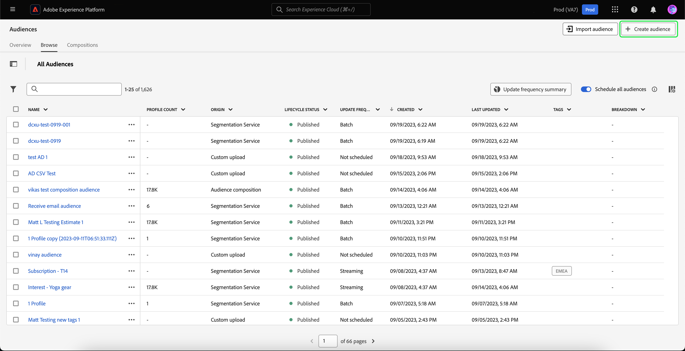

# Création d’audiences dans Real-Time CDP à l’aide de données d’événement [!DNL Commerce]

Utilisez les données d’événement capturées dans votre boutique [!DNL Commerce] pour créer des audiences dans Real-Time CDP. Les données capturées sont basées sur le comportement de navigation, les achats précédents, les attributs de profil, la propension à effectuer des conversions ou à atteindre l’attrition, le statut de fidélité, la valeur élevée et faible de la valeur client, etc.

## Quelles données dois-je envisager d’utiliser ?

Créez des audiences dans Real-Time CDP à l’aide des données issues des événements storefront, back office et profile.

| Types de données | Données Storefront (Événements Comportementaux) | Données de back-office (événements côté serveur) | Profil client et données de segment |
|---|---|---|---|
| **Définition** | Clics ou actions des clients sur votre site. | Informations sur le cycle de vie et détails de chaque commande (passée et actuelle). | Qui sont vos acheteurs et pour quels segments se qualifient-ils ? |
| **Événements capturés par Adobe Commerce** | [productPageView](events.md#productpageview) [addToCart](events.md#addtocart) | [placeOrder](events.md#completecheckout) [orderbased](events-backoffice.md#orderplaced) [orderLineItemRefund](events-backoffice.md#orderlineitemrefunded) [order Historique ](events-backoffice.md#ordercancelled) [ commandes annulées](connect-data.md#send-historical-order-data) | [createAccount](events.md#createaccount) [editAccount](events.md#editaccount) [Profile Record](events-profilerecord.md) |

## Qu’ont accompli les autres clients ?

Les clients Adobe [!DNL Commerce] ont obtenu des impacts commerciaux significatifs suite à l’activation des audiences créées dans Real-Time CDP et à leur déploiement sur leur instance [!DNL Commerce].

Un détaillant mondial de vêtements multi-marques a réalisé :

- Une source de vérité avec 10 millions de profils clients unifiés
- Création de plus de 40 audiences uniques de « clients à forte intention » pour interagir avec tous les canaux

Une entreprise mondiale de boissons a collecté :

- 98 millions de profils clients provenant de plus de 100 pays

## Commençons

Dans cet article, vous apprendrez à :

- Création d’une audience dans Real-Time CDP basée sur les données [!DNL Commerce] collectées par les événements
- Activez cette audience pour votre boutique [!DNL Commerce]
- Utilisez l’audience dans [!DNL Commerce] pour informer une règle de prix de panier.

>[!IMPORTANT]
>
>Effectuez les tâches décrites dans cet article à l’aide de votre environnement sandbox [!DNL Commerce]. Vous vous assurez ainsi que les données d’événement de storefront et de back-office que vous envoyez à Experience Platform ne diluent pas vos données d’événement de production.

### Conditions préalables

Avant de commencer, vérifiez les points suivants :

- Les privilèges d’accès vous ont été attribués pour utiliser Real-Time CDP. En cas de doute, contactez l’intégrateur système ou l’équipe de développement qui gère les projets et les environnements.
- Vous avez [installé](install.md) et [configuré](connect-data.md) l’extension [!DNL Data Connection] dans [!DNL Commerce].
- Vous avez [confirmé](connect-data.md#confirm-that-event-data-is-collected) que vos données d’événement [!DNL Commerce] arrivent à Experience Platform Edge.

### 1. Créer une audience

Une audience est un ensemble de clients qui partagent un comportement ou des caractéristiques similaires. Dans cet exercice, vous créez une audience qui qualifie les personnes intéressées par un produit particulier de votre boutique.

Pour simplifier cet exercice, vous utilisez des données d’événement provenant de l’événement [productPageView](events.md#productpageview). Cet événement capture les détails du produit qui a été affiché, tels que le nom, le SKU, le prix, etc.

Utilisez ces données d’événement pour indiquer que l’audience inclut des personnes qui ont au moins un événement « Vues des produits » pour lequel le SKU (identifiant de produit) est égal à un produit spécifique sur votre site et où l’événement se produit au cours du dernier jour. &#x200B;

1. Ouvrez Experience Platform et sélectionnez **[!UICONTROL Audiences]** dans le menu de navigation de gauche.

   

1. Cliquez sur **[!UICONTROL Create Audience]**.

   

   L’espace de travail **Créateur de segments** s’affiche.

1. Dans l’espace de travail **Créateur de segments**, sélectionnez la méthode de création **Créer une règle**.

   

   L’espace de travail **Créateur de segments** vous permet de définir les règles et conditions de votre audience&#x200B; Ces règles et conditions sont basées sur les données d’événement et de profil de votre boutique Commerce et définissent les critères qui déterminent si un utilisateur est admissible pour l’audience. Par exemple, vous pouvez créer une règle qui inclut les utilisateurs et utilisatrices qui ont consulté un produit spécifique ou les utilisateurs et utilisatrices qui ont effectué un achat au cours d’une certaine période. En savoir plus sur le [créateur de segments](https://experienceleague.adobe.com/fr/docs/experience-platform/segmentation/ui/segment-builder) ainsi que sur les règles et conditions.

1. Sélectionnez l’onglet [Événements](https://experienceleague.adobe.com/fr/docs/experience-platform/segmentation/ui/segment-builder#events).

   

1. Recherchez le type d’événement « Vues des produits ». Ensuite, glissez-déposez-le dans l’espace de travail **Créateur de segments**.

1. Revenez à l’onglet **Événements** et recherchez « SKU », qui est le champ de données sous le champ `productListItems` . Faites-le glisser et déposez-le dans l’espace de travail **Créateur de segments** au-dessus de l’événement **Vue du produit**.

   La section **Règles d’événement** s’affiche et vous permet de spécifier le produit spécifique sur lequel vous souhaitez créer votre audience.

   

1. Définissez l’intervalle de temps sur un jour en cliquant sur **À toute heure** et en sélectionnant *En dernier* avec une valeur de *1*.

   Lors de la création d’une audience, vous pouvez spécifier un intervalle de temps pour capturer l’activité récente. La définition d’un intervalle de temps vous permet de cibler les utilisateurs et utilisatrices en fonction de leurs interactions ou comportements récents au cours d’une période spécifique.

1. Dans la section **Propriétés de l’audience** située dans la partie droite de l’espace de travail, définissez les propriétés de l’audience en fournissant un nom, une description et une méthode d’évaluation pour l’audience.

1. Pour enregistrer l’audience, cliquez sur **[!UICONTROL Save and Close]**.

   Les détails de votre audience s’affichent dans le tableau de bord **Audience**.

### 2. Activer l’audience vers la destination [!DNL Commerce]

Vous rendez une audience disponible dans [!DNL Commerce] en l’activant pour la destination [!DNL Commerce].

>[!IMPORTANT]
>
>Si vous n’avez pas encore défini [!DNL Commerce] comme destination disponible pour recevoir des données, consultez la rubrique [Adobe [!DNL Commerce] Connection](https://experienceleague.adobe.com/fr/docs/experience-platform/destinations/catalog/personalization/adobe-commerce).

1. Dans l’onglet **Détails** de votre audience, cliquez sur **Activer vers la destination**.

1. Sélectionnez votre destination [!DNL Commerce]. Cliquez ensuite sur **Suivant**.

1. Terminez le processus d’activation en cliquant sur **[!UICONTROL Finish]**.

## 3. Affichage de l’audience dans le tableau de bord des audiences

Dans [!DNL Commerce], vous pouvez afficher toutes les audiences [actives](https://experienceleague.adobe.com/fr/docs/experience-platform/destinations/ui/activate/activate-edge-personalization-destinations) qui peuvent être personnalisées pour votre instance [!DNL Commerce] à l’aide du tableau de bord **Audiences Real-Time CDP**.

Pour accéder au tableau de bord **Audiences Real-Time CDP**, positionnez-vous sur la barre latérale _Admin_, puis sur **[!UICONTROL Customers]** > **[!UICONTROL Real-time CDP Audience]**.

Dans le tableau de bord, recherchez l’audience que vous avez créée. Notez qu’elle n’est pas utilisée dans une règle de prix de panier ou un bloc dynamique. Dans la section suivante, vous liez l’audience à une règle de prix de panier.

### 4. Créez une règle de prix de panier basée sur l’audience

Cette section vous explique comment créer une règle de prix de panier en fonction de votre nouvelle audience.

1. Vérifiez que la nouvelle audience s’affiche dans le tableau de bord **Audiences Real-Time CDP**.
1. [Créer une règle de prix de panier](https://experienceleague.adobe.com/fr/docs/commerce-admin/marketing/promotions/cart-rules/price-rules-cart-create).
1. [Définissez la condition](https://experienceleague.adobe.com/fr/docs/commerce-admin/marketing/promotions/cart-rules/price-rules-cart-create#use-real-time-cdp-audiences-to-set-a-condition) de la règle de prix du panier à l’aide de votre nouvelle audience.
1. [Définissez l’action](https://experienceleague.adobe.com/fr/docs/commerce-admin/marketing/promotions/cart-rules/price-rules-cart-create#step-3-define-the-actions) qui doit se produire lorsque le produit est ajouté au panier.
1. Continuez pour configurer votre règle de prix de panier.
1. Accédez à la vue client de votre instance sandbox.
1. Ajoutez au panier le produit sur lequel vous avez basé l’audience. Notez que la règle de prix de panier est activée.

## Conclure

Dans cet exercice, vous avez créé une audience dans Real-Time CDP et l’avez activée vers la destination [!DNL Commerce]. Ensuite, dans l’administrateur [!DNL Commerce], vous avez créé une règle de prix de panier basée sur cette audience et activé la règle dans votre environnement sandbox.
