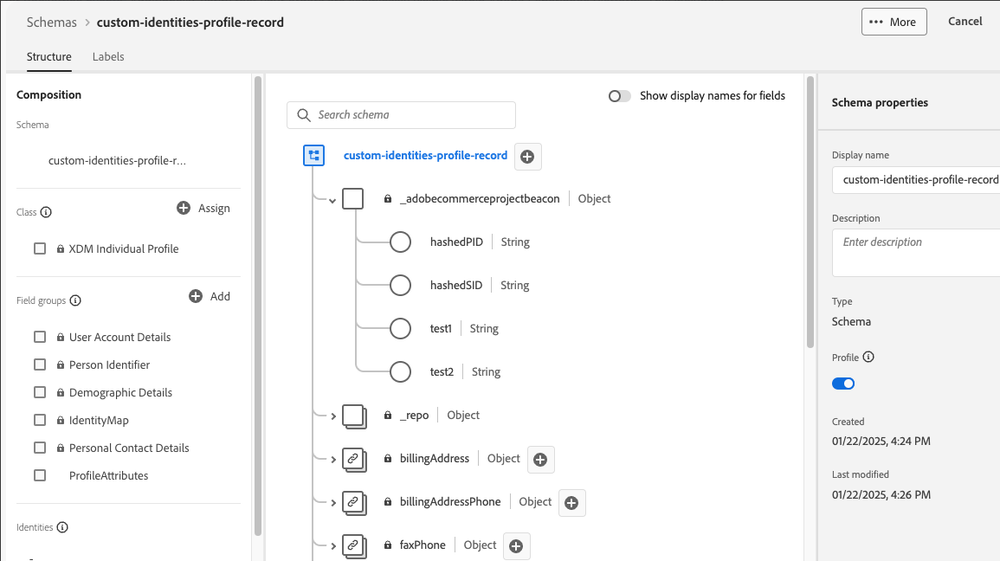

# Ajout d’attributs personnalisés aux profils

Les attributs de profil personnalisés vous permettent d’améliorer l’identification du profil client dans Experience Platform en utilisant des identifiants supplémentaires au-delà des `customerId` et `emailId` par défaut. Ces identifiants supplémentaires permettent une correspondance des clients plus précise et une meilleure intégration des données entre la plateforme Commerce et Experience Platform.

>[!NOTE]
>
>Découvrez comment [ajouter des attributs personnalisés](custom-attributes.md) aux commandes.

## Avantages

- Utilisez plusieurs identifiants pour une meilleure correspondance client.
- Mappez les champs personnalisés aux attributs d’identité en fonction des besoins de votre entreprise.
- Réduire les profils en double et améliorer la précision des données client
- Activez des expériences client plus ciblées.

## Conditions préalables

Avant d’implémenter des attributs d’identité personnalisés, veillez à :

- [Installation de l’extension Data Connection](install.md)
- [Connexion à Adobe Experience Platform](connect-data.md)
- [Envoyer des données de profil client](connect-data.md#send-customer-profile-data)

## Étape 1 : configuration du schéma Experience Platform

1. Connectez-vous à Adobe Experience Platform et sélectionnez votre schéma Commerce.
1. [Ajouter des champs d’identité personnalisés](https://experienceleague.adobe.com/en/docs/experience-platform/xdm/ui/resources/schemas?lang=en#custom-fields-for-standard-groups) au niveau racine :
   - `hashedPID` (chaîne) - hachage d’identité de Principal
   - `hashedSID` (chaîne) - hachage d’identité Secondaire
   - `primaryID` (chaîne) - nom du champ d’identité du Principal
   - `secondaryID` (chaîne) - nom de champ d’identité Secondaire



>[!NOTE]
>
>Vous pouvez personnaliser les noms exacts des champs en fonction de vos besoins. L’exemple utilise `hashedPID` et `hashedSID` comme champs d’identité.

## Étape 2 : créer des classes de processeur

Créez les classes de processeurs PHP suivantes dans votre module personnalisé :

### Classe AddressCustomHashedId

Ce processeur hache `parent_id` et `entity_id` pour les adresses client.

```php
<?php declare(strict_types=1);

namespace Magento\AepCustomerCustomAttributes\Event;
use Magento\AdobeCommerceEventsClient\Event\Event;
use Magento\AdobeCommerceEventsClient\Event\Processor\EventDataProcessorInterface;

class AddressCustomHashedId implements EventDataProcessorInterface
{
    public function process(Event $event, array $eventData): array
    {
        $pid = $eventData['parent_id'] ?? '';
        $sid = $eventData['entity_id'] ?? '';

        $eventData['profileAttributes']['hashedPID'] = hash('sha256', (string)$pid);
        $eventData['profileAttributes']['hashedSID'] = hash('sha256', (string)$sid);
        return $eventData;
    }
}
```

### Classe AddressCustomId

Ce processeur définit les noms de champ d&#39;ID principal et secondaire pour les événements d&#39;adresse.

```php
<?php declare(strict_types=1);

namespace Magento\AepCustomerCustomAttributes\Event;
use Magento\AdobeCommerceEventsClient\Event\Event;
use Magento\AdobeCommerceEventsClient\Event\Processor\EventDataProcessorInterface;

class AddressCustomId implements EventDataProcessorInterface
{
    public function process(Event $event, array $eventData): array
    {
        $eventData['profileAttributes']['primaryID'] = 'hashedPID';
        $eventData['profileAttributes']['secondaryID'] = 'hashedSID';

        // Ensure both IDs are present, otherwise, Commerce will default primary to customerId and secondary to emailId
        if (empty($eventData['profileAttributes']['primaryID']) || empty($eventData['profileAttributes']['secondaryID'])) {
            $eventData['profileAttributes']['primaryID'] = $eventData['customerId'] ?? '';
            $eventData['profileAttributes']['secondaryID'] = $eventData['email'] ?? '';
        }

        return $eventData;
    }
}
```

### Classe CustomHashedId

Ce processeur hache `entity_id` et `email` pour les profils client.

```php
<?php declare(strict_types=1);

namespace Magento\AepCustomerCustomAttributes\Event;
use Magento\AdobeCommerceEventsClient\Event\Event;
use Magento\AdobeCommerceEventsClient\Event\Processor\EventDataProcessorInterface;

class CustomHashedId implements EventDataProcessorInterface
{
    public function process(Event $event, array $eventData): array
    {
        $pid = $eventData['entity_id'] ?? '';
        $sid = $eventData['email'] ?? '';

        $eventData['profileAttributes']['hashedPID'] = hash('sha256', (string)$pid);
        $eventData['profileAttributes']['hashedSID'] = hash('sha256', (string)$sid);
        return $eventData;
    }
}
```

### Classe CustomId

Ce processeur définit les noms de champ d’ID principal et secondaire pour les événements de profil.

```php
<?php declare(strict_types=1);

namespace Magento\AepCustomerCustomAttributes\Event;
use Magento\AdobeCommerceEventsClient\Event\Event;
use Magento\AdobeCommerceEventsClient\Event\Processor\EventDataProcessorInterface;

class CustomId implements EventDataProcessorInterface
{
    public function process(Event $event, array $eventData): array
    {
        $eventData['profileAttributes']['primaryID'] = 'hashedPID';
        $eventData['profileAttributes']['secondaryID'] = 'hashedSID';

        // Ensure both IDs are present, otherwise, Commerce will default primary to customerId and secondary to emailId
        if (empty($eventData['profileAttributes']['primaryID']) || empty($eventData['profileAttributes']['secondaryID'])) {
            $eventData['profileAttributes']['primaryID'] = $eventData['customerId'] ?? '';
            $eventData['profileAttributes']['secondaryID'] = $eventData['email'] ?? '';
        }

        return $eventData;
    }
}
```

>[!NOTE]
>Assurez-vous que les `primaryID` et les `secondaryID` sont envoyés dans les données d’événement. Si l’un des éléments est manquant, Commerce est défini par défaut sur :
>
>- primaryID = customerId
>- secondaryID = emailId

>[!BEGINSHADEBOX]

Après avoir effectué ces deux étapes :

- Votre schéma Commerce dans Experience Platform peut correctement ingérer des identités personnalisées pour vos données d’événement de profil.
- Les classes de processeur de votre code Commerce PHP collectent des informations d’identification personnalisées à partir d’événements de profil.

Désormais, toutes les données d’événement de profil envoyées à partir de Commerce contiennent vos informations d’identification personnalisées.

>[!ENDSHADEBOX]

## Exemples de formats de données

Les exemples suivants montrent la structure JSON attendue pour les attributs d’identité personnalisés dans les attributs de profil et les formats de données de profil client complets.

### Format des attributs de profil

```json
{
  "profileAttributes": {
    "hashedPID": "d80eae6e96d148b3b2abbbc6760077b66c4ea071f847dab573d507a32c4d99a5",
    "hashedSID": "fa7359e288ce3104bd4317a4fb75f08c4a5feec472de2e415b8260fb3567ebe6",
    "warehousecode": "1256",
    "method": "ina2354",
    "source": "commerce",
    "primaryID": "hashedPID",
    "secondaryID": "hashedSID"
  }
}
```

### Structure complète du profil client

```json
{
  "id": 137,
  "entity_id": "137",
  "created_at": "2025-02-10 20:10:30",
  "updated_at": "2022-02-10 20:10:31",
  "email": "customer@example.com",
  "firstname": "John",
  "lastname": "Doe",
  "dob": "2007-10-01 00:00:00",
  "profileAttributes": {
    "hashedPID": "d80eae6e96d148b3b2abbbc6760077b66c4ea071f847dab573d507a32c4d99a5",
    "hashedSID": "fa7359e288ce3104bd4317a4fb75f08c4a5feec472de2e415b8260fb3567ebe6",
    "primaryID": "137",
    "secondaryID": "customer@example.com"
  },
  "_metadata": {
    "commerceEdition": "Adobe Commerce",
    "commerceVersion": "2.4.6",
    "eventsClientVersion": "1.9.0",
    "storeId": "1",
    "websiteId": "1",
    "storeGroupId": "1",
    "websiteCode": "base",
    "storeCode": "default",
    "storeViewCode": "main_website_store"
  }
}
```

## Dépannage

### primaryID ou secondaryID manquant

- **Symptôme :** les données sont définies par défaut sur customerId/emailId au lieu de valeurs personnalisées.
- **Solution :** assurez-vous que `primaryID` et `secondaryID` sont définis dans l’objet `profileAttributes`.

### Valeurs de hachage non valides

- **Symptôme :** les valeurs de hachage sont vides ou incorrectes.
- **Solution :** vérifiez que les champs sources (`parent_id`, `entity_id`, `email`) contiennent des données valides avant de procéder au hachage.

### Processeurs non exécutés

- **Symptôme :** les attributs personnalisés n’apparaissent pas dans les données d’événement.
- **Solution :** vérifiez que les processeurs sont correctement enregistrés dans `events.xml` et que le module est activé.

### Incompatibilité de schéma Experience Platform

- **Symptôme :** les données n’apparaissent pas dans les erreurs Experience Platform ou de validation du schéma.
- **Solution :** assurez-vous que le schéma Experience Platform inclut les champs d’identité personnalisés avec les types de données corrects.
