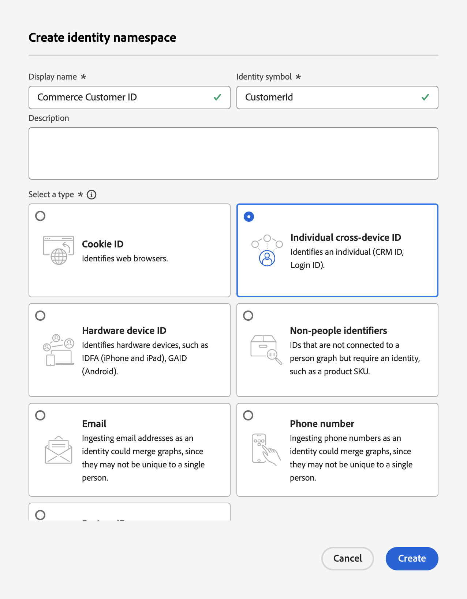

# Mettre à jour le schéma d’enregistrement de profil pour l’ingestion de données Commerce

Lorsque vos clients créent un profil sur votre site Commerce, un enregistrement de profil est créé et les données sont capturées. Vous devez créer un schéma et un jeu de données spécifiques à cet enregistrement de profil avant de pouvoir diffuser ces données de profil vers Experience Platform.

1. [Créez](https://experienceleague.adobe.com/fr/docs/experience-platform/xdm/ui/resources/schemas) un schéma et définissez la classe sur **Profil individuel**.

1. [Ajoutez](https://experienceleague.adobe.com/fr/docs/experience-platform/xdm/ui/resources/schemas) les groupes de champs spécifiques au profil suivants :

   - identityMap
   - Détails démographiques
   - Coordonnées personnelles
   - Détails du compte utilisateur

1. [Activer](https://experienceleague.adobe.com/fr/docs/experience-platform/xdm/ui/resources/schemas) le schéma pour Profil.

   Lorsqu’un schéma est activé pour Profil, tous les jeux de données créés à partir de ce schéma participent à Real-Time CDP, qui fusionne les données de sources disparates pour créer une vue complète de chaque client.

1. [Créez un jeu de données](https://experienceleague.adobe.com/fr/docs/platform-learn/implement-mobile-sdk/experience-cloud/platform) en fonction du schéma que vous avez créé ou mis à jour.

   Un jeu de données est une structure de stockage et de gestion pour une collecte de données, généralement sous la forme d’un tableau contenant un schéma (colonnes) et des champs (lignes). Les jeux de données contiennent également des métadonnées qui décrivent divers aspects des données stockées.

1. Créez un [espace de noms personnalisé](https://experienceleague.adobe.com/fr/docs/experience-platform/identity/features/namespaces#create-namespaces) dans Experience Platform avec les valeurs suivantes :

   - **Nom d’affichage** : _ID de client Commerce_
   - **Symbole d’identité** : _CustomerId_
   - **Type** : _identifiant individuel sur l’ensemble des appareils_

   {width="700" zoomable="yes"}

   Cliquez sur **[!UICONTROL Create]**. Un espace de noms personnalisé est utilisé par le service de profil unifié pour regrouper les fragments de profil.

Une fois le schéma, le jeu de données et l’espace de noms personnalisé configurés pour les données d’enregistrement de profil client, vous pouvez [configurer](connect-data.md#data-collection) votre instance Commerce pour collecter et envoyer ces données à Experience Platform.

Pour créer un schéma, un jeu de données et un flux de données pour les données comportementales et d’événement back-office, consultez [mise à jour des schémas d’événement de série temporelle pour l’ingestion de données Commerce](update-xdm.md).
