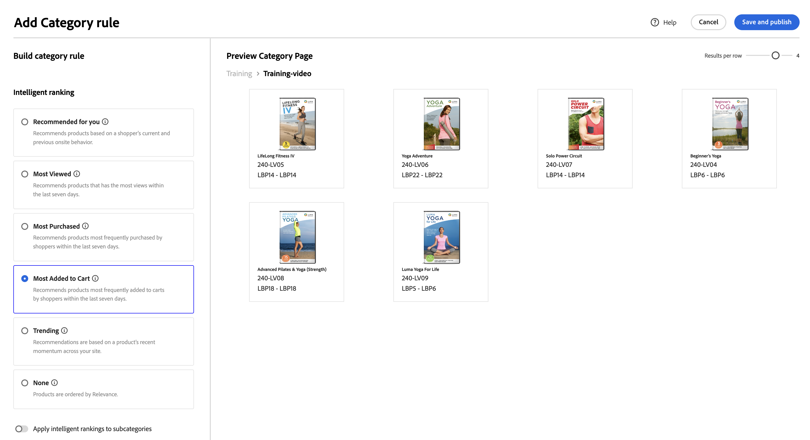

# Marchandisage de catégorie

Le marchandisage de catégorie permet aux propriétaires de magasin d’appliquer [!DNL Live Search] classement intelligent [règles](rules.md) aux catégories et sous-catégories de produits.

Cette vidéo présente le marchandisage des catégories.

>[!VIDEO](https://video.tv.adobe.com/v/3448853?captions=fre_fr)

Cette fonctionnalité est accessible dans l’administration à l’adresse **Marketing** > SEO et recherche > **[!DNL Live Search]** > **Marchandisage de catégorie**.

>[!NOTE]
>
>Le marchandisage de catégorie est disponible avec [!DNL Live Search] version [3.0.0 ou ultérieure](release-notes.md). Si l’espace de travail Marchandisage des catégories s’affiche, mais qu’il n’est pas rempli de données, mettez à jour le module [!DNL Live Search].

La vue Marchandisage de catégorie affiche les règles de catégorie définies, avec des colonnes pour :

* Catégorie
* Stratégie de classement
* Classement hérité
* Dernière mise à jour
* Action

Vous pouvez rechercher une catégorie ou une sous-catégorie dans le champ « Rechercher par catégorie ».

## Stratégies de classement

Le marchandisage de catégorie utilise les mêmes types de classement que pour les [produits individuels](rules-workspace.md).
Il existe deux types de classement : Intelligent et Manuel.

**Classement intelligent** exploite l’analyse des données comportementales du storefront par [Adobe Sensei](https://www.adobe.com/sensei.html) pour trier tous les produits dans les catégories sélectionnées selon un certain algorithme. Une fois le classement intelligent choisi, l’ordre spécifique des produits devrait changer au fil du temps, car les données sous-jacentes sont réanalysées régulièrement par Adobe Sensei. Par exemple, les produits les plus en vogue changent automatiquement au fil du temps en fonction des préférences des acheteurs.
Les méthodes de classement intelligentes sont les suivantes :

* Les plus achetés : classe les produits en fonction de la fréquence à laquelle ils ont été achetés par les acheteurs au cours des sept jours précédents.
* Les plus ajoutés au panier : classe les produits en fonction de la fréquence à laquelle ils ont été ajoutés au panier par les acheteurs au cours des sept jours précédents.
* Les plus consultés : classe les produits en fonction de la fréquence à laquelle ils ont été consultés par les acheteurs au cours des sept jours précédents.
* Recommandé pour vous : en fonction du comportement précédent et actuel de chaque acheteur sur site, classe les produits en fonction de leur probabilité d’interaction avec chacun d’eux.
* Tendance : classe les produits selon les hausses récentes de popularité en fonction des vues.
* Aucune : classe les produits par ordre par défaut.

Le **classement manuel** permet aux utilisateurs de remplacer l’ordre de tri automatique des produits en définissant des règles manuelles d’épinglage, d’amplification, d’enfouissement et de masquage.

## Classement hérité

En tant que marchandiseur, vous souhaiterez peut-être pouvoir sélectionner toutes les catégories de vêtements pour femmes à trier par « tendance ». Il s&#39;agit notamment des sous-catégories « pantalons pour femmes », « chemises pour femmes » et « accessoires pour femmes ». Les catégories masculines ne doivent pas être affectées. Pour ce faire, vous pouvez utiliser les classements hérités.

Lors de la sélection d&#39;une méthode de classement intelligente pour une catégorie ou une sous-catégorie comportant des sous-catégories, vous pouvez activer l&#39;option **Appliquer un classement intelligent aux sous-catégories**. Cela applique la méthode de classement à toutes les sous-catégories.

Ces sous-catégories héritent désormais de cette règle de la catégorie parent (« Oui » dans la colonne Classement hérité). Dans la colonne Action , les seules options disponibles sont **Modifier la règle** et **Afficher les détails**. L’option **Supprimer** est désactivée pour les règles héritées sur les sous-catégories. La suppression de l’héritage de sous-catégorie nécessite l’annulation de l’héritage de la catégorie parente.

Une catégorie ou sous-catégorie ne peut avoir qu’un seul classement intelligent appliqué à la fois. Des classements manuels supplémentaires peuvent également être appliqués.

Si vous appliquez un classement intelligent à une catégorie et activez l&#39;option **Appliquer le classement intelligent aux sous-catégories**, tout classement intelligent déjà appliqué aux sous-catégories est remplacé.

{width="700"}

Si vous cliquez sur **Afficher tout**, une boîte de dialogue s’ouvre avec les détails des modifications proposées.

Lors de l’ajout direct d’un classement intelligent à une catégorie qui possède un classement intelligent hérité, l’héritage est remplacé par le nouveau classement intelligent.

Lors de la suppression du classement intelligent de la catégorie , l’héritage est rétabli.
Dans les deux scénarios, les classements manuels sont conservés.

Si vous supprimez un classement intelligent d&#39;une catégorie et que l&#39;héritage des sous-catégories est sélectionné, seuls les classements intelligents hérités sont supprimés des sous-catégories. Les classements manuels ne sont pas soumis à l’héritage et le resteront.

Une boîte de dialogue s’affiche pour expliquer quelles sous-catégories héritées sont affectées par les modifications que vous apportez à une catégorie de niveau supérieur.

{width="1200"}

## Création d’une règle de catégorie

Pour créer une règle de catégorie, procédez comme suit :

1. Cliquez sur le bouton **Ajouter une règle**.
1. Dans la vue _Sélectionner une catégorie_, cliquez sur les catégories et sous-catégories.
1. Cochez la case pour sélectionner la catégorie à classer.
1. Cliquez sur **Appliquer**.

   

1. Dans la vue _Ajouter une règle de catégorie_, sélectionnez la méthode de classement Intelligent que vous souhaitez appliquer à la catégorie.
La page Aperçu de la catégorie affiche les résultats réels du classement sélectionné, à l’aide de vos données Live Search.
1. Cliquez sur **Enregistrer et publier** pour enregistrer la règle.

Le service [!DNL Live Search] traite la règle et l’active sur le magasin une fois l’opération terminée.

## Modification d’une règle de catégorie

Pour modifier une règle existante :

1. Cliquez sur la **...** dans la colonne Action et choisissez **Modifier**.
1. Dans la vue Modifier la règle de catégorie, apportez les modifications requises, puis cliquez sur **Enregistrer et publier**.

Les modifications sont répercutées sur le magasin lorsque [!DNL Live Search] a traité la modification.

## Suppression d’une règle de catégorie

Pour supprimer une règle de catégorie :

1. Cliquez sur la **...** dans la colonne Action et choisissez **Supprimer**.
1. Dans la boîte de dialogue modale _Supprimer la règle_, sélectionnez **Supprimer** pour supprimer la règle ou **Annuler** pour annuler l’action.

## Classement manuel

Le classement manuel vous permet de remplacer l’ordre des produits déterminé par les règles de classement intelligent (le cas échéant) et de contrôler manuellement l’emplacement des produits dans les résultats.

Les événements sont des actions qui modifient les résultats de la recherche lorsque des conditions définies sont remplies. Un classement manuel peut comporter jusqu’à 25 événements.

* Booster : permet de faire grimper un produit dans les résultats de recherche.
* Enterrer : permet de faire baisser un produit dans les résultats de la recherche.
* Épingler un produit : déplace un produit vers une position spécifique dans les résultats.
* Masquer un produit : exclut un produit des résultats de recherche.

Créer un classement manuel :

1. Configurez une règle de classement intelligent pour une catégorie comme décrit ci-dessus. Les résultats de la requête s’affichent dans l’aperçu de la page des catégories. Cette action utilise vos données de recherche en direct pour prévisualiser les résultats.

1. Cliquez sur un produit et faites-le glisser dans l’aperçu de la page des catégories. Faites-la glisser et déposez-la à l’emplacement souhaité. Les champs Produit et Position sont automatiquement renseignés dans le volet Événements.

Vous pouvez également cliquer sur l’icône d’épingle pour épingler un produit à son emplacement actuel. Utilisez le menu contextuel représentant des points de suspension pour effectuer l’opération « Épingler en haut » ou « Épingler en bas ».

Pour ajouter manuellement un événement :

1. Sous Classement manuel, cliquez sur le menu **Sélectionner un événement** et choisissez un événement qui se produira une fois les conditions associées remplies.
1. Saisissez le nom du produit à affecter. Des produits sont suggérés lors de la saisie.
1. Pour plusieurs événements, choisissez tous les autres événements que vous souhaitez déclencher lorsque les conditions sont remplies.

>[!NOTE]
>
>Les règles sont appliquées lorsqu’une catégorie spécifique est ouverte sur le storefront et qu’il existe une règle pour cette catégorie. Pour les règles de marchandisage de catégorie, l’ordre de tri par défaut est « Trier par : Position ». Si un acheteur modifie l’ordre de tri, tous les produits masqués, épinglés et enfouis ne sont plus triés.
