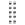

# Ajout de facettes

Tout attribut de produit filtrable peut être utilisé comme facette. Le panneau *Ajouter des facettes* répertorie les facettes actives et facilite l’affectation d’attributs de produit supplémentaires en tant que facettes. Au cours de ce processus en trois étapes, un attribut est choisi pour être utilisé comme facette, les propriétés sont modifiées si nécessaire et les modifications sont publiées sur le storefront.

## Étape 1 : ajouter une facette

1. Dans Admin, accédez à **Marketing** > SEO et recherche > **[!DNL Live Search]**.
1. Dans l&#39;onglet *Facettisation*, cliquez sur **Ajouter des facettes**.
1. Dans la liste *Ajouter des facettes*, chaque attribut disponible comporte un bouton  distinct. Effectuez l’une des opérations suivantes :

   * Dans la liste *Attributs de facettes*, sélectionnez l’attribut de produit à utiliser comme facette et cliquez sur **Ajouter**.
   * Pour rechercher un attribut de produit spécifique, saisissez les premiers caractères du nom de l’attribut dans la zone *Rechercher*. Cliquez ensuite sur **Ajouter**.

     Pour configurer les intervalles et les regroupements de facettes de prix, reportez-vous à [Paramètres](settings.md). Pour en savoir plus, accédez à [ Types de facettes ](facets-type.md).
La facette est ajoutée en bas de la liste *Facettes dynamiques* et le bouton *Publier les modifications* devient disponible.

1. Si la facette à ajouter est introuvable, accédez à **Magasins** > Attributs > **Produit** et vérifiez que l’attribut possède les [propriétés requises](facets.md) à utiliser comme facette. Si nécessaire, mettez à jour les propriétés storefront suivantes de l’attribut :

   * **[!UICONTROL Use in Search]** -  `Yes`
   * **[!UICONTROL Use in Layered Navigation]** -  `Filterable (with results)`
   * **[!UICONTROL Use in Search Results Layered Navigation]** -  `Yes`

1. Lorsque vous y êtes invité, actualisez le cache.

   La facette sera disponible dans le storefront la prochaine fois que le catalogue sera synchronisé avec [!DNL Live Search]. Si la facette n’est pas disponible au bout de deux heures, reportez-vous à la section [Synchronisation des données de catalogue](install.md#synchronize-catalog-data).

## Étape 2 : modification des propriétés de facette (facultatif)

1. Pour modifier les propriétés de la facette, cliquez sur **Plus** () dans la colonne de droite.
1. Dans le menu, cliquez sur **Modifier**. Modifiez ensuite les propriétés suivantes selon vos besoins.

   * Libellé : ([découplé](facets-type.md) uniquement) saisissez le libellé de facette à utiliser.
   * Type de tri : les facettes sont triées par ordre alphabétique pour tous les storefronts [!DNL Commerce]. Pour les implémentations découplées, les facettes peuvent être triées par ordre alphabétique ou par nombre. Options : Alphabétique, Nombre (découplé uniquement)
   * Valeur max - Saisissez le nombre maximal de valeurs de facette affichées dans le storefront. Entrées valides : 0 - 100 ; valeur par défaut : 8

1. Une fois l’opération terminée, cliquez sur **Enregistrer**.

   

1. Pour épingler la facette en haut de la liste *Filtres*, cliquez sur l’épingle grise ().
1. Pour modifier l’ordre de la facette épinglée, cliquez sur l’icône **Déplacer** () et faites glisser la ligne vers un nouvel emplacement dans la section *Facettes épinglées*.

## Étape 3 : Publier les modifications

1. Une fois la facette terminée, cliquez sur **Publier les modifications**.
1. Attendez que la facette apparaisse dans le magasin.
Si la facette n’est pas disponible au bout de deux heures, consultez la section [Vérifier l’exportation](install.md#synchronize-catalog-data) dans les instructions d’installation.

## Descriptions des champs

| Champ | Description |
|--- |--- |
| Libellé | ([Headless](facets-type.md) uniquement) Le [libellé de facette](facets-type.md) visible dans le storefront peut être modifié par souci de cohérence avec votre marque. |
| Type de tri | Méthode utilisée pour [trier](facets-type.md) les facettes. Tous les storefronts [!DNL Commerce] trient les facettes par ordre alphabétique uniquement. Les implémentations découplées peuvent également trier les `Count`. Options: Alphabétique - Trie les facettes par ordre alphabétique. Count - (Headless uniquement) Trie les facettes en fonction du nombre de correspondances trouvées. |
| Valeur max | Nombre maximal de valeurs pouvant être affichées dans le storefront pour chaque facette. Les facettes qui représentent une plage de valeurs sont également réparties. Entrées valides : 0 - 100 ; valeur par défaut : 8 |

### Contrôles

| Contrôle | Description |
|--- |--- |
|  | Épingle ou détache une facette en haut de la liste *Filtres*. |
|  | Affiche un menu d&#39;actions supplémentaires pouvant être appliquées à la facette sélectionnée. Options : Modifier, Supprimer |
|  | Utilisez l’icône *Déplacer* pour faire glisser une facette épinglée vers un autre emplacement de la section *Facettes épinglées*. |
