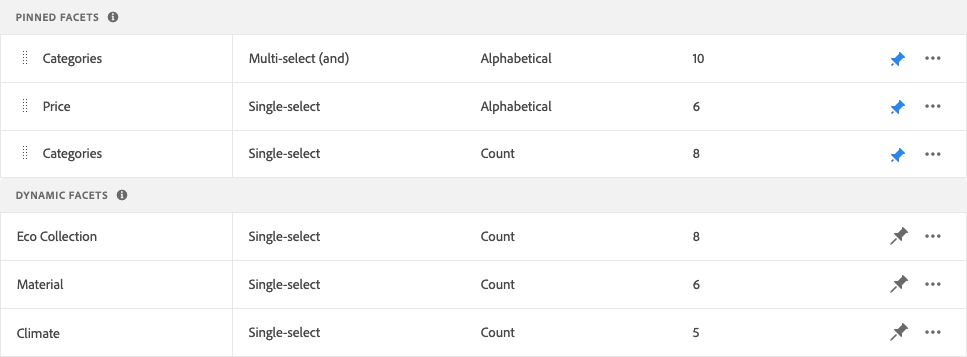

# Gestion des facettes

Suivez ces instructions pour mettre à jour les propriétés des facettes existantes ou modifier leur présentation dans le storefront.

## Configurer des regroupements de facettes de prix

Reportez-vous à [Paramètres](settings.md) pour configurer les intervalles et les regroupements à facettes de prix.

## Modifier la facette

1. Recherchez la facette à modifier.
1. Si la liste comporte de nombreuses facettes, définissez *Filtrer par* sur l’une des options suivantes :

   * Épinglé
   * Dynamique

   Pour en savoir plus, accédez à [ Types de facettes ](facets-type.md).

   

1. Pour modifier les propriétés de la facette, cliquez sur **Plus** (...).
1. Cliquez sur **Modifier**

   

1. Pour modifier le libellé de la facette, effectuez l’une des opérations suivantes :

   * Pour un storefront [!DNL Commerce], modifiez le libellé [attribut](https://experienceleague.adobe.com/docs/commerce-admin/catalog/product-attributes/product-attributes.html).
   * Pour une implémentation découplée, cliquez sur la valeur dans la première colonne et modifiez le texte selon vos besoins.

   

1. (Découplé uniquement) Pour modifier la méthode utilisée pour trier les valeurs de facette, cliquez sur la valeur de la colonne *Type de tri* et choisissez l’une des options suivantes :

   * Alphabétique
   * Nombre

   

1. Dans la colonne **Valeur max**, définissez le nombre maximal (de 0 à 10) de valeurs de filtre de facette à afficher dans le storefront.
1. Une fois l’opération terminée, cliquez sur **Enregistrer**.

   Vos modifications n’apparaîtront dans le storefront qu’après leur publication.

## Épingler/désépingler la facette

L’épingle change de couleur lorsque vous cliquez dessus et est utilisée pour déplacer la facette vers la section *Facettes épinglées* ou *Facettes dynamiques*.

1. Pour épingler une facette en haut de la liste *Filtres*, recherchez-la dans la liste *Facettes dynamiques*, puis cliquez sur l’épingle grise ().

   L’épingle devient bleue et la facette passe à la section *Facettes épinglées*.

1. Pour désépingler une facette, recherchez-la dans la liste *Facettes épinglées*, puis cliquez sur l’épingle bleue ().

   L’épingle devient grise et la facette passe à la section *Facettes dynamiques*.

   

>[!NOTE]
>
>L’ordre des facettes épinglées peut être incohérent s’il existe deux libellés portant le même nom.

## Déplacer la facette épinglée

>[!NOTE]
>
>L’ordre des facettes épinglées n’est pris en charge que dans les implémentations découplées. Si des facettes ordonnées sont nécessaires, utilisez le widget PLP [!DNL Live Search].

Vous pouvez modifier l&#39;ordre des facettes épinglées en déplaçant la ligne vers une autre position. Les facettes épinglées comportent une icône *Déplacer* () au début de la ligne. Contrairement aux facettes épinglées, les facettes dynamiques ne peuvent pas être déplacées.

1. Recherchez la facette dans la section *Facettes épinglées* de la liste.
1. Utilisez l’icône **Déplacer** () pour faire glisser la ligne vers un nouvel emplacement dans la section *Facettes épinglées*.

   Une fois les modifications publiées, les facettes réorganisées apparaissent dans la liste storefront *Filtres*.

## Supprimer la facette

1. Recherchez la facette dans la liste, puis cliquez sur les options **Plus** (...).
1. Cliquez sur **Supprimer**.
1. Lorsque vous êtes invité à confirmer, cliquez sur **Supprimer la facette**.
La facette est supprimée du storefront une fois les modifications publiées.

## Publier les modifications

1. Pour mettre à jour le storefront avec vos modifications, cliquez sur **Publier les modifications**.
1. Patientez environ 15 minutes pour que les mises à jour apparaissent dans votre boutique.
