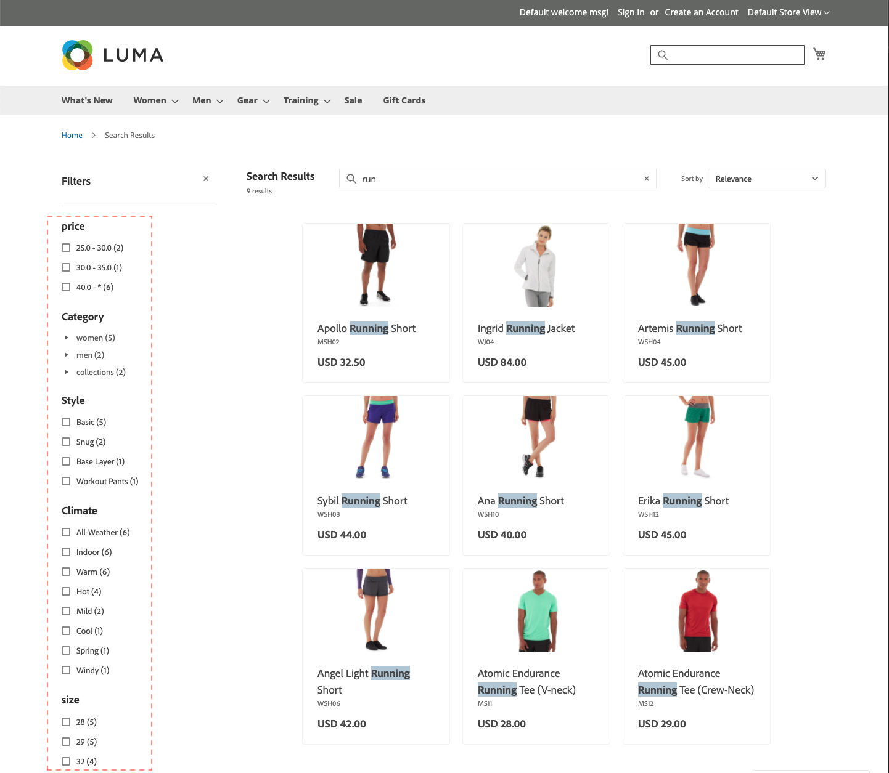

# Facettes

La facettisation est une méthode de filtrage haute performance qui utilise plusieurs dimensions de valeurs d’attribut comme critères de recherche. La recherche à facettes est similaire, mais considérablement plus « intelligente » que la [navigation par couches](https://experienceleague.adobe.com/docs/commerce-admin/catalog/catalog/navigation/navigation-layered.html?lang=fr) standard. La liste des filtres disponibles est déterminée par les [ attributs filtrables ](https://experienceleague.adobe.com/docs/commerce-admin/catalog/catalog/navigation/navigation-layered.html?lang=fr#filterable-attributes) des produits renvoyés dans les résultats de recherche.

[!DNL Live Search] utilise la requête `productSearch`, qui renvoie des données de facettes et d’autres données spécifiques à [!DNL Live Search]. Reportez-vous à [`productSearch` requête ](https://developer.adobe.com/commerce/services/graphql/live-search/product-search/) la documentation destinée aux développeurs pour obtenir des exemples de code.

Dans une facette, les acheteurs peuvent sélectionner plusieurs options, telles que « De base » et « Doux » sous « Style », et les résultats de la recherche sont mis à jour pour afficher uniquement ces styles. De même, si un acheteur sélectionne des options sur plusieurs facettes, telles que « De base » sous « Style » et « Intérieur » sous « Climat », les résultats de la recherche sont mis à jour pour afficher le style et le climat sélectionnés.

Toute facette définie peut être utilisée comme paramètre d’URL et les résultats seront filtrés en fonction des valeurs de paramètre : `http://yourstore.com?brand=acme&color=red`.

## Exigences de facettisation

Les exigences des attributs de catégorie et de produit pour la facettisation sont similaires aux attributs filtrables utilisés pour la navigation superposée. La valeur « Utiliser dans la navigation par couches des résultats de recherche » de chaque propriété storefront d’un attribut doit être définie sur « Oui ».

[!DNL Live Search] prend en charge jusqu’à :

* 100 attributs configurés sous forme de facettes
* 50 attributs triables
* 200 attributs filtrables
* 200 attributs interrogeables

>[!NOTE]
>
> Si plus de 200 attributs filtrables sont définis, il n’est pas déterministe de savoir quels 200 attributs seront réellement indexés.

Si vous devez composer avec un grand nombre d’attributs, envisagez de combiner les attributs en un seul « méta-attribut ». Par exemple, les chaussures ont généralement des tailles numériques, tandis que les chemises sont généralement de taille « S/M/L/XL ». Ces deux types de tailles peuvent être combinés en un seul attribut consultable.

| Paramètre | Description |
|--- |--- |
| [Paramètres d’affichage des catégories](https://experienceleague.adobe.com/docs/commerce-admin/catalog/categories/create/categories-display-settings.html?lang=fr) | Ancre - `Yes` |
| [Propriétés des attributs](https://experienceleague.adobe.com/docs/commerce-admin/catalog/product-attributes/create/attribute-product-create.html?lang=fr) | [Type d’entrée du catalogue](https://experienceleague.adobe.com/docs/commerce-admin/catalog/product-attributes/attributes-input-types.html?lang=fr) - `Yes/No`, `Dropdown`, `Multiple Select`, `Price`, `Visual swatch` (widget uniquement), `Text swatch` (widget uniquement) |
| Propriétés du storefront des attributs | Utiliser dans les résultats de recherche Navigation par couches - `Yes` |

## Agrégation de facettes

L’agrégation des facettes est effectuée comme suit : si le storefront comporte trois facettes (catégories, couleur et prix) et que les filtres de l’acheteur sont appliqués aux trois (couleur = bleu, prix compris entre 10,00 et 50,00 $, catégories = `promotions`).

* `categories` agrégation - Agrége `categories`, puis applique les filtres `color` et `price`, mais pas le filtre `categories`.
* `color` agrégation - Agrége `color`, puis applique les filtres `price` et `categories`, mais pas le filtre `color`.
* `price` agrégation - Agrége `price`, puis applique les filtres `color` et `categories`, mais pas le filtre `price`.

## Valeurs d’attribut par défaut

Les attributs de produit suivants possèdent des [propriétés storefront](https://experienceleague.adobe.com/docs/commerce-admin/catalog/product-attributes/product-attributes.html?lang=fr) qui sont utilisées par [!DNL Live Search] et activées par défaut.

| Propriété | Storefront, propriété | Attribut |
|---|---|---|
| Triable | Utilisé pour le tri dans la liste de produits | `price` |
| Indexable | Utiliser dans la recherche | `price`  `sku` `name` |
| FiltrableInSearch | Utilisation dans la navigation superposée - Filtrable (avec les résultats) | `price` `visibility` `category_name` |

## Propriétés d’attribut non système par défaut

Le tableau suivant présente les propriétés de recherche et de filtrage par défaut des attributs non système, y compris ceux qui sont spécifiques aux données d’exemple Luma. La définition de la propriété d’attribut *Utiliser dans la recherche* sur `Yes` rend l’attribut consultable dans [!DNL Live Search] et dans Adobe Commerce natif.

| Code attribut | Indexable | Utilisation dans la navigation superposée |
|--- |--- |--- |
| activité | Oui | Filtrable (avec résultats) |
| attributes_brand | Oui | Non |
| marque | Oui | Non |
| climat | Oui | Filtrable (avec résultats) |
| collier | Oui | Filtrable (avec résultats) |
| couleur | Oui | Filtrable (avec résultats) |
| coût | Oui | Non |
| eco_collection | Oui | Filtrable (avec résultats) |
| sexe | Oui | Filtrable (avec résultats) |
| fabricant | Oui | Filtrable (avec résultats) |
| matériau | Oui | Filtrable (avec résultats) |
| objectif | Oui | Filtrable (avec résultats) |
| strap_bag | Oui | Filtrable (avec résultats) |
| style_general | Oui | Filtrable (avec résultats) |

## Propriétés d’attribut système par défaut

Le tableau suivant présente les propriétés de recherche et de filtrage par défaut des attributs système.

| Code attribut | Indexable | Utilisation dans la navigation superposée |
|--- |--- |--- |
| allow_open_amount | Oui | Filtrable (avec résultats) |
| description | Oui | Non |
| name | Oui | Non |
| prix | Oui | Filtrable (avec résultats) |
| short_description | Oui | Non |
| sku | Oui | Non |
| statut | Oui | Non |
| tax_class_id | Oui | Non |
| url_key | Oui | Non |
| poids | Oui | Non |
