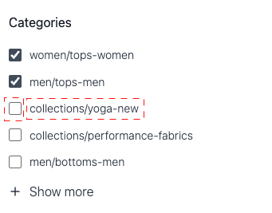

# Widget de page de liste de produits

Le [!DNL Live Search Product Listing Page Widget] (PLP) utilise la plateforme des services Commerce pour fournir une page de liste de produits performante, consultable et à facettes. Cette rubrique décrit comment activer et mettre en forme le widget PLP.

## Activation du widget PLP

Lors de l’installation du service [!DNL Live Search], la fonctionnalité de recherche par défaut est automatiquement convertie en [!DNL Live Search].

Le widget PLP [!DNL Live Search] est activé par défaut pour les nouvelles installations.

Si vous effectuez une mise à niveau [!DNL Live Search] et que le widget PLP a déjà été désactivé, il le restera. Pour l’activer :
1. Dans votre administrateur Adobe Commerce, accédez à Magasins → Paramètres → Configuration.
1. Dans le volet de navigation de gauche, cliquez sur **[!UICONTROL Live Search]** > **[!UICONTROL Storefront Features]**.
1. Cliquez sur la section [!UICONTROL Storefront Features] .
1. Définir [!UICONTROL Enable Product Listing Widget] = Oui
1. Enregistrer la configuration
1. Si vous y êtes invité, videz le cache ( accédez à Système > Outils > Gestion du cache > [!UICONTROL Flush Magento Cache]).

>[!IMPORTANT]
>
>Lorsque le [!DNL Live Search Product Listing Page Widget] est activé, le sens de l’ordre de tri sur une page de liste de produits ne peut pas être modifié.

## Fonctionnalités du widget

Le widget PLP fournit les fonctionnalités prêtes à l’emploi suivantes :

- Boutons Ajouter au panier - Disponible uniquement pour les produits simples.
- Plusieurs images par produit : l’image peut changer lorsqu’une couleur différente est choisie pour un produit configurable.
- Prise en charge des échantillons de couleurs : notez que l’attribut de couleur doit être orthographié `color` pour que le code puisse le valider correctement.

### Personnalisation du widget

Outre les fonctionnalités prêtes à l’emploi du widget PLP, vous pouvez personnaliser davantage le widget pour inclure les fonctionnalités suivantes :

- Filtrage par attributs
- Prise en charge de plusieurs langues
- Curseurs de prix

Pour plus d’informations sur la personnalisation du widget PLP pour gérer les fonctionnalités ci-dessus, consultez le fichier lisez-moi `storefront-product-listing-page` dans le [référentiel](https://github.com/adobe/storefront-product-listing-page/) suivant. Le fichier Lisez-moi de ce référentiel fournit un exemple de personnalisation du widget PLP et de déploiement de ces personnalisations sur votre site.

>[!WARNING]
>
>Si vous personnalisez le widget PLP à l’aide du code disponible dans le référentiel, vous êtes responsable de la maintenance et des mises à jour nécessaires. Toute nouvelle fonctionnalité de widget PLP publiée par Adobe peut être incompatible avec votre implémentation personnalisée.

## Exemple de style

Vous pouvez personnaliser l’aspect du widget PLP pour qu’il corresponde à votre site à l’aide de [CSS](https://developer.adobe.com/commerce/frontend-core/guide/css/).

>[!NOTE]
>
>Les éléments avec des classes personnalisées dans un thème Adobe Commerce ne sont pas hérités. Ces éléments doivent être ciblés par leur classe spécifique pour correspondre aux classes personnalisées. Les classes d’action principales ne fonctionneront pas sur un bouton de widget. Les éléments ciblés génériques dans le CSS sont hérités ; `button` s’applique aux boutons de widget.

Les balises div mises en surbrillance contiennent la classe cible `ds-sdk-product-item__product-name`.


Personnalisez le nom du produit en ajoutant une règle pour les mettre en majuscules.

```css
.ds-sdk-product-item__product-name {
 text-transform: uppercase;
}
```


## Classes CSS

### Liste de produits

- `.ds-sdk-product-list` : div externe
- `.ds-sdk-product-list__grid` : div interne


#### Pagination de la liste de produits

- `.ds-plp-pagination`


- `.ds-plp-pagination_item`


- `.ds-plp-pagination_item--current`


### Widgets

- `.ds-widgets` : div externe
- `.ds-widgets__actions` : div interne côté gauche
- `.ds-widgets__results` : div interne du côté droit


### Liste déroulante de tri

- `.ds-sdk-sort-dropdown`


- `.ds-sdk-sort-dropdown__button`


- `.ds-sdk-sort-dropdown__items`


- `.ds-sdk-sort-dropdown__items--item`


- `.ds-sdk-sort-dropdown__items--item-selected`


- `.ds-sdk-sort-dropdown__items--item-active`


### Facettes

- `.ds-plp-facets`
- `.ds-plp-facets__header`
- `.ds-plp-facets__header_title`
- `.ds-plp-facets__header__clear-all`

{width="350"}

- `.ds-plp-facets__pills`
- `.ds-sdk-pill`

{width="350"}

- `.ds-sdk-pill__label`
- `.ds-sdk-pill__cta`

{width="350"}

- `.ds-plp-facets__list`

{width="350"}

- `.ds-sdk-input`
- `.ds-sdk-input__label`
- `.ds-sdk-product-item__product-swatch-group`
- `ds-sdk-product-item__product-swatch-item`
- `.ds-sdk-input_fieldset_show-more`


- `.ds-sdk-labelled-input`


- `.ds-sdk-labelled-input__input`
- `.ds-sdk-labelled-input__label`



### Article de produit

- `.ds-sdk-product-item`
- `.ds-sdk-product-item__image`
- `.ds-sdk-product-item__product-name`
- `.ds-sdk-product-item__product-options`
- `.ds-sdk-product-price`
   - `.ds-sdk-product-price--no-discount`
   - `.ds-sdk-product-price--grouped`
   - `.ds-sdk-product-price--bundle`
   - `.ds-sdk-product-price--discount`


### Chargement

- `.ds-sdk-loading`
- `.ds-sdk-loading__spinner`
- `.ds-sdk-loading__spinner-label`


## Désactivation du widget PLP

Pour désactiver le widget PLP :

1. Accédez à **Magasins** > Paramètres > **Configuration** > **[!DNL Live Search]** > **Fonctionnalités de Storefront** et définissez **Activer les widgets de liste de produits** sur « Non ».
1. Sélectionnez **Enregistrer la configuration** pour enregistrer le paramètre.
