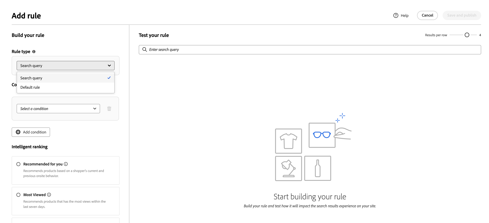
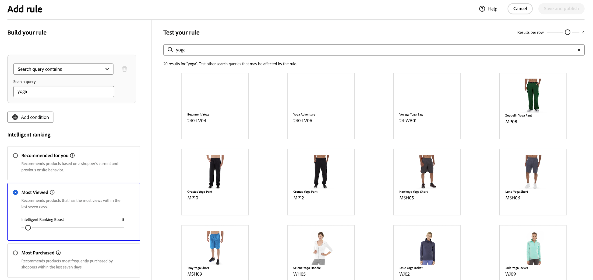
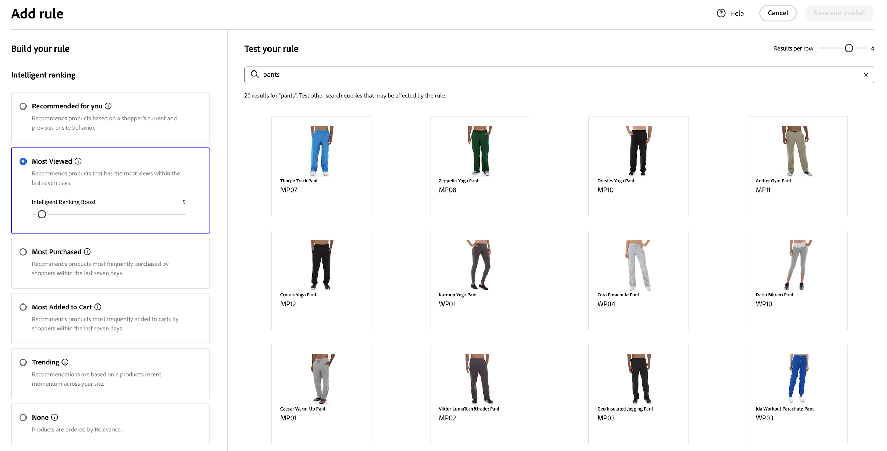
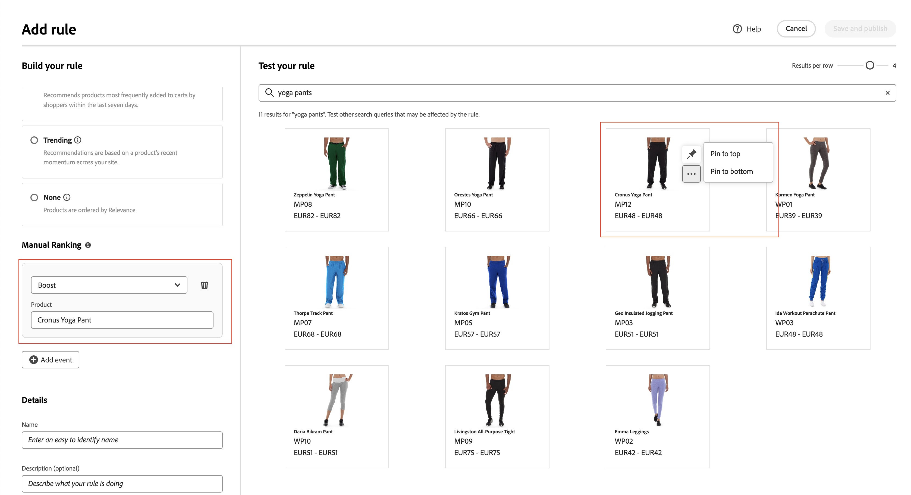
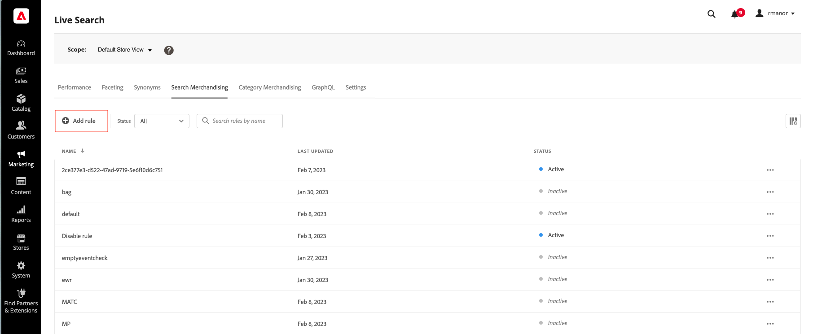

# Ajouter des règles

Pour créer une règle, la première étape consiste à utiliser l’éditeur de règles pour définir les conditions dans le texte de requête de l’acheteur qui déclenchent les événements associés. Renseignez ensuite les détails de la règle, testez les résultats et publiez la règle.

## Ajouter une règle

1. Dans Admin, accédez à **Marketing** > SEO et recherche > **[!DNL Live Search]**.
1. Définissez la **Portée** pour identifier la [vue de magasin](https://experienceleague.adobe.com/docs/commerce-admin/start/setup/websites-stores-views.html?lang=fr#scope-settings) où la règle s’applique.
1. Cliquez sur l’espace de travail **Recherche de marchandisage**.
1. Cliquez sur **Ajouter une règle** pour lancer l’éditeur de règles.

## Type de règle

Dans une requête de recherche, vous définissez un terme de recherche, des conditions et des types de classement spécifiques.

Vous pouvez définir une règle par défaut qui s’applique à toutes les requêtes, sauf si une requête de recherche plus spécifique est définie. Une seule règle par défaut peut être définie et elle ne peut contenir aucune condition. Si vous sélectionnez Par défaut, l’interface Conditions ne s’affiche pas.
Choisissez le type de classement intelligent par défaut et tout classement manuel que vous souhaitez appliquer à toutes les recherches par défaut. Les classements manuels sont toujours appliqués.

## Conditions

Les conditions sont les conditions requises pour déclencher un événement. Une règle peut contenir jusqu’à dix conditions et 25 événements. Une règle par défaut ne peut pas contenir de conditions.

>[!NOTE]
>
>Actuellement, il n’est pas possible de cibler des règles sur un groupe de clients spécifique.

### Condition unique

1. Sous *Créer votre règle*, sélectionnez la **Condition** à remplir et suivez les instructions pour terminer l’instruction.

   * La requête de recherche contient : saisissez la chaîne de texte qui doit se trouver dans la requête de l’acheteur. Le paramètre Correspondance détermine le degré auquel la requête de l’acheteur correspond au catalogue. Options :   quelconque - Toute partie du texte de la requête de l’acheteur peut correspondre à la condition. Tous - Toutes les requêtes de l’acheteur doivent correspondre à la condition.
   * La requête de recherche est : saisissez une chaîne de texte qui correspond exactement à la requête de l’acheteur. Par exemple : « pantalon de yoga ». Les règles comportant des `All` `Search query is` et Correspondance ne peuvent comporter qu’une seule condition.
   * La requête de recherche commence par : saisissez un caractère ou une chaîne de texte qui doit se trouver au début de la requête de l’acheteur.
   * La requête de recherche se termine par - Saisissez un caractère ou une chaîne de texte qui doit se trouver à la fin de la requête de l’acheteur.

   Les résultats apparaissent immédiatement dans le volet *Tester votre règle* et sont numérotés par priorité. Vous pouvez utiliser le curseur *Résultats par ligne* en haut à droite pour modifier le nombre de produits dans chaque ligne.

   

1. Pour tester d’autres requêtes, modifiez le texte de la requête dans la zone de recherche *Tester votre règle* et appuyez sur **Retour**.
Au départ, le volet de test effectue le rendu de la requête à partir de la zone de recherche Conditions . Mais maintenant, il effectue le rendu de la requête à partir de la zone de requête test. Le volet de test effectue le rendu d’une seule requête à la fois.
1. Si le résultat vous convient, mettez à jour le texte dans la zone de recherche *Conditions*. Cliquez ensuite n’importe où sur la page pour mettre à jour les résultats dans le volet de test.
1. Pour créer une règle simple avec une condition, passez à l’étape 3 : [Ajouter des événements](#manual-ranking).

### Conditions multiples

1. Pour créer une règle comportant plusieurs conditions, cliquez sur **Ajouter une condition**.
Une règle peut contenir jusqu’à dix conditions. L’opérateur logique qui joint deux conditions est basé sur le paramètre *Correspondance* actuel. Par défaut, *Correspondance* est `All` et l’opérateur logique est `AND`.

1. Sélectionnez la deuxième condition et saisissez le texte de requête requis.

1. Pour modifier la logique de la règle, modifiez le paramètre **Correspondance** afin de déterminer dans quelle mesure les critères de recherche de l’acheteur doivent correspondre à la condition de requête. Définissez **Correspondance** sur l’une des valeurs suivantes :

   * Any - (Par défaut) Tous les opérateurs logiques de la règle sont définis sur `OR` et les résultats apparaissent dans le volet de test.
   * Tous : tous les opérateurs logiques de la règle sont définis sur `AND` et les résultats apparaissent dans le volet de test.

   La valeur *Correspondance* détermine l’opérateur logique utilisé pour joindre plusieurs conditions. La modification du paramètre *Correspondance* modifie tous les opérateurs logiques de la règle. Il n’est pas possible de combiner `AND` et `OR` dans la même règle.

   Dans cet exemple, plutôt que de rechercher « pantalon de yoga », il existe deux requêtes distinctes qui recherchent « yoga » ou « pantalon ». Cette règle est moins spécifique et est déclenchée plus souvent dans le storefront que dans l’autre.

   

1. Pour ajouter une autre condition, cliquez sur **Ajouter une condition** et répétez le processus.

## Classement intelligent {#intelligent-ranking}

Le classement intelligent combine les comportements des utilisateurs et les statistiques du site pour déterminer le classement des produits.
Les propriétaires de magasin peuvent configurer les types de stratégies de classement suivants :

* Les plus achetés : cette option classe les produits en fonction du nombre total d’achats par SKU au cours des 7 jours précédents.
* Les plus ajoutés au panier : classent les activités « Ajouter au panier » par ordre de total au cours des 7 jours précédents.
* Les plus consultés : classe le nombre total de vues par SKU au cours des 7 jours précédents.
* Recommandé pour vous - Utilise le point de données `viewed-viewed` - Les acheteurs qui ont consulté ce SKU ont également consulté ces autres SKU.
* Tendance : examine les événements de pages vues au cours des 72 dernières heures pour les événements en arrière-plan et des 24 dernières heures pour les événements en premier plan.
* Aucun : les produits sont triés par pertinence.

Sélectionnez le type de stratégie de la règle. La fenêtre **[!UICONTROL Test your rule]** affiche les résultats attendus.

### Amplification intelligente du classement {#intelligent-ranking-boost}

Dans **Recommandé pour vous**, **Les plus consultés**, **Les plus achetés**, **Les plus ajoutés au panier** et **Tendance**, l’éditeur affiche **[!UICONTROL Intelligent Ranking Boost]** (le facteur d’amplification). Il n’est pas utilisé lorsque vous sélectionnez **Aucun**.

Utilisez ce contrôle pour équilibrer la force avec laquelle **signaux comportementaux** influencent l’ordre par rapport à **pertinence textuelle** sur la recherche, et par rapport aux autres signaux de classement sur **pages de catégorie** et **listes par défaut**. L’amplification est disponible pour les **règles de requête de recherche**, **règles par défaut** et **règles de marchandisage de catégorie** ; chaque règle stocke sa propre valeur.

| Comportement | Détail |
| --- | --- |
| Par défaut | `5` (équivalent au multiplicateur comportemental fixe précédent). |
| Plage | De `1` (influence comportementale plus douce) à `100` (influence plus forte). |
| Portée | S&#39;applique uniquement aux requêtes ou aux listes ciblées par la règle. D&#39;autres règles conservent leurs propres valeurs de surenchère. |
| Prévisualiser | L’aperçu de la règle utilise le même amplification que les résultats en direct pour cette règle. |
| Indexation | Appliqué au **moment de la requête** ; vous n’avez pas besoin d’une resynchronisation du catalogue ou d’une réindexation complète uniquement parce que vous avez modifié ce paramètre. |

**Quand augmenter ou diminuer l’augmentation**

* **Augmentez** augmentez lorsque des stratégies telles que **Les plus consultés** doivent afficher les SKU à engagement élevé de manière plus agressive pour les requêtes ambiguës ou larges, sans épingler manuellement chaque emplacement.
* **Réduisez** l’augmentation lorsque vous souhaitez que la qualité de la correspondance textuelle oriente la liste plus strictement et que les données comportementales ne doivent déplacer que légèrement l’ordre.

**Quand utiliser le classement manuel à la place**

Utilisez **pin**, **boost** ou **bury** lorsque vous avez besoin de produits spécifiques dans des positions exactes ou d&#39;une visibilité garantie indépendamment des signaux à l&#39;échelle du catalogue. **[!UICONTROL Intelligent Ranking Boost]** ajuste un poids comportemental **global** pour cette règle ; il ne remplace pas le contrôle au niveau du SKU.

>[!NOTE]
>
> Une **[!UICONTROL Intelligent Ranking Boost]** élevée peut l&#39;emporter sur un **coup de pouce manuel** sur le même produit. Si un SKU boosté se classe en dessous de ce que vous attendiez dans **[!UICONTROL Test your rule]** ou sur le storefront, réduisez le **[!UICONTROL Intelligent Ranking Boost]** ou **épinglez** le produit à une position spécifique. Soit la modification déplace le produit classé manuellement plus haut dans les résultats.

### Fonctionnement de la notation intelligente (recherche)

Pour les **règles de recherche** (et la requête de test dans l’éditeur de règles), le classement intelligent détermine l’ordre final du produit en combinant deux facteurs clés : **pertinence textuelle** et **signaux comportementaux**. Comprendre l’interaction de ces facteurs vous permet de définir des attentes réalistes pour vos résultats de recherche.

**Composants de notation :**

* **Pertinence textuelle** : le facteur dominant dans la notation. Cela permet de mesurer la correspondance entre le nom, la description et les attributs d’un produit et la requête de recherche. Le score de pertinence du texte est illimité (il n’a pas de limite supérieure spécifique) et est influencé par des facteurs tels que :

   * Fréquence d&#39;occurrence des mots correspondants.
   * Longueur (en mots) des noms/descriptions des produits.

* **Signaux comportementaux** : un coup de pouce limité est appliqué en plus du score de pertinence du texte. Lorsque vous sélectionnez une stratégie de classement intelligente telle que « Les plus consultés » ou « Les plus achetés », les produits présentant des signaux comportementaux plus élevés reçoivent un poids relatif plus important. La force de ce poids est contrôlée par **[!UICONTROL Intelligent Ranking Boost]** (voir [Amplification de classement intelligente](#intelligent-ranking-boost)) ; l&#39;amplification reste limitée, mais vous pouvez augmenter le degré de déplacement de l&#39;ordre.

**Pourquoi le produit le plus consulté peut ne pas apparaître en premier :**

La pertinence textuelle domine souvent le classement parce que son score est illimité, tandis que l&#39;influence comportementale est limitée par le modèle de boost. Les produits avec des correspondances de texte très fortes peuvent toujours devancer les SKU avec un engagement plus élevé, sauf si vous augmentez le **[!UICONTROL Intelligent Ranking Boost]** pour cette règle. Même avec des valeurs Amplifier plus élevées, un écart de pertinence extrême du texte peut ne pas entièrement inverser la liste, car la qualité de correspondance du texte reste un facteur principal. Vérifiez toujours les résultats dans **[!UICONTROL Test your rule]** pour vos requêtes cibles.

**Exemple:**

Un commerçant utilise la stratégie de classement intelligente « Les plus consultés » et recherche **bougie**. Ils s’attendent à ce que le SKU de produit YAN-K-E-512 apparaisse en haut des résultats, car il possède le nombre de vues le plus élevé. Cependant, d’autres produits se classent plus haut :

* **Texas Candle** (1ère position) : a un nom de produit plus court et plus propre qui crée un score de pertinence du texte très élevé. Même s&#39;il a moins de vues que **YAN-K-E-512**, sa correspondance de texte supérieure l&#39;emporte sur l&#39;amplification comportementale.

* **YAN-K-E-512** (position inférieure) : bien que disposant du centile de vue le plus élevé dans les données comportementales « Les plus consultés », son nom complexe basé sur un SKU génère un score de pertinence du texte inférieur. À l’**[!UICONTROL Intelligent Ranking Boost]** par défaut (`5`), l’influence comportementale peut ne pas suffire à combler ce vide textuel. L’augmentation peut faire passer le **YAN-K-E-512** à un niveau plus élevé parmi les produits qui correspondent déjà à la requête. **YAN-K-E-512** doit également correspondre à la requête : au moins un attribut consultable pour ce SKU doit inclure **candle**, ou il n’apparaîtra pas dans les résultats et l’amplification ne peut pas s’appliquer.

**Exemple (requête large) :**

Pour une requête telle que **wood**, plusieurs produits peuvent partager une pertinence textuelle similaire, tandis que le nombre d’affichages diffère. Avec l’option **Les plus consultés** sélectionnée, l’augmentation du **[!UICONTROL Intelligent Ranking Boost]** rend le SKU pertinent historiquement le plus consulté plus susceptible d’apparaître au-dessus des allumettes plus légères. La réduction de l’amplification permet de se rapprocher de l’ordre textuel pur.

Consultez [règles de recherche](./best-practice.md#search-rules) pour savoir comment améliorer la recherche de produit à l’aide de règles.

### Avertissements

* Les apostrophes et les guillemets dans les requêtes peuvent entraîner des problèmes mineurs de classement et de pertinence dans certaines langues.
* Pour garantir le bon fonctionnement du classement intelligent, assurez-vous que la **pondération de recherche** de tous les attributs de produit utilisés pour la recherche ou le filtrage (facettes) est `5` ou inférieure. Pour trouver ce paramètre dans l’administration [!DNL Commerce] :

   1. Sélectionnez **Magasins** > _Attributs_ > **Produit**.
   1. Recherchez l’attribut, tel que « name ».
   1. Sur la page **Informations d’attribut** > **Propriétés du storefront**, définissez un poids de recherche inférieur ou égal à `5`.

      

>[!NOTE]
>
>L’expérience de recherche dans Storefront est affectée par l’interaction de plusieurs configurations, telles que les facettes, les synonymes et les règles de marchandisage pour les recherches et les catégories, qui peuvent entraîner des résultats différents de ceux obtenus lors du test de configurations individuelles dans l’Administration. Bien que les tests d’administration isolent des zones de configuration spécifiques, le storefront applique toutes les configurations pertinentes ensemble, ce qui se traduit par une sortie de recherche plus complexe et plus réaliste.

## Classement manuel

Le classement manuel (anciennement appelé Événements) est une action qui modifie les résultats de la recherche lorsque des conditions définies sont remplies. Une seule règle peut contenir jusqu’à 25 événements.

* Booster - Fait monter un produit dans les résultats de recherche.
* Enterrer : déplace un SKU vers le bas dans les résultats de recherche.
* Épingler un produit : le produit s’affiche dans la « Position » sélectionnée sur la page.
* Masquer un produit - Exclut un SKU des résultats de recherche.

Le moyen le plus simple d’épingler un produit est de le faire glisser et de le déposer.

1. Cliquez sur un produit et faites-le glisser dans le volet Test. Faites-la glisser et déposez-la à l’emplacement souhaité. Les champs Produit et Position sont automatiquement renseignés dans le volet Événements.

   

Vous pouvez également cliquer sur l’icône d’épingle pour épingler un produit à son emplacement actuel. Utilisez le menu contextuel représentant des points de suspension pour effectuer l’opération « Épingler en haut » ou « Épingler en bas ».

>[!NOTE]
>
>Vous ne pouvez épingler que les produits renvoyés dans la requête.

Les événements ou peuvent être définis manuellement :

1. Sous *Événements*, sélectionnez l’événement **Événement** qui doit avoir lieu une fois les conditions associées remplies.

   Par exemple, choisissez `Hide a product`. Saisissez ensuite le nom du produit à masquer. Des produits sont suggérés lors de la saisie.

1. Pour plusieurs événements, choisissez tous les autres événements que vous souhaitez déclencher lorsque les conditions sont remplies.

## Détails supplémentaires

Les informations saisies ici apparaissent dans le panneau [Détails de la règle](rules-workspace.md).

1. Sous *Détails*, saisissez un **Nom** pour la règle. Tous les noms de règle doivent être uniques.
1. Saisissez une brève **Description** de la règle.
1. Saisissez les **Date de début** et **Date de fin** pour que la règle soit active ou choisissez les dates dans le calendrier.

   Pour sélectionner une plage de dates, cliquez sur la première date et faites-la glisser pour la sélectionner.

   

## Finalisation de la règle

1. Examinez les résultats de la règle dans le volet de test.
1. Si la règle comporte plusieurs requêtes, testez chacune d’elles qui peut être affectée par la règle.
1. Une fois l’opération terminée, cliquez sur **Enregistrer et publier**.

   La règle est ajoutée à la liste dans l’espace de travail *Règles*.

   >[!IMPORTANT]
   >
   >Si le bouton **[!UICONTROL Save and publish]** est grisé, assurez-vous d’avoir saisi toutes les informations requises pour la règle, y compris le nom de la règle.

1. Bien que les règles actives prennent immédiatement effet, vous devrez peut-être attendre jusqu’à 15 minutes pour que les résultats de la requête mise en cache dans le storefront soient actualisés.

>[!NOTE]
>
>Les règles et les produits classés manuellement sont appliqués aux résultats de la recherche lorsque l’ordre de tri par défaut « Trier par : les plus pertinents » est sélectionné. Si un acheteur modifie l’ordre de tri pour qu’il ressemble à un tri par nom ou prix, les règles et les classements manuels ne sont plus en vigueur.

## Descriptions des champs

### Conditions (le cas échéant)

| Condition | Description |
|--- |--- |
| La requête de recherche contient | Caractère ou chaîne de texte inclus dans la requête de l’acheteur. La requête de l’acheteur ne doit correspondre qu’à un seul caractère pour remplir cette condition. |
| La requête de recherche est | Caractère ou chaîne de texte correspondant exactement à la requête de l’acheteur. Les requêtes complexes avec plusieurs conditions ne peuvent pas être composées lorsque cette condition est utilisée. |
| La requête de recherche commence par | La requête de l’acheteur commence par ce caractère ou cette chaîne de texte. |
| La requête de recherche se termine par | La requête de l’acheteur se termine par ce caractère ou cette chaîne de texte. |

### Opérateurs logiques

| Opérateur | Description |
|--- |--- |
| SOIT | (Par défaut) L’opérateur logique `OR` compare deux conditions et répond aux exigences pour déclencher un événement si au moins une condition est vraie. |
| ET | L’opérateur logique compare `AND` deux conditions et satisfait aux exigences pour déclencher un événement si les deux conditions sont vraies. |

### Faire correspondre les opérateurs

| Opérateur | Description |
|--- |--- |
| N’importe lequel | Remplace tous les opérateurs logiques de la règle par `OR` et renvoie l’ensemble des produits correspondants. |
| Tous | Remplace tous les opérateurs logiques de la règle par `AND` et renvoie l’ensemble des produits correspondants. |

### Classement manuel

| Événement | Description |
|--- |--- |
| Amplifier | Déplace un SKU ou une plage de SKU vers le haut dans les résultats de recherche. Chaque élément est marqué d’un badge d’aperçu « boosté » dans les résultats de la recherche de test. |
| Enterrer | Déplace un SKU ou une plage de SKU plus bas dans les résultats de recherche. Chaque dossier est marqué d’un badge d’aperçu « enterré » dans les résultats de la recherche de test. |
| Épingler un produit | Associe un seul SKU à une position spécifique dans les résultats de recherche. Le produit est marqué d’un badge d’aperçu « épinglé » dans les résultats de la recherche de test. |
| Masquer un produit | Exclut un SKU, ou une plage de SKU, des résultats de recherche. |

### Détails

| Champ | Description |
|--- |--- |
| Nom | Nom de la règle. Les noms des règles doivent être uniques. |
| Type de règle | Par défaut ou Requête. La valeur par défaut est appliquée à toutes les règles, sauf si une règle de requête plus spécifique est définie. |
| Date de début | Date de début de la règle, le cas échéant. |
| Date de fin | Date de fin de la règle, le cas échéant. |
| Description | Brève description de la règle. |

### Contrôles de classement intelligents

| Champ | Description |
| --- | --- |
| [!UICONTROL Intelligent Ranking Boost] | Lorsqu&#39;une stratégie intelligente autre que **Aucune** est sélectionnée, ce paramètre contrôle la force avec laquelle les signaux comportementaux influencent le classement pour cette règle. `5` par défaut ; plage autorisée `1`-`100`. Appliqué au moment de la requête ; l’aperçu des règles correspond au comportement en direct de la règle configurée. |
