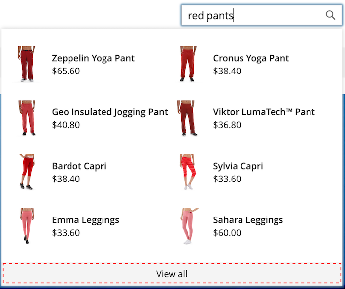
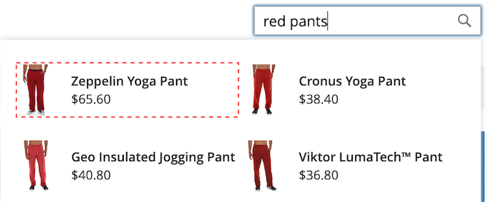

# [!DNL Storefront Popover]

Lorsque [!DNL Live Search] est [installé](install.md), un [!DNL popover] s’affiche dans le storefront lorsque les acheteurs saisissent dans la zone [Rechercher](https://experienceleague.adobe.com/docs/commerce-admin/catalog/catalog/search/search.html?lang=fr#quick-search). Avec chaque caractère saisi, le [!DNL popover] est mis à jour avec les produits suggérés et les images miniatures des principaux résultats de recherche.

[!DNL Live Search] renvoie des résultats pour une requête de deux caractères ou plus. Pour une correspondance partielle, le nombre maximal de caractères par mot est de 20. Le nombre de caractères dans une requête « recherche en cours de frappe » n’est pas configurable.

Par défaut, [!DNL Live Search] prend en charge les [redirections de termes de recherche](https://experienceleague.adobe.com/docs/commerce-admin/catalog/catalog/search/search-terms.html?lang=fr).

![[!DNL Live Search popover]](assets/storefront-search-as-you-type.png)

>[!TIP]
>
>Découvrez comment définir les attributs de produit comme pouvant faire l’objet d’une recherche dans l’article [Configuration de la recherche en direct](workspace.md).

## [!DNL Popover] de la page

La taille de la page du [!DNL popover] détermine le nombre de lignes de produits remplis automatiquement qui peuvent être renvoyées. Lors de l’installation de la recherche en direct, la valeur `page_size` est remplacée par la valeur actuelle du paramètre [Recherche catalogue](https://experienceleague.adobe.com/docs/commerce-admin/config/catalog/catalog.html?lang=fr) - `Autocomplete Limit`.

Par défaut, la valeur Recherche catalogue - Limite de saisie semi-automatique est définie sur huit lignes (ou lignes). Pour modifier la taille de page du [!DNL popover], procédez comme suit :

1. Dans la barre latérale *Admin*, accédez à **Magasins** > Paramètres > **Configuration**.
1. Dans le panneau de gauche, développez **Catalogue** et choisissez **Catalogue** dans la liste des paramètres.
1. Développez la section *Recherche catalogue*.
1. Définissez la **Limite de saisie automatique** sur le nombre de lignes que vous souhaitez autoriser dans le [!DNL popover].
1. Une fois l’opération terminée, cliquez sur **Enregistrer la configuration**.

## Exemple de [!DNL Popover] de style

Vous pouvez personnaliser l’aspect du widget [!DNL Popover] pour qu’il corresponde aux directives de style et d’image de marque de votre entreprise.

Le [!DNL storefront popover] affiche toujours le `name` et le `price` du produit, et la sélection des champs n’est pas configurable. Cependant, les éléments [!DNL popover] peuvent être mis en forme à l’aide des classes [CSS](https://developer.adobe.com/commerce/frontend-core/guide/css/). Par exemple, les déclarations suivantes modifient la couleur d’arrière-plan du conteneur et du pied de page [!DNL popover].

```css
.livesearch.popover-container {
    background-color: lavender;
}

.livesearch.view-all-footer {
    background-color: magenta;
}
```

## Visibilité du conteneur

Le composant parent du `.livesearch.popover-container` est `.search-autocomplete`.  La classe `.active` indique la visibilité du conteneur. La classe `.active` est ajoutée de manière conditionnelle lorsque la [!DNL popover] est ouverte.

```css
.search-autocomplete.active   /* visible */
.search-autocomplete          /* not visible */
```

Pour plus d’informations sur le style des éléments de storefront, reportez-vous à la section [CSS (Cascading style sheets)](https://developer.adobe.com/commerce/frontend-core/guide/css/) dans le [Guide de développement de Frontend](https://developer.adobe.com/commerce/frontend-core/guide/).

## Sélecteurs de classe

Vous pouvez utiliser les sélecteurs de classe suivants pour appliquer un style aux éléments de conteneur et de produit dans le [!DNL popover].

- `.livesearch.popover-container`
- `.livesearch.view-all-footer`
- `.livesearch.products-container`
- `.livesearch.product-result`
- `.livesearch.product-name`
- `.livesearch.product-price`

### Sélecteurs de classe de conteneur

#### .livesearch.popover-container

![[!DNL Popover] conteneur](assets/livesearch-popover-container.png)

#### .livesearch.view-all-footer



### Sélecteurs de classe de produit

#### .livesearch.products-container


#### .livesearch.product-result


#### .livesearch.product-name


#### .livesearch.product-price


#### lien du produit .livesearch



## Utilisation d’un thème modifié {#working-with-modified-theme}

Vous pouvez utiliser le [!DNL storefront popover] avec un [theme](https://developer.adobe.com/commerce/frontend-core/guide/themes/) personnalisé qui hérite des fichiers requis de *Luma*. Le bloc `top.search` dans le `header-wrapper` du module `Magento_Search` ne doit pas être modifié.

```html
<referenceContainer name="header-wrapper">
   <block class="Magento\Framework\View\Element\Template" name="top.search" as="topSearch" template="Magento_Search::form.mini.phtml">
      <arguments>
         <argument name="configProvider" xsi:type="object">Magento\Search\ViewModel\ConfigProvider</argument>
      </arguments>
   </block>
</referenceContainer>
```

## Désactivation de l’[!DNL popover]

Pour désactiver le [!DNL popover] et restaurer la fonctionnalité standard [Quick Search](https://experienceleague.adobe.com/docs/commerce-admin/catalog/catalog/search/search.html?lang=fr#quick-search), saisissez la commande suivante :

```bash
bin/magento module:disable Magento_LiveSearchStorefrontPopover
```

## Implémentations découplées

Pour ceux disposant d’une implémentation découplée, vous pouvez installer le [!DNL Live Search popover] à l’aide d’un package [npm](https://www.npmjs.com/package/@magento/ds-livesearch-storefront-utils).
