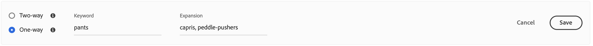

# Ajouter des synonymes

Améliorez l’engagement des clients en ajoutant votre propre liste de synonymes [!DNL Live Search]. [!DNL Live Search] pouvez gérer jusqu’à 200 synonymes par `Data Space ID`.

![[!DNL Live Search] synonymes ](assets/synonym-workspace.png)

## Étape 1 : ajouter un synonyme

1. Dans Admin, accédez à **Marketing** > SEO et recherche > **[!DNL Live Search]**.
1. Pour plusieurs magasins, définissez **Portée** sur la vue [ magasin](https://experienceleague.adobe.com/docs/commerce-admin/start/setup/websites-stores-views.html#scope-settings) où les paramètres de synonyme s’appliquent.
1. Cliquez sur l’onglet **Synonymes**.
1. Cliquez sur le bouton **Ajouter des synonymes**.

## Étape 2 : définir le synonyme par type

Suivez les instructions relatives au [type de synonyme](synonyms-type.md) que vous souhaitez créer.

### Synonyme bidirectionnel

1. Acceptez l’option **Bidirectionnelle** par défaut.

   

1. Saisissez le terme ou l’expression **Mot-clé** à faire correspondre.
1. Saisissez le ou les termes **Expansion** que vous souhaitez ajouter comme synonymes du mot-clé. Séparez les différents termes par une virgule.
Dans cet exemple, le mot-clé à associer est « pantalon » et l’ensemble des termes d’extension est « pantalon, pantalon ».

   

1. Une fois l’opération terminée, cliquez sur **Enregistrer**.
L’ensemble des synonymes apparaît dans la liste avec une flèche bidirectionnelle entre chaque terme, ce qui signifie que les termes sont interchangeables.

   

### Synonyme unidirectionnel

1. Cliquez sur le type de synonyme **Unidirectionnel**.

   

1. Saisissez les termes **Mot-clé** et **Expansion**. Séparez les différents termes par une virgule.

   

   Dans cet exemple, le mot-clé est « pantalon » et les termes d’extension unidirectionnels « capris, peddle-pushers » sont chacun un sous-ensemble de « pantalon », mais avec une signification spécifique.

1. Une fois l’opération terminée, cliquez sur **Enregistrer**.
L’ensemble de synonymes apparaît dans la liste avec une flèche à sens unique pointant des termes d’extension vers le mot-clé pour indiquer que les termes sont des sous-ensembles du mot-clé. Un signe plus sépare chaque terme de développement.

   

## Étape 3 : Publier les modifications

1. Une fois vos synonymes terminés, cliquez sur **Publier les modifications**.
1. Patientez jusqu’à deux heures pour que vos mises à jour soient disponibles dans le storefront.

## Descriptions des champs

| Champ | Description |
|--- |--- |
| [Type ](synonyms.md) | Détermine si les synonymes ont la même signification que le mot-clé ou s’ils sont un sous-ensemble du mot-clé. Options :  Bidirectionnel (par défaut) - Termes ayant la même signification que le mot-clé et renvoyant les mêmes résultats de recherche Unidirectionnel - Termes qui sont un sous-ensemble du mot-clé. Les synonymes à sens unique renvoient une liste plus étroite de produits spécifiques. |
| Mot-clé | Mot généralement associé à une sélection de produits dans votre catalogue. |
| Extension | Termes supplémentaires ayant la même signification ou une signification similaire au mot-clé. |
