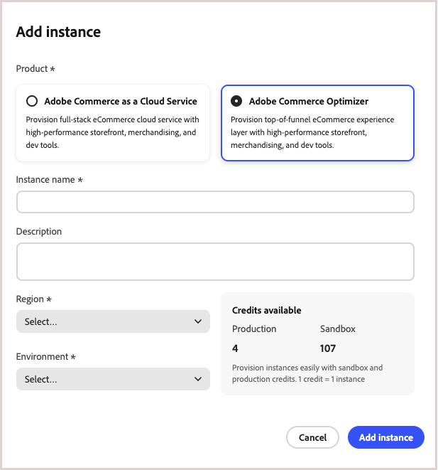

# Prise en main

Ce guide vous guide tout au long de la configuration de [!DNL Adobe Commerce Optimizer], du début à la fin. Bien que ce guide couvre tous les rôles, consultez la [documentation destinée aux développeurs](https://developer.adobe.com/commerce/services/optimizer/) pour obtenir du contenu détaillé spécifique aux développeurs.

## Conditions préalables

Avant de commencer, vérifiez que vous disposez des éléments suivants :

- Compte **Adobe Experience Cloud** avec droits [!DNL Adobe Commerce Optimizer]
- **Accès administrateur de l’organisation** pour créer des instances et gérer les utilisateurs
- **Compte GitHub** (pour le chargement des données d’exemple et le développement du storefront)
- **Compréhension de base** des concepts du commerce électronique

## Guide de démarrage rapide

Pour que votre environnement [!DNL Adobe Commerce Optimizer] fonctionne, procédez comme suit :

### Étape 1. Création d’une instance

1. Connectez-vous à [Adobe Experience Cloud](https://experience.adobe.com/).
1. Accédez à **Commerce** > **Commerce Cloud Manager**.
1. Cliquez sur **Ajouter une instance** > **Commerce Optimizer**.

   {width="60%" zoomable="yes"}

1. Configurez les paramètres des instances :
   - **Name** : nom explicite (par exemple, « Mon entreprise - Sandbox »)
   - **Description** : brève description de l’objectif
   - **Région** : sélectionnez la région de votre choix
   - **Type d’environnement** : commencez par un environnement **Sandbox** pour les tests

1. Cliquez sur **Ajouter une instance**.

   Le Cloud Manager se met à jour pour inclure votre nouvelle instance. Pour plus d’informations sur son accès et sa gestion, voir [Gestion d’une instance](#manage-an-instance).

>[!NOTE]
>
>Les instances Sandbox sont limitées à la région Amérique du Nord. Vous ne pouvez pas modifier la région après sa création.

### Étape 2. Configuration de votre environnement

Après avoir créé votre instance :

1. [Gérez votre instance](#manage-an-instance) à partir de Commerce Cloud Manager.
1. Configurez l’accès des utilisateurs et utilisatrices à l’aide du [ guide de gestion des utilisateurs ](./user-management.md).

### Étape 3. Ajouter des données d’exemple (facultatif)

Pour les tests et l’apprentissage, suivez les instructions [Charger des données d’exemple](#add-sample-data).

## Workflows basés sur les rôles

La configuration et la gestion des [!DNL Adobe Commerce Optimizer] reposent sur trois rôles clés. Chaque rôle comporte des tâches et des responsabilités spécifiques :

{zoomable="yes"}

### Tâches de l’administrateur

Les administrateurs gèrent les instances, les utilisateurs et les paramètres organisationnels.

| Tâche | Description | Lien |
|---|---|---|
| **Gérer les utilisateurs** | Ajouter des utilisateurs, des développeurs et des administrateurs | [Gestion des utilisateurs](./user-management.md) |
| **Créer des instances** | Configurer des environnements de sandbox et de production | [Créer une instance](#create-an-instance) |
| **Configurer l’accès** | Configurer des vues et des politiques de catalogue | [Vues du catalogue](./setup/catalog-view.md) |

### Tâches du développeur

Les développeurs gèrent l’implémentation technique et l’intégration des données, y compris les tâches d’architecture de plateforme.

| Tâche | Description | Lien |
|---|---|---|
| **Accéder à Developer Console** | Créer des projets et générer des informations d’identification | [Developer Console](https://developer.adobe.com/developer-console/docs/guides/getting-started) |
| **Ingérer des données de catalogue** | Importer les données de produit des systèmes existants | [API Data Ingestion](https://developer.adobe.com/commerce/services/optimizer/data-ingestion/) |
| **Configurer Storefront** | Configuration du storefront Edge Delivery Services | [Configuration de Storefront](./storefront.md) |

### Tâches du marchandiseur

Les marchandiseurs optimisent et personnalisent l’expérience d’achat par le biais de la découverte et des recommandations de produits. Elles utilisent également les données et les analyses des acheteurs pour prendre des décisions stratégiques concernant le placement, les prix et les promotions des produits sur le storefront.

| Tâche | Description | Lien |
|---|---|---|
| **Découverte de produits** | Configuration de la recherche et du filtrage | [Présentation du marchandisage](./merchandising/overview.md) |
| **Recommandations** | Configurer des recommandations de produits optimisées par l’IA | [Recommandations de produits](./merchandising/recommendations/overview.md) |
| **Suivi des performances** | Surveiller les mesures de succès | [Mesures de succès](./manage-results/success-metrics.md) |

## Gestion d’une instance

1. Connectez-vous à [Adobe Experience Cloud](https://experience.adobe.com/).

1. Ouvrez Commerce Cloud Manager :
   - Sous **Accès rapide**, cliquez sur **Commerce**.
   - Affichez les instances disponibles.

1. Accédez à votre instance :

   Cliquez sur le nom de l’instance pour ouvrir l’application [!DNL Adobe Commerce Optimizer]. Au sein de l’application, vous pouvez basculer entre différentes instances [!DNL Adobe Commerce Optimizer] à l’aide du menu déroulant situé en haut de la page :

   {zoomable="yes"}

   Toutes les instances affichées appartiennent à la même organisation. Vous pouvez basculer entre les instances pour afficher les données et les paramètres de chacune d’elles, par exemple entre le sandbox et les environnements de production.

1. Obtenir les détails de l’instance :
   - Cliquez sur l’icône d’informations en regard du nom de votre instance.
   - Notez le point d’entrée GraphQL, le point d’entrée du service de catalogue pour l’ingestion de données et l’ID d’instance (également appelé `tenant ID`).

   {width="60%" zoomable="yes"}

   Les détails du point d’entrée et de l’ID d’instance (ID de client) sont requis pour l’intégration aux applications frontales et aux systèmes principaux. L’URL d’accès à l’application [!DNL Adobe Commerce Optimizer] est également fournie ici.

   Tous les utilisateurs de Adobe Commerce Optimizer n’ont pas accès à Cloud Manager et aux détails de l’instance. L’accès dépend du rôle et des autorisations attribués au compte d’utilisateur. Si vous n’y avez pas accès, contactez l’administrateur ou administratrice de votre organisation pour obtenir les détails de l’instance.

1. Modifiez le nom et la description de l’instance :
   - Cliquez sur l’icône **Modifier** en regard d’un nom d’instance.
   - Mettez à jour le nom et la description si nécessaire.
   - Cliquez sur **Enregistrer**.

   Vous pouvez également utiliser les options de recherche et de filtrage pour rechercher rapidement des instances spécifiques.

## Ajout de données d’exemple

Adobe fournit un référentiel GitHub avec des exemples de données et d’outils pour vous aider à apprendre et à tester les fonctionnalités de [!DNL Adobe Commerce Optimizer].
Les données d’exemple sont basées sur le [scénario commercial Carvelo](./use-case/admin-use-case.md) et incluent :

- Catalogue de produits avec pièces automobiles
- Plusieurs tarifs et scénarios de tarification
- Vues et stratégies de catalogue pour différents revendeurs
- Exemples complets de workflows de bout en bout

**Chargez les exemples de données :**

1. Accédez au référentiel GitHub [ingestion de données de catalogue d’exemples](https://github.com/adobe-commerce/aco-sample-catalog-data-ingestion).

1. Suivez les instructions de configuration du fichier LISEZ-MOI du référentiel pour effectuer les tâches suivantes :

   - Configuration de votre environnement
   - Terminer le processus d’ingestion des données
   - Créer des vues de catalogue et des politiques à l’aide des données d’exemple
   - Vérifiez l’ingestion des données en vérifiant les données du service de catalogue sur la page [ Synchronisation des données ](./setup/data-sync.md)

## Étapes suivantes

Une fois la configuration terminée :

1. Configurez votre storefront :
   - Configurer le storefront [Edge Delivery Services](./storefront.md)
   - Connexion aux données de votre catalogue

1. Explorez le cas d’utilisation de Carvelo :
   - Suivez le [workflow de bout en bout](./use-case/admin-use-case.md)
   - Pratique avec des scénarios réels

1. Configurez le marchandisage :
   - Configurer [découverte de produits](./merchandising/overview.md)
   - Créer des [recommandations](./merchandising/recommendations/overview.md)

1. Surveillance des performances :
   - Suivi [mesures de succès](./manage-results/success-metrics.md)
   - Analyse [performances de recherche](./manage-results/search-performance.md)

## Dépannage

### Problèmes courants

| Problème | Solution |
|---|---|
| **Impossible de créer une instance** | Vérifiez que vous disposez des droits d’[!DNL Adobe Commerce Optimizer] et des autorisations d’administrateur. |
| **L’instance n’apparaît pas** | Vérifiez votre organisation Adobe IMS et actualisez la page. |
| **Impossible d’accéder à l’instance** | Assurez-vous d’être ajouté en tant qu’utilisateur dans Admin Console. |
| **Les exemples de données ne se chargent pas** | Vérifiez les informations d’identification de votre instance et les points d’entrée de l’API. |

### Obtenir de l’aide

- **Ressources pour les développeurs** : [Documentation destinée aux développeurs](https://developer.adobe.com/commerce/services/optimizer/)
- **Ressources Storefront** : [Documentation Du Storefront Commerce](https://experienceleague.adobe.com/developer/commerce/storefront/)
- **Assistance** : [Ressources d’assistance Adobe Commerce](https://experienceleague.adobe.com/en/docs/commerce-knowledge-base/kb/overview)
