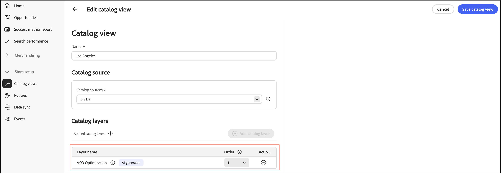

# Opportunités

La page **Opportunités** vous permet d’identifier et d’implémenter des optimisations pour améliorer le trafic sur le site, l’interaction client et les taux de conversion par le biais de l’intégration à Adobe Sites Optimizer.

## Que sont les opportunités ?

[Opportunités](https://experienceleague.adobe.com/en/docs/experience-manager-sites-optimizer/content/documentation/opportunities/overview) sont des recommandations optimisées par l’IA qui aident les marchandiseurs à identifier et à résoudre les problèmes affectant les performances de leur site commercial. Ces recommandations sont optimisées par [&#128279;](https://experienceleague.adobe.com/en/docs/experience-manager-sites-optimizer/content/home), un service cloud qui analyse et améliore les performances des sites web.

## Fonctionnalités clés

- **Détection automatisée des problèmes** : Sites Optimizer analyse en permanence les catalogues de produits, les journaux de recherche et les données de recommandation afin d’identifier les problèmes affectant la détection.
- **Recommandations basées sur l’IA**—Recevez des suggestions intelligentes pour résoudre les problèmes détectés.
- **Catégorisation de l’impact**—Les problèmes sont classés par impact sur l’entreprise (recherche, recommandations, navigation/navigation, qualité des données du produit).
- **Rapports de tableau de bord**—Affichez les tendances des problèmes, les produits ou les requêtes les plus impactés et les améliorations au fil du temps.

## Prise en main

Pour activer les opportunités dans [!DNL Adobe Commerce Optimizer], contactez votre responsable du succès client (CSM). Les opportunités sont disponibles avec la licence **Ultima** Adobe Sites Optimizer.

## Aperçu rapide

La page Opportunités est organisée en trois onglets qui vous aident à gérer les recommandations d’optimisation :

- **Actuel (actif)** : affiche les nouvelles opportunités détectées qui nécessitent une révision et une action. Il s’agit de problèmes actifs qui peuvent avoir un impact sur les performances de votre site.
- **Ignoré** : contient les opportunités que vous avez choisi d&#39;ignorer ou de reporter. Vous pouvez déplacer des opportunités ici si elles ne sont pas pertinentes par rapport à vos objectifs commerciaux actuels.
- **Optimisé (Terminé)** : affiche les opportunités qui ont été traitées avec succès par le déploiement de correctifs automatiques. Les opportunités traitées manuellement n’apparaissent pas dans cet onglet. Cet onglet vous permet de suivre vos opportunités corrigées automatiquement au fil du temps.

## Détecter automatiquement le workflow

Le workflow de détection automatique utilise une analyse optimisée par l’IA pour identifier automatiquement les opportunités d’optimisation dans votre catalogue de produits. Ce processus d’analyse automatisée surveille en permanence les données de vos produits, les journaux de recherche et les performances de Recommendations afin de détecter les problèmes susceptibles d’avoir un impact sur les performances du site, l’optimisation du moteur de recherche et l’engagement des clients.

### Fonctionnement

La détection automatique utilise Adobe Experience Manager Sites Optimizer pour :

- **Analyser les pages de produits** : le système examine les 200 premières pages et les filtres pour trouver les pages de détails du produit afin d’identifier les cibles d’optimisation.
- **Extraction de métadonnées** : les balises Meta (titres, descriptions, en-têtes H1) sont extraites de chaque page à des fins d’analyse.
- **Générer des recommandations d’IA** : les données extraites sont traitées par le workflow d’IA d’Adobe pour créer des suggestions d’optimisation exploitables.
- **Renseigner les opportunités** : les suggestions détectées automatiquement s’affichent dans l’onglet **Actuel (actif)** pour votre révision.

### Prérequis

Pour que la détection automatique puisse générer des recommandations, les données de votre catalogue doivent être synchronisées et à jour afin de garantir des recommandations précises.

### Que se passe-t-il ensuite ?

Une fois que la détection automatique a identifié les opportunités d’optimisation, vous pouvez :

- Examinez les optimisations suggérées dans l’onglet **Actif)**.
- Déployez automatiquement des correctifs à l’aide du [&#x200B; workflow de correctif automatique &#x200B;](#auto-fix-workflow) (pour les [types d’opportunité](#supported-opportunity-types) pris en charge).
- Mettez en œuvre les modifications manuellement dans votre administrateur Commerce.
- Ignorez les opportunités qui ne correspondent pas à vos objectifs commerciaux.

## Workflow de correction automatique

Le workflow de correctif automatique vous permet de déployer rapidement et en un seul clic des optimisations générées par l’IA. Lorsque vous appliquez un correctif automatique, le système crée une couche d’optimisation du catalogue qui remplace des attributs de produit spécifiques sans modifier les données de produit d’origine. Vos données de produit d’origine restent intactes, ce qui vous permet d’appliquer des optimisations en toute sécurité et d’annuler les modifications à tout moment. Pour en savoir plus[&#128279;](#how-catalog-layers-work-with-auto-fix) consultez la section  Fonctionnement des calques de catalogue avec le correctif automatique .

### Types d’opportunité pris en charge

Les types d’opportunités pris en charge sont les suivants :

- Titre trop long
- Titre trop court
- Dupliquer le titre
- Titre manquant
- Titre vide
- Description trop longue
- Description trop courte
- Description manquante
- Description vide
- Dupliquer la description
- H1 manquant
- Dupliquer H1
- H1 trop long

>[!NOTE]
>
>Plusieurs H1 sur la page ne sont actuellement pas pris en charge.

### Conditions préalables

Avant d’utiliser le correctif automatique, vérifiez les points suivants :

- Votre catalogue de produits est entièrement ingéré dans [!DNL Adobe Commerce Optimizer].
- Le type d’opportunité prend en charge le correctif automatique (certains types d’optimisation nécessitent une implémentation manuelle).
- Vous disposez des autorisations appropriées pour créer et gérer des calques de catalogue.

>[!IMPORTANT]
>
>La fonction de correctif automatique nécessite un catalogue de produits entièrement ingéré. Si votre catalogue n’est pas encore ingéré, vous pouvez tout de même afficher les opportunités et implémenter manuellement les correctifs à l’aide du fichier CSV fourni. Notez que les implémentations manuelles ne sont pas suivies dans l’onglet **Optimisé (Terminé)**.

### Déploiement d’une optimisation de correctif automatique

Pour implémenter une optimisation suggérée par l’IA, procédez comme suit :

1. Accédez à **Gérer les résultats** > **Opportunités**.

1. Dans l’onglet **Actif (Actif)** passez en revue les suggestions d’optimisation disponibles.

1. Sélectionnez une opportunité.

   

   >[!NOTE]
   >
   >Le bouton **Déployer l’optimisation** n’est disponible que pour les [types de suggestions pris en charge](#supported-opportunity-types). Pour les types non pris en charge, la case est désactivée et vous devez appliquer les correctifs manuellement dans votre catalogue.

1. Cliquez sur **Déployer l’optimisation** puis sur **Déployer** pour déclencher le processus de correction automatique.

   

   Le système effectue les actions suivantes en arrière-plan :

   - Crée une couche de catalogue pour le produit (si elle n’existe pas déjà).
   - Met à jour l’attribut approprié (tel que le méta-titre, la description ou H1) en fonction de la recommandation de l’IA.
   - Affecte le nouveau calque en tant que priorité la plus élevée (numéro plus élevé) dans la vue Catalogue.
   - Valide la modification via le service storefront de catalogue.

1. Surveillez le statut du déploiement. Le système met automatiquement à jour l’état des suggestions une fois la validation terminée.

1. Une fois optimisée, la suggestion passe à l’onglet **Optimisé (Terminé)** avec un indicateur de statut :

   - **Coche verte** : la couche d’optimisation est définie comme première priorité et est appliquée activement à votre storefront.
   - **Icône d&#39;avertissement** : le calque existe mais n&#39;est pas la première priorité, ce qui signifie qu&#39;il peut être remplacé par un autre calque.

   

>[!NOTE]
>
>Le correctif automatique prend en charge l’optimisation des métadonnées pour les sites dans n’importe quelle langue. Sites Optimizer analyse les pages de détails du produit dans leur langue d’origine, génère des recommandations d’IA localisées et crée des calques de catalogue en fonction des paramètres régionaux source configurés dans votre vue de catalogue.

### Fonctionnement des calques de catalogue avec le correctif automatique

S’il n’existe pas de calque Adobe Sites Optimizer dans votre vue de catalogue, le correctif automatique en crée automatiquement un et l’affecte comme priorité la plus élevée (numéro le plus élevé). Si vous supprimez ce calque, il sera recréé lors de la prochaine exécution du correctif automatique et déplacera les calques existants vers des numéros d’ordre inférieurs. Si le calque Adobe Sites Optimizer existe déjà avec un autre numéro de commande, le correctif automatique ne modifie pas sa priorité. Si vous souhaitez conserver un calque de correction automatique, mais ne pas l’utiliser immédiatement, vous pouvez le désactiver. En savoir plus sur la gestion des calques de [catalogue](../setup/catalog-layer.md#activate-deactivate-or-delete-layers).

Le diagramme présente une seule ligne appelée **Optimisation ASO**. Cette entrée représente toutes les opportunités que vous choisissez de corriger automatiquement. Que vous résolviez automatiquement une ou plusieurs opportunités, elles apparaissent toutes dans cette seule ligne **Optimisation ASO**. Les calques sont spécifiques à chaque vue de catalogue. La vue de catalogue **Los Angeles** affichée ici applique donc son calque **Optimisation ASO** uniquement lorsque cette vue est active.

### Considérations importantes

Gardez les points suivants à l’esprit lors de l’utilisation du correctif automatique :

- Le statut affiché pour chaque suggestion reflète l’état au moment où le programme de travail de correctif automatique s’est exécuté. Le statut n’est pas mis à jour dynamiquement si vous réorganisez manuellement les calques du catalogue par la suite.

- Pour vous assurer que vos optimisations restent actives, évitez de modifier manuellement les priorités des couches de catalogue après le déploiement des recommandations de correctifs automatiques.

### Dépannage

Si une optimisation ne semble pas être appliquée à votre storefront :

1. Vérifiez l’indicateur de statut dans l’onglet **Optimisé (Terminé)**.
1. Si une icône d’avertissement s’affiche, vérifiez les paramètres de priorité des calques du catalogue.
1. Assurez-vous que la couche d’optimisation est définie comme priorité la plus élevée (numéro le plus élevé) dans votre vue de catalogue.
1. Vérifiez que la synchronisation des données du catalogue est active et à jour.
1. Laissez le temps aux modifications de se propager. Même avec une couche correctement configurée au numéro d’ordre le plus élevé, les modifications peuvent prendre du temps pour apparaître sur votre storefront, comme le délai de publication de nouveaux produits.

## Fonctionnement conjoint de Sites Optimizer et des mesures de succès

Les mesures de succès surveillent les indicateurs clés de performances, tels que la découverte de produits et l’efficacité commerciale du catalogue, tandis que les opportunités dans Sites Optimizer vous permettent de savoir comment améliorer l’optimisation du moteur de recherche (SEO), la vitesse de chargement, l’accessibilité et l’engagement. Ensemble, les spécialistes du marchandisage et du marketing peuvent améliorer l’efficacité opérationnelle, ce qui leur permet d’obtenir des performances de bout en bout plus rapides et de réaliser des gains de conversion avec un support informatique minimal. Pour découvrir comment tirer parti de ces deux technologies afin d’améliorer les performances et l’expérience de votre storefront, consultez [Utilisation conjointe des mesures de succès et de Sites Optimizer](./success-metrics.md#using-success-metrics-and-sites-optimizer-together).

## En savoir plus sur Sites Optimizer

Pour plus d’informations sur les fonctionnalités de Sites Optimizer, consultez la [documentation de Adobe Experience Manager Sites Optimizer](https://experienceleague.adobe.com/en/docs/experience-manager-sites-optimizer/content/home).

Ressources supplémentaires :

- [Types d’opportunités](https://experienceleague.adobe.com/en/docs/experience-manager-sites-optimizer/content/opportunities) - Découvrez les opportunités d’optimisation disponibles.
- [Fonctionnalités de Sites Optimizer &#x200B;](https://experienceleague.adobe.com/en/docs/experience-manager-sites-optimizer/content/capabilities) - Découvrez ce que Sites Optimizer peut faire.

## Plus comme ceci

- [Mesures de succès](success-metrics.md) - Surveillez les indicateurs clés de performances.
- [Performances de la recherche](search-performance.md) - Analysez les termes de recherche et optimisez la pertinence.
- [Performances des recommandations](recommendation-performance.md) - Surveillez l’efficacité des recommandations.
