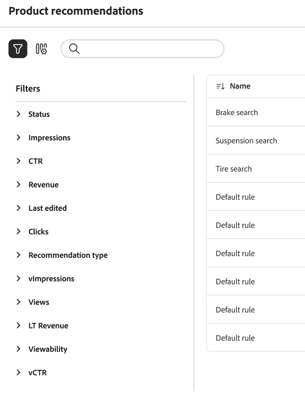

# Performances de Recommendations

La page Performances des recommandations affiche une liste des recommandations configurées ainsi que des mesures clés pour vous aider à évaluer leur efficacité. Vous pouvez configurer la vue pour afficher les mesures du dernier jour, de la dernière semaine ou du dernier mois. Ces informations indiquent la fréquence à laquelle chaque unité de recommandation est consultée ou fait l’objet d’un clic, ce qui vous permet d’évaluer les performances et d’identifier les opportunités d’optimisation.

>[!INFO]
>
>Une unité de recommandation est un widget qui contient les _éléments_ de produit recommandés.

{zoomable="yes"}

## Choisissez la vue **Catalogue**

Sélectionnez la vue [catalogue](../setup/catalog-view.md) où vos recommandations s’appliquent.

## Affichage d’un rapport

Cliquez sur le **[!UICONTROL Date Range]** et sélectionnez l’une des plages suivantes :

Le tableau de recommandations est mis à jour pour afficher les mesures de cette période.

## Personnaliser le tableau

1. Dans le coin supérieur gauche, cliquez sur l’icône  pour personnaliser le tableau.

   Les colonnes visibles comportent une coche.

1. Dans le menu, effectuez l’une des opérations suivantes :

   - Pour afficher une colonne masquée, cliquez sur un nom de colonne sans coche.
   - Pour masquer une colonne visible, cliquez sur un nom de colonne avec une coche.

   Le tableau est actualisé pour n’inclure que les colonnes sélectionnées.

## Définition de filtres

Cliquez sur l’icône de filtre pour filtrer les mesures dans l’espace de travail des performances des recommandations.

Vous pouvez configurer plusieurs valeurs pour chacun des filtres. Consultez le [tableau ci-dessous](#column-descriptions) pour obtenir une description de chaque filtre.

## Afficher les détails

1. Dans le tableau, cliquez sur l’icône () en regard de la recommandation à examiner.

1. Pour modifier le statut de la recommandation, cliquez sur **Activer** ou **Désactiver**.

## Création ou gestion de recommandations

Découvrez comment [créer ou gérer une recommandation existante](../merchandising/recommendations/create.md).

## Contrôles Workspace

| Contrôle | Description |
|---|---|
|  | Détermine la période utilisée pour les calculs des mesures. |
|  | Détermine les colonnes qui apparaissent dans le tableau Recommendations. |
| Créer une recommandation | Ouvre la page [&#x200B; Créer une recommandation &#x200B;](../merchandising/recommendations/create.md). |

## Descriptions des colonnes

| Colonne | Description |
|---|---|
| Nom | Nom de la recommandation. |
| Page | Page sur laquelle s’affiche la recommandation. |
| Type | Type de recommandation. |
| Statut | Statut de la recommandation. Options : Inactive/Active/Draft |
| Créé | Date de création de la recommandation. |
| Dernière édition | Date de la dernière modification de la recommandation. |
| Impressions | Nombre de fois qu’une unité de recommandation est chargée et rendue sur une page. Une unité de recommandation située sous le pli de la fenêtre d’affichage du navigateur est rendue sur la page, même si elle n’est pas consultée par l’acheteur. Dans ce cas, l’unité rendue est comptabilisée comme une impression, mais une vue n’est comptabilisée que si l’acheteur fait défiler l’unité vers la vue. |
| vImpressions | (Impressions visibles) Nombre d’unités de recommandation qui enregistrent au moins une vue. Par exemple, si l’unité de recommandation comporte deux lignes, chacune avec deux produits, et que les deux derniers produits ne sont pas vus par l’acheteur, mais que les deux premiers le sont, l’activité comptera toujours comme une impression. |
| Vues | Nombre d’unités de recommandation qui apparaissent dans la fenêtre du navigateur de l’acheteur. Si l’acheteur fait défiler la page vers le haut ou vers le bas plusieurs fois, l’événement se déclenche plusieurs fois, chaque fois que l’unité est visible. |
| Clics | Somme du nombre de fois où un acheteur clique sur un article dans l’unité de recommandation et du nombre de fois où l’acheteur clique sur le bouton **Ajouter au panier** dans l’unité de recommandation |
| Chiffre d’affaires | Chiffre d’affaires généré par la recommandation pour la période actuelle. |
| Lt Revenue | (Chiffre d’affaires cumulé sur toute la durée de vie) Chiffre d’affaires cumulé sur une recommandation. |
| Visibilité | Pourcentage d&#39;unités de recommandation qui s&#39;enregistrent pour la vue. |
| CTR | (Taux de clic publicitaire) Pourcentage d’impressions d’unité pour la recommandation qui enregistre un clic. Le CTR comptabilise toutes les impressions même si l’unité n’entre pas dans la vue de l’acheteur. Si l’unité de recommandation n’est pas consultée, il est peu probable qu’elle soit cliquée. Cependant, ces impressions invisibles sont prises en compte dans le score de RCT et réduisent le pourcentage de RCT global. |
| vCTR | (Taux de clic publicitaire visible) mesure les clics en fonction uniquement des impressions visibles (recommandations qui se sont en fait affichées dans la partie visible de l’écran de l’acheteur), offrant ainsi une mesure plus précise de l’engagement de l’acheteur. |
