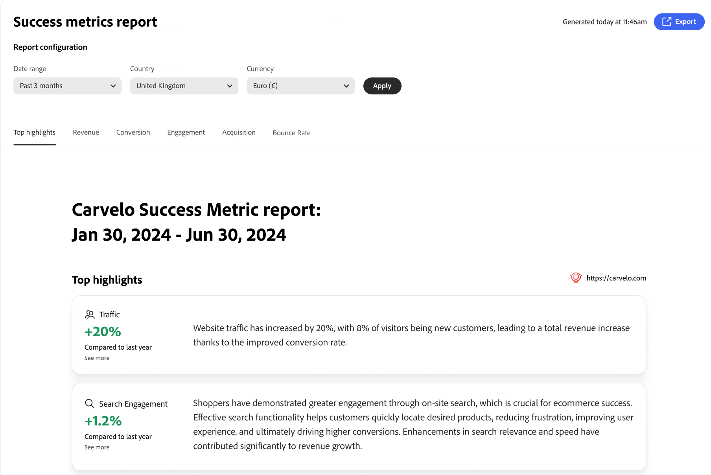

# Mesures de succès

Cette page présente un aperçu des mesures de performances clés de votre boutique [!DNL Adobe Commerce Optimizer]. L’objectif est que vous compreniez rapidement les résultats de l’implémentation de [!DNL Adobe Commerce Optimizer], puis que vous et votre équipe identifiiez les opportunités de croissance et mettiez en évidence les domaines à optimiser.

Les mesures du rapport sont extraites des données d’événement du storefront. [En savoir plus](../setup/events/overview.md) sur les données d’événement collectées.

## Compréhension de vos mesures

Le rapport des mesures de succès fournit des informations exploitables sur cinq domaines de performances clés qui ont un impact direct sur les résultats de votre entreprise. Chaque mesure révèle des modèles de comportement des clients et des clientes, ainsi que des performances de magasin qui vous aident à découvrir des opportunités et à relever des défis. Tirez parti de ces informations pour prendre des décisions plus intelligentes et optimiser votre expérience commerciale.

**Principales caractéristiques** résume les mesures clés de chaque domaine de performance. Utilisez cette section pour identifier rapidement les principales opportunités d’amélioration.

Les principaux indicateurs de performance sont les suivants :

- **Chiffre d’affaires** : votre principale mesure financière indiquant le chiffre d’affaires total.
- **Conversion** : pourcentage de visiteurs et visiteuses qui effectuent des achats.
- **Engagement** : comment les utilisateurs interagissent activement avec votre site.
- **Acquisition** : efficacité de vos efforts d’acquisition de clients.
- **Taux de rebond** : pourcentage de visiteurs et visiteuses qui quittent après avoir consulté une seule page.

## Générer un rapport

1. Dans le rail de gauche, sélectionnez **Mesures de succès**.
1. Sous **Configuration du rapport** spécifiez la **Période**, **Source du catalogue**, en fonction de vos paramètres régionaux, et **Devise**.
1. Cliquez sur **[!UICONTROL Apply]**.

   Les **Principales caractéristiques**, **Chiffre d’affaires**, **Conversion**, **Engagement**, **Acquisition** et **Taux de rebond** sont toutes mises à jour en fonction de la configuration de votre rapport.

1. Cliquez sur **[!UICONTROL Export]** pour enregistrer le rapport en tant que PDF.

## Étapes suivantes et stratégies d’optimisation

Utilisez vos données de mesures de succès pour identifier les opportunités d’amélioration et mettre en œuvre des stratégies d’optimisation ciblées. Les sections suivantes fournissent des conseils spécifiques et exploitables pour chaque zone de mesure.

### Optimisation du chiffre d’affaires

Pour le chiffre d’affaires, votre objectif est d’augmenter les ventes totales et la valeur moyenne des commandes.

#### Stratégies

- **Implémenter des recommandations optimisées par l’IA** : utilisez le moteur de recommandations de l’optimiseur pour faire apparaître les produits pertinents qui génèrent des taux de conversion plus élevés. Déployer *Les clients qui l’ont consulté ont également consulté* et *l’ont acheté* ont acheté ces types de recommandations afin d’augmenter les opportunités de vente croisée.

- **Créer des règles de marchandisage** : améliorez les produits à marge élevée dans les résultats de recherche à l’aide de [règles de marchandisage](../merchandising/rules/overview.md). Épinglez les articles les plus vendus en haut des résultats de recherche pour les requêtes à trafic élevé.

- **Optimiser la découverte de produits** : utilisez les [facettes intelligentes](../merchandising/facets/overview.md) pour aider les clients à trouver les produits plus efficacement, ce qui entraîne des taux de conversion plus élevés et une augmentation des recettes.

- **Tirer parti des opportunités saisonnières** : créez des règles de marchandisage temporelles pour promouvoir les articles saisonniers ou promotionnels pendant les périodes de pointe des achats.

### Amélioration du taux de conversion

Pour améliorer votre taux de conversion, votre objectif est de convertir davantage de visiteurs en clients.

#### Stratégies

- **Optimiser la pertinence de la recherche** : implémentez des [synonymes](../merchandising/synonyms/overview.md) pour vous assurer que les clients trouvent ce qu’ils recherchent, même avec des termes de recherche différents. Utilisez la facettisation dynamique pour fournir des options de filtrage pertinentes.

- **Emplacement de recommandation stratégique** : déployez des unités de recommandation sur les pages à trafic élevé, telles que les pages de détails du produit et les pages de catégories. Utilisez les recommandations *Les plus consultés* et *Les plus achetés* pour créer de la confiance et de l’urgence.

- **Améliorer la visibilité des produits** : utilisez les règles de marchandisage pour vous assurer que les produits les plus vendus et à forte conversion apparaissent bien en vue dans les résultats de recherche.

- **Types de recommandations de test A/B** : testez différents types de recommandations et emplacements pour trouver celui qui convient le mieux à votre audience.

### Amélioration de l’engagement

Pour améliorer l’engagement, votre objectif est d’augmenter l’interaction client et le temps passé sur le site.

#### Stratégies

- **Diversifier les types de recommandations** : évitez d’afficher les mêmes recommandations à plusieurs reprises. Utilisez un mélange de *Recommandé pour vous*, *Tendance* et *Récemment consultés* pour garder le contenu à jour et attrayant.

- **Implémenter une recherche intelligente** : utilisez la facettisation dynamique et le reclassement des résultats pilotés par l’IA pour adapter les résultats de recherche en temps réel en fonction du comportement de l’acheteur.

- **Création d’expériences personnalisées** : déployez des unités « Recommandé pour vous » sur la page d’accueil et sur l’ensemble du parcours client pour fournir des suggestions de produits personnalisées.

- **Optimiser l’expérience de recherche** : utilisez des synonymes pour améliorer la pertinence de la recherche et vous assurer que les clients trouvent rapidement ce qu’ils recherchent.

### Croissance des acquisitions

Pour augmenter votre croissance, vous avez pour objectif d&#39;attirer davantage de nouveaux clients et d&#39;améliorer l&#39;efficacité de vos acquisitions.

#### Stratégies

- **Exploiter les données de performances de recherche** : utilisez le rapport [performances de recherche](../manage-results/search-performance.md) pour identifier les produits en tendance et les termes de recherche populaires. Créez des règles de marchandisage pour mettre en évidence ces éléments.

- **Optimiser les performances des recommandations** : surveillez les mesures [performances des recommandations](../manage-results/recommendation-performance.md) pour identifier les types de recommandations qui génèrent le plus de trafic et de conversions.

- **Mettre en surbrillance les nouveaux articles et les articles promotionnels** : utilisez les règles de marchandisage pour améliorer les nouveaux produits ou articles promotionnels dans les résultats de recherche pour attirer l’attention des nouveaux visiteurs.

- **Suivre les sources de trafic** : utilisez les données d’événement pour comprendre quels canaux apportent le trafic le plus précieux et optimisez vos efforts marketing en conséquence.

### Réduction du taux de rebond

Pour réduire le taux de rebond, votre objectif est de maintenir l’engagement des visiteurs et de réduire les visites sur une seule page.

#### Stratégies

- **Améliorez la pertinence de la recherche** : utilisez des synonymes et une facettisation intelligente pour vous assurer que les clients trouvent rapidement des produits pertinents. De mauvais résultats de recherche sont une cause majeure des taux de rebond élevés.

- **Implémenter des unités de recommandation** : déployez des unités de recommandation sur les pages de résultats de catégorie et de recherche pour fournir des options de produit supplémentaires et maintenir l’engagement des visiteurs.

- **Optimiser la découverte de produits** : utilisez les règles de marchandisage pour vous assurer que les produits les plus pertinents et les plus populaires apparaissent en premier dans les résultats de recherche.

- **Créer des expériences de page d’accueil attrayantes** : utilisez les types de recommandation « Recommandé pour vous » et « En tendance » sur votre page d’accueil pour intéresser immédiatement les visiteurs et visiteuses avec du contenu pertinent.

## Dépannage et optimisation

### Lorsque les mesures diminuent

**Recettes en baisse** :

- Vérifiez si les unités de recommandation sont toujours actives et performantes.
- Revoir les règles de marchandisage pour s&#39;assurer que les produits à marge élevée sont promus
- Analysez les performances de recherche pour déterminer si les produits populaires se classent toujours bien.

**Baisse du taux de conversion** :

- Vérifiez que la pertinence de la recherche est conservée (vérifiez les synonymes et les facettes).
- S’assurer que les unités de recommandation s’affichent correctement
- Consultez les règles de marchandisage pour tout conflit ou problème.

**Taux de rebond élevés** :

- Vérifiez la pertinence des résultats de recherche et implémentez des synonymes si nécessaire.
- S’assurer que les unités de recommandation se chargent correctement
- Vérifier la qualité et la disponibilité des données sur les produits

**Faible engagement** :

- Diversifier les types de recommandations pour éviter la fatigue des clients
- Implémenter des stratégies de recommandation plus personnalisées
- Optimisez l’expérience de recherche avec de meilleures facettes et de meilleurs synonymes.

## Descriptions des champs

### Configuration du rapport

| Champ | Description |
|---|---|
| Période | Les options incluent **3 derniers mois**, **7 derniers jours**, **30 derniers jours**, **6 derniers mois**, **12 derniers mois** et **Année à ce jour**. Utilisez des plages plus courtes pour obtenir des informations d’optimisation immédiates et des plages plus longues pour l’analyse des tendances. |
| Pays | En fonction de la source de catalogue spécifiée pour votre [vue de catalogue](../setup/catalog-view.md). Sélectionnez le marché approprié pour une analyse des performances précise. |
| Devise monétaire | Devise spécifiée pour l’affichage du catalogue. Assurez-vous que cela correspond à votre marché cible pour un reporting précis des recettes. |
| Exporter | Enregistre le rapport en tant que PDF pour le partage avec les parties prenantes ou l’analyse hors ligne. |

## Plus comme ceci

- [Performances de la recherche](../manage-results/search-performance.md) - Analysez les termes de recherche et optimisez la pertinence de la recherche.
- [Performances des recommandations](../manage-results/recommendation-performance.md) - Surveillez et optimisez l’efficacité des recommandations
- [Présentation de Recommendations](../merchandising/recommendations/overview.md) - En savoir plus sur les recommandations de produits optimisées par l’IA
- [Règles de marchandisage](../merchandising/rules/overview.md) - Booster, enterrer, épingler ou masquer des produits dans les résultats de recherche
- [Facettes](../merchandising/facets/overview.md) - Améliorez la recherche avec le filtrage intelligent
- [Synonymes](../merchandising/synonyms/overview.md) - Améliorez la pertinence de la recherche et l’expérience client
- [Présentation des événements](../setup/events/overview.md) - Comprenez les données qui alimentent vos mesures
