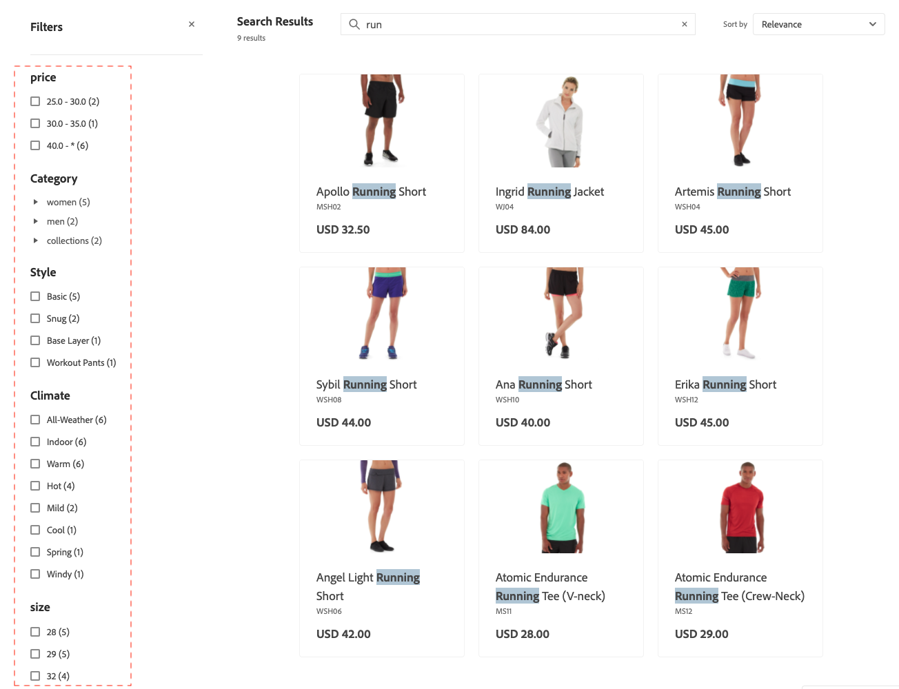

# Facettes

Facettes est une méthode de filtrage haute performance qui utilise plusieurs dimensions de valeurs d’attribut comme critères de recherche.

Dans une facette, les acheteurs peuvent sélectionner plusieurs options, telles que « De base » et « Doux » sous « Style », et les résultats de la recherche sont mis à jour pour afficher uniquement ces styles. De même, si un acheteur sélectionne des options sur plusieurs facettes, telles que « De base » sous « Style » et « Intérieur » sous « Climat », les résultats de la recherche sont mis à jour pour afficher le style et le climat sélectionnés.

Toute facette définie peut être utilisée comme paramètre d’URL et les résultats seront filtrés en fonction des valeurs de paramètre : `http://yourstore.com?brand=acme&color=red`.

## Agrégation de facettes

L’agrégation des facettes est effectuée comme suit : si le storefront comporte trois facettes (catégories, couleur et prix) et que les filtres de l’acheteur sont appliqués aux trois (couleur = bleu, prix compris entre 10,00 et 50,00 $, catégories = `promotions`).

- `categories` agrégation - Agrége `categories`, puis applique les filtres `color` et `price`, mais pas le filtre `categories`.
- `color` agrégation - Agrége `color`, puis applique les filtres `price` et `categories`, mais pas le filtre `color`.
- `price` agrégation - Agrége `price`, puis applique les filtres `color` et `categories`, mais pas le filtre `price`.

## Valeurs d’attribut par défaut

Les attributs de produit suivants sont utilisés par [!DNL Adobe Commerce Optimizer] et activés par défaut.

| Propriété | Description | Attribut |
|---|---|---|
| Triable | Utilisé pour le tri dans la liste de produits | `price` |
| Indexable | Utiliser dans la recherche | `price`  `sku` `name` |

Consultez la section [API de métadonnées d’ingestion de données](https://developer.adobe.com/commerce/services/optimizer/data-ingestion/#metadata) pour en savoir plus sur les attributs de produit et leurs propriétés.

## Recherche en couches et développement de types de recherche

La recherche en couches, ou recherche dans une recherche, est un système de filtrage basé sur les attributs qui étend la fonctionnalité de recherche traditionnelle pour inclure des paramètres de recherche supplémentaires. Ces paramètres de recherche supplémentaires permettent une découverte de produit plus précise et plus flexible.

Avec la recherche par couches, vous pouvez :

- Permettre aux acheteurs de rechercher dans les résultats de la recherche.
- Utilisez l’indexation de la recherche `startsWith` et `contains` dans le deuxième calque de la recherche superposée pour affiner davantage les résultats.

Les fonctionnalités de recherche avancée sont implémentées via le paramètre `filter` dans la requête [`productSearch`](https://developer.adobe.com/commerce/webapi/graphql/schema/live-search/queries/product-search/) à l’aide d’opérateurs spécifiques :

- **Recherche superposée** - Effectuez une recherche dans un autre contexte de recherche - Grâce à cette fonctionnalité, vous pouvez effectuer jusqu’à deux couches de recherche pour vos requêtes de recherche. Par exemple :

   - **Recherche de la couche 1** - Recherchez « moteur » sur `product_attribute_1`.
   - **Recherche de la couche 2** - Recherchez « numéro de pièce 123 » sur `product_attribute_2`. Dans cet exemple, le « moteur » est recherché dans les résultats par « numéro de pièce 123 ».

  La recherche en couches est disponible pour l’indexation de la recherche `startsWith` et l’indexation de la recherche `contains` dans le deuxième calque de la recherche en couches, comme décrit ci-dessous :

- **startsWith search indexation** - Effectuez une recherche à l’aide de l’indexation `startsWith`. Cette fonctionnalité permet :

   - Recherche de produits dont la valeur d’attribut commence par une chaîne spécifiée.
   - La configuration d’une recherche « se termine par » afin que les acheteurs puissent rechercher des produits pour lesquels la valeur d’attribut se termine par une chaîne particulière.
      - Pour activer une recherche « se termine par », l’attribut de produit doit être ingéré en inverse et l’appel API doit également être une chaîne inversée. Par exemple, si vous souhaitez rechercher un nom de produit qui se termine par « pantalon », vous devez l’envoyer sous la forme « stnap ».

- **contient l’indexation de la recherche** - Recherchez un attribut à l’aide de l’indexation contient. Cette nouvelle fonctionnalité permet :

   - Recherche d’une requête dans une chaîne plus grande. Par exemple, si un acheteur recherche le numéro de produit « PE-123 » dans la chaîne « HAPE-123 ».

      - Remarque : ce type de recherche est différent de la recherche existante [expression](https://developer.adobe.com/commerce/webapi/graphql/schema/live-search/queries/product-search/#phrase), qui effectue une recherche de saisie automatique. Par exemple, si la valeur de l’attribut de votre produit est « pantalon extérieur », une expression de recherche renvoie une réponse pour « out pan », mais ne renvoie pas de réponse pour « oor ants ». Une recherche Contient , cependant, renvoie une réponse pour « fourmis ».

Ces nouvelles conditions améliorent le mécanisme de filtrage des requêtes de recherche pour affiner les résultats de recherche. Ces nouvelles conditions n’affectent pas la requête de recherche principale.

### Mise en œuvre

1. [Définissez les attributs comme pouvant faire l’objet de recherches](https://developer.adobe.com/commerce/services/reference/rest/#tag/Metadata).

1. Spécifiez la fonctionnalité de recherche de cet attribut, par exemple **Contient** (par défaut) ou **Commence par**. Vous pouvez spécifier un maximum de six attributs à activer pour **Contient** et de six attributs à activer pour **Commence par**. En outre, pour l’indexation **Contient**, la longueur de la chaîne est limitée à 50 caractères ou moins.

1. Consultez la [documentation pour les développeurs](https://developer.adobe.com/commerce/webapi/graphql/schema/live-search/queries/product-search/#filtering-using-search-capability) pour obtenir des exemples de mise à jour de vos appels API [!DNL Commerce Optimizer] à l’aide des nouvelles fonctionnalités de recherche `contains` et `startsWith`.

   Vous pouvez implémenter ces nouvelles conditions sur votre page de résultats de recherche. Par exemple, vous pouvez ajouter une nouvelle section sur la page où l’acheteur peut affiner davantage ses résultats de recherche. Vous pouvez permettre aux acheteurs de sélectionner des attributs de produit spécifiques, tels que « Fabricant », « Numéro de pièce » et « Description ». À partir de là, ils effectuent une recherche dans ces attributs à l’aide des conditions `contains` ou `startsWith`.

### Cas d’utilisation de la recherche par couches plutôt que des facettes

La recherche superposée et les facettes ont des objectifs différents dans la découverte de produits, et le choix entre ces objectifs dépend de votre cas d’utilisation spécifique :

**Utilisez la recherche en couches pour effectuer les opérations suivantes :**

- Recherche dans les résultats de recherche à l’aide de plusieurs critères
- Utiliser des numéros de pièce, des SKU ou des spécifications techniques lorsque les utilisateurs connaissent des informations partielles
- Permettre aux utilisateurs de réduire les résultats pas à pas avec des critères imbriqués
- Réduisez le nombre d’appels API en combinant plusieurs critères de recherche dans une seule requête
- Implémenter des modèles de recherche spécifiques à l’entreprise qui vont au-delà de la navigation à facettes standard

**Utilisation des facettes pour :**

- Filtrage standard des catégories, des prix, des marques et des attributs
- Offrir des options de filtre intuitives que les utilisateurs peuvent facilement comprendre et sélectionner
- Afficher les options disponibles en fonction des résultats de la recherche actuelle
- Afficher les nombres et les plages de filtres qui aident les utilisateurs à comprendre les options disponibles
- Utiliser des caractéristiques de produit courantes telles que la couleur, la taille, le matériau, etc

**Bonne pratique :** utilisez la recherche par couches pour les recherches techniques complexes où les utilisateurs et utilisatrices disposent de critères spécifiques et utilisez des facettes pour le filtrage standard d’e-commerce où les utilisateurs et utilisatrices souhaitent explorer et affiner les options visuellement.
