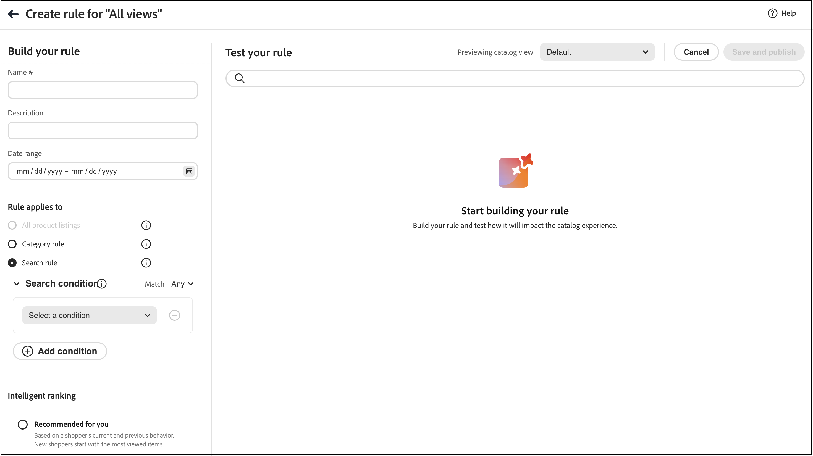

# Créer et gérer des règles

Pour créer une règle, ouvrez l’éditeur de règles, choisissez un **type de règle** (conditions de recherche, liste par défaut ou pages de catégorie), puis définissez les conditions et le classement là où ils s’appliquent, testez les résultats et publiez la règle.

## Créer une règle {#create-a-rule}

1. Dans le rail de gauche, accédez à _Marchandisage_ > **Règles de marchandisage**.
1. (Facultatif) Utilisez la liste déroulante **Vue du catalogue** pour sélectionner la vue du catalogue à laquelle la règle doit s’appliquer. La règle que vous créez est étendue à la vue sélectionnée (ou à toutes les vues de catalogue si **Toutes les vues** est sélectionné). Voir [Sélectionner la vue du catalogue](workspace.md#select-catalog-view) pour savoir comment fonctionne la portée de la vue du catalogue.

   >[!IMPORTANT]
   >
   >Les vues catalogue sont actuellement en version [bêta](https://experienceleague.adobe.com/fr/docs/commerce-operations/release/beta#merchandising-rules-globally-and-per-catalog-view-public-beta). Les participants de Beta devront recréer toutes les règles de marchandisage existantes pour tirer parti de la nouvelle portée d’affichage du catalogue.

1. Cliquez sur **[!UICONTROL Create rule]** pour lancer l’éditeur de règles.

### Types de règle

Chaque type de règle comporte une icône d’information dans l’éditeur, accompagnée d’une brève explication. Utilisez le type correspondant à l’endroit où les acheteurs doivent voir la logique de marchandisage :

| Type de règle | Objectif |
| --- | --- |
| **Règle Tous les produits** | Classement et marchandisage par défaut dans les listes de produits lorsqu’aucune règle de recherche ou de catégorie plus spécifique ne s’applique. Vous ne pouvez créer qu’une seule règle de ce type. Elle ne peut pas contenir de conditions. |
| **Règle de catégorie** (Beta) | Applique le marchandisage et le classement à une ou plusieurs catégories sélectionnées, en contrôlant l’ordre des produits sur ces pages de catégorie. |
| **Règle de recherche** | Applique le marchandisage et le classement lorsque les acheteurs exécutent une recherche correspondant aux conditions de requête de la règle. |

Dans la section **Créer votre règle**, définissez le nom de la règle, le planning, si la règle s&#39;applique à toutes les annonces ou à des conditions de recherche spécifiques, ainsi que les types de classement.

1. Dans le champ **[!UICONTROL Name]** , saisissez le nom de la règle. Tous les noms de règle doivent être uniques.
1. Dans le champ **[!UICONTROL Description]** , saisissez une description de la règle.
1. Dans le champ **[!UICONTROL Date range]** , indiquez la date ou la plage de dates à laquelle la règle doit être active.
1. Dans la section **[!UICONTROL Rule applies to]**, sélectionnez le [type de règle](#rule-types) que vous souhaitez utiliser.

>[!BEGINTABS]

>[!TAB Règle de recherche]

Une règle de recherche applique la logique de marchandisage et de classement lorsque les acheteurs effectuent une recherche correspondant aux conditions définies.

Les conditions sont les conditions requises pour déclencher un événement. Une règle peut contenir jusqu’à dix conditions et 25 événements. Une règle par défaut ne peut pas contenir de conditions.

**Condition unique**

1. Sous *Créer votre règle*, sélectionnez la **Condition** à remplir et suivez les instructions pour terminer l’instruction.

   - La requête de recherche contient : saisissez la chaîne de texte qui doit se trouver dans la requête de l’acheteur. Le paramètre Correspondance détermine le degré auquel la requête de l’acheteur correspond au catalogue. Options :   quelconque - Toute partie du texte de la requête de l’acheteur peut correspondre à la condition. Tous - Toutes les requêtes de l’acheteur doivent correspondre à la condition.
   - La requête de recherche est : saisissez une chaîne de texte qui correspond exactement à la requête de l’acheteur. Par exemple : « pantalon de yoga ». Les règles comportant des `Search query is` `All` et Correspondance ne peuvent comporter qu’une seule condition.
   - La requête de recherche commence par : saisissez un caractère ou une chaîne de texte qui doit se trouver au début de la requête de l’acheteur.
   - La requête de recherche se termine par - Saisissez un caractère ou une chaîne de texte qui doit se trouver à la fin de la requête de l’acheteur.

   Les résultats apparaissent immédiatement dans le volet *Tester votre règle* et sont numérotés par priorité. Vous pouvez utiliser le curseur *Résultats par ligne* en haut à droite pour modifier le nombre de produits dans chaque ligne.

1. Pour tester d’autres requêtes, modifiez le texte de la requête dans la zone de recherche *Tester votre règle* et appuyez sur **Retour**.
Au départ, le volet de test effectue le rendu de la requête à partir de la zone de recherche Conditions . Mais maintenant, il effectue le rendu de la requête à partir de la zone de requête test. Le volet de test effectue le rendu d’une seule requête à la fois.
1. Si le résultat vous convient, mettez à jour le texte dans la zone de recherche *Conditions*. Cliquez ensuite n’importe où sur la page pour mettre à jour les résultats dans le volet de test.
1. Définissez [Classement intelligent](#intelligent-ranking) et [Classement manuel](#manual-ranking) comme décrit dans les sections suivantes. Les mêmes commandes s’appliquent aux pages de catégorie, avec les différences signalées.

**Conditions multiples**

1. Pour créer une règle comportant plusieurs conditions, cliquez sur **Ajouter une condition**.
Une règle peut contenir jusqu’à dix conditions. L’opérateur logique qui joint deux conditions est basé sur le paramètre *Correspondance* actuel. Par défaut, *Correspondance* est `All` et l’opérateur logique est `AND`.

1. Sélectionnez la deuxième condition et saisissez le texte de requête requis.

1. Pour modifier la logique de la règle, modifiez le paramètre **Correspondance** afin de déterminer dans quelle mesure les critères de recherche de l’acheteur doivent correspondre à la condition de requête. Définissez **Correspondance** sur l’une des valeurs suivantes :

   - Any - (Par défaut) Tous les opérateurs logiques de la règle sont définis sur `OR` et les résultats apparaissent dans le volet de test.
   - Tous : tous les opérateurs logiques de la règle sont définis sur `AND` et les résultats apparaissent dans le volet de test.

   La valeur *Correspondance* détermine l’opérateur logique utilisé pour joindre plusieurs conditions. La modification du paramètre *Correspondance* modifie tous les opérateurs logiques de la règle. Il n’est pas possible de combiner `AND` et `OR` dans la même règle.

   Dans cet exemple, plutôt que de rechercher « pantalon de yoga », il existe deux requêtes distinctes qui recherchent « yoga » ou « pantalon ». Cette règle est moins spécifique et est déclenchée plus souvent dans le storefront que dans l’autre.

1. Pour ajouter une autre condition, cliquez sur **Ajouter une condition** et répétez le processus.
1. Définissez [Classement intelligent](#intelligent-ranking) et [Classement manuel](#manual-ranking) comme décrit dans les sections suivantes. Les mêmes commandes s’appliquent aux pages de catégorie, avec les différences signalées.

>[!TAB  Règle de catégorie ]

>[!IMPORTANT]
>
>Les règles de catégorie sont en version Beta.

Les règles de catégorie contrôlent la manière dont les produits sont triés sur les **pages de catégorie**. Vous combinez les **règles de catégorie** avec le **classement intelligent** (y compris les signaux pilotés par l’IA) et les **actions manuelles** telles que l’épinglage, l’amplification et l’enterrement, afin d’organiser la découverte, d’exécuter des promotions et d’aligner les pages de catégorie sur votre stratégie sans recourir à des outils externes.

1. Sous **Catégories**, sélectionnez la ou les catégories auxquelles la règle doit s’appliquer. Les catégories sélectionnées s’affichent sous le contrôle afin que vous puissiez confirmer la portée.
1. Dans la liste des catégories qui s’affichent, vous pouvez cliquer sur les trois points et sélectionner pour :

   - **Supprimer** - Supprime la catégorie de la règle.
   - **Appliquer aux sous-catégories** - Applique la règle aux sous-catégories pour lesquelles aucune règle de marchandisage active n’est définie.
   - **Aperçu** - Affiche l’aspect de la page de catégorie sur votre storefront.

1. Définissez [Classement intelligent](#intelligent-ranking) et [Classement manuel](#manual-ranking) comme décrit dans les sections suivantes. Les mêmes contrôles s’appliquent aux règles de recherche, les différences étant signalées.

>[!ENDTABS]

### Classement intelligent {#intelligent-ranking}

Le classement intelligent classe les produits en utilisant des **signaux comportementaux** et, le cas échéant, l’IA. Elle s’applique à **règles de recherche**, **toutes les listes de produits** (règles par défaut) et **règles de catégorie** (pages de catégorie). Pour les achats **recherches**, le classement pèse également **pertinence textuelle** dans la requête ; **pages de catégories** n’utilisent pas le texte de la requête de la même manière ; l’éditeur se concentre sur les stratégies comportementales.

Les propriétaires de magasin peuvent définir des stratégies telles que les suivantes. Les libellés exacts et les fenêtres temporelles correspondent à l’éditeur de règles et peuvent différer légèrement en fonction du type de règle.

- **Les plus achetés** / **Les plus achetés** — Classe par fréquence d’achat par SKU dans une fenêtre récente (par exemple, les 7 jours précédents pour les contextes de recherche).
- **Les plus ajoutés au panier** — Classe par activité totale d’ajout au panier dans une fenêtre récente (par exemple, les 7 jours précédents pour les contextes de recherche).
- **Les plus consultés** : classe les vues par SKU dans une fenêtre récente (par exemple, les 7 jours précédents pour les contextes de recherche).
- **Recommandé pour vous** — Utilise le signal `viewed-viewed` : les acheteurs qui ont consulté ce SKU ont également consulté d’autres SKU ; prend en charge la commande personnalisée sur les pages de catégorie, le cas échéant.
- **Tendance** — Met en évidence la popularité récente (pour la recherche, les pages vues au cours des dernières 72 heures pour les événements en arrière-plan et 24 heures pour les événements de premier plan).
- **Aucun** — Pour les listes de recherche et les listes par défaut, les produits sont classés par **pertinence**. Pour **règles de catégorie**, utilise l&#39;ordre de marchandisage par défaut de la catégorie lorsque vous ne choisissez pas une autre stratégie intelligente.

Sélectionnez la stratégie de votre règle. Le volet **Tester votre règle** affiche les résultats attendus pour les règles orientées recherche ; **règles de catégorie** utilisez la prévisualisation de catégorie.

#### Fonctionnement de la notation intelligente (recherche)

Pour **résultats de recherche** (et la requête de test dans l’éditeur de règles), le classement intelligent détermine l’ordre final du produit en combinant deux facteurs clés : **pertinence textuelle** et **signaux comportementaux**. Comprendre l’interaction de ces facteurs vous permet de définir des attentes réalistes pour vos résultats de recherche.

**Composants de notation :**

- **Pertinence textuelle** : le facteur dominant dans la notation. Cela permet de mesurer la correspondance entre le nom, la description et les attributs d’un produit et la requête de recherche. Le score de pertinence du texte est illimité (il n’a pas de limite supérieure spécifique) et est influencé par des facteurs tels que :

   - Fréquence d&#39;occurrence des mots correspondants.
   - Longueur (en mots) des noms/descriptions des produits.

- **Signaux comportementaux** : un coup de pouce limité est appliqué en plus du score de pertinence du texte. Lorsque vous sélectionnez une stratégie de classement intelligente telle que « Les plus consultés » ou « Les plus achetés », les produits présentant des signaux comportementaux plus élevés bénéficient d’une amélioration fixe de leurs scores. Cependant, ce coup de pouce a une limite définie.

**Pourquoi le produit le plus consulté peut ne pas apparaître en premier :**

La pertinence textuelle domine généralement le classement parce que son score est illimité, alors que les encouragements comportementaux sont fixes. Par conséquent, les produits dotés de correspondances textuelles solides l’emportent souvent sur ceux présentant des signaux d’engagement plus élevés. Les stimuli comportementaux seuls peuvent ne pas compenser les larges écarts de pertinence du texte. Le classement intelligent résout ce problème en tenant compte à la fois de la qualité des correspondances et de l’interaction client, ce qui améliore la pertinence globale. Cependant, la qualité de la correspondance de texte reste le principal moteur du classement.

**Exemple:**

Un commerçant utilise la stratégie de classement intelligente « Les plus consultés » et recherche « bougie ». Ils s’attendent à ce que le SKU de produit YAN-K-E-512 apparaisse en haut des résultats, car il possède le nombre de vues le plus élevé. Cependant, d’autres produits se classent plus haut :

- **Texas Candle** (1ère position) : a un nom de produit plus court et plus propre qui crée un score de pertinence du texte très élevé. Même s&#39;il a moins de vues que YAN-K-E-512, sa correspondance de texte supérieure l&#39;emporte sur l&#39;amplification comportementale.

- **YAN-K-E-512** (position inférieure) : bien que disposant du centile de vue le plus élevé dans les données comportementales « Les plus consultés », son nom complexe basé sur un SKU génère un score de pertinence du texte inférieur. L’augmentation fixe des comportements ne suffit pas à combler ce fossé de pertinence du texte.

Consultez [règles de recherche](./best-practice.md#tips-to-optimize-search-rules) pour savoir comment améliorer la recherche de produit à l’aide de règles.

#### Avertissements

- Les apostrophes et les guillemets dans les requêtes peuvent entraîner des problèmes mineurs de classement et de pertinence dans certaines langues.
- Pour garantir le bon fonctionnement du classement intelligent pour la **recherche**, assurez-vous que le **Poids de la recherche** de tous les attributs utilisés pour la recherche ou le filtrage (facettes) est `5` ou inférieur. (Ces conseils s’appliquent à l’indexation de la recherche et non aux flux de marchandisage de catégorie uniquement.)

Pour plus d’informations sur la définition des poids de recherche, voir [API de métadonnées](https://developer.adobe.com/commerce/services/reference/rest/).

### Classement manuel {#manual-ranking}

**Classement manuel** les événements ajustent l’ordre des produits pour les **résultats de recherche** (lorsque les conditions de votre règle sont remplies), pour les **listes de produits par défaut** et pour les listes **page de catégorie**. Une seule règle peut contenir jusqu’à 25 événements.

- **Booster** : permet de placer un produit plus haut dans la liste.
- **Bury** — Déplace un SKU plus bas dans la liste.
- **Épingler un produit** — Fixe un produit à l&#39;emplacement sélectionné dans la liste.
- **Masquer un produit** — Exclut un SKU des résultats (orienté recherche ; confirmer le comportement pour les règles de catégorie dans l’éditeur).

Le moyen le plus simple d’épingler un produit est de le faire glisser et de le déposer.

1. Cliquez sur un produit et faites-le glisser dans le volet Test. Faites-la glisser et déposez-la à l’emplacement souhaité. Les champs Produit et Position sont automatiquement renseignés dans le volet Événements.

Vous pouvez également cliquer sur l’icône d’épingle pour épingler un produit à son emplacement actuel. Utilisez le menu contextuel représentant des points de suspension pour effectuer l’opération « Épingler en haut » ou « Épingler en bas ».

>[!NOTE]
>
>**Règles de recherche** — Vous pouvez uniquement épingler les produits qui apparaissent dans les résultats de recherche pour les conditions de requête et de règle configurées. Les produits doivent être indexés, visibles, en stock et respecter tous les filtres de règle pour pouvoir être épinglés. Si un produit n’apparaît pas dans l’aperçu ou dans les résultats de votre règle, l’épinglage n’a aucun effet.
>
>**Tri par défaut** — Les positions manuelles s’appliquent lorsque l’acheteur utilise le tri par défaut : **Trier par : le plus pertinent** pour la recherche, ou **pertinence** / **position** pour les listes de catégories. Si l’acheteur change de tri, par exemple le comportement par nom, épinglé, amplifié, enterré ou masqué peut ne plus correspondre à l’aperçu.

Les événements ou peuvent être définis manuellement :

1. Sous *Événements*, sélectionnez l’événement **Événement** qui doit avoir lieu une fois les conditions associées remplies.

   Par exemple, choisissez `Hide a product`. Saisissez ensuite le nom du produit à masquer. Des produits sont suggérés lors de la saisie.

1. Pour plusieurs événements, choisissez tous les autres événements que vous souhaitez déclencher lorsque les conditions sont remplies.

### Finalisation de la règle {#finalizing-the-rule}

1. Examinez les résultats de la règle dans le volet de test.
1. Si la règle comporte plusieurs requêtes, testez chacune d’elles qui peut être affectée par la règle.
1. Une fois l’opération terminée, cliquez sur **Enregistrer et publier**.

   La règle est ajoutée à la liste dans l’espace de travail *Règles*.

1. Bien que les règles actives prennent immédiatement effet, vous devrez peut-être attendre jusqu’à 15 minutes pour que les résultats de la requête mise en cache dans le storefront soient actualisés.

>[!NOTE]
>
>Les règles et les produits classés manuellement sont appliqués aux résultats de **recherche** lorsque l’ordre de tri par défaut, « Trier par : les plus pertinents », est sélectionné. Si un acheteur modifie l’ordre de tri comme trier par nom, les règles et les classements manuels ne sont plus en vigueur. Pour les listes **category**, le comportement de tri par défaut est décrit dans la section [Classement manuel](#manual-ranking).

## Modifier, afficher et supprimer des règles {#edit-view-and-delete-rules}

Suivez ces instructions pour mettre à jour les propriétés des règles existantes. Vous ne pouvez pas modifier la vue de catalogue (portée) d’une règle après sa création ; la portée est définie lorsque vous créez la règle. Voir [Sélectionner la vue du catalogue](workspace.md#select-catalog-view).

### Modifier la règle

1. Dans l’espace de travail *Règles de marchandisage*, recherchez la règle de la grille à modifier, puis cliquez sur les options **Plus** (...).
1. Cliquez sur **Modifier** pour accéder à l’éditeur de règles.
1. Mettez à jour les conditions, les opérateurs et les événements selon les besoins.
1. Mettez à jour le nom, la date de début et de fin, ainsi que les champs de description selon les besoins. Tous les noms de règle doivent être uniques.
1. Testez la règle.
1. Publiez les modifications.
La règle est ajoutée à la liste dans l’espace de travail *Règles*. Bien que les règles actives entrent en vigueur immédiatement, l’actualisation des résultats des requêtes mises en cache dans le storefront peut prendre jusqu’à 15 minutes.

### Afficher les détails

Cette option permet d’afficher rapidement tous les paramètres de la règle, tout en restant dans le tableau *Règles*.

1. Dans l’espace de travail *Règles de marchandisage*, recherchez la règle de la grille à modifier, puis cliquez sur les options **Plus** (...).
1. Cliquez sur **Afficher les détails** pour afficher les paramètres de la règle.
1. Choisissez **Modifier** ou **Supprimer**, ou cliquez sur le X pour fermer le panneau.

### Supprimer la règle

1. Dans l’espace de travail *Règles*, recherchez la règle de la grille à modifier, puis cliquez sur les options **Plus** (...).
1. Cliquez sur **Supprimer**.

## Descriptions des champs {#field-descriptions}

### Conditions (le cas échéant)

| Condition | Description |
|--- |--- |
| La requête de recherche contient | Caractère ou chaîne de texte inclus dans la requête de l’acheteur. La requête de l’acheteur ne doit correspondre qu’à un seul caractère pour remplir cette condition. |
| La requête de recherche est | Caractère ou chaîne de texte correspondant exactement à la requête de l’acheteur. Les requêtes complexes avec plusieurs conditions ne peuvent pas être composées lorsque cette condition est utilisée. |
| La requête de recherche commence par | La requête de l’acheteur commence par ce caractère ou cette chaîne de texte. |
| La requête de recherche se termine par | La requête de l’acheteur se termine par ce caractère ou cette chaîne de texte. |

### Opérateurs logiques

| Opérateur | Description |
|--- |--- |
| SOIT | (Par défaut) L’opérateur logique `OR` compare deux conditions et répond aux exigences pour déclencher un événement si au moins une condition est vraie. |
| ET | L’opérateur logique compare `AND` deux conditions et satisfait aux exigences pour déclencher un événement si les deux conditions sont vraies. |

### Faire correspondre les opérateurs

| Opérateur | Description |
|--- |--- |
| N’importe lequel | Remplace tous les opérateurs logiques de la règle par `OR` et renvoie l’ensemble des produits correspondants. |
| Tous | Remplace tous les opérateurs logiques de la règle par `AND` et renvoie l’ensemble des produits correspondants. |

### Événements de classement manuels

| Événement | Description |
|--- |--- |
| Amplifier | Déplace un SKU ou une plage de SKU vers le haut dans la liste (recherche ou catégorie). Chaque est marqué d’un badge d’aperçu « boosté » dans les résultats du test. |
| Enterrer | Déplace un SKU ou une plage de SKU plus bas dans la liste. Chaque est marqué d’un badge d’aperçu « enterré » dans les résultats du test. |
| Épingler un produit | Associe un seul SKU à une position spécifique dans la liste. Le produit est marqué d’un badge d’aperçu « épinglé » dans les résultats du test. |
| Masquer un produit | Exclut un SKU, ou une plage de SKU, des résultats (orienté recherche ; confirmer pour les règles de catégorie dans l’éditeur). |

### Détails

| Champ | Description |
|--- |--- |
| Nom | Nom de la règle. Les noms des règles doivent être uniques. |
| Type de règle | **Par défaut** (toutes les listes de produits), **Requête** (conditions de recherche spécifiques) ou **Catégorie** (pages de catégorie), selon **La règle s’applique à**. |
| Date de début | Date de début de la règle, le cas échéant. |
| Date de fin | Date de fin de la règle, le cas échéant. |
| Description | Brève description de la règle. |
