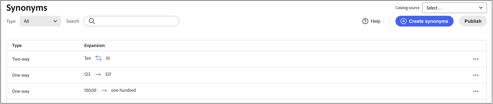
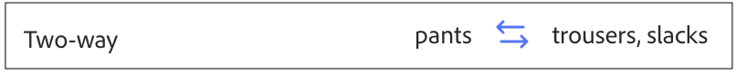
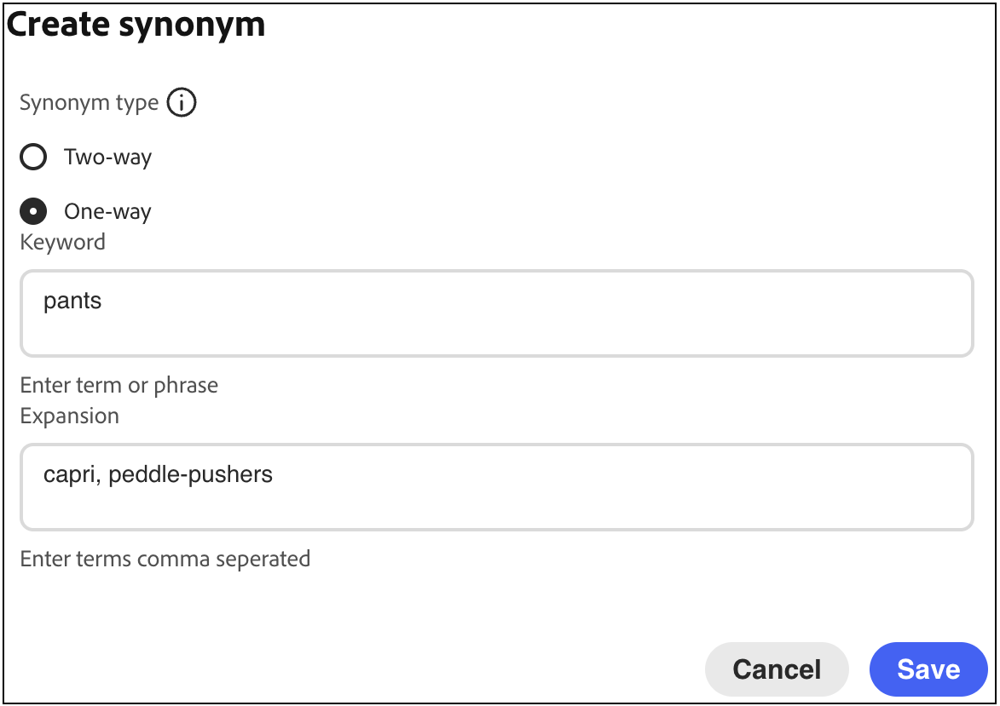
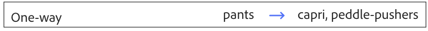

# Créer des synonymes

Améliorez l’engagement des clients en ajoutant votre propre liste de synonymes [!DNL Adobe Commerce Optimizer]. Vous pouvez ajouter jusqu’à 200 synonymes par source de catalogue.

## Étape 1 : ajouter un synonyme

1. Dans le rail de gauche, accédez à _Marchandisage_ > **Synonymes**.
1. Cliquez sur le bouton **[!UICONTROL Create synonyms]** .

## Étape 2 : définir le synonyme par type

Suivez les instructions relatives au [type de synonyme](type.md) que vous souhaitez créer.

### Synonyme bidirectionnel

1. Saisissez le terme ou l’expression **Mot-clé** à faire correspondre.
1. Saisissez le ou les termes **Expansion** que vous souhaitez ajouter comme synonymes du mot-clé. Séparez les différents termes par une virgule.
Dans cet exemple, le mot-clé à associer est « pantalon » et l’ensemble des termes d’extension est « pantalon, pantalon ».

   

1. Une fois l’opération terminée, cliquez sur **Enregistrer**.

   L’ensemble des synonymes apparaît dans la liste avec une flèche bidirectionnelle entre chaque terme, ce qui signifie que les termes sont interchangeables.

   

### Synonyme unidirectionnel

1. Cliquez sur le type de synonyme **Unidirectionnel**.

1. Saisissez les termes **Mot-clé** et **Expansion**. Séparez les différents termes par une virgule.

   

   Dans cet exemple, le mot-clé est « pantalon » et les termes d’extension unidirectionnels « capris, peddle-pushers » sont chacun un sous-ensemble de « pantalon », mais avec une signification spécifique.

1. Une fois l’opération terminée, cliquez sur **Enregistrer**.

   L’ensemble de synonymes apparaît dans la liste avec une flèche à sens unique pointant des termes d’extension vers le mot-clé pour indiquer que les termes sont des sous-ensembles du mot-clé. Un signe plus sépare chaque terme de développement.

   

## Étape 3 : Publier les modifications

1. Une fois vos synonymes terminés, cliquez sur **Publier**.
1. Patientez jusqu’à deux heures pour que vos mises à jour soient disponibles dans le storefront.

## Descriptions des champs

| Champ | Description |
|--- |--- |
| [Type ](type.md) | Détermine si les synonymes ont la même signification que le mot-clé ou s’ils sont un sous-ensemble du mot-clé. Options :  Bidirectionnel (par défaut) - Termes ayant la même signification que le mot-clé et renvoyant les mêmes résultats de recherche Unidirectionnel - Termes qui sont un sous-ensemble du mot-clé. Les synonymes à sens unique renvoient une liste plus étroite de produits spécifiques. |
| Mot-clé | Mot généralement associé à une sélection de produits dans votre catalogue. |
| Extension | Termes supplémentaires ayant la même signification ou une signification similaire au mot-clé. |

## Gestion des synonymes

Suivez ces instructions pour gérer les [!DNL Adobe Commerce Optimizer] existants [synonymes](overview.md).

## Rechercher le synonyme

Pour faciliter la recherche d’un synonyme, vous pouvez filtrer la liste par type et effectuer une recherche par mot-clé ou terme d’extension. Ces méthodes peuvent être utilisées individuellement ou conjointement.

1. Pour filtrer la liste, définissez **Type** sur l’une des options suivantes :

   - Tous
   - Unidirectionnel
   - Bidirectionnel

1. Pour rechercher un mot-clé ou un terme de développement, saisissez au moins trois caractères dans la zone de **[!UICONTROL Search]**.

## Modifier le synonyme

1. Recherchez le synonyme à modifier, puis cliquez sur **Plus** (...) options.

1. Cliquez sur **Modifier**.
Le mot-clé est le premier terme de la liste et chaque terme est séparé par une virgule. Le mot-clé et les termes d’extension peuvent être mis à jour, mais le type du synonyme ne peut pas être modifié.
1. Cliquez sur l’élément à modifier. Mettez ensuite à jour le texte selon vos besoins.

1. Une fois l’opération terminée, cliquez sur **Enregistrer**.

## Supprimer le synonyme

1. Recherchez le synonyme à supprimer dans la liste, puis cliquez sur **Plus** (...) options.
1. Cliquez sur **Supprimer**.
1. Lorsque vous y êtes invité, cliquez sur **Supprimer le synonyme** pour confirmer.

## Publier les modifications

Pour terminer le processus, vos modifications enregistrées doivent être publiées sur le storefront. L’activation des mises à jour peut prendre jusqu’à deux heures.

1. Cliquez sur **Publier**.
1. Recherchez le message en haut de la page qui confirme que vos modifications ont été publiées.
