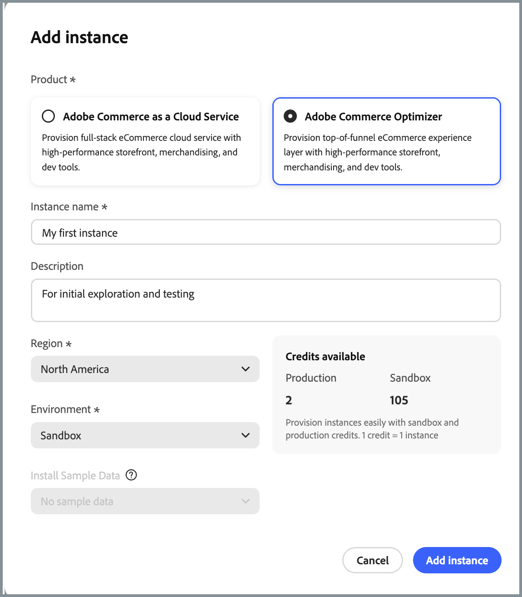

# Notes de mise à jour

Les notes de mise à jour suivantes contiennent des mises à jour de [!DNL Adobe Commerce Optimizer].

## Août 2025

**Date de publication** : 28 août 2025

>[!BEGINSHADEBOX]

### Région de l’UE désormais disponible

La prise en charge de la Région de l’Union européenne (eu1) pour les organisations IMS clientes est désormais disponible. Vous pouvez désormais sélectionner **Union européenne** en tant que **Région** lors de l’[ajout d’une instance Commerce Optimizer](./get-started.md#step-1-create-an-instance) dans le Cloud Manager. La région de l’Union européenne n’est disponible que pour les environnements de production.

Les URL de production de base pour la région de l’Union européenne sont les suivantes :

* Administrateur : `https://eu1.admin.commerce.adobe.com`
* REST et GraphQL : `https://eu1.api.commerce.adobe.com`

{width="600" align="center" zoomable="yes"}

>[!ENDSHADEBOX]
