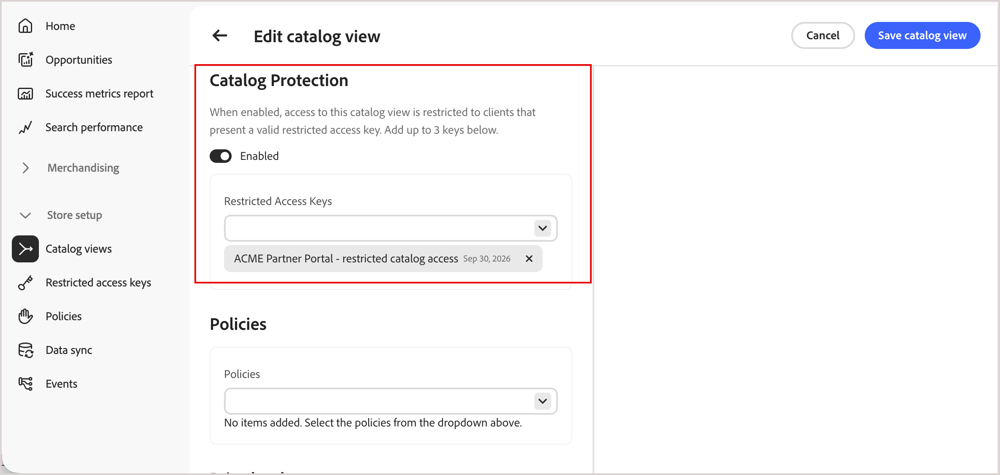

# Vues de catalogue privé

Par défaut, une [vue de catalogue](catalog-view.md) est publique. Activez la protection du catalogue sur une vue de catalogue pour restreindre l’accès aux requêtes qui incluent un jeton signé valide.

La protection du catalogue s’applique uniquement à la vue de catalogue sélectionnée. Cela ne modifie pas les politiques, les calques ou les livres de prix de la vue.

Consultez les [Cas d’utilisation de clés d’accès limité](restricted-access-keys.md#restricted-access-key-use-cases) pour obtenir des exemples de protection d’une vue de catalogue.

## Comprendre le périmètre de protection

La protection du catalogue s’applique uniquement à la vue du catalogue dans laquelle elle est activée. Il protège les demandes de catalogue et de recherche, mais ne modifie pas les politiques ou les répertoires de prix de la vue, protège d’autres vues de catalogue ou sécurise les opérations de panier, de passage en caisse ou de commande.

Le serveur principal de commerce connecté doit appliquer indépendamment l’éligibilité d’achat.

## Protection d’une vue de catalogue

Avant de commencer, [créez une clé d’accès restreint](restricted-access-keys.md) à partir de la clé publique générée par votre application cliente.

1. Dans la vue Catalogue, créez ou modifiez le formulaire, **[!UICONTROL Catalog Protection]** à **[!UICONTROL Enabled]**.

1. Sous **[!UICONTROL Restricted Access Keys]**, sélectionnez jusqu’à trois [clés d’accès restreintes](restricted-access-keys.md) à affecter à cette vue de catalogue.

   {width="70%" zoomable="yes"}

1. Cliquez sur **[!UICONTROL Save catalog view]**.

   La vue Catalogue est maintenant protégée. Seules les requêtes portant un jeton signé valide d’une clé attribuée peuvent récupérer ses données.

   >[!NOTE]
   >
   >Patientez jusqu’à cinq minutes pour que les modifications apportées à la configuration de la protection du catalogue prennent effet.

## Vérifier que l’accès est appliqué

Pour confirmer qu’une vue de catalogue privé rejette les requêtes non autorisées, appelez son point d’entrée [&#128279;](../get-started.md#get-instance-details) avec ou sans jeton signé, à l’aide des en-têtes suivants :

| En-tête | Objectif |
| --- | --- |
| `AC-View-ID` | Vue du catalogue à interroger. |
| `AC-Price-Book-ID` | Le catalogue des prix à appliquer. |
| `AC-Catalog-View-Access-Token` | JWT signé prouvant l’autorisation pour la vue de catalogue. |

Une requête sans jeton valide renvoie une erreur GraphQL au lieu des données de catalogue, par exemple :

```json
{
  "errors": [
    {
      "message": "Access key validation failed: Missing token",
      "extensions": { "x-commerce-exception": "access-key-invalid" }
    }
  ]
}
```

Une requête portant un jeton signé par une clé attribuée non expirée renvoie les données du catalogue comme prévu. Pour plus d’informations sur la signature d’un jeton JWT et l’appel de l’API de marchandisage, consultez la [documentation destinée aux développeurs](https://developer.adobe.com/commerce/services/optimizer/merchandising-services/using-the-api#authentication).

## Gestion des clés d’accès restreintes

Si [!UICONTROL Catalog Protection] est activé et que toutes les clés affectées expirent, la vue de catalogue devient inaccessible ; les storefronts qui reposent sur cette vue de catalogue ne peuvent pas servir de données à partir de celle-ci. Attribuez une nouvelle clé non expirée pour restaurer l’accès. Pour obtenir des instructions, voir [Rotation des clés](restricted-access-keys.md#rotate-a-key).

>[!IMPORTANT]
>
>La création et la gestion automatiques des clés via Adobe Commerce et le connecteur Adobe Commerce Optimizer ne sont pas encore disponibles.

## Plus comme ceci

- [Vues catalogue](catalog-view.md) : découvrez comment les vues catalogue organisent votre catalogue de produits en fonction de la structure de l&#39;entreprise, des politiques et des prix.
- [Clés d&#39;accès restreint](restricted-access-keys.md) : créez, attribuez et faites pivoter les clés utilisées pour signer les jetons pour la protection du catalogue.
