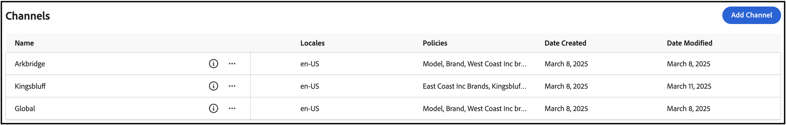

# Cas d’utilisation complet de Storefront et de Catalog Administrator

Ce cas d’utilisation est basé sur un conglomérat automobile fictif appelé Carvelo Automobile, qui possède une configuration opérationnelle complexe. Il explique comment utiliser [!DNL Adobe Commerce Optimizer] pour gérer un catalogue qui prend en charge plusieurs marques, concessionnaires et tarifs, tout en offrant une expérience de storefront personnalisée.

## Conditions préalables

Ce cas pratique est destiné aux administrateurs et aux développeurs qui souhaitent apprendre à configurer un storefront et à gérer un catalogue à l’aide de [!DNL Adobe Commerce Optimizer]. Cela suppose que vous ayez une compréhension de base de [!DNL Adobe Commerce Optimizer] et de ses fonctionnalités.

**Temps estimé pour terminer :** 45-60 minutes

### Configuration requise

Avant de commencer ce tutoriel, assurez-vous que les conditions préalables suivantes sont en place :

- **Instance Adobe Commerce Optimizer**
   - Accès à une instance de test dans Cloud Manager
   - Voir [Prise en main](../get-started.md) pour obtenir des instructions de configuration

- **Autorisations utilisateur**
   - Accès des administrateurs à Adobe Admin Console
   - Voir [User Management](../user-management.md) pour la configuration des comptes
   - Si vous n’y avez pas accès, contactez votre représentant de compte Adobe ou remplissez le formulaire [ Programme d’accès anticipé ](https://experienceleague.adobe.com/go/aco-early-access-program)

- **Données d’exemple**
   - Données du catalogue Carvelo Automobile chargées dans votre instance
   - Suivez les instructions du [Référentiel d’ingestion de données de catalogue d’exemples](https://github.com/adobe-commerce/aco-sample-catalog-data-ingestion)
   - Vous pouvez supprimer des données d’exemple une fois l’opération terminée à l’aide du script `reset.js` inclus

- **Environnement Storefront**
   - Environnement de développement local avec Node.js.
   - Projet standard Storefront cloné et configuré
   - Voir [Configuration de Storefront](../storefront.md) pour obtenir des instructions détaillées

## Commençons

Dans ce cas d’utilisation, vous utiliserez les éléments suivants :

1. Interface utilisateur de [!DNL Adobe Commerce Optimizer] - Configurez des vues et des politiques de catalogue pour gérer la configuration opérationnelle complexe du catalogue pour le cas d’utilisation de Carvelo.

1. Storefront Commerce : effectuez le rendu du storefront à l’aide des exemples de données de catalogue chargées dans votre instance [!DNL Adobe Commerce Optimizer] et des fichiers de configuration, `fstab.yaml` et `config.json` du storefront Commerce.

>[!NOTE]
>
> Découvrez les fichiers de configuration de storefront en consultant la rubrique [Explorer le standard](https://experienceleague.adobe.com/developer/commerce/storefront/get-started/boilerplate-project/?lang=fr) dans la documentation du storefront Adobe Commerce.

### ‌Principaux points à retenir

À la fin de cet article, vous pourrez :

- Découvrez les principes de base de [!DNL Adobe Commerce Optimizer] avec son modèle de données de catalogue performant et évolutif.
- Découvrez comment le modèle de données de catalogue s’intègre aux composants storefront indépendants de la plateforme créés par Adobe.
- Découvrez comment utiliser les vues et politiques de catalogue Adobe Commerce Optimizer pour créer des vues de catalogue personnalisées et des filtres d’accès aux données, et envoyer les données à un storefront Adobe Commerce optimisé par Edge Delivery.

## Scénario d&#39;affaires - Carvelo Automobile

Carvelo Automobile est un conglomérat automobile fictif avec une configuration opérationnelle complexe.


Dans ce diagramme, vous voyez que Carvelo vend des produits automobiles de trois marques. Chaque marque est une entreprise enfant différente :

- Aurora (véhicules électriques)
- Boulon (SUV)
- Cruz (hybride)

Elle vend ces marques par l&#39;intermédiaire de trois concessionnaires :

- Arkbridge
- Kingsbluff
- Celport

Ces concessionnaires appartiennent à deux sociétés mères différentes :

- West Coast Inc. (Arkbridge) (en anglais seulement)
- East Coast Inc. (Kingsbluff, Celport)

Chaque société possède deux registres des prix utilisés pour vendre des produits à un prix spécifique pour différents acheteurs (base, VIP).

- `west_coast_inc` et `vip_west_coast_inc`
- `east_coast_inc` et `vip_east_coast_inc`

Comme vous pouvez le constater, il s’agit d’un cas d’utilisation commerciale très complexe. Avec [!DNL Adobe Commerce Optimizer], un commerçant peut prendre en charge une structure commerciale complexe à l’aide d’un catalogue de base unique pour syndiquer les données sans duplication de catalogue, adapter les tarifs (tarifs de plus de 30 000) et diffuser toutes ces données sur un storefront Edge Delivery Services.

Maintenant que vous disposez d’un aperçu du cas d’utilisation professionnel, voici votre objectif tout au long de ce tutoriel :

>[!BEGINSHADEBOX]

Carvelo souhaite vendre des pièces de ses trois marques (Aurora, Bolt et Cruz) par l&#39;intermédiaire des différents concessionnaires (Arkbridge, Kingsbluff et Celport). Carvelo veut s&#39;assurer que les concessionnaires n&#39;ont accès qu&#39;aux pièces et aux prix corrects conformément à leurs accords de licence respectifs.

En fin de compte, Carvelo a deux objectifs principaux :

1. Tenez à jour un site web « mondial », qui comporte tous les SKU des trois marques.
1. Offrez aux concessionnaires un moyen de créer leurs propres vitrines en fonction de la visibilité et des prix uniques des SKU pour chaque SKU de chaque concessionnaire. Le tout lors de l’utilisation d’un seul catalogue de base, ce qui élimine la duplication de catalogue.

>[!ENDSHADEBOX]

## &#x200B;1. Accéder à l’instance de [!DNL Adobe Commerce Optimizer]

Accédez à l’URL de l’application Commerce Optimizer préconfigurée avec les données d’exemple. Vous pouvez rechercher l’URL dans le gestionnaire Commerce Cloud à partir des détails de l’instance pour votre projet Commerce Optimizer ou l’obtenir auprès de votre administrateur système. (Voir [Accès à une instance](../get-started.md#access-an-instance).)

Lorsque vous lancez [!DNL Adobe Commerce Optimizer], les éléments suivants s’affichent :

![[!DNL Adobe Commerce Optimizer] UI](../assets/user-interface.png)

>[!NOTE]
>
>Consultez l’article [présentation](../overview.md) pour en savoir plus sur les composants clés de [!DNL Adobe Commerce Optimizer]’interface utilisateur.

Dans le volet de navigation de gauche, développez la section _Configuration du magasin_ et cliquez sur **[!UICONTROL Catalog views]**. Notez que les concessionnaires Arkbridge et Kingsbluff ont déjà créé des vues de catalogue :



>[!NOTE]
>
>Pour l’instant, vous pouvez ignorer la vue catalogue **globale**.

Cliquez sur l’icône d’informations pour consulter les détails de la vue du catalogue.

Les politiques d’Arkbridge sont les suivantes :

- Marque
- Modèle
- Marques de West Coast Inc
- Catégories de pièces Arkbridge

Kingsbluff a les politiques suivantes :

- Marque
- Modèle
- Marques de East Coast Inc
- Catégories de pièces Kingsbluff

Dans la section suivante, vous allez créer une vue de catalogue et des politiques pour le concessionnaire Celport.

## &#x200B;2. Créer une vue de politique et de catalogue

Le directeur du commerce de Carvelo doit mettre en place une nouvelle vitrine pour un concessionnaire appelé *Celport* qui appartient à la société *East Coast Inc*. Celport commercialisera des freins et des suspensions pour les marques Bolt et Cruz.


À l’aide de [!DNL Adobe Commerce Optimizer], le gestionnaire de commerce :

1. Créez une nouvelle politique appelée *Catégories de pièces Celport* pour que Celport vende uniquement des pièces de frein et de suspension.
1. Créez une vue de catalogue pour le storefront Celport.

   Cette vue de catalogue utilise votre nouvelle politique *catégories de pièces Celport* et les marques existantes *East Coast Inc* pour vous assurer que Celport ne peut vendre que les marques Bolt et Cruz dans le cadre de l&#39;accord avec East Coast Inc. La vue de catalogue Celport utilisera le catalogue `east_coast_inc` pour prendre en charge les barèmes de prix de produits conformes aux accords de licence de la marque.
1. Mettez à jour la configuration du storefront Commerce pour utiliser les données de la vue de catalogue Celport que vous avez créée.

À la fin de cette section, Celport sera opérationnel et prêt à vendre les produits de Carvelo.

### Créer une politique

Créons une nouvelle politique appelée *Catégories de pièces Celport* pour filtrer les SKU que le concessionnaire Celport vend, qui incluent les pièces de frein et de suspension.

1. Dans le rail de gauche, développez la section _Configuration du magasin_ et cliquez sur **[!UICONTROL Policies]**.

1. Cliquez sur **[!UICONTROL Create Policy]**.

   Une nouvelle page s’affiche pour ajouter les détails de la politique.

1. Ajoutez les détails requis :

   **Nom** = *Catégories de pièces Celport*

1. Cliquez sur **[!UICONTROL Add Filter]**.

   Une boîte de dialogue s’affiche pour ajouter des détails de filtre.

1. Ajoutez les détails du filtre :

   - **Attribute** = *part_category*
   - **Opérateur** = **IN**
   - **Valeur Source** = **STATIC**
   - **Valeur** = *freins*, *suspension*

   >[!IMPORTANT]
   >
   >Assurez-vous que le nom d’attribut que vous spécifiez correspond exactement au nom d’attribut de SKU dans le catalogue.

   Pour en savoir plus sur la différence entre une source de valeurs STATIQUE et TRIGGER, voir [types de sources de valeurs](../setup/policies.md#value-source-types).

1. Dans la boîte de dialogue **[!UICONTROL Filter details]**, cliquez sur **[!UICONTROL Save]**.

1. Pour activer le filtre que vous venez de créer, cliquez sur les points d’action (...) et sélectionnez **Activer**.

1. Cliquez sur **[!UICONTROL Save]**.

   >[!NOTE]
   >
   >Si le bouton **[!UICONTROL Save]** n’est pas actif (bleu), il se peut que le nom de la politique vous manque. Cliquez sur l’icône en forme de crayon en regard de *Nouvelle politique* pour l’ajouter.

1. Revenez à la liste des politiques en cliquant sur la flèche Précédent.

   Votre nouvelle stratégie *Celport part categories* apparaît dans la liste.

**Pour vérifier que cette étape a été correctement effectuée :**

- La politique apparaît dans la liste des politiques
- Le statut de la politique s’affiche comme étant activé (indicateur vert)
- Les détails du filtre indiquent « part_category IN (freins, suspension) »
- Le nom de la stratégie est « Couvrir les catégories de pièces »

### Création d’une vue de catalogue

Créez une nouvelle vue de catalogue pour le concessionnaire *Celport* et liez les politiques suivantes : *marques East Coast Inc* et *Catégories de pièces Celport*.

1. Dans le rail de gauche, développez la section _Configuration du magasin_ et cliquez sur **[!UICONTROL Catalog views]**.

   Notez les vues de catalogue existantes : *Arkbridge*, *Kingsbluff* et *Global*.

   

1. Cliquez sur **[!UICONTROL Add catalog view]**.

1. Renseignez les détails de la vue Catalogue :

   - **Name** = *Celport*
   - **Sources de catalogue** = *fr-FR* (appuyez sur Entrée)
   - **Politiques** (liste déroulante d’utilisation) = *Marques East Coast Inc*; *Catégories de pièces Celport*; *Marque*; *Modèle*                          
1. Cliquez sur **[!UICONTROL Add]** pour créer la vue de catalogue.

   La page Vues du catalogue se met à jour pour afficher la nouvelle vue du catalogue.

   

   >[!NOTE]
   >
   >Si le bouton **[!UICONTROL Add]** n’est pas bleu, assurez-vous que la source du catalogue est sélectionnée en plaçant le curseur dans la section **[!UICONTROL Catalog sources]** et en appuyant sur **Entrée**.

1. Obtenez l’identifiant de vue du catalogue Celport.

   Cliquez sur l’icône d’informations correspondant à la vue Catalogue Celport sur la page **Vues Catalogue**.

   

   Copiez et enregistrez l’ID de vue de catalogue. Vous avez besoin de cet identifiant lorsque vous mettez à jour la configuration du storefront pour fournir des données à votre nouveau catalogue Celport.

   **Pour vérifier que cette étape a été correctement effectuée :**
   - Le nom de la vue Catalogue est « Celport »
   - La vue Catalogue affiche 4 politiques associées
   - L’ID de vue de catalogue s’affiche et peut être copié
   - La source du catalogue affiche « en-US ».

Après avoir créé la vue de catalogue Celport et les politiques associées, l’étape suivante consiste à configurer le storefront pour utiliser votre nouveau catalogue Celport.

## &#x200B;3. Mettre à jour votre storefront

La dernière partie de ce tutoriel implique la mise à jour du storefront que [vous avez déjà créé](#prerequisite) pour diffuser des données vers le nouveau catalogue Celport. Dans cette section, remplacez l’ID de vue de catalogue dans votre fichier de configuration de storefront par l’ID de vue de catalogue pour Celport.

1. Dans votre environnement de développement local, ouvrez le dossier dans lequel vous avez cloné le référentiel GitHub avec vos fichiers de configuration storefront standard.

1. Dans le répertoire racine du dossier, ouvrez le fichier `config.json`.

   +++Code config.json

   ```json
   {
    "public": {
      "default": {
      "commerce-core-endpoint": "https://www.aemshop.net/graphql",
      "commerce-endpoint": "https://na1-sandbox.api.commerce.adobe.com/Fwus6kdpvYCmeEdcCX7PZg/graphql",
      "headers": {
         "cs": {
            "ac-catalog-view-id": "9ced53d7-35a6-40c5-830e-8288c00985ad",
            "ac-price-book-id": "west_coast_inc",
            "ac-source-locale": "en-US"
           }
         },
         "analytics": {
            "base-currency-code": "USD",
            "environment": "Production",
            "store-id": 1,
            "store-name": "ACO Demo",
            "store-url": "https://www.aemshop.net",
            "store-view-id": 1,
            "store-view-name": "Default Store View",
            "website-id": 1,
            "website-name": "Main Website"
          }
       }
      }
   }
   ```

   Notez que l’en-tête de la vue Catalogue comprend les valeurs suivantes :

   - `commerce-endpoint` : `"https://na1-sandbox.api.commerce.adobe.com/Fwus6kdpvYCmeEdcCX7PZg/graphql"`
   - `ac-catalog-view-id`:`"9ced53d7-35a6-40c5-830e-8288c00985ad"`
   - `ac-price-book-id` : `"west_coast_inc"`
   - `ac-source-locale` : `"en-US"`

1. Dans la valeur `commerce-endpoint` , remplacez l’ID du client dans l’URL par l’URL de votre instance [!DNL Adobe Commerce Optimizer].

   L’ID du client se trouve dans l’URL de l’interface utilisateur de Commerce Optimizer. Par exemple, dans l’URL suivante, l’identifiant client est `XDevkG9W6UbwgQmPn995r3`.

   ```text
   https://experience.adobe.com/#/@commerceprojectbeacon/in:XDevkG9W6UbwgQmPn995r3/commerce-optimizer-studio/catalog
   ```

1. Remplacez la valeur `ac-catalog-view-id` par l’ID de vue du catalogue Celport que vous avez copié précédemment.

1. Remplacez la valeur `ac-price-book-id` par `"east_coast_inc"`.

   Après avoir apporté ces modifications, votre fichier `config.json` doit ressembler à ce qui suit, les espaces réservés `ACO-tenant-id` et `celport-catalog-view-id` devant être remplacés par vos valeurs :

   ```json
   {
     "public": {
        "default": {
        "commerce-core-endpoint": "https://www.aemshop.net/graphql",
        "commerce-endpoint": "https://na1-sandbox.api.commerce.adobe.com/{{ACO-tenant-id}}/graphql",
        "headers": {
            "cs": {
                "ac-catalog-view-id": "{{celport-catalog-view-id}}",
                "ac-price-book-id": "east_coast_inc",
                "ac-source-locale": "en-US"
              }
            },
            "analytics": {
                "base-currency-code": "USD",
                "environment": "Production",
                "store-id": 1,
                "store-name": "ACO Demo",
                "store-url": "https://www.aemshop.net",
                "store-view-id": 1,
                "store-view-name": "Default Store View",
                "website-id": 1,
                "website-name": "Main Website"
             }
         }
     }
   }
   ```

1. Enregistrez le fichier.

   Lorsque vous enregistrez les modifications, vous mettez à jour la configuration du catalogue pour utiliser la vue de catalogue Carvelo qui a été configurée pour vendre uniquement des pièces de frein et de suspension.

## &#x200B;4. Prévisualiser le storefront

Maintenant que vous avez mis à jour la configuration du storefront pour utiliser la vue de catalogue Celport, vous pouvez prévisualiser le storefront pour voir comment il effectue le rendu des données du catalogue.

1. Lancez le storefront pour afficher l’expérience de catalogue spécifique à Celport créée par votre configuration de storefront.

   1. Dans la fenêtre du terminal de votre IDE, démarrez l’aperçu de votre storefront local.

      ```shell
      npm start
      ```

      Le navigateur s’ouvre dans l’aperçu du développement local sur `http://localhost:3000`.

      Si la commande échoue ou si le navigateur ne s’ouvre pas, consultez les [instructions pour le développement local](../storefront.md) dans la rubrique Configuration de Storefront .

1. Dans le navigateur, recherchez `brakes` et appuyez sur **Entrée**.

   Le storefront se met à jour pour afficher la page de liste de produits affichant les pièces de frein.

   

   Cliquez sur une image de pièce de frein pour afficher les détails du produit avec les informations de prix et notez les informations de prix du produit.

1. Recherchez `tires`, qui est une autre catégorie d’articles disponible dans les données de cas d’utilisation de votre instance [!DNL Adobe Commerce Optimizer].

   

   Notez qu’aucun résultat n’est renvoyé. Ceci est dû au fait que la vue Catalogue Celport a été configurée pour vendre uniquement des pièces de frein et de suspension.

1. Testez la mise à jour de votre fichier de configuration de storefront (`config.json`).

   1. Modifiez les valeurs `ac-catalog-view-id` et `ac-price-book`.

   Par exemple, vous pouvez remplacer l&#39;ID de vue de catalogue par la vue de catalogue Kingsbluff et l&#39;ID de catalogue par `east_coast_inc`. Vous pouvez voir les catégories de pièces disponibles pour Kingsbluff en examinant la politique *Catégories de pièces Kingsbluff*.

   1. Enregistrez le fichier.

      Lorsque vous enregistrez le fichier, l’aperçu du storefront local se met automatiquement à jour.

   1. Prévisualisez les modifications dans le navigateur à l&#39;aide de la fonction Rechercher pour rechercher des pièces de pneumatique.

      Notez les différents types de pièces disponibles et les prix attribués à la vue catalogue Kingsbluff.

   Ces expériences illustrent la flexibilité de Adobe Commerce Optimizer : vous pouvez rapidement basculer entre différentes vues de catalogue et tarifs afin de créer des expériences d’achat personnalisées pour différentes audiences sans dupliquer les données de votre catalogue.

## Dépannage

Si vous rencontrez des problèmes au cours de ce tutoriel, essayez les solutions suivantes :

### Problèmes de création de politique

**Problème :** le bouton Enregistrer n’est pas actif

- **Solution :** assurez-vous que le nom de la politique est saisi et que tous les champs obligatoires sont renseignés

**Problème :** filtre ne fonctionne pas comme prévu

- **Solution :** vérifiez que le nom de l’attribut correspond exactement à l’attribut de SKU dans votre catalogue

### Événements de la vue Catalogue

**Problème :** vue Catalogue n’apparaît pas dans la liste

- **Solution :** vérifiez que toutes les politiques associées sont activées et correctement configurées

**Problème :** le bouton Ajouter n’est pas bleu

- **Solution :** Assurez-vous que la source du catalogue est sélectionnée en plaçant votre curseur dans le champ et en appuyant sur Entrée

### Problèmes de configuration du storefront

**Problème : le storefront** ne se charge pas

- **Solution :** vérifiez que votre identifiant client et votre identifiant de vue de catalogue sont correctement saisis dans le fichier config.json

**Problème :** Aucun produit ne s’affiche

- **Solution :** vérifiez que l&#39;ID du catalogue des prix correspond à un ID disponible dans votre instance Adobe Commerce Optimizer

**Problème :** recherche ne renvoyant aucun résultat

- **Solution :** vérifiez que les politiques d’affichage du catalogue autorisent la catégorie de produits recherchée

Pour obtenir de l’aide supplémentaire, consultez la documentation de [Adobe Commerce Optimizer](../overview.md) ou contactez l’assistance technique d’Adobe.

## Résumé

Dans ce tutoriel, vous avez réussi à :

- Création d&#39;une nouvelle politique pour filtrer les catégories de produits pour le concessionnaire Celport
- Configurer une vue de catalogue avec plusieurs politiques pour contrôler la visibilité du produit
- Configuration d’un storefront pour utiliser la nouvelle vue de catalogue
- Vérification de la configuration en testant la visibilité et le prix du produit

## Étapes suivantes

Pour continuer à en savoir plus sur Adobe Commerce Optimizer :

- Explorez les [fonctionnalités de marchandisage](../merchandising/overview.md) pour personnaliser l’expérience d’achat
- En savoir plus sur les [configurations de politique avancées](../setup/policies.md)
- Configurer [vues de catalogue supplémentaires](../setup/catalog-view.md) pour d&#39;autres concessionnaires
- Consultez la [documentation de l’API](https://developer-stage.adobe.com/commerce/services/composable-catalog/data-ingestion/api-reference/) pour la gestion programmatique du catalogue
- Découvrez comment configurer des composants de dépôt pour votre storefront Edge Delivery Services afin de créer des expériences storefront personnalisées pour la découverte de produits, les recommandations et d’autres fonctionnalités storefront. Voir la [Documentation de Storefront](https://experienceleague.adobe.com/developer/commerce/storefront/dropins/all/introduction/?lang=fr)


