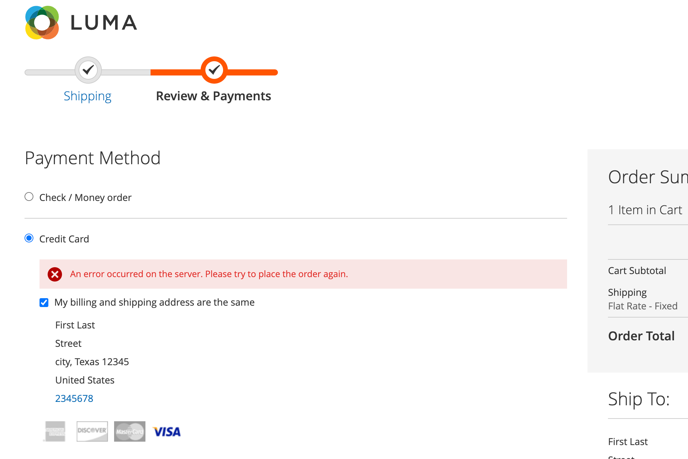
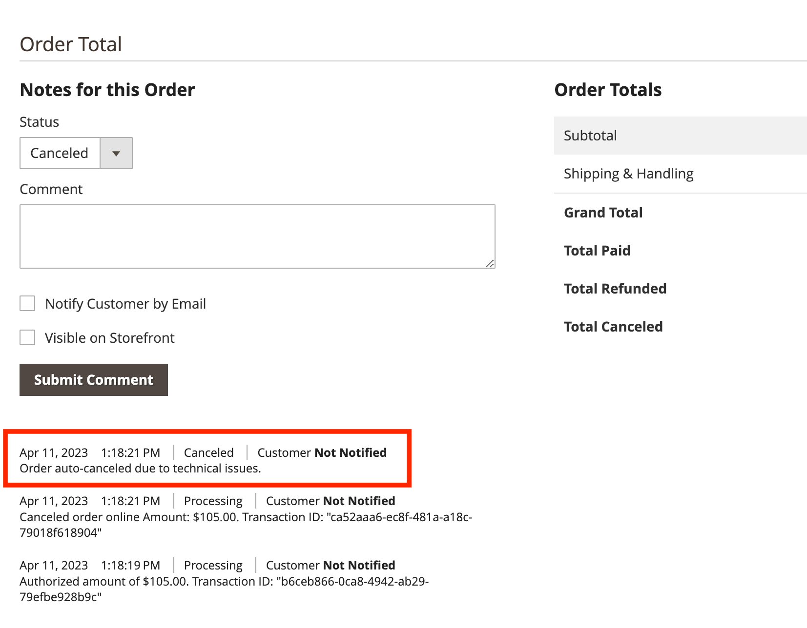

# Extraire dans [!DNL Payment Services]

Vous pouvez configurer le passage en caisse d’Adobe Commerce [!DNL Payment Services] pour qu’il corresponde au mieux à vos clients. Des fonctionnalités telles que [commande de voirie automatique](#order-auto-voided-if-error) et [chambre forte de carte de crédit](#credit-card-vaulting) garantissent une expérience utilisateur fluide à vos acheteurs.

## Commande annulée automatiquement en cas d&#39;erreur

Si une erreur se produit lors du passage en caisse, [!DNL Payment Services] annule/annule automatiquement la commande.

Un message d’erreur s’affiche sur la page de passage en caisse de l’acheteur. Le message peut varier.

{width="600" zoomable="yes"}

Un commentaire concernant la commande annulée s’affiche également dans l’Administration pour une [commande](https://experienceleague.adobe.com/en/docs/commerce-admin/stores-sales/order-management/orders/orders?lang=en) spécifique.

{width="600" zoomable="yes"}

Si un acheteur obtient l’autorisation de passer une commande, mais que celle-ci n’a pas été créée et convertie en `Capture`, la commande est annulée automatiquement. Ce processus permet de s’assurer qu’aucun crédit n’est réservé sur la carte de crédit de l’acheteur et d’éviter les frais du fournisseur de services de paiement qui se produisent lorsque l’autorisation est annulée à la fin de la période standard de 29 jours.

>[!NOTE]
>
>L&#39;annulation automatique de la commande ne se produit que lorsque le client utilise un mode de paiement défini sur `Authorize`, et non sur `Authorize and Capture`.

## Extraire à partir de la page du produit

Lorsqu’un client extrait directement de la page du produit, à l’aide des boutons PayPal ou [!DNL Pay Later], seul l’article représenté sur la page du produit actuel est acheté. Les articles qui se trouvent déjà dans le panier du client ne sont pas ajoutés au flux de passage en caisse et ne sont pas achetés.

Cette fonction permet au client d’acheter rapidement l’article qu’il consulte actuellement, tout en conservant les articles précédemment ajoutés à son panier.
Si le client ou la cliente annule la commande, l’article de la page produit en cours est ajouté au panier du client ou de la cliente.

Lorsqu’un client accède au flux de passage en caisse à partir de la page de produit, la page de passage en caisse est simplifiée : la vue affiche uniquement les données et options liées à la commande.

## Chambre forte de carte de crédit

Les acheteurs peuvent mettre en coffre (ou « enregistrer ») leurs informations de carte de crédit pour leurs achats futurs au niveau du site web (n’importe quel magasin situé dans le compte du même commerçant).

Pour plus d’informations, consultez [chambre forte des cartes de crédit](vaulting.md)
