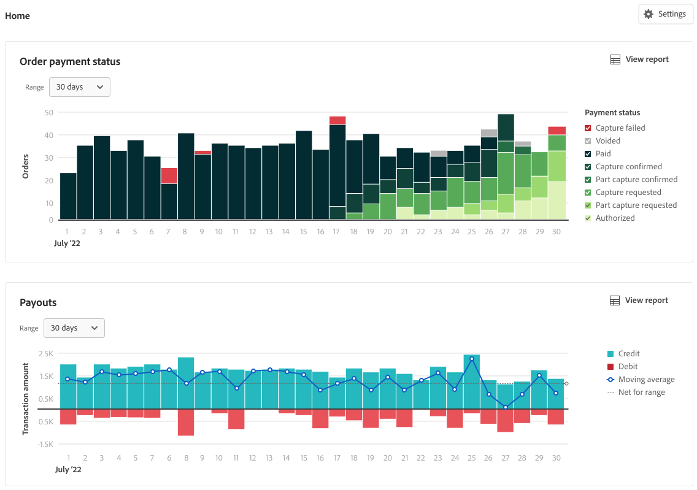

# Rapports financiers

[!DNL Payment Services] for [!DNL Adobe Commerce] and [!DNL Magento Open Source] vous offre des rapports complets afin que vous puissiez obtenir une vue claire des commandes et des paiements de votre magasin.

{width="600" zoomable="yes"}

Les états de gestion des flux de trésorerie (Paiements, Transactions et Statut de paiement de la commande) synchronisent les détails de paiement avec les informations de commande afin de vous donner une transparence totale du volume traité, du solde des paiements et des états détaillés au niveau des transactions pour le rapprochement financier.

>[!NOTE]
>
>Votre déploiement détermine lequel de ces rapports s’affiche dans le [!DNL Payment Services] **tableau de bord**. Sur [!DNL Adobe Commerce as a Cloud Service] et [!DNL Adobe Commerce Optimizer], le tableau de bord expose les rapports **sélectionnés** (y compris les [Transactions](reporting.md) de l’Accueil). [Statut du paiement de la commande](order-payment-status.md) et [Paiements](payouts.md) les vues d’accueil et les rapports associés sont disponibles sur Adobe Commerce dans le cloud et sur site, comme décrit dans ces rubriques. Voir [[!DNL Payment Services] Accueil](payments-home.md).
