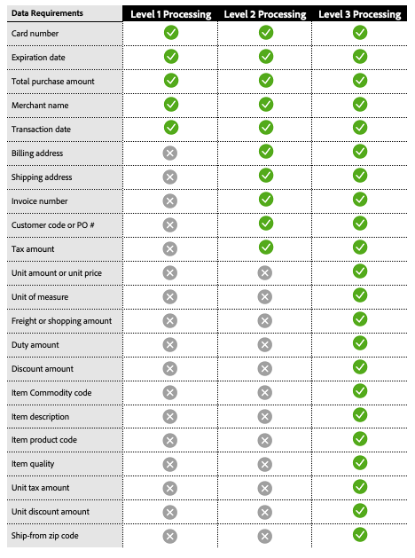

# Traitement de niveau 2 et de niveau 3

[!DNL Payment Services] offre des fonctionnalités avancées de traitement des cartes pour aider les commerçants à optimiser leurs transactions de paiement et à réduire les frais d&#39;interchange. Il existe trois niveaux de traitement des cartes, chacun avec des exigences différentes en matière de données de transaction.

>[!CAUTION]
>
> Les commandes [Fastlane](payments-options.md#fastlane-button) n&#39;incluent pas les données, les postes et la répartition des montants de niveau 2/niveau 3.

## Exigences en matière de données par niveau de traitement

{width="500" zoomable="yes"}

[!DNL Payment Services] collecte ces données et fournit des rapports détaillés sur vos opérations de paiement.

## Niveaux de traitement disponibles par réseau de cartes

{width="500" zoomable="yes"}

Voir [traitement des paiements](https://developer.paypal.com/docs/checkout/advanced/processing/){target=_blank} dans la documentation destinée aux développeurs PayPal pour plus d’informations.

### Niveau 1

Le niveau 1 est le plus courant, nécessite moins d&#39;information et, par conséquent, entraîne généralement des frais d&#39;interchange plus élevés par rapport aux transactions traitées avec des données de niveau 2 ou 3, qui sont généralement liées aux cartes de crédit d&#39;entreprise et d&#39;achat.

### Niveau 2 et niveau 3

Les commerçants [!DNL Payment Services] sur Interchange Plus Plus (IC++) peuvent être admissibles au traitement de niveau 2/niveau 3 s&#39;ils fournissent des détails de transaction supplémentaires aux réseaux de cartes et répondent à des critères de qualification spécifiques. Ces niveaux sont particulièrement avantageux pour les commerçants qui traitent des volumes importants d&#39;achats ou de cartes d&#39;entreprise, car ils peuvent entraîner des économies importantes. La fourniture de données détaillées de niveau 2 ou 3 peut :

* Réduire les frais de traitement et optimiser les coûts globaux
* Prévenir les fraudes et réduire les risques associés aux processeurs
* Amélioration de la sécurité des transactions

Voir [&#x200B; Qu’est-ce qu’IC ++?](https://www.paypal.com/us/brc/article/what-is-interchange-plus-plus){target=_blank} dans la documentation PayPal destinée aux développeurs pour plus d&#39;informations.

## Opérations de paiement par carte de niveau 2 et de niveau 3 en [!DNL Payment Services]

Pour bénéficier d&#39;un traitement de niveau 2 ou de niveau 3, les commerçants doivent envoyer les informations précédentes, bien que ce soient les réseaux de cartes qui déterminent en fin de compte le niveau auquel une transaction est admissible lors de son traitement.

Pour plus d’informations, consultez la [FAQ sur le traitement des paiements](https://www.paypal.com/us/cshelp/article/ts2278?_ga=1.131773126.875104296.1712843492){target=_blank} dans la documentation PayPal destinée aux développeurs.

Le traitement de niveau 2 et de niveau 3 est désactivé par défaut pour les commerçants [!DNL Payment Services] au niveau du magasin.

Les traitements de niveau 2 et de niveau 3 sont disponibles si vous utilisez déjà la tarification IC++. Pour activer cette fonctionnalité, vous pouvez le faire via l’[interface de ligne de commande (CLI](configure-cli.md).

>[!IMPORTANT]
>
>Pour toute question, veuillez contacter votre gestionnaire de compte [!DNL Payment Services].
