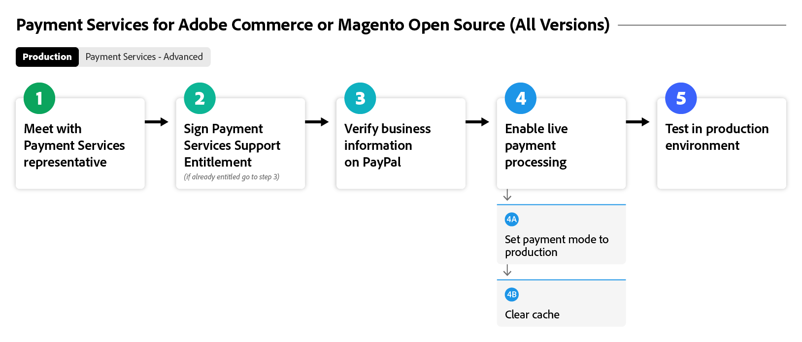
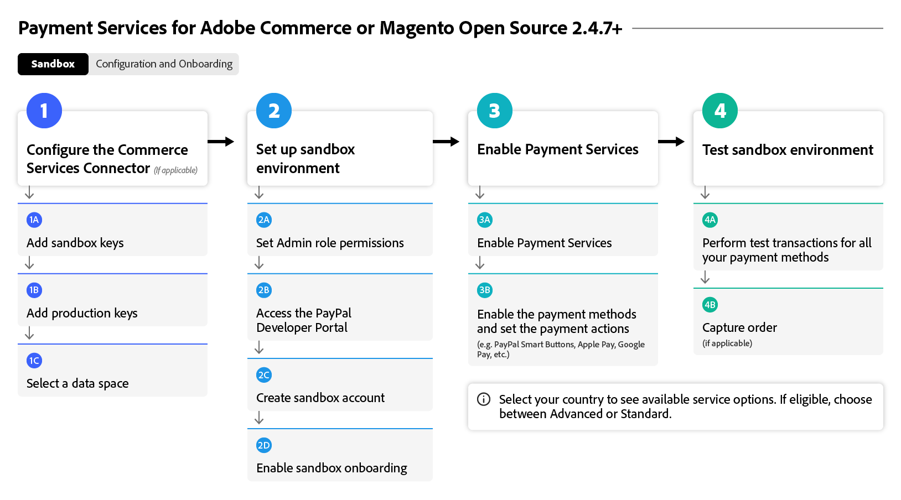
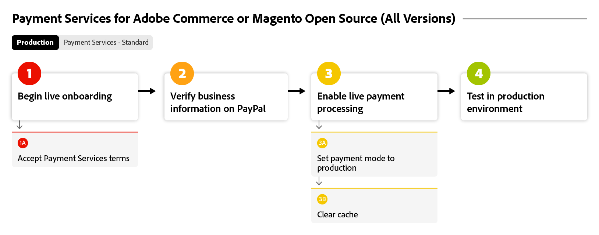
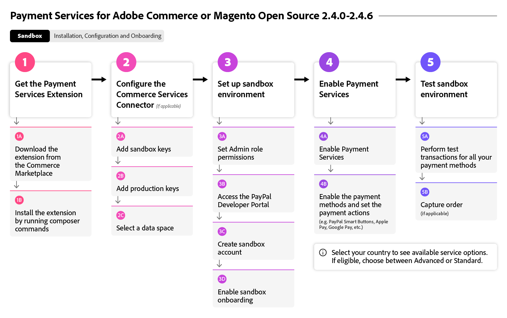

# Flux de [!DNL Payment Services] d’intégration

Pour commencer à utiliser [!DNL Payment Services], vous devez effectuer quelques étapes d’intégration. Pour obtenir des conseils précis, sélectionnez l’option Adobe Commerce ci-dessous qui correspond le mieux à l’instance et à la version de votre organisation.

Ce diagramme de flux présente le processus général d’intégration des [!DNL Payment Services] dans toutes les versions :

{width="700" zoomable="yes"}

Consultez ci-dessous la version d’Adobe Commerce spécifique à intégrer à [!DNL Payment Services].

## M’aider à trouver mon instance et ma version

### Adobe Commerce ou Magento Open Source | v2.4.7+

Ces diagrammes de flux montrent le processus général d’intégration des [!DNL Payment Services] avec une Adobe Commerce ou un Magento Open Source plus récent que la version v2.4.7.

>[!BEGINTABS]

>[!TAB  Sandbox ]

Ce diagramme de flux présente le processus d’intégration des sandbox avec une Adobe Commerce ou un Magento Open Source plus récent que la version 2.4.7, où [!DNL Payment Services] est prêt à l’emploi avec Adobe Commerce.

{width="700" zoomable="yes"}

**Étapes d’intégration pour les versions v2.4.7+ Partie 1 : Sandbox**

1. [Connectez votre instance](connect.md#configure-commerce-services) aux services Commerce. Cette connexion ne doit être établie qu’une seule fois par instance Commerce. [!BADGE PaaS uniquement]{type=Informative tooltip="S’applique uniquement à Adobe Commerce sur les projets cloud (infrastructure PaaS gérée par Adobe)."}
1. [Configurer le service Sandbox](sandbox.md#sandbox-onboarding)
1. Testez les paiements dans un environnement [sandbox](sandbox.md#test-in-sandbox-environment).

>[!TAB Production]

Ce diagramme de flux présente les étapes de production nécessaires à l’activation de [!DNL Payment Services].

{width="700" zoomable="yes"}

**Étapes d’intégration pour les versions v2.4.7+ Partie 2 : Production**

1. [Définissez [!DNL Payment Services] comme mode de paiement](production.md#set-payment-services-as-payment-method), en mode sandbox, pour commencer à traiter les paiements de test.
1. [Demander des droits de paiement](production.md#request-payments-entitlement-from-adobe) pour activer l’intégration en direct.
1. [Intégration complète des commerçants](production.md#complete-merchant-onboarding) pour activer les paiements en direct pour vos sites web Commerce.
1. [Obtenez votre [!DNL Payment Services] ID de commerçant](production.md#configure-pricing-tier) et remettez-le au service des ventes pour configurer le niveau tarifaire approprié.
1. [Activer [!DNL Payment Services] en mode réel](production.md#enable-live-payments) pour commencer à traiter les paiements dynamiques.
1. Testez les paiements dans les environnements [sandbox](sandbox.md#test-in-sandbox-environment) et [production](production.md#test-in-production).

>[!ENDTABS]

### Adobe Commerce ou Magento Open Source | v2.4.0-2.4.6 [!BADGE PaaS uniquement]{type=Informative tooltip="S’applique uniquement à Adobe Commerce sur les projets cloud (infrastructure PaaS gérée par Adobe)."}

Ces diagrammes de flux montrent le processus général d’intégration des [!DNL Payment Services] avec Adobe Commerce ou Magento Open Source versions 2.4.0 à 2.4.6. Il est nécessaire de télécharger et d’installer [!DNL Payment Services] pour commencer l’intégration.

>[!BEGINTABS]

>[!TAB  Sandbox ]

Ce diagramme de flux présente les étapes requises pour les [!DNL Payment Services] d’intégration à Adobe Commerce ou Magento Open Source versions 2.4.0 à 2.4.6.

{width="700" zoomable="yes"}

**Étapes d’intégration pour les versions v2.4.0 à 2.4.6 Partie 1 : Sandbox**

1. [Installez l’extension  [!DNL Payment Services]  si nécessaire](install.md#get-payment-services).
1. [Obtention des informations d’identification d’API](connect.md#obtain-api-credentials).
1. [Connectez votre instance](connect.md#configure-commerce-services) aux services Commerce. Cette connexion ne doit être établie qu’une seule fois par instance Commerce.
1. [Configurer le service Sandbox](sandbox.md#sandbox-onboarding)
1. Testez les paiements dans un environnement [sandbox](sandbox.md#test-in-sandbox-environment).

>[!TAB Production]

Ce diagramme de flux présente le processus général d’activation de [!DNL Payment Services] dans un environnement de production avec Adobe Commerce ou Magento Open Source versions 2.4.0 à 2.4.6.

{width="700" zoomable="yes"}

**Étapes d’intégration pour les versions v2.4.0 à 2.4.6 Partie 2 : Production**

1. [Définissez [!DNL Payment Services] comme mode de paiement](production.md#set-payment-services-as-payment-method), en mode sandbox, pour commencer à traiter les paiements de test.
1. [Demander des droits de paiement](production.md#request-payments-entitlement-from-adobe) pour activer l’intégration en direct.
1. [Intégration complète des commerçants](production.md#complete-merchant-onboarding) pour activer les paiements en direct pour vos sites web Commerce.
1. [Obtenez votre [!DNL Payment Services] ID de commerçant](production.md#configure-pricing-tier) et remettez-le au service des ventes pour configurer le niveau tarifaire approprié.
1. [Activer [!DNL Payment Services] en mode réel](production.md#enable-live-payments) pour commencer à traiter les paiements dynamiques.
1. Testez les paiements dans les environnements [sandbox](sandbox.md#test-in-sandbox-environment) et [production](production.md#test-in-production).

>[!ENDTABS]

>[!NOTE]
>
>Si vous ne configurez pas vos services Commerce dans l’administrateur (partie 1), vous ne pouvez pas configurer de sandbox ou de paiements dynamiques.

>[!MORELIKETHIS]
>
> * [Dépannage [!DNL Payment Services] installation](https://experienceleague.adobe.com/en/docs/experience-cloud-kcs/kbarticles/ka-26826)
> * [Compte sandbox PayPal non vérifié](https://experienceleague.adobe.com/en/docs/experience-cloud-kcs/kbarticles/ka-26836)
> * [Données  [!DNL Payment Services]  rapport différées](https://experienceleague.adobe.com/en/docs/experience-cloud-kcs/kbarticles/ka-26837)
> * [Le test de la carte de crédit échoue avec PayPal lors du traitement des paiements dans un environnement Sandbox](https://experienceleague.adobe.com/en/docs/experience-cloud-kcs/kbarticles/ka-26825)
> * [Désactiver l’extension  [!DNL Payment Services] ](https://experienceleague.adobe.com/en/docs/commerce-on-cloud/user-guide/configure-store/extensions#manage-extensions-1)