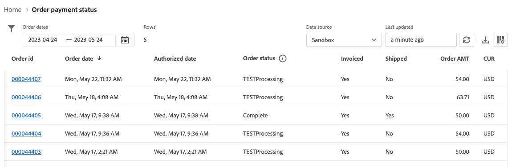

# Etat Statut du paiement de la commande

[!DNL Payment Services] for [!DNL Adobe Commerce] and [!DNL Magento Open Source] vous offre des rapports complets afin que vous puissiez obtenir une vue claire des [transactions](reporting.md), commandes et paiements de votre magasin.

Il existe deux vues d&#39;état du statut de paiement des commandes pour vous permettre de consulter rapidement le statut de paiement de vos commandes :

* **[Vue de visualisation du statut de paiement de la commande](#order-payment-status-data-visualization-view)** : graphique disponible sur l&#39;Accueil des services de paiement qui est une représentation visuelle des statuts de paiement agrégés par jour à partir de la vue de rapport du statut de paiement de la commande
* **[Affichage de l&#39;état du statut de paiement de la commande](#order-payment-status-report-view)** : état disponible dans le statut de paiement de la commande qui affiche les statuts de paiement détaillé, de facturation, d&#39;expédition, de remboursement et de litige pour tous les mouvements

Les vues du statut de paiement de la commande vous permettent de comprendre facilement où se trouve une commande spécifique dans le flux de traitement de la commande en trésorerie. Ces rapports vous permettent de consulter rapidement les commandes (en fonction de leur statut de paiement et de leur date de paiement) et d’identifier les problèmes potentiels.

Vous pouvez [télécharger les états de paiement des commandes](#download-order-payment-statuses) au format .csv pour les utiliser dans les logiciels de comptabilité ou de gestion des commandes existants.

>[!NOTE]
>
>Vous ne pouvez pas afficher les rapports financiers si vous n’avez pas [intégré et activé le mode réel](production.md#enable-live-payments) par [!DNL Payment Services].

## Vue de visualisation des données relatives au statut de paiement de la commande

La vue de visualisation des données relatives au statut du paiement de la commande est disponible dans l’Accueil des services de paiement. Il s&#39;agit d&#39;une représentation visuelle des statuts de paiement agrégés par jour à partir de la vue de rapport détaillée du tableau [Statut du paiement des commandes](#order-payment-status-report-view).

Dans la barre latérale _Admin_, accédez à **Ventes** > **Services de paiement** > _Commandes_ pour afficher la visualisation des données [graphique des statuts de paiement](#statuses-information).

{width="800" zoomable="yes"}

Cliquez sur **[!UICONTROL View Report]** pour accéder à la vue du rapport détaillé [Statut du paiement des commandes](#order-payment-status-report-view).

### Personnaliser la période des statuts

Par défaut, 30 jours de statuts de paiement s’affichent.

Dans la vue de visualisation du statut de paiement de la commande, vous pouvez personnaliser le délai des statuts de paiement que vous souhaitez afficher en sélectionnant une période :

1. Dans la barre latérale _Admin_, accédez à **[!UICONTROL Sales]** > **[!UICONTROL Payment Services]**. La vue de visualisation des données relatives au statut de paiement des commandes est visible dans la section _Commandes_.
1. Cliquez sur le filtre du sélecteur de **[!UICONTROL Range]**.
1. Sélectionnez la période applicable : 30 jours, 15 jours ou 7 jours.
1. Affichez les informations sur les statuts pour les dates spécifiées.

### Informations sur les statuts

Les statuts de paiement pour une période sélectionnée s&#39;affichent à gauche de la vue de visualisation des données sur le statut de paiement de la commande. Les dates de la période sélectionnée s’affichent au bas de l’affichage. S’il n’y a pas eu de commande à une date donnée, cette date n’apparaît pas.

La vue de visualisation des données relatives au statut de paiement de la commande comprend les informations suivantes.

| Données | Description |
| ------------ | -------------------- |
| [!UICONTROL Orders] | Plage de montants pour les commandes dans la période spécifiée ; données sur l’axe Y (gauche) |
| Période | Période de l’intervalle spécifié ; données sur l’axe X (bas) |
| Autorisé | Commande autorisée |
| Capture demandée | Capture demandée pour la commande |
| Capture confirmée | Capture de commande terminée |
| Capture partielle | Ordre partiellement capturé |
| Échec de la capture | Échec de la capture de commande |
| Annulé | Commande annulée |

## Vue du rapport sur le statut du paiement de la commande

La vue du rapport Statut du paiement de la commande est disponible dans la vue d&#39;accueil des services de paiement. Il comprend des statuts détaillés (paiement, facturation, expédition, remboursement, litige, etc.) pour toutes les transactions.

Dans la barre latérale _Admin_, accédez à **[!UICONTROL Sales]** > **[!UICONTROL Payment Services]** > _[!UICONTROL Orders]_>**[!UICONTROL View Report]**pour afficher la vue du rapport tabulaire détaillé sur le statut du paiement des commandes.

{width="800" zoomable="yes"}

Vous pouvez configurer cette vue, conformément aux sections de cette rubrique, pour présenter au mieux les données que vous souhaitez afficher.

Vous pouvez [télécharger les transactions de paiement](#download-order-payment-statuses) au format .csv pour les utiliser dans les logiciels de comptabilité ou de gestion des commandes existants.

>[!NOTE]
>
>Les données affichées dans ce tableau sont triées par défaut par ordre décroissant (`DESC`) à l’aide de la `TRANS DATE` . La `TRANS DATE` correspond à la date et à l&#39;heure auxquelles la transaction a été initiée.

### Mises à jour du statut des paiements

Certains modes de paiement nécessitent un certain temps pour saisir le paiement. [!DNL Payment Services] détecte désormais les statuts en attente d&#39;une transaction de paiement dans une commande en :

* Détection synchrone des transactions `pending capture`
* Surveillance asynchrone des transactions `pending capture`

>[!NOTE]
>
>La détection des statuts en attente des transactions de paiement dans une commande empêche l&#39;expédition accidentelle de commandes si le paiement n&#39;a pas encore été reçu. Cela peut concerner les transactions par chèque électronique et PayPal.

#### Détection synchrone des transactions de capture en attente

Détecter automatiquement les transactions de capture avec un statut `Pending` et empêcher les commandes de passer à un statut `Processing` lorsqu&#39;une telle transaction est détectée.

Lors du passage en caisse du client ou lorsqu’un administrateur crée une facture pour un paiement précédemment autorisé, [!DNL Payment Services] détecte automatiquement les transactions de capture dont le statut est défini sur `Pending` et transforme les commandes correspondantes en statut `Payment Review`.

#### Surveillance asynchrone des transactions de capture en attente

Détecter quand une transaction de capture en attente passe en statut `Completed` afin que les commerçants puissent reprendre le traitement de la commande concernée.

Pour que ce processus fonctionne comme prévu, les commerçants doivent configurer une nouvelle tâche cron. Une fois le traitement configuré pour s&#39;exécuter automatiquement, aucune autre intervention n&#39;est attendue du commerçant.

Voir [ Configuration des tâches cron ](https://experienceleague.adobe.com/docs/commerce-operations/configuration-guide/cli/configure-cron-jobs.html). Une fois configuré, le nouveau traitement s’exécute toutes les 30 minutes pour récupérer les mises à jour des commandes dont le statut est défini sur `Payment Review`.

Les commerçants peuvent vérifier le statut de paiement mis à jour à partir de la vue du rapport Statut du paiement de la commande.

### Données utilisées dans le rapport

[!DNL Payment Services] utilise les données de commande et les combine avec les données de paiement agrégées provenant d&#39;autres sources (y compris PayPal), pour fournir des rapports significatifs et très utiles.

Les données de commande sont exportées et conservées dans le service de paiement. Lorsque vous [modifiez ou ajoutez des statuts de commande](https://experienceleague.adobe.com/en/docs/commerce-admin/stores-sales/order-management/orders/order-status#custom-order-status) ou [modifiez une vue de magasin](https://experienceleague.adobe.com/en/docs/commerce-admin/stores-sales/site-store/store-views#edit-a-store-view), un [magasin](https://experienceleague.adobe.com/en/docs/commerce-admin/start/setup/store-details#store-information) ou un nom de site web, ces données sont combinées aux données de paiement et l&#39;état Statut du paiement des commandes est renseigné avec les informations combinées.

Ce processus comporte deux étapes :

1. L’index est modifié en données `ON SAVE` (à chaque modification des informations de commande ou de magasin) ou `BY SCHEDULE` (selon un planning cron préconfiguré), selon la manière dont il est configuré dans [Gestion des index](https://experienceleague.adobe.com/en/docs/commerce-admin/systems/tools/index-management) dans l’administrateur.

   Par défaut, l’indexation des données se produit `ON SAVE`, ce qui signifie que chaque fois qu’un élément change dans la commande, le statut de la commande, l’affichage du magasin, le magasin ou le site web, le processus de réindexation se produit immédiatement.

1. Les données indexées sont envoyées au service de paiement, qui les renseigne ensuite dans le rapport d&#39;état du paiement de la commande.

Les seules données exportées et collectées à des fins de reporting sont les données utilisées par l&#39;état du statut de paiement des commandes.

>[!NOTE]
>
>Les données affichées dans ce tableau sont triées par défaut par ordre décroissant (`DESC`) à l’aide de la `ORDER DATE` . La `ORDER DATE` correspond à la date et à l’heure de création de la commande.

#### Configurer l’export des données

Bien que, par défaut, la réindexation se produise en mode `ON SAVE`, il est recommandé de procéder à l’indexation en mode `BY SCHEDULE`. L’index `BY SCHEDULE` s’exécute selon un planning cron d’une minute et toutes les données modifiées apparaissent dans le rapport État de la commande dans les deux minutes suivant la modification des données. Cette réindexation planifiée vous permet de réduire la pression sur votre magasin, en particulier si vous avez un grand volume de commandes entrantes, car elle se produit selon un planning (et non pas lorsque chaque commande est passée).

Vous pouvez modifier le mode d’index (`ON SAVE` ou `BY SCHEDULE`) [dans l’Administration](https://experienceleague.adobe.com/en/docs/commerce-admin/systems/tools/index-management#change-the-index-mode).

Pour savoir comment configurer l’exportation des données, voir [Configuration de ligne de commande](configure-cli.md#configure-data-export).

### Sélectionner la source de données

Dans la vue de rapport Statut du règlement des commandes, vous pouvez sélectionner la source de données (**[!UICONTROL Live]** _ ou **[!UICONTROL Sandbox]**) pour laquelle vous souhaitez consulter les résultats du rapport.

{width="300" zoomable="yes"}

Si _[!UICONTROL Live]_est la source de données sélectionnée, vous pouvez afficher les informations de rapport pour vos magasins qui utilisent [!DNL Payment Services] en mode production. Si_[!UICONTROL Sandbox]_ est la source de données sélectionnée, vous pouvez afficher des informations de rapport pour le mode sandbox.

Les sélections de sources de données fonctionnent comme suit :

* Si aucun magasin n’utilise [!DNL Payment Services] en mode réel, la sélection de la source de données est définie par défaut sur _[!UICONTROL Sandbox]_.
* Si des magasins (un ou plusieurs) utilisent [!DNL Payment Services] en mode réel, la sélection de la source de données est définie par défaut sur _[!UICONTROL Live]_.
* Les exportations de rapports respectent toujours la sélection de la source de données.

Pour sélectionner la source de données de votre rapport [!UICONTROL Order Payment Status] :

1. Dans la barre latérale _Admin_, accédez à **[!UICONTROL Sales]** > **[!UICONTROL [!DNL Payment Services]]** > **[!UICONTROL Orders]** > **[!UICONTROL View Report]**.
1. Cliquez sur le filtre du sélecteur de _[!UICONTROL Data source]_et sélectionnez **[!UICONTROL Live]**ou **[!UICONTROL Sandbox]**.

   Les résultats du rapport sont régénérés en fonction de la source de données sélectionnée.

### Personnaliser la période des dates de commande

Dans la vue du rapport Statut du paiement de la commande, vous pouvez personnaliser le délai des résultats de statut que vous souhaitez afficher en sélectionnant des dates spécifiques. Par défaut, 30 jours de statut de paiement des commandes sont affichés dans la grille.

1. Dans la barre latérale _Admin_, accédez à **[!UICONTROL Sales]** > **[!UICONTROL [!DNL Payment Services]]** > _[!UICONTROL Orders]_>**[!UICONTROL View Report]**.
1. Cliquez sur le filtre du sélecteur de calendrier _[!UICONTROL Order dates]_.
1. Sélectionnez la période applicable.
1. Affichez les statuts de paiement des commandes pour les dates spécifiées dans la grille.

### Filtrer les informations du rapport

Dans la vue d&#39;état Statut du paiement de la commande, vous pouvez filtrer les statuts et les résultats à afficher en sélectionnant des critères de filtrage.

1. Dans la barre latérale _Admin_, accédez à **[!UICONTROL Sales]** > **[!UICONTROL [!DNL Payment Services]]** > _[!UICONTROL Orders]_>**[!UICONTROL View Report]**.
1. Cliquez sur le sélecteur de **[!UICONTROL Filter]**.
1. Activez/désactivez les options _Statut de règlement_ pour afficher les résultats du rapport pour les statuts de règlement de commande sélectionnés uniquement.
1. Affichez les résultats du rapport dans une fourchette de montants de commande en saisissant un _[!UICONTROL Min Order Amount]_ou un _[!UICONTROL Max Order Amount_].
1. Cliquez sur **[!UICONTROL Hide filters]** pour masquer le filtre.

### Afficher et masquer les colonnes

Par défaut, l&#39;état Statut du paiement de la commande affiche toutes les colonnes d&#39;informations disponibles. Vous pouvez toutefois personnaliser les colonnes affichées dans votre rapport.

1. Dans la barre latérale _Admin_, accédez à **[!UICONTROL Sales]** > **[!UICONTROL [!DNL Payment Services]]** > _[!UICONTROL Orders]_>**[!UICONTROL View Report]**.
1. Cliquez sur l’icône _Paramètres de colonne_ ({width="20" zoomable="yes"}).
1. Pour personnaliser les colonnes du rapport, cochez ou décochez les colonnes de la liste.

   L&#39;état Statut du paiement de la commande affiche immédiatement toutes les modifications effectuées dans le menu Paramètres des colonnes. Les préférences de colonne sont enregistrées et restent actives si vous quittez la vue du rapport.

### Afficher les statuts

La vue d&#39;état Statut de paiement de la commande affiche des informations complètes sur le statut de paiement de chaque commande.

Par défaut, 30 jours de statut de paiement des commandes sont affichés dans la grille.

Faites défiler l’écran vers la gauche et la droite pour afficher les [informations sur le statut du paiement de la commande](#column-descriptions), notamment la date de commande, la date autorisée, la facture, l’expédition, le statut de paiement, etc.

Le nombre de lignes renvoyées dans une recherche, ou affichées dans les 30 jours par défaut des statuts de paiement de la commande, s&#39;affiche au-dessus de la grille d&#39;affichage du statut de paiement de la commande à côté du filtre du sélecteur de calendrier Dates de commande .

#### Statut de rémunération

La colonne Statut du règlement affiche le statut actuel de tout règlement. Un paiement `Capture failed` affiche un statut d&#39;alerte rouge et un paiement `Voided` affiche un statut d&#39;alerte gris.

#### Statut du remboursement

La colonne Statut du remboursement indique le statut actuel de tout remboursement. Un paiement `Capture failed` affiche un statut d&#39;alerte rouge et un paiement `Voided` affiche un statut d&#39;alerte gris.

### Mise à jour des données d’un rapport

La vue d&#39;état du statut de paiement de la commande affiche un horodatage _[!UICONTROL Last updated]_indiquant la dernière mise à jour des informations de l&#39;état. Par défaut, les données du rapport Statut du paiement des commandes sont automatiquement actualisées toutes les trois heures.

Vous pouvez également forcer manuellement une actualisation des données de l&#39;état du statut de paiement des commandes pour afficher les informations les plus récentes.

1. Dans la barre latérale _Admin_, accédez à **[!UICONTROL Sales]** > **[!UICONTROL [!DNL Payment Services]]** > _[!UICONTROL Orders]_>**[!UICONTROL View Report]**.
1. Cliquez sur l’icône _Actualiser_ ({width="20" zoomable="yes"}).

   Les données de l&#39;état du statut de paiement de la commande sont actualisées, une confirmation de *[!UICONTROL Update complete]* apparaît et les dernières informations sont présentes dans la grille.

### Afficher les litiges

Vous pouvez afficher tous les litiges sur les commandes de votre boutique et accéder au Centre de résolution PayPal pour prendre des mesures à leur sujet, à partir du rapport Statut du paiement des commandes .

1. Dans la barre latérale _Admin_, accédez à **[!UICONTROL Sales]** > **[!UICONTROL [!DNL Payment Services]]** > _[!UICONTROL Orders]_>**[!UICONTROL View Report]**.
1. Accédez à la **[!UICONTROL Disputes column]** .
1. Affichez tous les litiges relatifs à une commande spécifique et consultez [statut du litige](#order-payment-status-information).
1. Consultez les détails du litige dans le [Centre de résolution PayPal](https://www.paypal.com/us/cshelp/article/what-is-the-resolution-center-help246) en cliquant sur le lien de l&#39;ID de litige qui commence par _PP-D-_.
1. Prenez les mesures appropriées pour régler le différend, au besoin.

   Pour trier les litiges par statut, cliquez sur l’en-tête de colonne [!UICONTROL Disputes].

### Télécharger les statuts de paiement des commandes

Vous pouvez télécharger un fichier .csv avec tous les statuts visibles dans la grille d&#39;affichage du statut du paiement des commandes, que vous consultiez les statuts par défaut de 30 jours ou un délai personnalisé.

1. Dans la barre latérale _Admin_, accédez à **[!UICONTROL Sales]** > **[!UICONTROL [!DNL Payment Services]]** > _[!UICONTROL Orders]_>**[!UICONTROL View Report]**.
1. Si vous souhaitez afficher les statuts pour une période autre que les 30 derniers jours, [personnalisez la période pour vos statuts](#customize-dates-timeframe).
1. Cliquez sur l’icône _Télécharger_ ({width="20" zoomable="yes"}).

Les statuts de paiement de votre commande sont téléchargés au format .csv.

### Descriptions des colonnes

Les états de statut du paiement de la commande contiennent les informations suivantes.

| Colonne | Description |
| ------------ | -------------------- |
| [!UICONTROL Order ID] | ID de commande Commerce    Pour afficher les [informations de commande](https://experienceleague.adobe.com/en/docs/commerce-admin/stores-sales/order-management/orders/orders){target="_blank"} associées, cliquez sur l’ID. |
| [!UICONTROL Order Date] | Date et heure de commande |
| [!UICONTROL Authorized Date] | Date et heure de l’autorisation de paiement |
| [!UICONTROL Order Status] | Commerce actuel [statut de la commande](https://experienceleague.adobe.com/en/docs/commerce-admin/stores-sales/order-management/orders/order-status){target="_blank"} |
| [!UICONTROL Invoiced] | Statut de la facture de la commande : *[!UICONTROL No]*, *[!UICONTROL Partial]* ou *[!UICONTROL Yes]* |
| [!UICONTROL Shipped] | Statut d’expédition de la commande : *[!UICONTROL No]*, *[!UICONTROL Partial]* ou *[!UICONTROL Yes]*. |
| [!UICONTROL Order Amt] | Montant total général de la commande |
| [!UICONTROL Cur] | Type de devise de la commande |
| [!UICONTROL Pay Status] | Statut du paiement d’une commande spécifique |
| [!UICONTROL Paid Amt] | Montant payé sur une commande |
| [!UICONTROL Cur] | Type de devise du montant payé sur une commande |
| [!UICONTROL Refund Status] | État d&#39;un remboursement sur une commande (par exemple, renseignements provenant de retours, de RAM et d&#39;avoirs)—   *[!UICONTROL Requires refund]*, *[!UICONTROL Refund requested]*, *[!UICONTROL Refunded]*, *[!UICONTROL Refund failed]* ou *[!UICONTROL Voided]* |
| [!UICONTROL Refund Amount] | Montant total du remboursement pour une commande |
| [!UICONTROL Cur] | Type de devise du montant remboursé pour une commande |
| [!UICONTROL Disputes] | Statut de tout litige relatif à une commande (informations issues de litiges et d’imputations) : *[!UICONTROL Open]*, *[!UICONTROL Waiting for buyer response]*, *[!UICONTROL Waiting for seller response]*, *[!UICONTROL Under review]*, *[!UICONTROL Resolved]* ou *[!UICONTROL Other]* |
| [!UICONTROL Payment Method] | Mode de paiement utilisé dans la transaction Commerce pour une commande |
| [!UICONTROL Website] | Site Web à partir duquel la commande a été passée |
| [!UICONTROL Store] | Magasin à partir duquel la commande a été passée |
| [!UICONTROL Store View] | Vue de magasin à partir de laquelle la commande a été passée |
