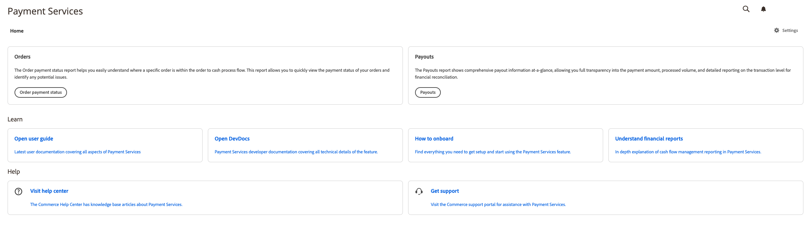

# Présentation de la page d’accueil [!DNL Payment Services]

[!DNL Payment Services] pour [!DNL Adobe Commerce] et [!DNL Magento Open Source] fournit une vue d’accueil avec toutes les informations nécessaires pour commencer à configurer et à utiliser l’extension.

1. Dans la barre latérale _Admin_, accédez à **[!UICONTROL Sales]** > **[!UICONTROL Payment Services]** :

   {width="700" zoomable="yes"}

1. Dans cette vue d’accueil, vous pouvez accéder à la vue _Accueil_, _En savoir_ sur les [!DNL Payment Services], configurer l’extension _Paramètres_ ou obtenir de l’_Aide_.

## Accueil

| Champ | Description |
|---|---|
| [!UICONTROL Orders] | Ces rapports vous permettent de consulter rapidement le statut du paiement de vos commandes et d’identifier les problèmes potentiels. |
| [!UICONTROL Payouts] | Les rapports Paiements affichent des informations complètes sur les paiements en un coup d&#39;œil, ce qui vous permet d&#39;obtenir une transparence totale sur le montant des paiements, le volume traité et des rapports détaillés sur le niveau des transactions pour le rapprochement financier. |

## Apprendre

| Champ | Description |
|---|---|
| [!UICONTROL Read documentation] | Consultez la dernière documentation destinée aux utilisateurs et aux développeurs pour en savoir [!DNL Payment Services]. |
| [!UICONTROL How to onboard] | Trouvez tout ce dont vous avez besoin pour configurer et commencez à utiliser la fonctionnalité [!DNL Payment Services]. |
| [!UICONTROL Understand financial reports] | Explication détaillée des rapports sur la gestion des flux de trésorerie en [!DNL Payment Services]. |

## Aide

| Champ | Description |
|---|---|
| [!UICONTROL Visit help center] | Le Centre d’aide [!DNL Adobe Commerce] contient des articles de la base de connaissances sur [!DNL Payment Services]. |
| [!UICONTROL Get support] | Consultez le portail d’assistance [!DNL Adobe Commerce] pour obtenir de l’aide sur [!DNL Payment Services.] |

## Paramètres

Dans la vue d’accueil, cliquez sur **[!UICONTROL Settings]**. Voir [Paramètres](settings.md) pour plus d’informations.
