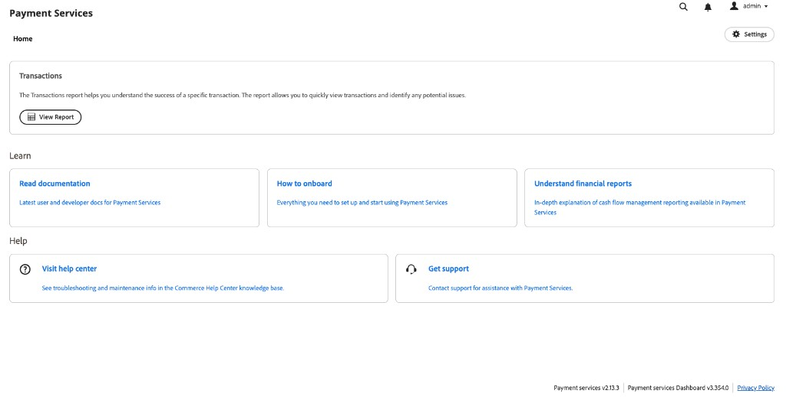

# Page de départ [!DNL Payment Services]

[!DNL Payment Services] pour Adobe Commerce et Magento Open Source fournit une vue d’accueil avec les informations dont vous avez besoin pour configurer et utiliser l’extension. Les options situées en haut de la page d’Accueil dépendent de votre déploiement : Adobe Commerce sur le cloud ou sur site (PaaS), ou [!DNL Adobe Commerce as a Cloud Service] ou [!DNL Adobe Commerce Optimizer] (SaaS).

Dans la barre latérale _Admin_, accédez à **[!UICONTROL Sales]** > **[!UICONTROL [!DNL Payment Services]]** :

>[!BEGINTABS]

>[!TAB Adobe Commerce sur le cloud et sur site]

{width="700" zoomable="yes"}

>[!TAB Adobe Commerce as a Cloud Service et Commerce Optimizer]

Jusqu’à ce que vous ayez terminé l’intégration, **[!UICONTROL Home]**’affiche **[!UICONTROL ACCS Onboarding Required]**. La notification contient des liens pour [configurer le service Sandbox](sandbox.md#sandbox-onboarding) (avec un compte de traitement PayPal de test) ou pour [activer les paiements en direct](production.md#enable-live-payments) si vous avez déjà effectué un test dans un autre environnement :

{width="700" zoomable="yes"}

Une fois l’intégration terminée (ou sur une instance déjà configurée), **[!UICONTROL Home]** affiche les **[!UICONTROL Transactions]** avec les **[!UICONTROL View Report]** pour le rapport tabulaire, ainsi que les zones **[!UICONTROL Learn]** et **[!UICONTROL Help]** :

{width="700" zoomable="yes"}

>[!ENDTABS]

Dans cette vue d’accueil, vous pouvez accéder à _Accueil_, _En savoir_ sur les [!DNL Payment Services], configurer l’extension _Paramètres_ ou obtenir _Aide_. Utilisez **[!UICONTROL View Report]** (SaaS) ou les points d’entrée **[!UICONTROL Orders]** et **[!UICONTROL Payouts]** (Adobe Commerce sur le cloud et sur site) pour ouvrir le compte rendu des performances. Voir [Compte rendu des performances](reporting.md).

>[!NOTE]
>
>Dans [!DNL Adobe Commerce as a Cloud Service] et [!DNL Adobe Commerce Optimizer], le [!DNL Payment Services] **tableau de bord** expose uniquement les rapports **sélectionnés** : vous obtenez le rapport [Transactions](reporting.md) depuis **[!UICONTROL Home]** (voir le tableau SaaS ci-dessous). Les zones **[!UICONTROL Orders]** et **[!UICONTROL Payouts]** sur l’Accueil, ainsi que leurs graphiques et rapports associés, s’appliquent uniquement à Adobe Commerce sur le cloud et sur site ([PaaS](#home)). Pour obtenir un aperçu des rapports sur les flux de trésorerie pour les déploiements, voir [Rapports financiers](financial-reporting.md).

## Accueil

[!BADGE PaaS uniquement]{type=Informative url="https://experienceleague.adobe.com/en/docs/commerce/user-guides/product-solutions" tooltip="S’applique uniquement aux projets Adobe Commerce on Cloud (infrastructure PaaS gérée par Adobe) et aux projets On-premise."}

| Champ | Description |
|---|---|
| [!UICONTROL Orders] | Ces rapports vous permettent de consulter rapidement le statut du paiement de vos commandes et d’identifier les problèmes potentiels. |
| [!UICONTROL Payouts] | Les rapports Paiements affichent des informations complètes sur les paiements en un coup d&#39;œil, ce qui vous permet d&#39;obtenir une transparence totale sur le montant des paiements, le volume traité et des rapports détaillés sur le niveau des transactions pour le rapprochement financier. |

[!BADGE SaaS uniquement]{type=Positive url="https://experienceleague.adobe.com/en/docs/commerce/user-guides/product-solutions" tooltip="S’applique uniquement aux projets Adobe Commerce as a Cloud Service et Adobe Commerce Optimizer (infrastructure SaaS gérée par Adobe)."}

| Champ | Description |
|---|---|
| [!UICONTROL Transactions] | Affiche le rapport des transactions, qui vous aide à comprendre le résultat de transactions spécifiques. Cliquez sur **[!UICONTROL View Report]** pour ouvrir la grille des transactions (par exemple, les ID de transaction de commande et PayPal, le mode de paiement, le résultat et les codes réponse). Voir [Vue du rapport des transactions](reporting.md#transactions-report-view). |

## Apprendre

| Champ | Description |
|---|---|
| [!UICONTROL Read documentation] | Consultez la dernière documentation destinée aux utilisateurs et aux développeurs pour en savoir [!DNL Payment Services]. |
| [!UICONTROL How to onboard] | Trouvez tout ce dont vous avez besoin pour configurer et commencez à utiliser la fonctionnalité [!DNL Payment Services]. |
| [!UICONTROL Understand financial reports] | Explication détaillée des rapports sur la gestion des flux de trésorerie en [!DNL Payment Services]. |

## Aide

| Champ | Description |
|---|---|
| [!UICONTROL Visit help center] | Le Centre d’aide [!DNL Adobe Commerce] contient des articles de la base de connaissances sur [!DNL Payment Services]. |
| [!UICONTROL Get support] | Consultez le portail d’assistance [!DNL Adobe Commerce] pour obtenir de l’aide sur [!DNL Payment Services]. |

## Paramètres

Dans la vue d’accueil, cliquez sur **[!UICONTROL Settings]**. Voir [[!DNL Payment Services] configuration](configure-admin.md) pour plus d’informations.

Le pied de page de la zone Services de paiement affiche les libellés de version **Services de paiement** et **Tableau de bord des services de paiement** par exemple, lorsque vous collectez des détails pour l’assistance.
