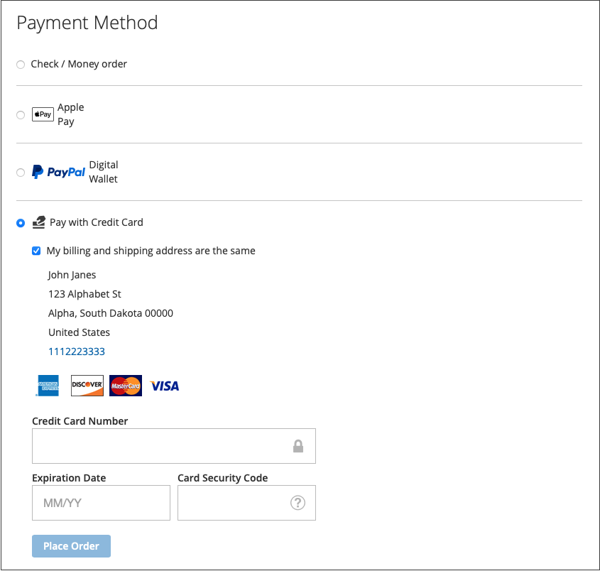

# Options de paiement

Avec [!DNL Adobe Commerce] et [!DNL Magento Open Source] [!DNL Payment Services], vous disposez de plusieurs options de paiement.

Vous pouvez configurer ces options de paiement dans [Paramètres du domicile](payments-home.md) ou [Configuration du magasin](configure-admin.md) (recommandé pour les options de paiement héritées ou une configuration multi-magasin).

Il existe différents comportements pour chaque mode de paiement en fonction de l’étape du processus de passage en caisse :

* Page de produit : page de produit d&#39;un article
* Mini panier : disponible lorsqu&#39;un produit a été ajouté au panier et que vous cliquez sur l&#39;icône du panier.
* Panier : disponible lorsque vous cliquez sur _Afficher et modifier le panier_ à partir du mini-panier.
* Vue de passage en caisse : disponible lorsque vous cliquez sur _Passer en caisse_ à partir d&#39;un mini-panier ou d&#39;un panier

>[!IMPORTANT]
>
>[!DNL Payment Services] intégration doit être terminée avant que les paiements puissent être traités.

## Expérience de paiements standard ou avancés

[!DNL Payment Services] offre des options de paiement et des flux d’intégration **avancés** (entièrement pris en charge) et **standard** (paiement express), en fonction du pays dans lequel vous opérez.

* **Avancé** - Toutes les [options de paiement](../payment-services/payments-options.md) sont disponibles pour les [pays actuellement entièrement pris en charge](../payment-services/introduction.md#availability). Lors de l’intégration pour activer les paiements en direct, sélectionnez l’option [&#x200B; Intégration avancée &#x200B;](../payment-services/production.md#advanced-onboarding).

* **Standard** - Un sous-ensemble d’options de paiement (paiement express), à savoir les cartes de crédit et de débit PayPal, est disponible pour les autres pays pris en charge. [Les champs de carte de crédit](#credit-card-fields) et [Apple Pay](#apple-pay-button) ne sont pas disponibles pour cette option d’intégration. Lors de l’intégration pour activer les paiements en direct, sélectionnez l’option [&#x200B; Intégration standard &#x200B;](../payment-services/production.md#standard-onboarding).

Consultez [Activer [!DNL Payment Services] pour la production](../payment-services/production.md#complete-merchant-onboarding) pour plus d’informations sur l’intégration avancée et standard.

## [!UICONTROL Credit Card Fields]

[!UICONTROL Credit Card Fields] offre un passage en caisse simple et sécurisé pour les méthodes de paiement par carte de crédit ou de débit. Lorsqu’un acheteur passe en caisse à l’aide des champs de carte de crédit, il saisit son nom, son adresse de facturation et ses informations de carte de crédit ou de débit pour passer sa commande. Leurs informations client sont utilisées en toute sécurité pendant la session d’achat afin de les guider en toute simplicité tout au long du flux de passage en caisse.

{width="500" zoomable="yes"}

## [!UICONTROL Digital Wallets]

### bouton [!DNL Fastlane]

[!DNL Fastlane] offre un moyen rapide, sécurisé et sans tracas de payer en ligne. Lors d&#39;un passage en caisse **Invité**, vous pouvez stocker en toute sécurité votre carte et les informations d&#39;expédition pour des achats encore plus rapides à l&#39;avenir.

* **Accès instantané pour les acheteurs vérifiés** : identifiez les millions de clients récurrents et activez des paiements transparents en quelques secondes.
* **Augmenter le chiffre d’affaires** : améliorez les taux de conversion et d’autorisation avec davantage d’achats terminés.
* **Accélérer le passage en caisse** : réduisez les frictions grâce à une expérience de connexion sécurisée et sans mot de passe.

Lorsque [!DNL Fastlane] est activé, l’option [!UICONTROL Credit Card Fields] est désactivée par défaut.

>[!NOTE]
>
> Dans les instances Sandbox, les transactions Fastlane n’affichent pas l’adresse d’expédition dans la vue Activité de transaction .

Voir la rubrique [Fastlane by PayPal](https://www.paypal.com/us/fastlane){target=_blank} pour plus d’informations.

### bouton [!DNL Apple Pay]

Avec [!DNL Apple Pay], les commerçants peuvent offrir une expérience de passage en caisse sécurisée et rationalisée dans Safari (jusqu’à 99 domaines par compte de commerçant), ce qui peut augmenter les conversions. Le bouton [!DNL Apple Pay] permet de remplir automatiquement les informations de paiement, de contact et d’expédition stockées à partir des appareils iOS ou macOS des clients, ce qui permet de passer en caisse rapidement et en une pression.

{width="500" zoomable="yes"}

Lorsqu’il est activé, le bouton [!DNL Apple Pay] est visible à partir de la page produit, du mini-panier, du panier et des vues de passage en caisse. Vous pouvez configurer [!DNL Apple Pay] dans la configuration du magasin ou dans l’Accueil de l’extension.

>[!NOTE]
>
>  Le certificat de vérification du domaine Apple Pay est déjà inclus dans le code Payment Services. Vérifiez que le chemin d’accès `/.well-known/apple-developer-merchantid-domain-association` renvoie un code de réponse 200. Pour plus d’informations sur le certificat [Vérification du domaine Pay d’Apple](https://developer.paypal.com/docs/checkout/apm/apple-pay/#download-and-host-sandbox-domain-association-file), consultez la documentation du développeur **PayPal sur l’intégration à Apple Pay**.

Voir [Paramètres](configure-admin.md#apple-pay) pour plus d’informations.

### bouton [!DNL Google Pay]

En intégrant [!DNL Google Pay] dans votre expérience de passage en caisse, les commerçants peuvent collecter des informations enregistrées de paiement, de contact et d’expédition à partir du compte Google de l’acheteur, offrant ainsi une procédure de paiement pratique et rationalisée sur les navigateurs et applications pris en charge.

[!DNL Google Pay] n’est disponible que dans certains pays ou régions et sur certains appareils. Voir [[!DNL Google Pay] documentation](https://developer.paypal.com/docs/checkout/apm/google-pay/#link-googlepayintegration) pour plus d’informations.

{width="500" zoomable="yes"}

Lorsqu’il est activé, le bouton [!DNL Google Pay] est visible à partir de la page produit, du mini-panier, du panier et des vues de passage en caisse. Voir [Paramètres](configure-admin.md) pour plus d’informations.

>[!NOTE]
>
> L’API [!DNL Google Pay] ne peut être utilisée que sur des sites web dans un contexte sécurisé. Voir la documentation [Dépannage](https://developers.google.com/pay/api/web/support/troubleshooting) pour plus d’informations.

### [!DNL PayPal Payment Buttons]

[!DNL PayPal payment buttons], qui utilise PayPal pour effectuer un achat, stocke l&#39;adresse d&#39;expédition de votre acheteur, les adresses de facturation et les détails de paiement pour une utilisation ultérieure. Les acheteurs peuvent utiliser n&#39;importe quel mode de paiement précédemment stocké ou proposé par PayPal.

{width="350" zoomable="yes"}

Vous pouvez configurer [!UICONTROL PayPal payment buttons] dans la configuration du magasin ou l’Accueil [!DNL Payment Services].

Découvrez les modes de paiement disponibles par pays dans la [documentation relative aux modes de paiement](https://developer.paypal.com/docs/checkout/payment-methods/) de PayPal.

#### bouton [!DNL PayPal]

Les clients peuvent quitter facilement et en toute confiance en utilisant le bouton PayPal.

Le bouton [!DNL PayPal] est visible à partir de la page produit, du mini-panier, du panier et des vues de passage en caisse.

#### bouton [!DNL Venmo]

Les clients peuvent passer en caisse à l’aide du bouton [Venmo](https://venmo.com/).

Le bouton [!DNL Venmo] est visible à partir de la page produit, du mini-panier, du panier et des vues de passage en caisse.

#### Bouton de carte de débit ou de crédit PayPal

Les clients peuvent passer en caisse à l&#39;aide du bouton PayPal Débit ou Carte de crédit.

Le bouton PayPal Débit ou Carte de crédit est visible depuis la page de passage en caisse.

Cette option peut être utilisée pour présenter une option de paiement par carte de débit ou de crédit à vos acheteurs à l&#39;aide d&#39;un bouton hébergé par PayPal comme alternative à une intégration par carte de crédit.

#### bouton [!DNL Pay Later]

Offrez à vos clients des paiements à court terme sans intérêt et d&#39;autres options de financement afin qu&#39;ils puissent acheter maintenant et payer plus tard avec le bouton [!DNL Pay Later].

Le bouton [!DNL Pay Later] est visible à partir de la page produit, du mini-panier, du panier et des vues de passage en caisse.

Pour plus d’informations sur les [offres Pay Later](https://developer.paypal.com/docs/checkout/pay-later/us/), consultez la documentation destinée aux développeurs PayPal. Utilisez le menu déroulant **Pays ou région** pour sélectionner une région d’intérêt.

Découvrez comment désactiver ou activer la messagerie [!DNL Pay Later] en mettant à jour la configuration [Paramètres](configure-admin.md#pay-later-button).

##### Facultatif. Configuration des messages de paiement différé

**Configurer la messagerie** pour [Payer plus tard](configure-admin.md#pay-later-button) permet aux commerçants de modifier les styles par défaut pour cette option de paiement. Si vous définissez **[!UICONTROL Display Pay Later Message]** sur `Yes` dans votre configuration [Paramètres](configure-admin.md#pay-later-button), un bouton modal **[!UICONTROL Configure Messaging]** s’affiche afin que vous puissiez définir les styles du **[!UICONTROL PayPal Pay Later messaging]**.

{width="500" zoomable="yes"}

### Rappels d’expédition côté serveur pour les boutons de paiement PayPal

Les méthodes de paiement PayPal, Pay Later et Venmo utilisent un [rappel d’expédition côté serveur](https://developer.paypal.com/docs/multiparty/checkout/standard/customize/shipping-module/) qui permet à PayPal de communiquer directement avec votre instance Commerce pour récupérer les options d’expédition et calculer les totaux en temps réel.

Cette approche côté serveur [!DNL Payment Services] permet d’ignorer le pop-up de confirmation de commande, offrant ainsi une expérience d’achat plus rapide et rationalisée. Comme les frais d&#39;expédition et les taxes sont calculés dynamiquement par le biais de rappels, l&#39;acheteur peut voir des totaux précis directement sur la page d&#39;examen PayPal ou Venmo.

>[!NOTE]
>
>Le point d’entrée de rappel doit être accessible au public et répondre dans les 5 secondes. Si le temps de réponse dépasse cette limite, PayPal affiche un message d&#39;erreur dans le pop-up. Consultez [Test sur les environnements de développement locaux](test-validate.md#test-on-local-development-environments) pour plus d’informations sur le test local de ces modes de paiement.

### Utiliser uniquement les boutons de paiement PayPal

Pour mettre rapidement votre boutique en mode production, vous pouvez configurer _uniquement_ les boutons de paiement PayPal (Venmo, PayPal, etc.)... au lieu d&#39;utiliser également l&#39;option de paiement par carte de crédit PayPal.

Cela vous permet d’effectuer les opérations suivantes :

* Proposez différentes options de paiement à vos clients, y compris des boutons de paiement Venmo et PayPal, avec la possibilité de désactiver les champs de carte hébergée PayPal et d&#39;utiliser un fournisseur de carte de crédit existant.
* Utilisez votre fournisseur de carte de crédit existant pour les paiements par carte de crédit, tout en utilisant les autres options de paiement de PayPal.
* Utilisez les boutons de paiement PayPal dans les régions où PayPal ne prend pas en charge les cartes de crédit comme option de paiement.

Pour **capturer les paiements avec _uniquement_ les boutons de paiement PayPal (_pas_ l’option de paiement par carte de crédit PayPal)** :

1. Assurez-vous que votre boutique est [en mode production](configure-admin.md#enable-payment-services).
1. [Configurez les boutons de paiement PayPal souhaités](configure-admin.md#payment-buttons) dans Paramètres.
1. Désactivez _off_ l’option **[[!UICONTROL Show PayPal Credit and Debit card button]](configure-admin.md#payment-buttons)** dans la section _[!UICONTROL Payment buttons]_.

Pour **capturer des paiements avec votre fournisseur de carte de crédit existant _et_ les boutons de paiement PayPal** :

1. Assurez-vous que votre boutique est [en mode production](configure-admin.md#enable-payment-services).
1. [Configurez les boutons de paiement PayPal souhaités](configure-admin.md#payment-buttons).
1. Désactivez _off_ l’option **[[!UICONTROL PayPal Show Credit and Debit card button]](configure-admin.md#payment-buttons)** dans la section _[!UICONTROL Payment buttons]_.
1. Désactivez _Désactiver_ l’option **[[!UICONTROL Show on checkout page]](configure-admin.md#credit-card-fields)** dans la section _[!UICONTROL Credit card fields]_&#x200B;et utilisez votre [compte de fournisseur de carte de crédit existant](https://experienceleague.adobe.com/docs/commerce-admin/stores-sales/payments/payments.html?lang=fr#payments).

## Modes de paiement locaux

Les modes de paiement locaux (LPM) prennent en charge les modes de paiement spécifiques à la région et locaux, tels que les virements bancaires et les solutions de paiement localisées, parallèlement aux options existantes basées sur les cartes. Les commerçants peuvent activer ou désactiver les LPM disponibles directement dans la configuration Commerce. Les LPM élargissent les capacités de paiement d’Adobe, répondent aux besoins du marché européen, améliorent la localisation des paiements et contribuent à augmenter la conversion, l’adoption par les commerçants et la satisfaction des acheteurs.

Les LPM disponibles sont les suivants :

| Mode de paiement | Pays | Devise monétaire |
|----------------|-----------|----------|
| Bancontact | Belgique | EUR |
| CLIGNOTER | Pologne | PLN |
| eps | Autriche | EUR |
| IDEAL | Pays-Bas | EUR |
| MyBank | Italie | EUR |
| Przelewy24 | Pologne | EUR, PLN |

Les LPM sont affichés aux clients en fonction de leur adresse de facturation et de la devise de base de leur site web. Un mode de règlement apparaît uniquement lorsque les deux conditions correspondent aux exigences du mode de règlement.

Voir [Configuration des modes de paiement locaux](configure-admin.md#local-payment-methods) pour plus d’informations.

## Boutons de passage en caisse express

Pour accélérer le passage en caisse, des options de paiement express sont disponibles au début du flux de passage en caisse. Les clients peuvent effectuer leur achat à l’aide de PayPal, PayPal Pay Later, Venmo, Apple Pay ou Google Pay.

Une fois activés, les boutons de passage en caisse express s’affichent au début du processus de passage en caisse, offrant ainsi un chemin d’achat plus rapide aux clients qui préfèrent les méthodes de paiement par portefeuille numérique.

Pour activer les boutons de passage en caisse express, configurez chaque mode de paiement individuellement :

* **PayPal et Pay Later** : activez la **[!UICONTROL Show buttons at start of checkout]** dans les paramètres [Boutons de paiement PayPal](configure-admin.md#paypal-payment-buttons).

* **Apple Pay** : activez la **[!UICONTROL Show Apple Pay at start of checkout]** dans les paramètres [Apple Pay](configure-admin.md#apple-pay).

* **Google Pay** : activez la **[!UICONTROL Show Google Pay at start of checkout]** dans les paramètres de [Google Pay](configure-admin.md#google-pay).

>[!NOTE]
>
>La disponibilité du mode de paiement dépend de la localisation de l&#39;acheteur. Pour les tests de sandbox, utilisez la configuration [Pays de l’acheteur](sandbox.md#buyers-country) pour simuler différentes régions. Par exemple, Venmo n’est disponible qu’aux États-Unis. Pay Later est disponible aux États-Unis et au Royaume-Uni.

## Options de passage en caisse

Avec [!DNL Payment Services], vous pouvez configurer l’expérience de passage en caisse pour Adobe Commerce en fonction des préférences et du comportement de vos clientes et clients. Des fonctionnalités telles que la carte de crédit [chambre forte](vaulting.md) et le vidage automatique des commandes assurent une transaction transparente et sans tracas pour vos clients.

Avec Adobe Commerce et Magento Open Source [!DNL Payment Services], vous disposez de plusieurs expériences de passage en caisse. Il existe différents comportements pour chaque mode de paiement en fonction de l’étape du processus de passage en caisse :

* Page produit : page produit d&#39;un article

* Mini panier : disponible lorsqu&#39;un produit a été ajouté aux paniers, lorsque vous cliquez sur l&#39;icône du panier.

* Panier - Disponible en cas de clic sur Afficher et modifier le panier du mini-panier

* Vue de passage en caisse : disponible lorsque vous cliquez sur Passer en caisse à partir du mini-panier ou du panier.

### Recalcul de commande

Lorsqu’un client accède au flux de passage en caisse à partir du mini-panier, du panier ou de la page produit, il est redirigé vers une page de révision de commande où il peut voir l’adresse de livraison sélectionnée dans une fenêtre contextuelle PayPal. Une fois que le client a sélectionné le mode d’expédition, le montant de la commande est recalculé de manière appropriée et il peut consulter les coûts d’expédition et les taxes.

Lorsqu’un client accède au flux de passage en caisse à partir de la page de passage en caisse, le système connaît déjà l’adresse de livraison et le montant calculé final, et les totaux sont correctement représentés.

Les congés fiscaux, les frais d&#39;expédition et les taxes de vente peuvent varier considérablement d&#39;un endroit à l&#39;autre. Une fois que [!DNL Payment Services] a reçu l’adresse et le tarif de livraison, il recalcule rapidement tous les coûts applicables et les affiche correctement au cours des dernières étapes de la commande.

Découvrez les modes de paiement disponibles par pays dans la documentation [Modes de paiement PayPal](https://developer.paypal.com/docs/checkout/payment-methods/){target=_blank}.
