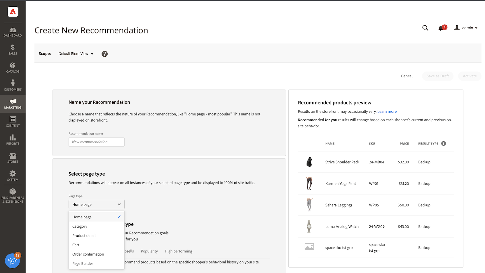

# Créer une recommandation

Lorsque vous créez une recommandation, vous créez une _unité de recommandation_, ou widget, qui contient les _éléments_ de produit recommandés.

_Unité de recommandation_

Lorsque vous activez l’unité de recommandation, Adobe Commerce commence à [collecter des données](workspace.md) pour mesurer les impressions, les vues, les clics, etc. Le tableau [!DNL Product Recommendations] affiche les mesures de chaque unité de recommandation afin de vous aider à prendre des décisions commerciales éclairées.

>[!NOTE]
>
>Les mesures de recommandations de produits sont optimisées pour les storefronts Luma. Si votre storefront n’est pas basé sur Luma, la manière dont les mesures effectuent le suivi des données dépend de la manière dont vous [implémentez la collecte d’événements](events.md).

1. Dans la barre latérale _Admin_, accédez à **Marketing** > _Promotions_ > **Recommandations de produit** pour afficher l’espace de travail _Recommandations de produit_.

1. Spécifiez l’[Affichage de la boutique](https://experienceleague.adobe.com/en/docs/commerce-admin/start/setup/websites-stores-views) où vous souhaitez que les recommandations s’affichent.

   >[!NOTE]
   >
   > Les unités de recommandation Page Builder doivent être créées dans la vue de magasin par défaut, mais peuvent ensuite être utilisées n’importe où. Pour en savoir plus sur la création de recommandations de produit avec Page Builder, voir [Ajouter du contenu - Recommandations de produit](https://experienceleague.adobe.com/en/docs/commerce-admin/page-builder/add-content/recommendations).

1. Cliquez sur **Créer une recommandation**.

1. Dans la section _Nommer votre recommandation_, saisissez un nom explicite à des fins de référence interne, tel que `Home page most popular`.

1. Dans la section _Sélectionner le type de page_, sélectionnez la page sur laquelle vous souhaitez que la recommandation apparaisse parmi les options suivantes :

   >[!NOTE]
   >
   > Les recommandations de produits ne sont pas prises en charge sur la page Panier lorsque votre boutique est configurée pour [afficher la page du panier immédiatement après l’ajout d’un produit au panier](https://experienceleague.adobe.com/en/docs/commerce-admin/stores-sales/point-of-purchase/cart/cart-configuration).

   * Page d’accueil
   * Catégorie
   * Détails du produit
   * Panier
   * Confirmation
   * [Page Builder](https://experienceleague.adobe.com/en/docs/commerce-admin/page-builder/add-content/recommendations)

   Vous pouvez créer jusqu’à cinq unités de recommandation actives pour chaque type de page, et jusqu’à 25 pour Page Builder. Le type de page est grisé lorsque la limite est atteinte.

   
   _Nom de la recommandation et emplacement de la page_

1. Dans la section _Sélectionner le type de recommandation_, indiquez le [type de recommandation](type.md) qui doit apparaître sur la page sélectionnée. Pour certaines pages, l’[emplacement](placement.md) des recommandations est limité à certains types.

1. Dans la section _Étiquette d’affichage du storefront_, saisissez l’[étiquette](placement.md#recommendation-labels) visible par vos acheteurs, telle que « Meilleurs vendeurs ».

1. Dans la section _Choisir le nombre de produits_, utilisez le curseur pour indiquer le nombre de produits à afficher dans l’unité de recommandation.

   La valeur par défaut est `5`, avec un maximum de `20`.

1. Dans la section _Sélectionner l’emplacement_, indiquez l’emplacement où l’unité de recommandation doit apparaître sur la page.

   * En bas du contenu principal
   * En haut du contenu principal

1. (Facultatif) Pour modifier l’ordre des recommandations, sélectionnez et déplacez les lignes du tableau _Choisir la position_.

   La section _Choisir la position_ affiche toutes les recommandations (le cas échéant) créées pour le type de page que vous avez sélectionné.

   
   _Ordre des recommandations sur la page_

1. (Facultatif) Dans la section _Filtres_, [appliquez des filtres](filters.md) pour contrôler quels produits apparaissent dans l’unité de recommandation.

   
   _Filtres de produit recommandés_

1. Une fois l’opération terminée, cliquez sur l’une des options suivantes :

   * **Enregistrer en tant que brouillon** pour modifier ultérieurement l’unité de recommandation. Vous ne pouvez pas modifier le type de page ou de recommandation d’une unité de recommandation à l’état de brouillon.

   * **Activer** pour activer l’unité de recommandation sur votre storefront.

>[!IMPORTANT]
>
>Certains navigateurs peuvent bloquer des scripts critiques qui empêchent le fonctionnement attendu de Product Recommendations.

## Indicateurs de préparation

Les indicateurs de préparation indiquent les types de recommandations les plus performants en fonction du catalogue et des données comportementales disponibles. Vous pouvez également utiliser des indicateurs de préparation pour déterminer si vous rencontrez des problèmes avec votre [événement](events.md) ou si vous n’avez pas suffisamment de trafic pour renseigner le type de recommandation.

Les indicateurs de préparation sont classés en [sur base statique](#static-based) ou [sur base dynamique](#dynamic-based). Les données de catalogue d’utilisation basées sur statique uniquement, tandis que les données de comportement d’utilisation basées sur dynamique proviennent de vos acheteurs. Ces données comportementales sont utilisées pour [entraîner des modèles de machine learning](events.md) afin de créer des recommandations personnalisées et de calculer leur score de préparation.

### Comment les indicateurs de préparation sont calculés

Les indicateurs de préparation sont une indication de la formation du modèle. Les indicateurs dépendent des types d’événements collectés, de l’ampleur des produits avec lesquels il y a eu interaction et de la taille du catalogue.

Le pourcentage d’indicateur de préparation est dérivé d’un calcul qui indique le nombre de produits qui peuvent être recommandés en fonction du type de recommandation. Les statistiques sont appliquées aux produits en fonction de la taille globale du catalogue, du volume d’interactions (telles que les vues, les clics, les ajouts au panier) et du pourcentage de SKU qui enregistrent ces événements dans une certaine période. Par exemple, pendant le trafic pendant la haute saison des fêtes, les indicateurs de préparation peuvent afficher des valeurs plus élevées qu’en période de volume normal.

En raison de ces variables, le pourcentage de l’indicateur de préparation peut fluctuer. Cela explique pourquoi les types de recommandations peuvent apparaître et disparaître lorsqu’ils sont « Prêts à être déployés ».

Les indicateurs de préparation sont calculés en fonction de deux facteurs :

* Taille suffisante du jeu de résultats : y a-t-il suffisamment de résultats renvoyés dans la plupart des scénarios pour éviter d’utiliser les [recommandations de sauvegarde](events.md#backuprecs) ?

* Variété suffisante du jeu de résultats : les produits renvoyés représentent-ils une variété de produits de votre catalogue ? L’objectif avec ce facteur est d’éviter qu’une minorité de produits soit les seuls articles recommandés sur le site.

En fonction des facteurs ci-dessus, une valeur de préparation est calculée et affichée comme suit :

* 75 % ou plus signifie que les recommandations suggérées pour ce type de recommandation seront très pertinentes.
* Au moins 50 % signifie que les recommandations suggérées pour ce type de recommandation seront moins pertinentes.
* Moins de 50 % signifie que les recommandations suggérées pour ce type de recommandation peuvent ne pas être pertinentes. Dans ce cas, les [recommandations de sauvegarde](events.md#backuprecs) sont utilisées.

En savoir plus sur [pourquoi les indicateurs de préparation peuvent être faibles](#what-to-do-if-the-readiness-indicator-percent-is-low).

### Basé sur statique

Les types de recommandations suivants sont basés sur des données statiques, car ils ne nécessitent que des données de catalogue. Aucune donnée comportementale n’est utilisée.

* _Plus Comme Ceci_
* _Similarité visuelle_

### Basé sur Dynamic

Les types de recommandations suivants sont basés sur les dynamiques, car ils utilisent les données comportementales de storefront.

Données comportementales des six derniers mois du storefront :

* _A consulté ceci, a consulté cela_
* _J&#39;ai vu ceci, j&#39;ai acheté cela_
* _J&#39;ai acheté ceci, acheté cela_
* _Recommandé_

Sept derniers jours de données comportementales storefront :

* _Les plus consultés_
* _Les plus achetés_
* _Les plus ajoutés au panier_
* _En Tendance_
* _Afficher pour acheter la conversion_
* _Conversion de l’affichage au panier_

Données comportementales les plus récentes sur les acheteurs (vues uniquement) :

* _Récemment consultés_

### Visualiser la progression

Pour visualiser plus facilement la progression de l’entraînement pour chaque type de recommandation, la section _Sélectionner le type de recommandation_ affiche une mesure de préparation pour chaque type.

_Type de recommandation_

>[!NOTE]
>
>Les indicateurs peuvent ne jamais atteindre 100 %.

Le pourcentage d’indicateur de préparation pour les types de recommandations qui dépendent des données du catalogue ne change pas beaucoup, car le catalogue du commerçant ne change pas souvent. Cependant, le pourcentage d’indicateur de préparation pour les types de recommandations basés sur les données comportementales de l’acheteur peut changer souvent en fonction de l’activité quotidienne de l’acheteur.

#### Que faire si le pourcentage d’indicateur de préparation est faible

Un faible pourcentage de préparation indique que peu de produits de votre catalogue peuvent être inclus dans les recommandations pour ce type de recommandation. Cela signifie qu’il existe une forte probabilité que les [recommandations de sauvegarde](events.md#backup-recommendations) soient renvoyées si vous déployez quand même ce type de recommandation.

>[!IMPORTANT]
>
>Les types de produits _Bundle_, _grouped_ et personnalisés ne sont pas pris en charge. Si votre catalogue contient un grand nombre de ces types de produits, vous pouvez vous attendre à un faible score de préparation. En outre, tout SKU avec des espaces peut réduire la pertinence des recommandations et doit être évité.

Vous trouverez ci-dessous la liste des raisons possibles et des solutions aux faibles scores de préparation courants :

* **Basé sur les statistiques statiques** - Des pourcentages faibles pour ces indicateurs peuvent être dus à des données de catalogue manquantes pour les produits affichables. S’ils sont inférieurs aux prévisions, une synchronisation complète peut résoudre ce problème.
* **Basé sur la dynamique** - Les faibles pourcentages des indicateurs basés sur la dynamique peuvent être dus aux éléments suivants :

   * Champs manquants dans les [événements storefront](https://developer.adobe.com/commerce/services/shared-services/storefront-events/#product-recommendations) requis pour les types de recommandation respectifs (requestId, contexte du produit, etc.)
   * Faible trafic sur le magasin : le volume d’événements comportementaux que nous recevons est donc faible.
   * La variété d’événements comportementaux de storefront sur différents produits de votre magasin est faible. Par exemple, si seulement 10 % de vos produits sont consultés ou achetés la plupart du temps, les indicateurs de préparation respectifs seront faibles.

## Aperçu de Recommendations {#preview}

Le panneau _Aperçu des produits recommandés_ est toujours disponible avec un exemple de sélection de produits qui peuvent apparaître dans l’unité de recommandation lors de son déploiement sur le storefront.

Pour tester une recommandation lorsque vous travaillez dans un environnement hors production, vous pouvez récupérer les données de recommandation d’une [autre source](settings.md). Cela permet aux commerçants de tester les règles et de prévisualiser les recommandations avant le déploiement en production.

| Champ | Description |
|---|---|
| Nom | Nom du produit. |
| SKU | Unité de gestion des stocks affectée au produit |
| Prix | Prix du produit. |
| Type de résultat | Principal : indique que les données d’identification collectées sont suffisantes pour afficher une recommandation. Sauvegarde : indique qu’il n’y a pas suffisamment de données d’identification collectées ; une recommandation de sauvegarde est donc utilisée pour remplir le slot. Accédez à [Données comportementales](events.md) pour en savoir plus sur les modèles de machine learning et les recommandations de sauvegarde. |

Lorsque vous créez votre unité de recommandation, testez le type de page, le type de recommandation et les filtres pour obtenir des commentaires en temps réel immédiats sur les produits qui seront inclus. Lorsque vous commencez à comprendre quels produits apparaissent, vous pouvez configurer l’unité de recommandation pour répondre aux besoins de votre entreprise.

Adobe Commerce [filtre](filters.md) recommandations pour éviter d’afficher des produits en double lorsque plusieurs unités de recommandation sont déployées sur une seule page. Par conséquent, les produits qui s’affichent dans le panneau d’aperçu peuvent différer de ceux qui s’affichent dans le storefront.

>[!NOTE]
>
> Vous ne pouvez pas prévisualiser le type de recommandation `Recently viewed`, car les données ne sont pas disponibles dans l’Administration.
